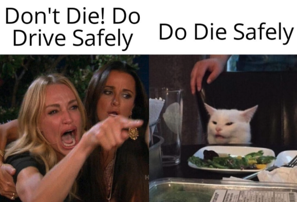

# Die

L'objectif de cet exercice est de refaire l'affiche suivante tout en conservant la signature graphique et le message. 

👉 Ici, on ne cherche pas juste à rendre l'affiche plus belle. On veut surtout rendre le message **efficace** et sans ambiguïté.

{data-zoom-image .w-50}
{data-zoom-image .w-50}

> This poster was designed by Chandan Chaurasia (Capita India), the winner of the Capita Safe Driver/Driving Competition - July 2019 
> Do Drive Safely, Don't Die while you Drive

## Consigne

- [ ] Dans votre projet « Exercices » de Figma, si elle n'existe pas déjà, ajoutez une nouvelle composition de type « Design » et renommez la par le numéro du cours (ex: Cours 02)
- [ ] Créer une nouvelle Page et remplacez son nom par le titre de l'exercice.
- [ ] Créer un Frame avec la dimension : `Papier > Tabloïde`.

Reproduire le concept du designer :

- [ ] reproduire le panneau de signalisation en losange
- [ ] reproduire les tirets symbolisant la route

!!! note "Il n'est pas nécessaire de reproduire les petites inscriptions en bas de l'affiche, ni le mot "CAPITA" en haut."

- [ ] Pour améliorer l'affiche, utilisez votre créativité et les principes de design appris en classe. Vous pouvez modifier le texte, les couleurs, le positionnement, etc.

!!! tip "N'oubliez pas. L'affiche a une fonction précise. Ne la perdez pas de vue ! C'est le plus important."
