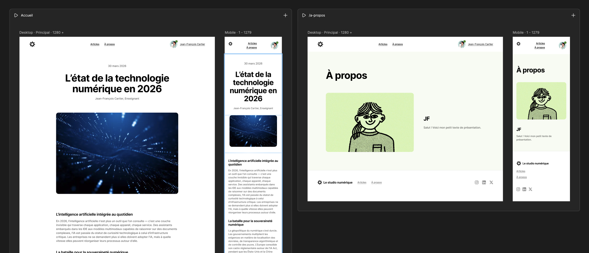

# Un site et que ça saute !

Cet exercice porte sur la publication d'un site Web avec Figma.

## Résultat suggéré

{data-zoom-image}

<https://le-studio-numerique.figma.site/>

## Consignes

L'objectif est de : 

- [ ] Créer 2 pages Web
- [ ] Intégrer un menu, un corps et un pied de page pour chacune
- [ ] Dans le corps du texte, ajouter une vidéo YouTube
- [ ] Modifier les contenus texte avec du contenu francophone
- [ ] Rendre les 2 pages navigables via le menu
- [ ] Insérer la composante Avatar dans le menu
- [ ] Ajouter une favicône
- [ ] Publier le site Web
- [ ] Modifier l'adresse URL attribuée par défaut
