# C'est du gâteau !

{.w-100}

L'objectif de cet exercice est de mettre en pratique les techniques de mise en page dynamique imbriquée (_auto layout_) dans Figma.

## Résultat suggéré

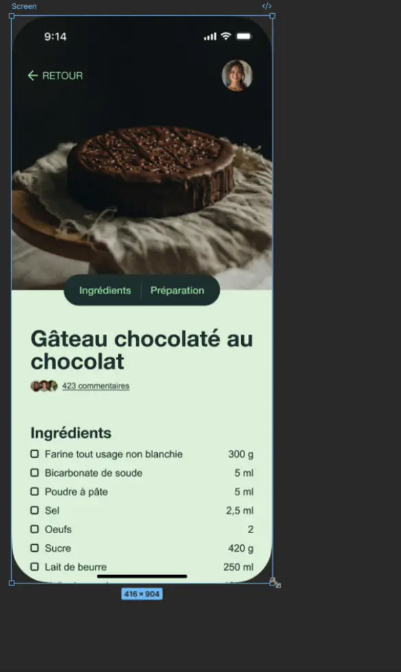{.w-50 data-zoom-image}

## Consigne

### Étape 1 | Mettre la table

- [ ] Trouver et ouvrir le projet "Blank iPhone Screen" dans l'onglet Communauté.

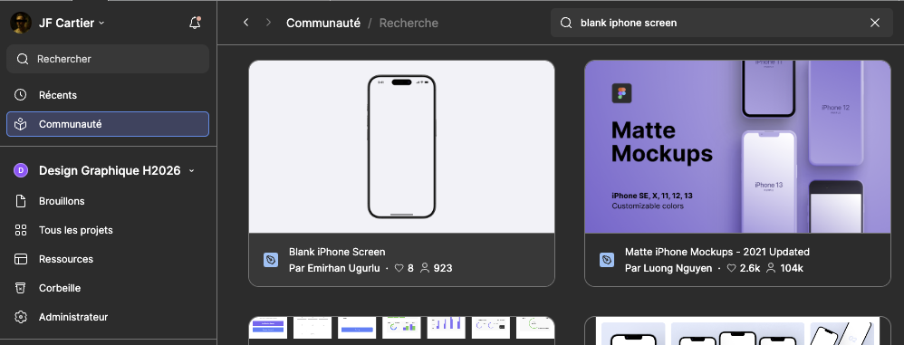{data-zoom-image .w-25}
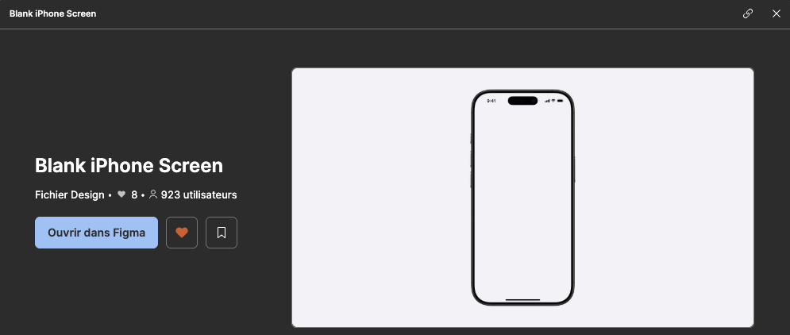{data-zoom-image .w-25}

- [ ] Ajouter le plugin "UI Faces - Free AI avatar", puis "Enregistrer".

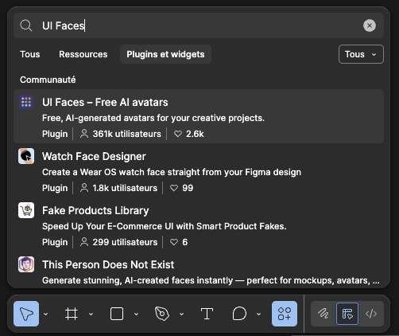{data-zoom-image .w-25}
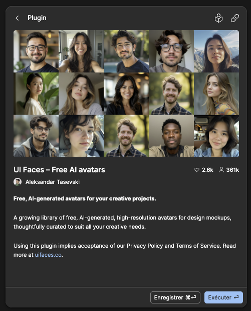{data-zoom-image .w-25}

- [ ] Ajouter le plugin "Feather Icons", puis "Enregistrer".

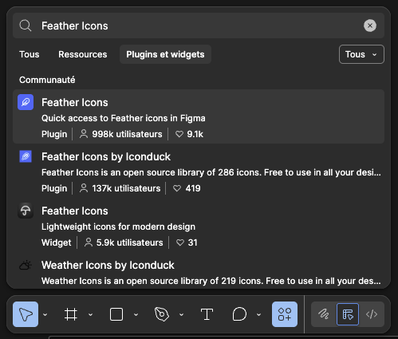{data-zoom-image .w-25}
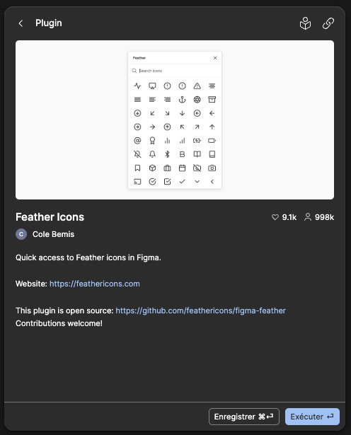{data-zoom-image .w-25}

- [ ] Télécharger l'[image d'un gâteau](https://www.pexels.com/fr-fr/chercher/cake/) sur pexels.com.
- [ ] Renommer le fichier Figma « C'est du gâteau ! ».
- [ ] Déplacer le fichier Figma dans un projet plutôt que de le laisser dans « Brouillon ».

### Étape 2 | L'entête

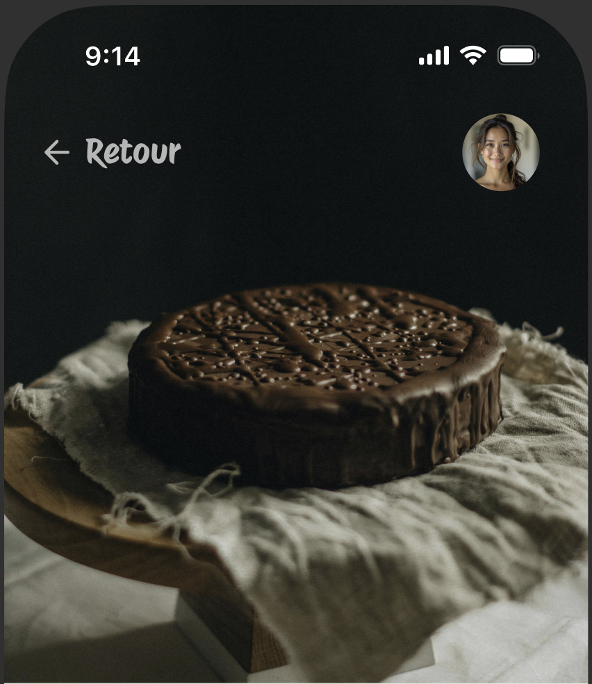{data-zoom-image}

- [ ] Ajouter l'image dans le frame du téléphone de sorte qu'elle prenne 50% de la hauteur et 100% de la largeur. 
- [ ] Si on redimensionne la page, l'image devrait s'adapter : 

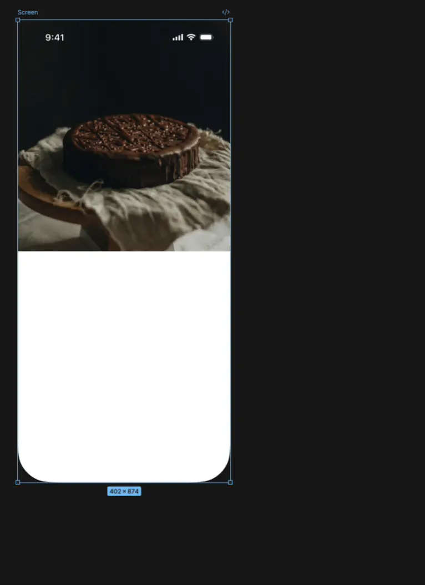{.w-25 data-zoom-image}

- [ ] Trouver une police de caractères adaptée à un site de recettes.
- [ ] Ajouter un lien de retour en haut à gauche avec une icône tirée des icônes Feather.
- [ ] Ajouter un avatar en haut à droite.
- [ ] Aligner verticalement l'icône, le lien ainsi que l'avatar.
- [ ] Si on redimensionne la page, l'avatar devrait rester attaché à droite (contrainte 😜) :

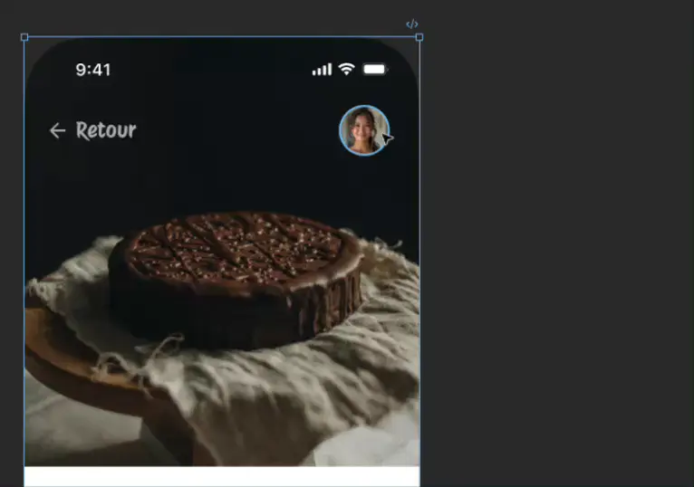{.w-25 data-zoom-image}

### Étape 3 | Le menu

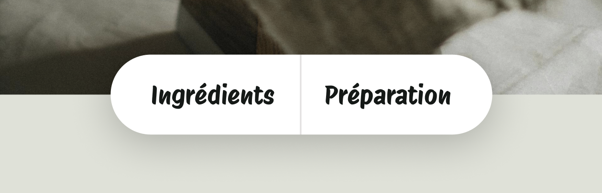{data-zoom-image}

- [ ] Créer un frame « Menu » avec une mise en page automatique horizontale.
- [ ] Ajouter dans le menu les mots "Ingrédients" et "Préparation". Ajouter également un trait vertical au centre.
- [ ] Gérer les espacements avec les options de mise en page automatique.
- [ ] Positionner le frame dans le frame du téléphone de sorte qu'il soit toujours au centre de la page (contrainte 😜). 
- [ ] Si vous avez bien configuré le tout, le menu devrait s'ajuster automatiquement si vous changez le texte.

{.w-25 data-zoom-image}

- [ ] Ajouter un effet d'ombre portée sous le menu. 

### Étape 4 | Zone du titre

- [ ] Ajouter 3 petits avatars superposés avec un nombre de commentaires à leur droite. Grouper le tout.

{.w-25 data-zoom-image}

- [ ] Ajouter le titre de la recette. Sa largeur doit s'adapter à la largeur de la page (contrainte 😜).
- [ ] Créer un frame « Body », de la largeur du téléphone, avec une mise en page automatique verticale et y ajouter le titre et les commentaires.
- [ ] Si vous avez bien configuré le tout, la partie des commentaires devrait s'ajuster par rapport à la hauteur du titre.

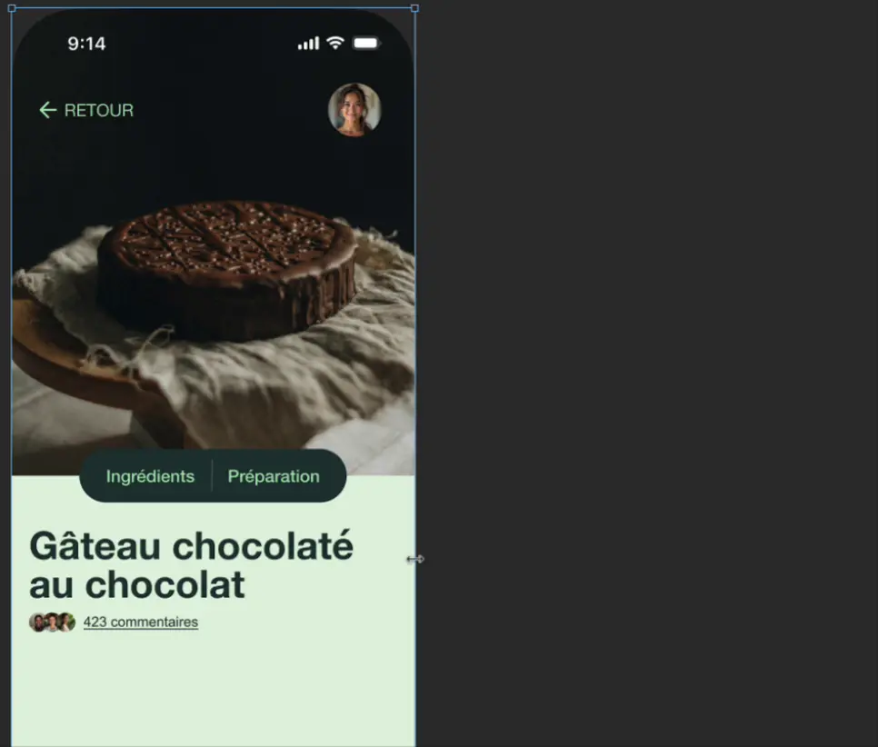{.w-25 data-zoom-image}

### Étape 5 | Les ingrédients

- [ ] Ajouter un « titre 2 » pour la liste des ingrédients.

Pour la liste des ingrédients, commençons par la mise en forme d'une seule ligne

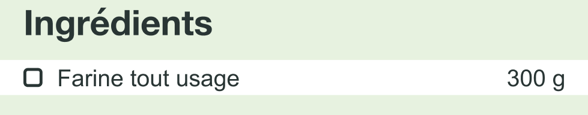

- [ ] Créer un frame « Ligne », de la largeur du téléphone, avec une mise en page automatique horizontale.
- [ ] Dans le frame, ajouter un carré d'environ 12 x 12 avec un tracé de 2px. Cela fera office de "checkbox".
- [ ] Dans le frame, ajouter un texte pour l'aliment. Assurez-vous que la largeur de ce dernier « remplisse le contenant ».
- [ ] Dans le frame, ajouter un texte pour la quantité.
- [ ] Configurer les marges de sorte que le contenu ne soit pas collé sur les bords du téléphone (ex.&nbsp;: 16px).
- [ ] Configurer les espacements pour éviter que la case à cocher soit collée à l'aliment.
- [ ] Retirer la couleur de remplissage du frame, si ce n'est déjà fait.

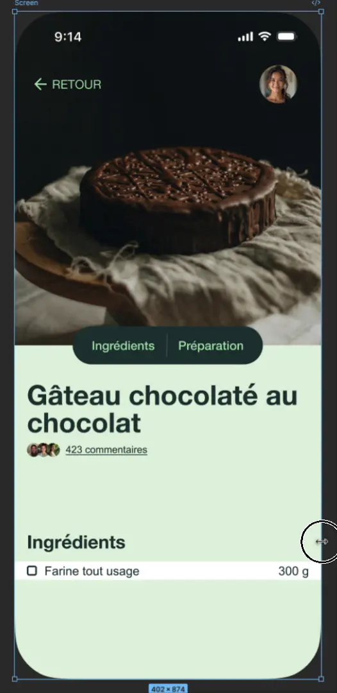{.w-25 data-zoom-image}

- [ ] Ajouter le titre des ingrédients et la ligne d'ingrédient dans le frame « Body » !
- [ ] Copier-coller quelques fois la ligne d'ingrédient et remplir quelques ingrédients supplémentaires.

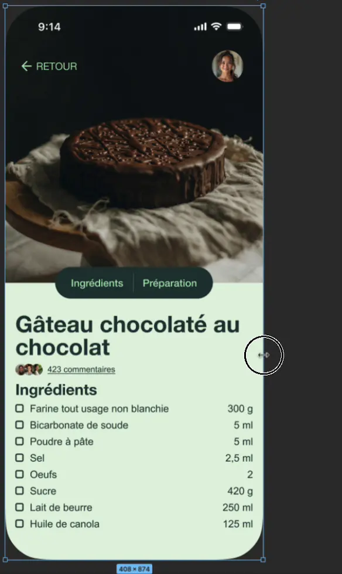{.w-25 data-zoom-image}

### Étape 6 | Finition

- [ ] Ajouter un rectangle vide entre le lien des commentaires et le titre Ingrédients.

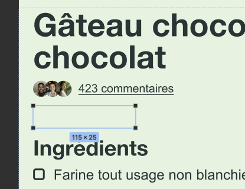{.w-25 data-zoom-image}

- [ ] Changer les marges et les espaces du frame « Body » pour aérer la page.

{.w-25 data-zoom-image}
