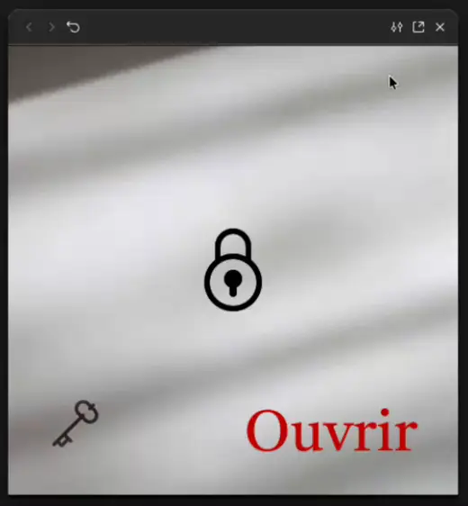

# C'est logique

L'objectif de cet exercice est de mettre en place une logique conditionnelle dans un prototype Figma.

## Résultat attendu

- Lorsqu'on clique sur « Ouvrir », le cadenas déverrouillé ne doit pas s'afficher.
- Si on clique sur la clé, celle-ci disparaît et la couleur du texte change.
- Si on clique à nouveau sur « Ouvrir », le cadenas déverrouillé s'affiche.

{data-zoom-image}

## Consignes

- [ ] Pour cet exercice, vous pouvez utiliser le plugin « Icons8 — icons, illustrations, photos » pour les icônes.   {data-zoom-image .w-25}
- [ ] Créer un nouveau frame de `500px x 500px`.
- [ ] Ajouter le texte « Ouvrir ».
- [ ] Ajouter les icônes suivantes : 
  - Cadenas déverrouillé
  - Cadenas verrouillé
  - Clé
- [ ] Ajouter une variable booléenne pour chaque icône.
- [ ] Associer l'affichage des icônes en fonction de leur variable respective.
- [ ] Ajouter une variable de couleur pour le texte.
- [ ] Ajouter une logique conditionnelle pour la clé et le texte « Ouvrir ».