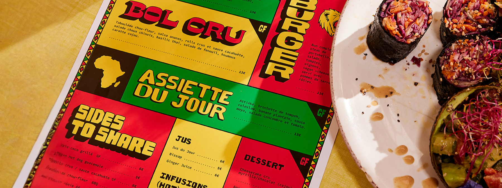

# Menu

{.w-100}

L'objectif de cet exercice est de faire un menu prêt à être envoyé à l'imprimeur.

## Consigne

- [ ] Télécharger le [modèle de menu 3.75 x 8.25](https://www.vistaprint.ca/marketing-materials/flat-menus) chez VistaPrint.
- [ ] Importer le modèle dans Figma.
- [ ] Créer un menu fictif, recto seulement. 

!!! success "Vous pouvez vous fier aux exemples de menu affichés sur la page où vous avez téléchargé le modèle."

- [ ] Assurez-vous que les textes sont à l'intérieur des marges de sécurité.
- [ ] Supprimer les lignes du modèle.
- [ ] Exporter en JPG à 4.17 la taille d'origine.
- [ ] Ajouter l'export dans le fichier Figma.

!!! note "Normalement, il faudrait exporter en PDF et vectoriser les textes. Figma permet de le faire, mais il ne permet pas de redimentionner l'export PDF 🤷. Disons que c'est pas le meilleur logiciel pour faire de l'imprimé."
