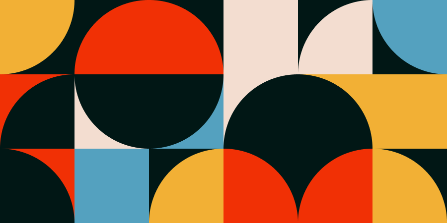
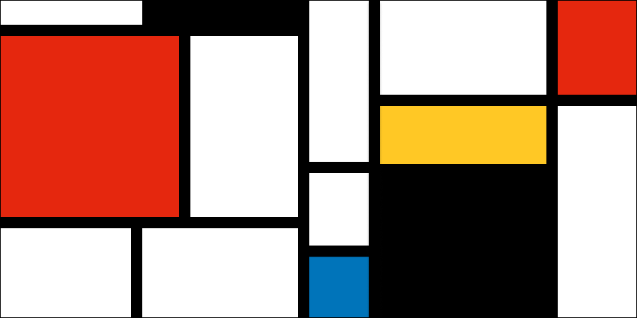

# Mosaïque

L’objectif de cet exercice est de vous pratiquer avec les outils de Figma.

Le but est de reproduire **à l’identique** les résultats attendus.

## Résultats attendus

<figure markdown>
{data-zoom-image}
<figcaption>Frame 1</figcaption>
</figure>
<figure markdown>
{data-zoom-image}
<figcaption>Frame 2</figcaption>
</figure>
<figure markdown>
{data-zoom-image}
<figcaption>Frame 3</figcaption>
</figure>
<figure markdown>
{data-zoom-image}
<figcaption>Frame 4 - Piet Mondrian</figcaption>
</figure>

## Consignes

- [ ] Dans Figma, créez le projet « Exercices » s’il n’existe pas
- [ ] Dans le projet « Exercices », si elle n’existe pas, ajoutez une nouvelle composition de type « Design » et renommez cette composition par le numéro du cours
- [ ] Renommez la page par le nom de l'exercice. Exemple :

  

- [ ] Créez 4 _Frames_ avec une résolution de 900 × 450
- [ ] Utilisez exactement les couleurs des résultats attendus (utilisez la pipette)

**Frame 1**

- [ ] Utilisez uniquement des cercles
- [ ] Appliquez les couleurs de l’image de référence en utilisant la pipette

**Frame 2**

- [ ] Utilisez uniquement des carrés en exploitant les coins arrondis
- [ ] Appliquez les couleurs de l’image de référence en utilisant la pipette

**Frame 3**

- [ ] Utilisez uniquement des carrés en exploitant les coins arrondis
- [ ] Appliquez les couleurs de l’image de référence en utilisant la pipette

**Frame 4**

- [ ] Utilisez des lignes et des carrés
- [ ] Appliquez les couleurs de l’image de référence en utilisant la pipette

