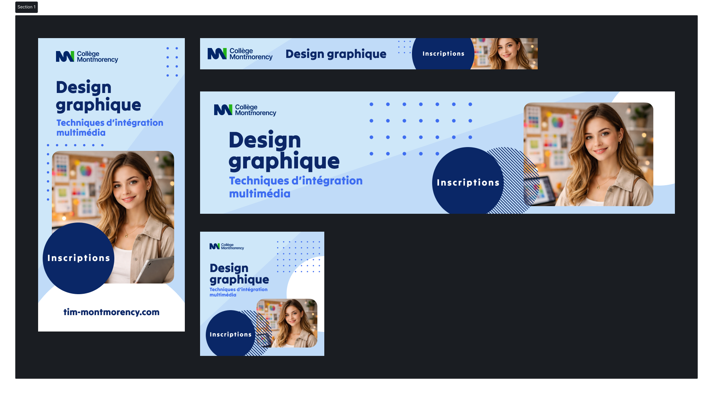

# Programme

L'objectif de cet exercice est de reproduire une même publicité en 4 variations.

## Résultat attendu

{data-zoom-image}

## Consignes

### Partie 1

- [ ] Créer les 4 frames suivants : `385x770`, `886x82`, `1246x320`, `326x326`
- [ ] Télécharger le [logo du collège](./logo.svg)
- [ ] Trouver l'image d'une personne. Utiliser soit [pexels.com](https://www.pexels.com/fr-fr/chercher/student/) ou générer l'image d'un ou d'une étudiante.
- [ ] Dans un des frames, préparer tous les éléments graphiques, dont ces deux remplissage de type « Motif » :   
- [ ] Utilisez des variables pour les couleurs.
- [ ] Reproduire la mise en page des différents frames affichés dans résultat attendu et portez attention aux changements. (La police utilisée est `Tilt Warp`).

!!! note "Ce qui est important ici est de comprendre pourquoi certains éléments sont parfois déplacés, retirés ou ajoutés."

- [ ] À l'aide de l'outil « Section », envelopper tous les frames dans une section.
- [ ] Exporter la section en format png.
- [ ] Ajouter l'image exportée dans la même page figma et passer à la partie 2.

### Partie 2

- [ ] Trouver sur internet les normes graphiques du collège.
- [ ] Consulter la section « Utilisation du logo »
- [ ] Consulter la section « Couleurs »
- [ ] En respectant les normes graphiques du collège, proposez une version aux couleurs dramatiquement différentes du résultat actuel.