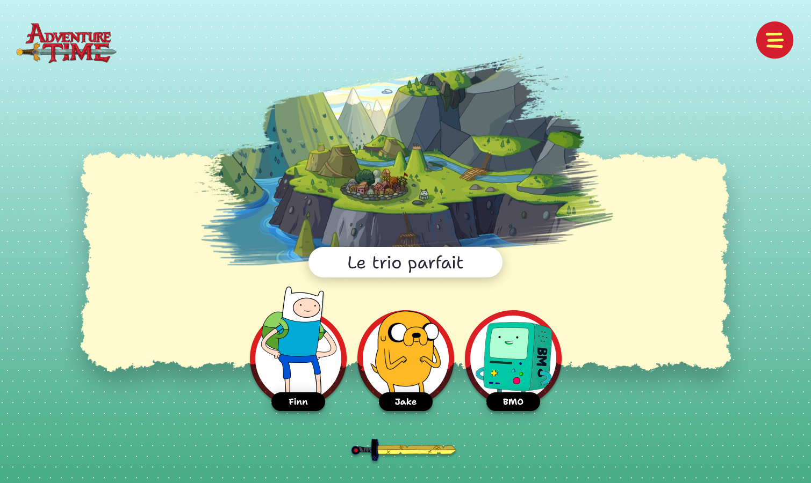
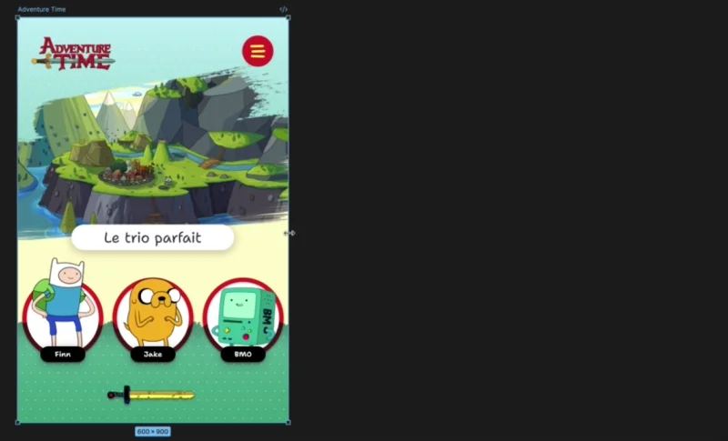

# Trio

{ data-zoom-image }

L'objectif de cet exercice est de mettre en pratique les notions de **contrainte** et de **masque** (alpha et luminosité) en Figma.

## Concept du trio

{.w-50}

Le concept de l'exercice est de faire le design graphique d'une page affichant votre trio préféré. Ça peut être n'importe quel type de trio : culturel 🍿, sportif ⚽️, religieux 🙏, trio de fast food 🍟

Vous choisissez ce qui vous parle le plus !

## Résultat attendu

On doit pouvoir redimensionner le frame sans briser la mise en page.

{ .w-100 data-zoom-image }

!!! note "Notes du prof"

    Pour l'image principale, je suis allé sur Google Images et j'ai cherché « _brush stroke black and white mask_ ». J'ai trouvé une image et l'ai appliquée à l'image principale.

    { .w-50 data-zoom-image }

    Pour le rectangle jaune pâle, j'ai juste ajouté un tracé de type pinceau. 

    { .w-50 data-zoom-image }

    Pour les personnages, j'ai utilisé une petite technique facile avec un masque arrondi comme le cercle du fond. Il faut juste que le masque soit plus haut que le cercle pour faire ressortir le personnage du cercle du fond.

    { .w-50 data-zoom-image }

## Consignes

- [ ] Créer un Frame de `600px` de large et d'une hauteur que vous décidez.
- [ ] Ajouter le logo de votre thème en haut à gauche.
- [ ] Ajouter un bouton de menu en haut à droite.
- [ ] Ajouter une image principale (hero).
  - [ ] Appliquer un masque luminosité sur l'image principale
- [ ] Ajouter un titre 1 (h1).
- [ ] Ajouter sous le titre votre trio avec le nom pour chaque « membre »
  - [ ] Appliquer un masque alpha 
- [ ] Ajouter un petit pied de page centré en bas du frame.

- [ ] Tous les éléments de la page doivent avoir une contrainte cohérente lorsqu'on redimensionne le frame.
- [ ] Travailler l'esthétisme avec un agencement de couleur, de police et d'espacements harmonieux.