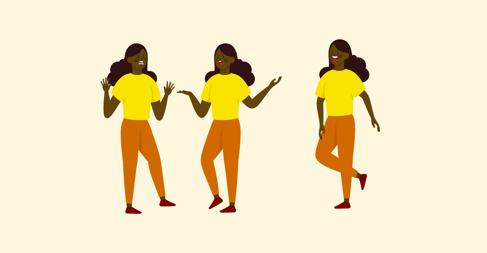

# Variable manquante

<!-- vecteezy_young-people-group-diverse-stylish-characters_16962639_241 -->

L'objectif de cet exercice est multiple. Il sera question de : 

- créer des variables pour ajouter des couleurs aux _assets_
- reproduire un montage équivalent au résultat attendu
- ajuster les couleurs pour exporter des résultats attendus

## Aperçu

## Consignes

### Étape 1

- [ ] Télécharger le [document de départ](./variable-manquante.fig){download}
- [ ] Ouvrir le `.fig` dans Figma.

  {.w-25 data-zoom-image}

- [ ] Appliquer une couleur aux cheveux et créer une variable nommée "Cheveux"
- [ ] Appliquer cette couleur à tous les vecteurs de cheveux
- [ ] Répéter cette opération pour tous les autres éléments distincts.

  !!! tip "Essayez de récupérer les couleurs tant que possible. Par exemple, la couleur des chevilles sera sans doute la même que celle du visage. Dans ce cas, nommer la variable « Peau » au lieu de « Visage » pour la rendre plus générique."

  !!! tip "Vous devriez avoir autour de 9 variables"

  !!! tip "Les ombrages n'ont pas nécessairement besoin variables, car elles sont neutres. Les pomettes peuvent être traitées de la même façon et on peut même y ajouter un mode de fusion."

- [ ] Créer un nouveau Frame d'environ 3500px x 1800px
- [ ] Renommer le « Montage »

### Étape 2

Il sera question de créer **3 personnages**.
Tous les _assets_ fournis dans le document doivent apparaître au moins une fois dans le montage. Au moins un personnage doit être inversé. Voici un exemple (sans couleur), du type de montage à effectuer :

{.w-25 data-zoom-image}

- [ ] Effectuer un montage avec les _assets_ (préalablement colorés par des variables)
- [ ] Appliquer une couleur de fond au Frame.

### Étape 3

{data-zoom-image}

{data-zoom-image}

Dans cette étape, il faudra ajuster les couleurs des variables afin de créer un esthétique ou une technique recherchée. Un export devra être fait pour chacun des points ci-dessous. Chaque export devra être dans un nouveau frame du projet.

- [ ] Ambience colorométrique chaudes :hot_pepper:
- [ ] Ambience colorométrique froide :ice_cube:
- [ ] Schémas de couleurs complémentaire (ou complémentaire scindé)
- [ ] Schémas de couleurs triadique
