# Cours 1 | Intro

[^crap]: [The Non-Designer's Design Book](https://diegopiovesan.wordpress.com/wp-content/uploads/2010/07/livro_-_the_non-designers_desi.pdf)

{.w-100}

## Présentation du plan de cours

## Quelques définitions

### Art

{data-zoom-image}

Expression

> L'art est une expression personnelle. L'artiste crée pour exprimer une vision, une émotion ou une idée.

🎯 Poser des questions, choquer ou émouvoir.

### Graphisme

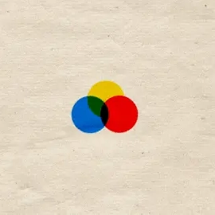{data-zoom-image}

Style et technique

> Le graphisme concerne la **mise en forme visuelle** : couleurs, formes, typographies, images et composition.

🎯 Créer un objet visuel cohérent et esthétique.

### Design

{data-zoom-image}

Solution et utilité

> Le design est une **méthode de réflexion** pour répondre à un problème selon des **contraintes** (public, contexte, support, temps, budget, accessibilité, etc.). 
> On recherche une solution pratique, simple, efficace.

🎯 L'objet (ou l'image) fonctionne bien pour la personne qui l'utilise.

### Design + graphisme

{data-zoom-image}

Mission !

> Le design graphique est l'art de concevoir des images pour transmettre un message précis à un public, dans un contexte donné. 
> C'est une communication visuelle qui se veut surtout **stratégique**.

🎯 Convaincre, informer ou guider l'utilisateur rapidement.

#### Histoire du design graphique

{data-zoom-image}
<!-- Plus d’expression, contre l’austérité -->
<!-- Lignes organiques et motifs floraux; a modernisé l’affiche et la typographie. -->

{data-zoom-image}
<!-- De l’enthousiasme dans les choses du quotidien -->
<!-- Formes simples, fonction d’abord; a posé les bases du design moderne. -->

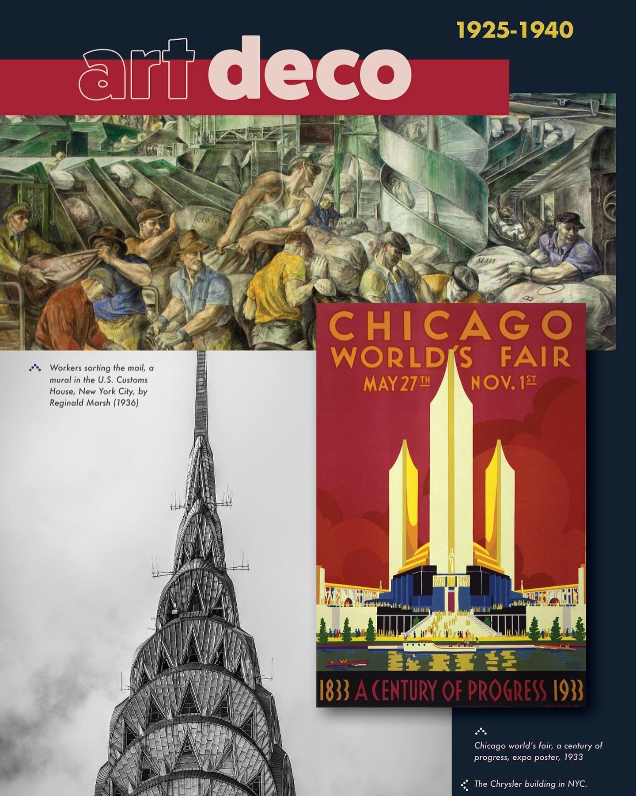{data-zoom-image}
<!-- La forme suit la fonction -->
<!-- Géométrie chic et symétrie; a popularisé le modernisme “luxe”. -->

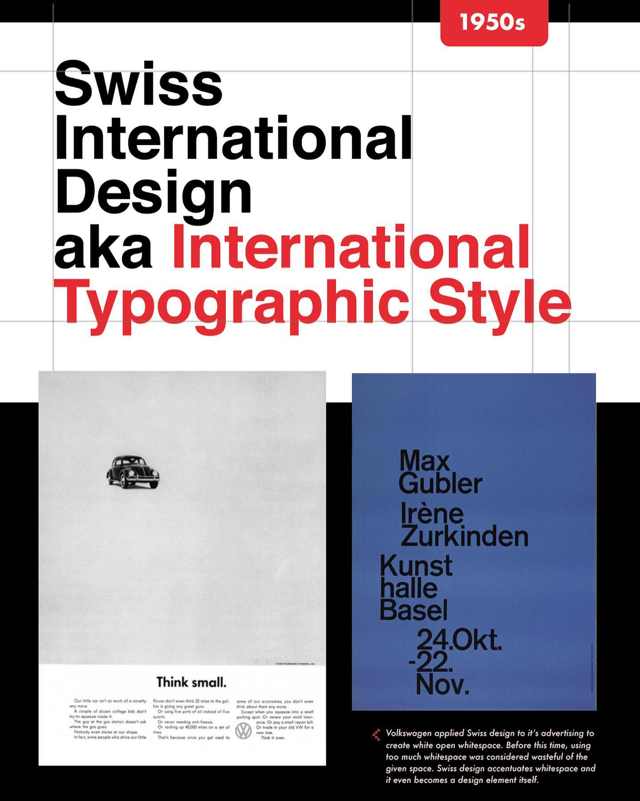{data-zoom-image}
<!-- Opulence et souci du détail -->
<!-- Grille, sans-serif, clarté; a standardisé la mise en page moderne. -->

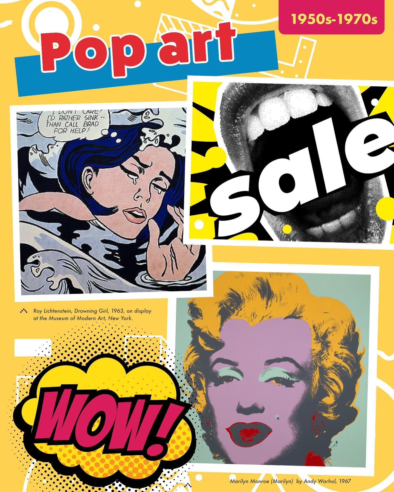{data-zoom-image}
<!-- La forme suit la fonction -->
<!-- Imagerie pop et couleurs vives; a fait entrer la culture de masse en design. -->

{data-zoom-image}
<!-- Dynamisme et mouvement -->
<!-- Mélange, ironie, rupture; a ramené l’expression et l’éclectisme. -->

[Les tendances actuelles en print](https://www.vistaprint.fr/hub/tendances-design-graphique)

#### Design (graphique) Web

Les tendances en graphisme peuvent être pertinentes comme références, mais le graphisme Web a de nombreuses considérations techniques et conceptuelles qui changent la façon dont on aborde le design et l'esthétisme. Par exemple : 

- Numérique et non imprimé
- Interactivité
- Expérience utilisateur (navigation, temps de chargement)
- Médias animés (gif, vidéo, animation)
- Accessibilité
- Responsive

[Les tendances Web actuelles](https://www.canva.com/newsroom/news/design-trends-2026/)

## Le design graphique

{.w-100}

L’expertise du designer graphique c'est la communication. 

Il faut faire comprendre quelque chose (un message ou une information) **rapidement**, le plus **efficacement** possible. 

!!! example "Étude de cas - Panneaux de stationnement"

    En 2014, Nikki Sylianteng a eu l'initiative de [repenser l'information des panneaux de stationnement à Los Angeles](https://nikkisylianteng.com/parking) dans l'optique de simplifier leur compréhension par le design graphique.

    

    <figure markdown>
    {data-zoom-image}
    <figcaption>😨</figcaption>
    </figure>
    <figure markdown>
    {data-zoom-image}
    <figcaption>💅</figcaption>
    </figure>
    

### La méthode QQOQCCP

Pour y arriver, il faut bien comprendre l'objectif !

On peut alors utiliser la méthode [QQOQCCP](https://bpifrance-creation.fr/moment-de-vie/qqoqccp-outil-presenter-idee) :

| Questions |  |
| - | - |
| **Quoi ?** | quel est le message / l’objectif ? (informer, convaincre, vendre, faire agir) |
| **Qui ?** | à qui on parle ? (public cible, besoins, codes, attention) |
| **Où ?** | où est-ce que ce sera vu ? (téléphone, affiche, site, écran, rue) |
| **Quand ?** | à quel moment ? (urgence, saison, période, humeur du public) |
| **Comment ?** | avec quels choix visuels ? (hiérarchie, contraste, cohérence, divulgation progressive, accessibilité) |
| **Pourquoi ?** | pourquoi le message importe ? |

!!! example "Exercice - Portes ouvertes"

    **Message : « Portes ouvertes, 5 février 18h à 21h »**

    On vous demande de faire une affiche sur un mur de la cafétéria et de faire une story Instagram.

    Comment aborder cette demande ?

    > 🌱 Indice : Le « où » et le « comment » sont importants

    <!-- Affiche : Gros titre lisible à 5–10 m, une seule info clé en énorme (date/heure), très peu de texte, contraste fort. -->
    <!-- Instagram : 1 idée par écran, animation possible, bouton/CTA clair (“Swipe / Inscris-toi”), texte court, éléments centrés. -->

!!! example "Exercice - Application de budget"

    **Une application de budget**

    On vous demande de faire 2 applications de gestion de budget. Une pour les étudiants et une pour les parents.

    Comment aborder cette demande ?

    > 🌱 Indice : Le « qui » et le « quoi » sont importants.

    <!-- Penser à l'objectif, le ton, le type de visuel, fonctionnalités, le type d'action à solliciter. -->

    <!-- Étudiant
    Objectif typique : survivre au mois sans stress
    Ton : simple, motivant, un peu ludique
    Visuels : dynamiques, concrets (sorties, abonnement, épicerie)
    Fonctionnalités mises de l’avant : budget hebdo, alertes “trop dépensé”, objectifs d’épargne, catégories faciles
    CTA : “Commencer en 2 minutes” -->

    <!-- Parent
    Objectif typique : gérer une famille + prévoir
    Ton : rassurant, organisé, fiable
    Visuels : plus calmes, axés sur la planification (épicerie, garderie, activités, imprévus)
    Fonctionnalités mises de l’avant : budgets par postes fixes, suivi des dépenses du foyer, objectifs (vacances, rénovations), rappels de paiements
    CTA : “Planifier le mois” / “Voir un exemple de budget familial” -->

### Les enjeux de la désinvolture

{.w-100}

Si on fait abstraction des besoins et du contexte : 

* On peut difficilement justifier ses choix
* On risque de devoir recommencer plusieurs fois (beaucoup d'irritants pour tout le monde)
* Ça peut nuire à la marque 
  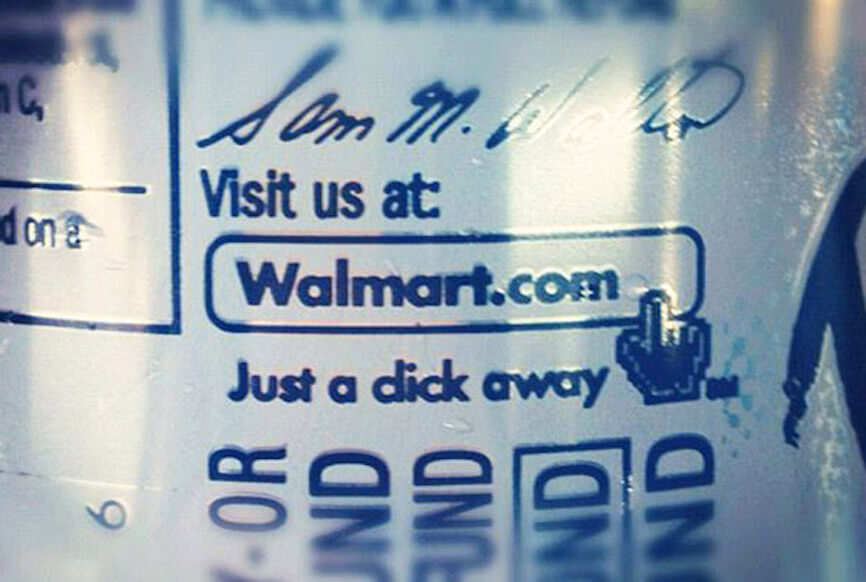{data-zoom-image .w-25}
  {data-zoom-image .w-25}
  {data-zoom-image .w-25}
  {data-zoom-image .w-50}

### L'effet des contraintes

Pour viser juste, il faut prendre le temps d'avoir bien compris, de laisser reposer son oeuvre, de la faire évaluer par d'autres, etc. Ça c'est les conditions idéales, mais dans le monde professionnel, c'est assez rare d'avoir peu de contrainte.

Parfois c'est pas toujours la faute du designer. Un classique pour déterminer la faisabilité d'un projet est l'acronyme [QCD](https://fr.wikipedia.org/wiki/QCDA).

{.w-50 data-zoom-image}

### La phase d'inspiration

La phase d'inspiration est toujours très importante pour ne pas avoir à refaire la roue à chaque fois. S'inspirer des pros est la meilleure façon d'apprendre.

Voici quelques sources : 

* [Behance](https://www.behance.net/galleries/graphic-design)
* [Awwwards](https://www.awwwards.com/)
* [Dribbble](https://dribbble.com/tags/graphic-design)
* [Pinterest](https://ca.pinterest.com/search/pins/?q=graphic%20design&rs=typed)
* Reddit : [r/graphic_design](https://www.reddit.com/r/graphic_design/), [r/web_design](https://www.reddit.com/r/web_design/), [r/FigmaDesign](https://www.reddit.com/r/FigmaDesign/)

!!! question "Qu'est-ce que je regarde ?"

    Trouver des œuvres jolies, c'est bien, mais connaître le style et ses origines apporte une compréhension essentielle à la professionnalisation.

    <figure markdown>
    {.w-50 data-zoom-image}
    <figcaption>Totally Accurate Battle Simulator</figcaption>
    </figure>

    Prenons l'exemple de l'esthétisme low-poly dans les jeux vidéo. Il est intéressant de savoir que cet esthétisme existe depuis les années 90, mais il est encore plus intéressant de savoir pourquoi ce style a resurgi dans les années 2010 : performance, coût de production. Donc son usage va au-delà de ses qualités esthétiques. Son usage fait partie d'une stratégie ! C'est la même chose en design graphique.

    En cas de doute, utilisez par exemple <https://imgops.com/> (un genre de google images) pour trouver les origines d'une image. Pour en savoir plus sur son courant artistique, utilisez l'IA (LLM) ou allez à la bibliothèque ;)

### Techniques de création

Lorsqu'on crée, l'inspiration est un bon support, mais il faut connaître certaines techniques afin de faciliter le processus.

#### C.R.A.P.

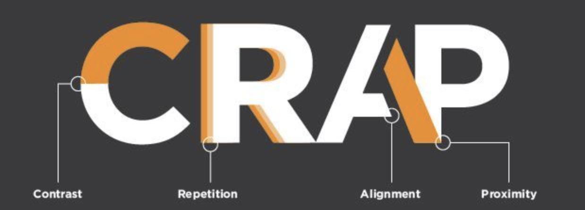{data-zoom-image}

Le principe [C.R.A.P.](https://www.digitallearninginstitute.com/blog/visual-design-for-digital-learning-c-r-a-p-principles)[^crap] est un principe simple permettant d'orienter son approche au design graphique en 4 volets : contraste, répétition, alignement et proximité.

#### 12(ish) principes de design graphique

<figure markdown>
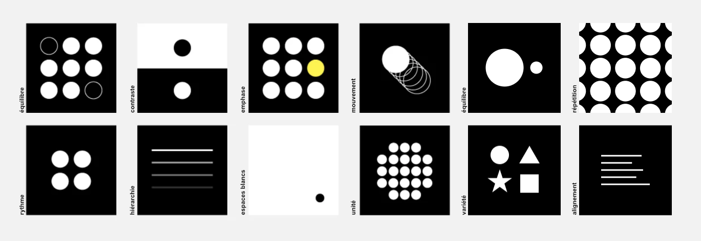{data-zoom-image}
<figcaption>alignement, contraste, équilibre, hiérarchie, couleurs, espacements, proportions, répétition, rythme, mouvement, accentuation, proximité, unité</figcaption>
</figure>

En vrai, il n’y a pas de recettes universelles, mais on observe des [principes](https://www.figma.com/resource-library/graphic-design-principles/) récurrents qui augmentent les chances qu’un visuel soit efficace. 

!!! info "Ce ne sont pas des « règles esthétiques »"
    
    En tout cas, pas que ! 
	
	Ce sont des **leviers** pour rendre un message plus clair, lisible et convaincant. Un peu comme une boîte à outils 🛠️ du designer.

!!! example "Aiguisons notre œil de designer"

    {data-zoom-image .w-33}
    {data-zoom-image .w-33}

    ---

    {data-zoom-image .w-33}
    {data-zoom-image .w-33}

    ---

    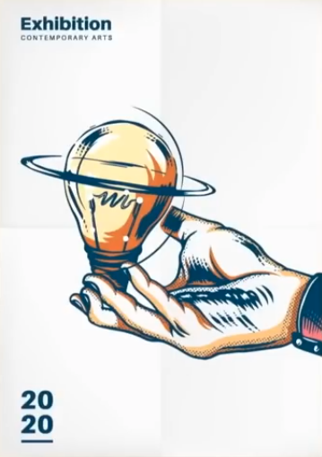{data-zoom-image .w-33}
    {data-zoom-image .w-33}

    ---

    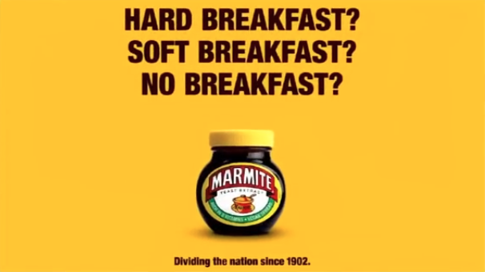{data-zoom-image .w-33}
    {data-zoom-image .w-33}

    ---

    {data-zoom-image .w-33}
    {data-zoom-image .w-33}

    ---

    Les exemples sont tirés de la chaîne YouTube de [Satori Graphics](https://www.youtube.com/@SatoriGraphics)

## Figma 

{ .w-100 }

[Figma](https://www.figma.com) est un outil de conception collaboratif en ligne qui permet de créer, prototyper et commenter des interfaces (maquettes, UI, UX) en temps réel directement dans le navigateur.

### Création de compte

{ data-zoom-image }

Rendez-vous sur <https://www.figma.com/login>

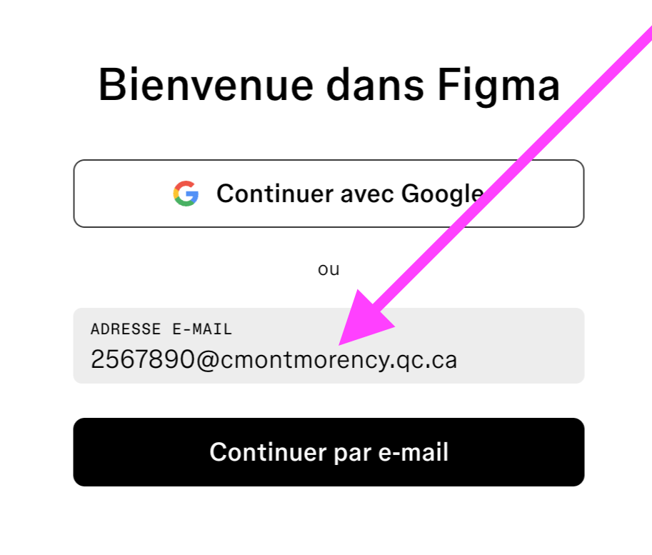{ data-zoom-image }

Utilisez l'adresse courriel du CÉGEP

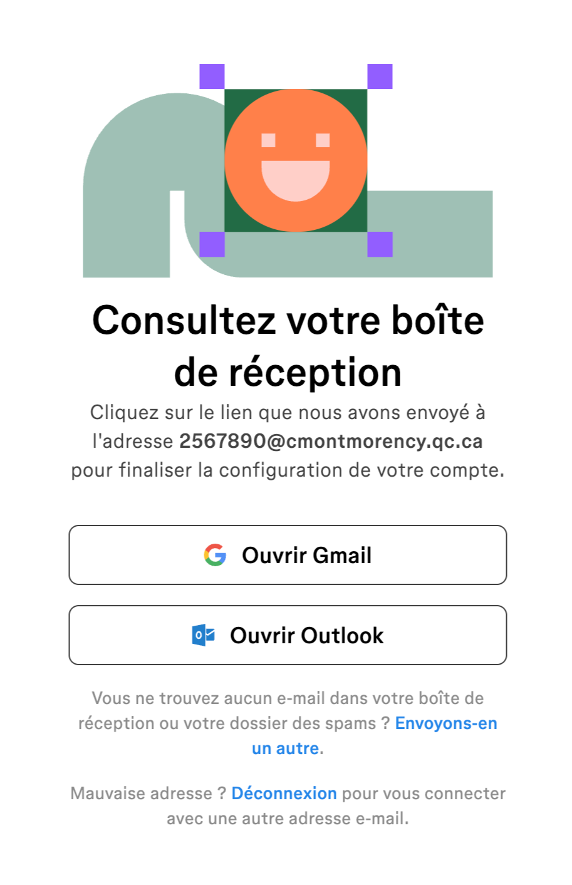{ data-zoom-image }

Finalisez la création de compte

### Introduction à Figma

1. Aller sur figma.com  
2. Se connecter  
3. Créer un fichier **Design**  
4. Renommer le fichier : `Cours01`  
5. Renommer la **Page 1** : `Début`  
6. Créer un **Frame** (équivalent d'un *artboard*)  
7. Renommer le frame : `Test`

#### Navigation (essentiels)

- Déplacements et zoom
- Ordre des calques (Layers)
- Sélection, multi-sélection, verrouillage
- Alignements et distribution

#### Formes (Shape tools)

- Panneau de droite (propriétés)
- Carré avec ++shift++ (garde les proportions)
- Coins arrondis
- Grouper / dégrouper
- Snap, alignement et distribution
- Redimensionnement et rotation (outil Rotation : ++r++)
- Flip horizontal / vertical (effet miroir)

#### Propriétés visuelles

- Remplissages (solid, gradients)
- Contours / tracés (stroke)
- Effets (ombres, flou, etc.)
- Opacité

#### Texte

- Outil texte
- Styles de base : taille, graisse, interlignage, alignement

#### Démonstrations rapides (idées)

- Jeux olympiques (formes + simplification)
- Logo Figma (formes + opérations booléennes)
- Triptique Piet Mondrian (grille + proportions + couleurs)

#### Sauvegarde et bonnes pratiques

- Figma sauvegarde automatiquement **dans le cloud**.
- Renommer clairement les fichiers, pages et frames (éviter "Untitled" / "Frame 1").
- Exporter au besoin (PNG/SVG/PDF) et (optionnel) exporter un fichier `.fig`.
	
## Exercices

  

  <small>Exercice - Figma</small> 
  **[Mosaïque](./activite/exercice/pattern/index.md){.stretched-link .back}**

## Devoir 

  

  <small>Devoir - Figma</small> 
  **[Activer la version étudiante gratuite](./activite/devoir/figma-edu/index.md){.stretched-link .back}**

