# Cours 2 | Composition

## Retour sur les exercices

!!! tip "Au besoin, demandez une rétroaction verbale 🗣️ sur votre travail"

## Comité Merch

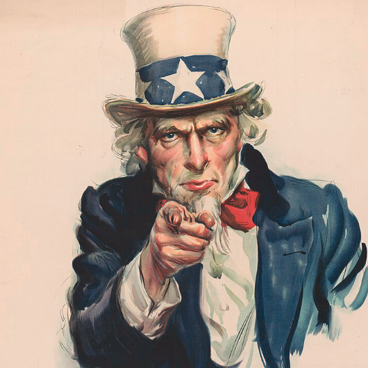

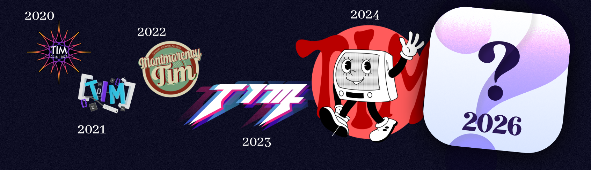

J'ai besoin de 2 volontaires par groupe pour gérer le concours du logo 2026 !

## Règle des tiers 

La règle des tiers est un principe classique de photographie qui vise à positionner un sujet d'intérêt de façon harmonieuse. C'est un principe également très utile pour le design graphique.

> Imaginons une grille **3 × 3** sur un visuel. 
> Placez les éléments importants soit sur les lignes, soit sur les intersections.

<iframe class="aspect-16-9 w-75 center" src="https://www.youtube.com/embed/ThQOmxElMt4?si=gNBr9zvzy6NXLjQ6" title="YouTube video player" frameborder="0" allow="accelerometer; autoplay; clipboard-write; encrypted-media; gyroscope; picture-in-picture; web-share" referrerpolicy="strict-origin-when-cross-origin" allowfullscreen></iframe>

!!! tip "Vous avez cette option sur votre téléphone"

	{.w-25 data-zoom-image}

## Principes de design graphique

<!-- https://www2.sjsu.edu/honorsx/docs/HonsX%2012%20Principles.pdf -->
<!-- Before after : https://www.justinmind.com/blog/5-excellent-website-redesigns-before-and-after/ -->
<!-- Before after : https://www.youtube.com/watch?v=cRqCrEx05Ro -->
<!-- https://visme.co/blog/visual-hierarchy/ -->

### Contraste

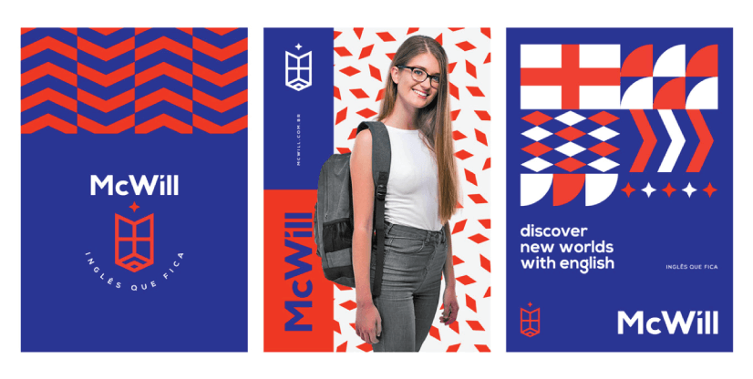{data-zoom-image}

**Définition**  
Mettre des éléments en opposition (taille, formes, typo, texture, couleurs, styles).

**À quoi ça sert ?**  
Attirer l’attention, clarifier la lecture et rendre un message plus “accrocheur”.

**Exemples**  
{.w-25 data-zoom-image}
{.w-25 data-zoom-image}
{.w-25 data-zoom-image}

<!-- https://yesimadesigner.com/using-contrast-1/ -->
<!-- https://graphicmama.com/blog/principles-design/#principle-contrast -->

!!! example "Une petite analogie ⭐️"
	Une pièce silencieuse.  
	Un cri y sera extrêmement contrasté (opposition sonore).  
	Dans une pièce où tout le monde crie, plus personne ne se distingue.

!!! info "Contraste et accessibilité"
	Le contraste de couleur peut nuire à la lisibilité s'il n'est pas assez prononcé, **surtout pour du texte**.

	{data-zoom-image .w-50}

### Alignement

{data-zoom-image}

<!-- https://graphicmama.com/blog/principles-design/ -->

**Définition**  
Un **fil invisible** qui relie les éléments entre eux (marges, colonnes, grilles, axes).

**À quoi ça sert ?**  
Donner une impression d’ordre, de rigueur et de cohérence. À l’inverse, on peut **désaligner volontairement** pour provoquer ou interpeller.

**Exemples**  
{data-zoom-image}
{data-zoom-image}
<!-- https://visme.co/blog/visual-hierarchy/ -->
<!-- https://254-online.com/alignment-principle-design/ -->

!!! example "Une petite analogie ⭐️"
	Imaginez une troupe de soldats au garde-à-vous.  
	Un soldat qui n'est pas aligné évoque un manque de rigueur.  
	Remplacez ce même soldat par un danseur contemporain : vous avez plutôt un effet de contraste !

### Équilibre

**Définition**  
Répartition du **poids visuel** dans une image (ce qui “pèse” : taille, contraste, couleur, densité, position, etc.).

**À quoi ça sert ?**  
Créer un sentiment de **stabilité** et de confort visuel.  

<!-- Le contraste attire l’œil; l’équilibre rend l’ensemble harmonieux et lisible. -->

**Exemples**  

{data-zoom-image}

**Équilibre symétrique** 
Évoque le calme et la prévisibilité.

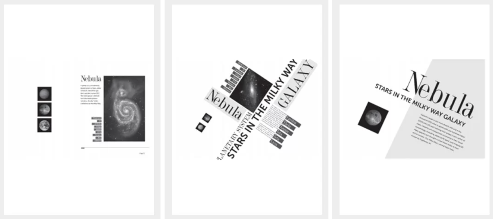{data-zoom-image}

**Équilibre asymétrique** 
Évoque le dynamisme et l'informel.

!!! info "Super important en design"
	L'asymétrie ne signifie pas que les éléments sont jetés au hasard, ni que c'est déséquilibré ! On compense par le **poids visuel** plutôt que par une position miroir.

	{data-zoom-image .w-25}
	{data-zoom-image .w-25}

	{data-zoom-image .w-25}
	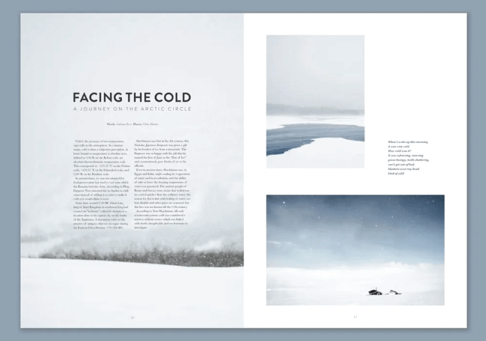{data-zoom-image .w-25}

<!-- https://254-online.com/balance-principle-design/ -->

### Hiérarchie

{.w-100 data-zoom-image}

**Définition**  
Organiser l’information pour indiquer **quoi regarder en premier**, puis en deuxième, etc.

**À quoi ça sert ?**  
Aider la personne à comprendre rapidement, naviguer facilement et retenir l’essentiel.  
<!-- La hiérarchie visuelle est souvent créée par le contraste, mais pas seulement (espacement, position, couleur, typographie, etc.). -->

**Exemples**  

{.w-25 data-zoom-image}
{.w-25 data-zoom-image}
{.w-25 data-zoom-image}

<!-- https://254-online.com/hierarchy-principle-of-design/ -->
<!-- https://blog.thenounproject.com/graphic-design-principles-hierarchy/ -->

### Couleur

{data-zoom-image}

**Définition**  
La couleur est un langage visuel. Elle sert à communiquer, hiérarchiser et guider le regard.

**À quoi ça sert ?**  
Communiquer une intention (ambiance, connotation), attirer l’attention, soutenir la hiérarchie et améliorer (ou nuire à) la lisibilité.

**Exemple**  

{data-zoom-image .w-25}
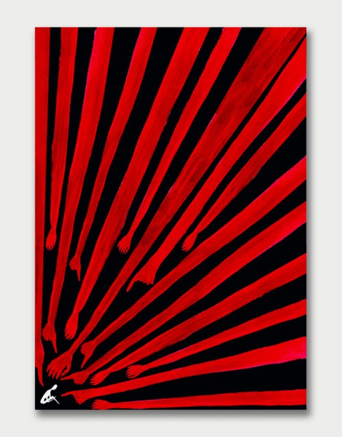{data-zoom-image .w-25}

La couleur peut servir de “code” (ex. : boutons, alertes, catégories) ou créer une émotion (ex. : luxe, danger, calme).

<!-- https://deepidoo.com/psychologie-des-couleurs-et-affichage-dynamique/ -->

### Le « vide »

{.w-100 data-zoom-image}

**Définition**  
Espace laissé volontairement autour des éléments (marges, espacements, zones non occupées).

**À quoi ça sert ?**  
Laisser respirer, améliorer la lisibilité et mettre en valeur l’essentiel.

**Exemples**  
> Less is More

{data-zoom-image}

<!-- https://masterclass.ted.com/blog/visual-presentations-series-less-is-more -->

{.w-25 data-zoom-image}
{.w-25 data-zoom-image}
{.w-25 data-zoom-image}

#### Espace négatif

**Définition**  
Utiliser le “vide” pour **faire apparaître une forme secondaire** ou une idée cachée.

**À quoi ça sert ?**  
Ajouter une seconde lecture, créer une métaphore, rendre un visuel plus mémorable.

**Exemples**  
{data-zoom-image .w-25}
{data-zoom-image .w-25}
{data-zoom-image .w-25}
{data-zoom-image .w-25}
{data-zoom-image .w-25}

### Proportion

{data-zoom-image .w-100}

**Définition**  
Relation de taille entre les éléments (grands/petits, épais/fin, large/étroit).

**À quoi ça sert ?**  
Créer du sens : importance, relation, confort visuel.  
Pour qu'il y ait proportion (ou disproportion), il faut comparer un élément à un autre.

**Exemples**  
{data-zoom-image}

<!-- https://www.thirdwunder.com/blog/the-importance-of-proportion-in-design/ -->

{.w-25 data-zoom-image}
{.w-25 data-zoom-image}

<!-- https://fabrikbrands.com/branding-matters/graphic-design/proportion-in-graphic-design-principles-of-design-proportion/ -->

<!-- Les lettres pour jaguar sont proportionnelles, mais pas pour puma. Le m est plus large. -->
<!-- Aussi, l'animal ne prend pas le même espace dans les 2 cas. -->

### Répétition

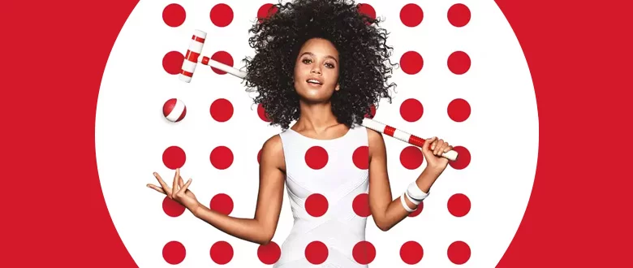

**Définition**  
Réutiliser des éléments similaires/identiques (couleurs, formes, motifs, textures, typographies).

**À quoi ça sert ?**  
Créer de la cohérence visuelle, renforcer une identité et installer un rythme agréable.

**Exemples**  
{.w-25 data-zoom-image}
{.w-25 data-zoom-image}
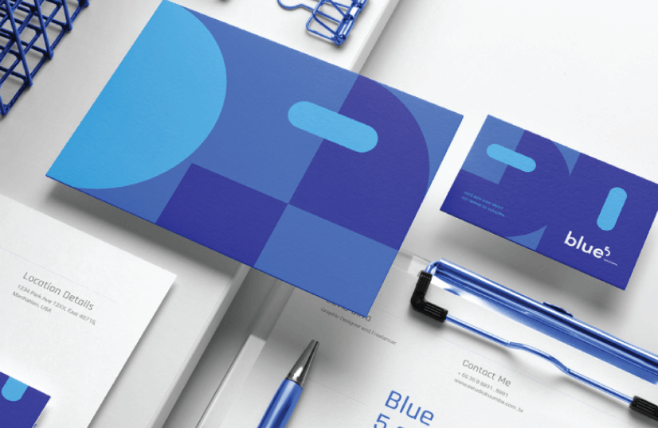{.w-25 data-zoom-image}

<!-- https://www.thirdwunder.com/blog/the-importance-of-repetition-in-design/ -->

### Rythme

{.w-100 data-zoom-image}
<!-- https://www.outcrowd.io/blog/value-of-rhythm-in-design -->

**Définition**  
Cadence visuelle créée par la répétition **et** des variations (ex. : alternance, progression, regroupements).

**À quoi ça sert ?**  
Guider l’œil et rendre la composition “vivante” sans la rendre chaotique.

**Exemples**  
{.w-50 data-zoom-image}

{.w-25 data-zoom-image}
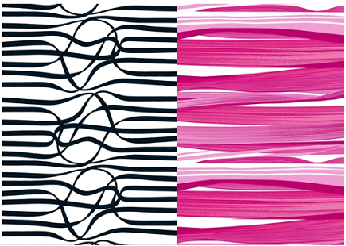{.w-25 data-zoom-image}
{.w-25 data-zoom-image}

<!-- {.w-25 data-zoom-image} -->
<!-- https://www.youtube.com/watch?v=seey_uNt7V8 -->

### Mouvement

<figure markdown>
{data-zoom-image}
<figcaption markdown>
[La Grande Vague de Kanagawa](https://fr.wikipedia.org/wiki/La_Grande_Vague_de_Kanagawa) - 1830
</figcaption>
</figure>

**Définition**  
Organisation qui **dirige le regard** (directions, diagonales, courbes, flèches, séquences).

**À quoi ça sert ?**  
Créer un parcours de lecture et une dynamique (ex. : du titre vers l’appel à l’action).

**Exemples**  
{.w-25 data-zoom-image}
{.w-25 data-zoom-image}
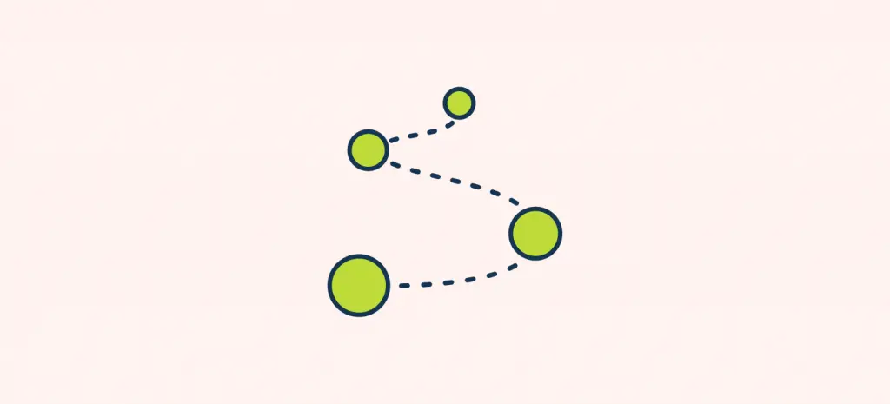{.w-25 data-zoom-image}
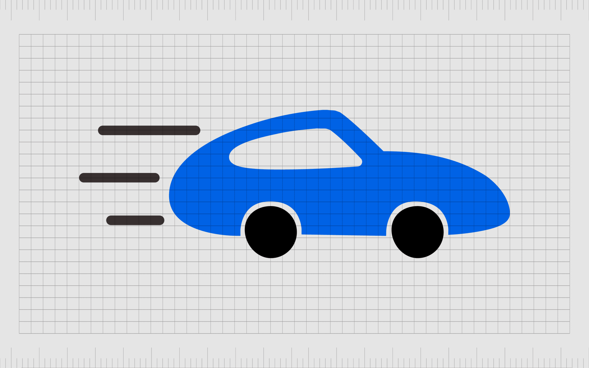{.w-25 data-zoom-image}
{.w-25 data-zoom-image}

### Emphase

{.w-100}

**Définition**  
Mettre un élément en vedette : le **point focal** (ce que l’on veut que l’œil voie en premier).

**À quoi ça sert ?**  
Éviter que tout “se batte” pour l’attention et rendre l’intention claire.

**Exemples**  
On peut créer de l'emphase avec le contraste, la perspective, la subordination[^subordination] et la position.

[^subordination]: En art, la subordination consiste à mettre en valeur un élément central de l'image, en atténuant l'importance de l'ensemble.

{.w-25 data-zoom-image}
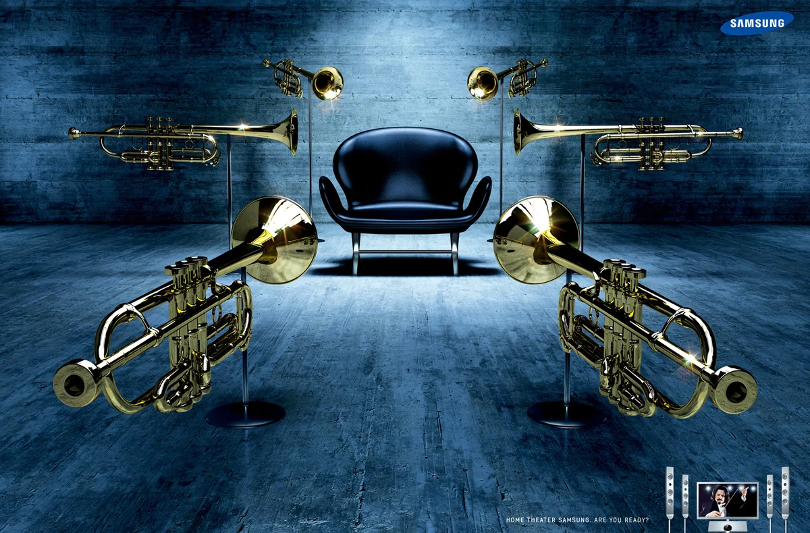{.w-25 data-zoom-image}
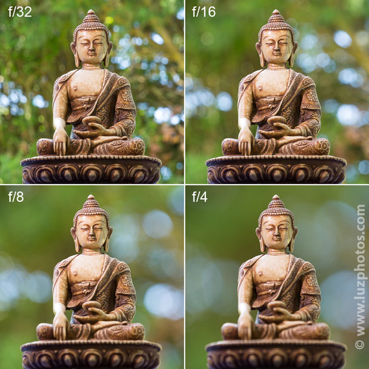{.w-25 data-zoom-image}

<!-- https://yourartpath.com/what-is-emphasis-in-art-6-ways-to-use-it-examples -->

### Proximité

**Définition**  
Regrouper ce qui va ensemble et séparer ce qui est différent.

**À quoi ça sert ?**  
Clarifier la structure, réduire la confusion, montrer des relations (groupes, sections, catégories).

**Exemples**  
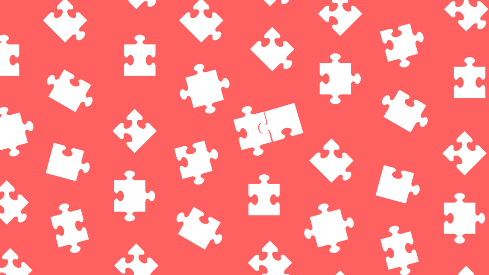{.w-25 data-zoom-image}
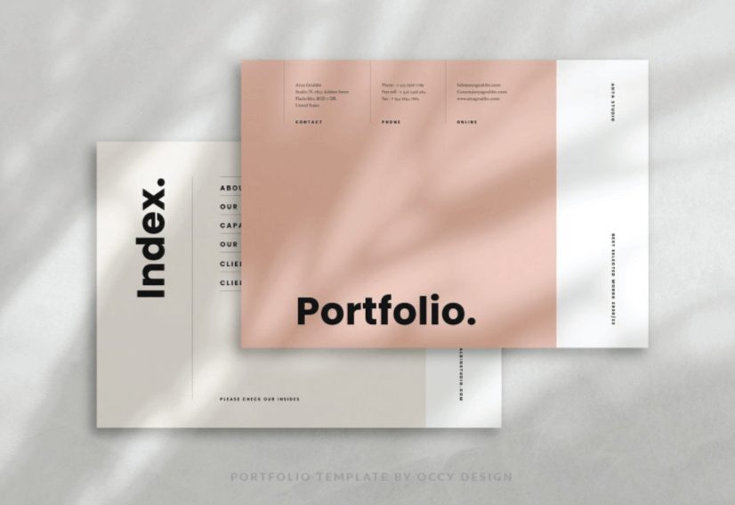{.w-25 data-zoom-image}
{.w-25 data-zoom-image}
{.w-25 data-zoom-image}

<!-- https://uxmisfit.com/2019/04/23/ui-design-in-practice-gestalt-principles/ -->
<!-- https://wearemucho.com/work/uc-annual-report-2022 -->
<!-- https://blog.thenounproject.com/grouping-and-proximity-in-graphic-design-the-art-of-visual-organization/ -->

### Unité

{data-zoom-image}

**Définition**  
Donner l’impression que **tout appartient au même système** (style, règles, cohérence, harmonie).

**À quoi ça sert ?**  
Renforcer la crédibilité, la clarté et l’identité visuelle (on “reconnaît” le système).

**Exemples**  

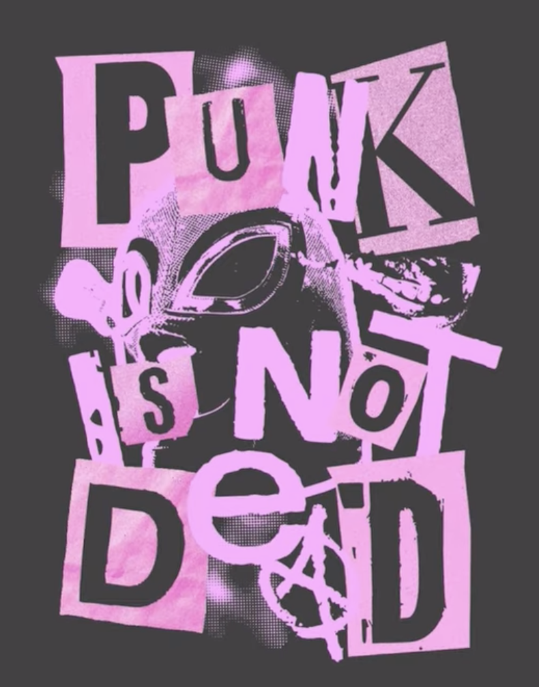{.w-25 data-zoom-image}
{data-zoom-image .w-25}
{data-zoom-image .w-25}

<!-- https://www.panesar.studio/le-temps-chocolate -->
<!-- https://www.zekagraphic.com/12-principles-of-graphic-design/ -->
<!-- https://www.figma.com/resource-library/graphic-design-principles/ -->
<!-- https://medium.com/design-related/20-design-rules-you-should-never-break-bc5407a78cea -->
<!-- https://www2.sjsu.edu/honorsx/docs/HonsX%2012%20Principles.pdf -->

### Mini _checklist_ de principes 🧠

Quand vous créez, corrigez ou améliorez un design, commencez par :

1. **Hiérarchie** : qu’est-ce qu’on voit en premier, en deuxième, etc. ?
2. **Proximité** : qu’est-ce qui va ensemble / qu’est-ce qui est séparé ?
3. **Alignement** : est-ce que le positionnement est efficace ?
4. **Contraste** : qu’est-ce qui ressort ?
5. **Vide** : est-ce que ça respire ? (surtout autour du texte)
6. **Unité** : est-ce que les styles sont cohérents ?

## Figma

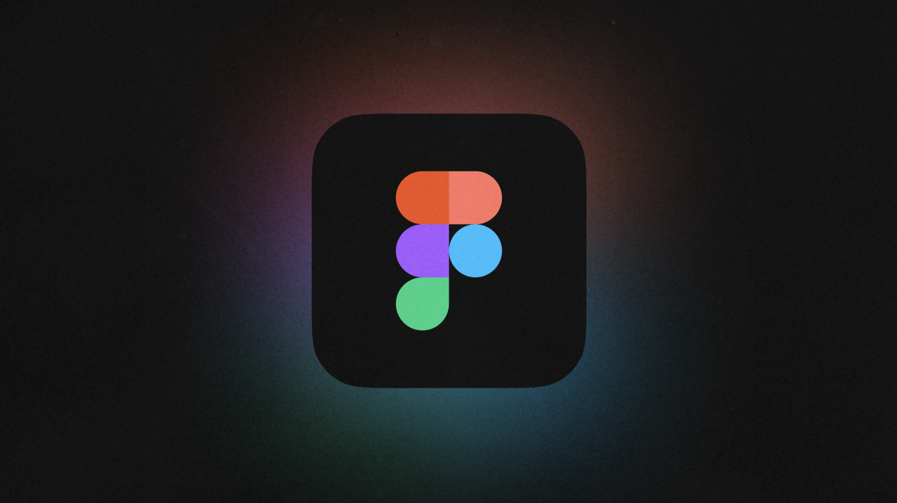

### Tracé et remplissage

- Usage d’images CC0 (ex. : [Pexels.com](https://www.pexels.com/fr-fr/))
- Usage de vecteurs existants pour créer un pattern custom !
- Paramètres avancés de contour

### Vectoriel

- Entrer ou quitter l'édition vectorielle : ++enter++
- Manipulations de tracé (points d'ancrage, courbes Bézier)
- Supprimer un point avec ++Shift+Del++
- Opérations booléennes (Union, Soustraction, Intersection, etc.)

## Exercices

  

  <small>Exercice - Vectoriel</small> 
  **[Courbes de Bézier | method.ac](https://bezier.method.ac/){.stretched-link}**

  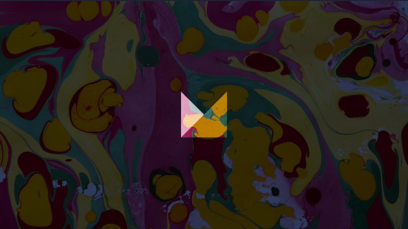

  <small>Exercice - Vectoriel</small> 
  **[Opérations booléennes | method.ac](https://boolean.method.ac/){.stretched-link}**

  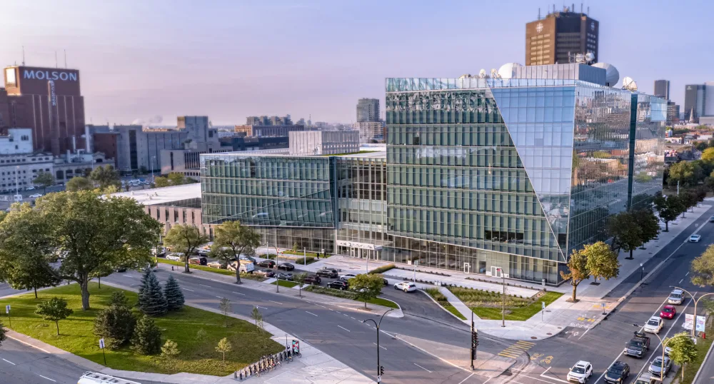

  <small>Exercice - Figma</small> 
  **[Radio-Canada](./activite/exercice/radio-canada/index.md){.stretched-link .back}**

  

  <small>Exercice - Figma</small> 
  **[DIE](./activite/exercice/die/index.md){.stretched-link .back}**

## Devoir

  

  <small>Devoir - Figma</small> 
  **[J'peux faire mieux que ça !](./activite/devoir/sauvetage/index.md){.stretched-link .back}**

[STOP]

AMÉLIORATION pour 2027
Changer la partie des principes par une partie plus interactives. C'est trop magistral. Il faudrait plutôt leur donner du matériel initial et ils le positionneraient de sorte à ce que ça respecte le principe.
