# Cours 3 | Typographie

## Tutorat 

| Nom | Plage horaire | Lieu | Dates |
| --- | ------------- | ---- | ----- |
| Alexis Guilbault | Mardi 12h30&nbsp;à&nbsp;14h10 | En personne au Centre d’aide C-1612 | 3 février au 27 avril inclus. |
| Olivier Laliberté | Mercredi 19h00&nbsp;à&nbsp;20h15 | En ligne sur TEAMS : canal Tutorat de l'équipe TIM-Programme TIM | 4 février au 29 avril inclus. |
| Iryna Lysenko | Dimanche 18h00&nbsp;à&nbsp;19h15 | En ligne sur TEAMS : canal Tutorat de l'équipe TIM-Programme TIM | 8 février au 3 mai inclus. |

[Calendrier du tutorat](https://www.cmontmorency.qc.ca/etudiants/services-aux-etudiants/aide-a-la-reussite/aide-techniques/centre-aide-integration-multimedia)

## Typographie

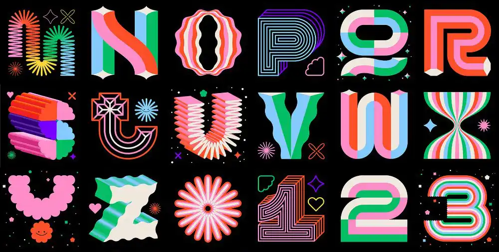{.w-100}

La **typographie** en design graphique sert à **organiser le texte** pour que le message soit **lu, compris et retenu** avec le moins d’effort possible.  

Ce n’est pas **juste** « choisir une belle police ».

## Fonte

{data-zoom-image}

- **Police de caractères** (*typeface*) : le **design** des lettres.
- **Fonte** (*font*) : une **version précise** de cette police (ex. *Roboto Bold Italic 24*), souvent concrètement un **fichier** (variable ou statique) + ses réglages.

## Réglages

### Graisse 

{data-zoom-image}

La **graisse** (en français _bold_ c'est graisse 😅) influence directement :

- la **hiérarchie** (ce qui ressort)
- le **ton** (plus sérieux, plus doux, plus imposant ...)
- la **lisibilité** (une graisse trop fine en petit peut devenir fatigante)

<!-- https://www.medianes.org/la-typographie-a-l-aide/ -->
<!-- Decagram_Font_Emtype_0007.jpg -->

### Italic

{data-zoom-image}

## Catégories de polices

### Sérif

{data-zoom-image}

Lettres avec **empattements** : petites terminaisons aux extrémités des traits.

> Connotation : classique, éditoriale, institutionnelle, sérieuse

!!! info "Souvent confortable pour la **lecture longue** (surtout en imprimé)."

### Sans sérif

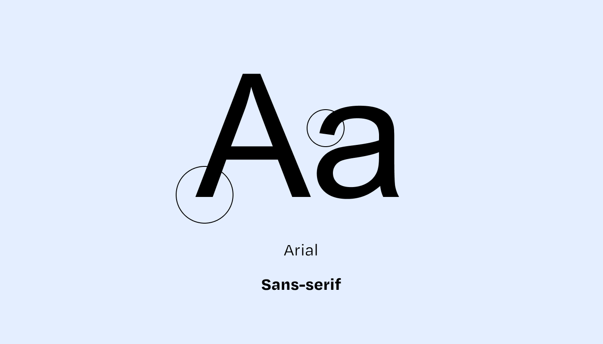{data-zoom-image}

Lettres sans empattements.

> Connotation : moderne, neutre, simple

!!! success "Très utilisé en **web/UI** pour sa clarté à petite taille."

### Slab

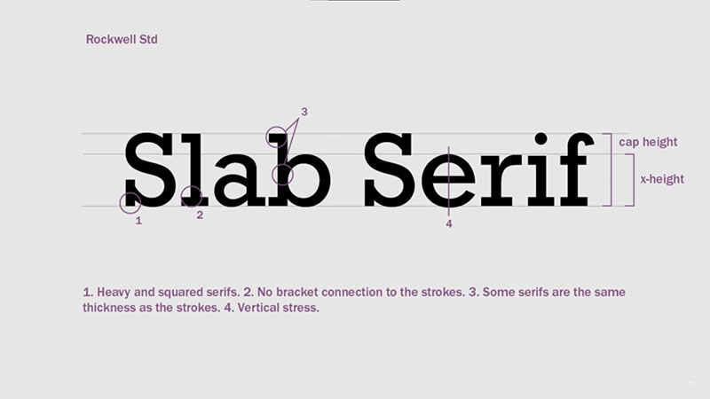{data-zoom-image}

Empattements **épais**, carrés ou très présents.

> Connotation : solide, robuste, parfois rétro

!!! info "Très efficace en **titres** et en signalétique. Pas tant sur les longs textes."

### Monospace 

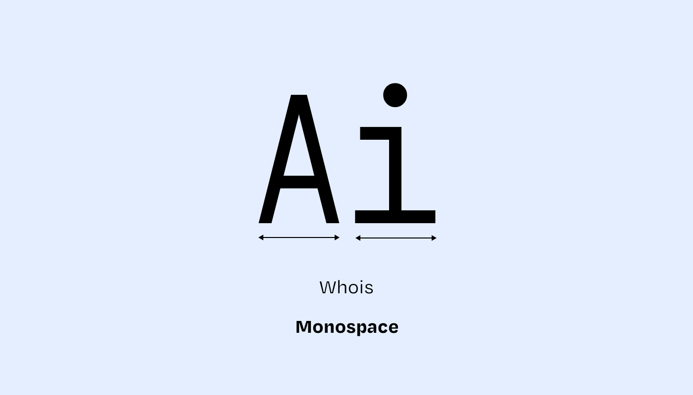{data-zoom-image}

Chaque caractère occupe la même largeur.

> Connotation : technologie, machine, cartésien

!!! info "Souvent utilisé pour afficher du **code** et des données alignées (ex. : comptabilité)."

### Cursive / Script

{data-zoom-image}

Imite l’écriture manuscrite (plume, pinceau, calligraphie).

> Connotation : personnalité, émotion, humain, élégant, ludique

!!! warning "La lisibilité est souvent moins bonne. Idéalement l'utiliser sur du text **court** (ex. : logo, titre)."

### Display 

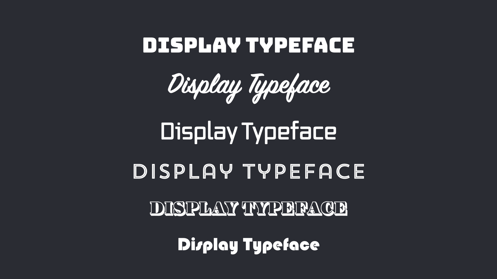{data-zoom-image}

Une police **Display** est surtout une police conçue pour être utilisée **en grande taille** et **en peu de mots**.

## Variantes et OpenType

{data-zoom-image} 

{data-zoom-image .w-25 .float-right} 

Une même police peut avoir plusieurs **variantes** :

- graisses (Light → Black)
- styles (Regular, Italic…)
- largeurs (Condensed → Expanded)
- petites majuscules, [chiffres elzéviriens](https://fr.wikipedia.org/wiki/Chiffres_elz%C3%A9viriens), etc.

<!-- https://learn.microsoft.com/en-us/typography/opentype/spec/otvaroverview -->

### Ligatures

{data-zoom-image}

Les **ligatures** fusionnent certaines lettres (ex. : *fi*, *fl*) pour améliorer le rendu.

!!! info "Les ligatures sont disponibles dans les formats dits [**OpenType**](https://en.wikipedia.org/wiki/OpenType) (`.otf` ou `.ttf`)."

## Espacements

### Interlignage (*line-height*)

{data-zoom-image}

Espace entre les lignes. 

### Interlettrage (*tracking* / *letter spacing*)

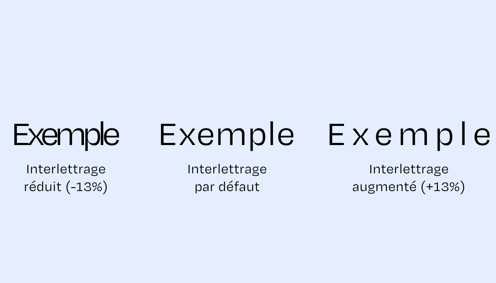{data-zoom-image}

Espacement **global** appliqué à un mot à un texte.

### Crénage (*kerning*)

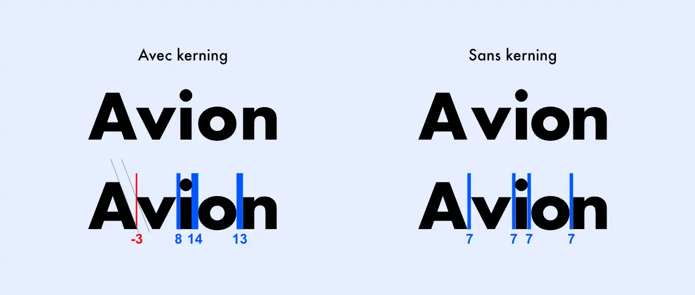{data-zoom-image}

Ajustement, déterminé « à l’œil » par le/la designer de la police, de certaines paires de lettres (ex. A/V, T/o) afin d’équilibrer l’espacement et éviter les “trous” visuels à la lecture.

!!! example "Œil de lynx"

    {data-zoom-image .w-25}

## Choix des fontes

<!-- https://www.toptal.com/designers/typography/choosing-a-typeface-infographic -->

### Cohérence (Titre vs paragraphe)

{data-zoom-image}

Certaines polices sont super en grande taille, pour des textes courts (souvent des Display), mais bien moins performantes pour des paragraphes longs ou en petite taille, et _vice versa_. L’objectif est de choisir une police selon sa fonction (titre, texte, UI, légende) et son contexte d’utilisation.

* Police de titre (display) : plus de caractère, plus de contraste, pensée pour attirer.
* Police de texte (text) : pensée pour tenir longtemps (formes plus simples, plus régulières, plus lisibles).  

Lien utile : [Agencements de différentes fontes](https://typespiration.com/)

<!-- https://betterwebtype.com/web-typography-resources/ -->

### Méthode simple pour choisir

1. Portée du projet (_scope_). Web, app, impression, affiche, logo, réseaux sociaux ?
  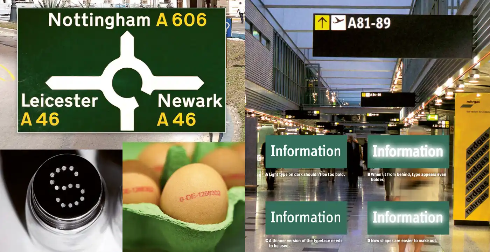{.w-50 data-zoom-image}
1. Ton (_mood_) et message. La police porte une personnalité : sérieux, ludique, luxe, techno, institutionnel. Elle doit soutenir le message et pas le contredire. 
1. Polyvalence, langues et caractères. Certaines polices sont magnifiques, mais peu de variations et incomplètes pour la langue française.  
1. Combinaison. Éviter les polices trop similaires, ça amène plus de confusion qu'autre chose. Dans ce cas, vaut mieux choisir une variante de la même police.
1. Lisibilité. Tester en petite taille, sur fond clair/sombre, en paragraphe (pas juste un mot).

!!! example "Exercice rapide"

	{data-zoom-image}

	

	{data-zoom-image}

	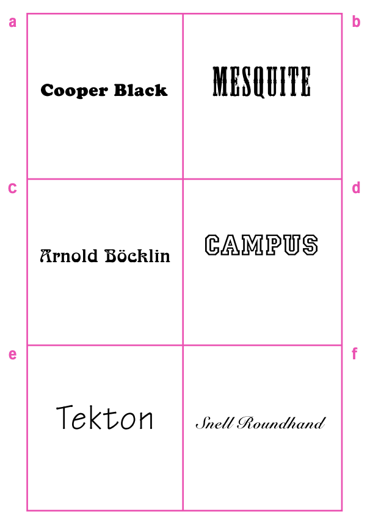{data-zoom-image}
	

### Limitations 

- Certaines polices sont gratuites, «Gratuit pour usage personnel», d’autres sont payantes
- Toujours vérifier la **licence** (web, impression, logo, app...) !

  !!! example "Exemple de licence"

	  <https://www.grillitype.com/shops/gt-walsheim>

### Magasinage

- [Google Fonts](https://fonts.google.com/) : gratuit et libre. Polices souvent très courantes et peu identitaires.
- [Adobe Fonts](https://fonts.adobe.com/fonts)
- [MyFonts](https://www.myfonts.com/fr)
- [DaFont](https://www.dafont.com/fr/) : souvent gratuit pour usage personnel
- [ifonts.xyz](https://ifonts.xyz/font-designers) : souvent gratuit pour usage personnel

!!! note "Moins connus, mais très cool"

	- [Collletttivo](https://www.collletttivo.it/typefaces) : polices libres.
	- [design-research.be/by-womxn/](https://www.design-research.be/by-womxn/) : collection de fontes par des femmes.
	- [Hanken](https://hanken.co/collections/free) : certaines fontes gratuites
	- [ohnotype](https://ohnotype.co/)
	- [vj-type](https://vj-type.com/)

## Lisibilité

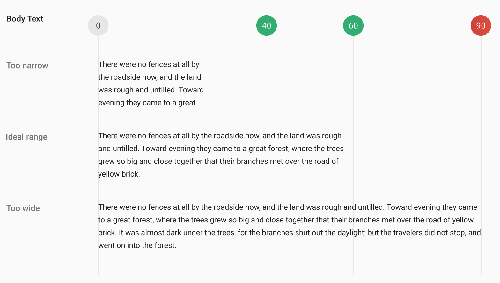{data-zoom-image .w-50}

En général, on dit pour le Web de ne pas faire de paragraphes ni trop large, ni trop courts. 
De ne pas faire d'interligna trop grand, ni trop courts.
D'avoir une taille de caractère suffisament large pour faciliter la lecture.

Ça dépend beaucoup de la fonte utilisée, mais voici une règle de pouce pour les paragraphes :

- Longueur de ligne : **~45–75 caractères**
- Taille : > 14px
- Interlignage : 1.618
- Une fonte sans-serif

!!! info "Type Scale"

	L'échelle typographique (ou _type scale_) est un ensemble de tailles de texte cohérentes (H1, H2, body, caption…) basé sur une logique d’écarts réguliers.

	[Générer un typescale](https://typescale.net/).

## Figma

Fontes

- [Polices de caractères](https://www.figma.com/fonts/)
- Interlignage
- Alinéa (retrait de paragraphe)
- Espacement entre paragraphes
- Ligature avancée (ex. : Raleway, Playfair Display, Cormorant, EB Garamond, Girassol, Updock, Staatliches, Inconsolata)

Vectoriel

- Applatir une police pour accéder à ses vecteurs 😱 !

Effets

- Ombre interne
- Ombre portée
- Calque de floutage
- Flou de fond
- Bruit
- Texture
- Verre (seulement sur les frames!)

<!-- Figma : effets + fx progressifs (https://www.youtube.com/watch?v=sV-J_WH_P4k) -->

Autre

- _Text on path_
- _Radial_ / _Linear Repeat_ ([tuto](https://youtu.be/Cx_kJUIM-wA?si=8eQFfF0Lg-uZL2aU&t=969))

## Exercices 

  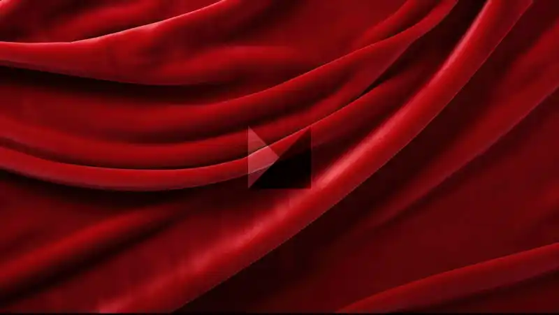

  <small>Exercice - Vectoriel</small> 
  **[Lettres | method.ac](https://shape.method.ac/){.stretched-link}**

  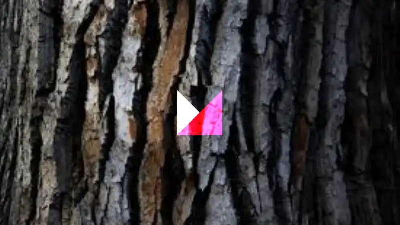

  <small>Exercice - Vectoriel</small> 
  **[Crénage | method.ac](https://type.method.ac/){.stretched-link}**

  

  <small>Exercice - Figma</small> 
  **[Emo](./activite/exercice/emo/index.md){.stretched-link .back}**

  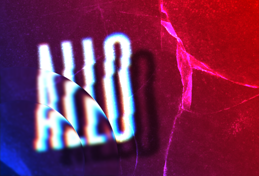

  <small>Exercice - Figma</small> 
  **[Allo](./activite/exercice/allo/index.md){.stretched-link .back}**

  

  <small>Exercice - Figma</small> 
  **[Salé](./activite/exercice/salty/index.md){.stretched-link .back}**

[STOP]

<!-- https://www.reddit.com/r/dontdeadopeninside/ -->
Même données en 4 version différentes en changeant l'emplacement.

<!-- https://static.googleusercontent.com/media/fonts.google.com/en//knowledge/stop_stealing_sheep.pdf -->

<!-- https://ca.pinterest.com/pin/7599893116499317/?e_t=fec5c47b45bc48648780f9f3ca816c93&news_hub_id=3188225014109666688&utm_campaign=hfdigestpins&utm_content=7599893116499317&utm_medium=2004&utm_source=31&utm_term=2 -->
