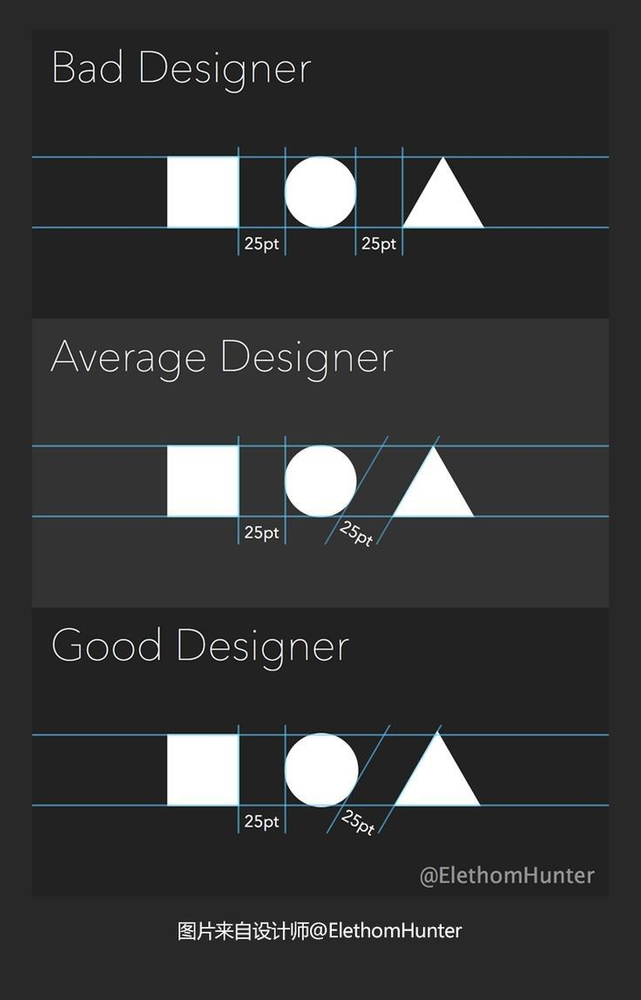

# Cours 3 | Typographie

[STOP]

https://ca.pinterest.com/pin/7599893116499317/?e_t=fec5c47b45bc48648780f9f3ca816c93&news_hub_id=3188225014109666688&utm_campaign=hfdigestpins&utm_content=7599893116499317&utm_medium=2004&utm_source=31&utm_term=2

Text + texture : https://ca.pinterest.com/pin/75364993759827485/

    Certains principes peuvent parfois entrer en conflit. C’est normal 😅 Le contexte et l'objectif à atteindre guide les choix.
    {data-zoom-image .w-25}

Trend 2026 : https://www.youtube.com/watch?v=IK67VeKPvzo

## Tutorat

## Vocabulaire plastique
+ exercice

### Design thinking

take a brief, unpack the problem, brainstorm directions, weigh trade-offs.

Demander le besoin plutôt que la solution au client. Le designer travaille sur la solution au probleme, pas le client.

Par exemple, on peut questionner pourquoi le client veut le résultat X ou Y? En quoi ça répond à tel ou tel problème?

Exemple : 

Je veux une bannière.

- Ok, tu veux qu'elle s'adresse à qui. 
- Où va elle être affichée.
- Pourquoi faire une bannière ? / Quel besoin elle doit combler? / Quel impact doit elle avoir ? (une action doit être prise par celui qui la regarde ?)

## Typographie

https://www.reddit.com/r/dontdeadopeninside/

À enseigner
	•	Lisibilité : tailles minimales, interlignage, longueur de ligne.
	•	Hiérarchie typographique : H1/H2/Body/Caption.
	•	Règle simple : 2 polices max, contrastes par taille/poids (pas 12 styles).
Démo Figma
	•	Styles de texte (Text Styles) : créer H1/H2/Body/Small.
	•	Auto-layout de base (si tu veux déjà préparer UI plus tard).

lisibilité, hiérarchie typo, paires, styles, règles web, accessibilité.

Quelle font utiliser dans quel contexte.
https://www.youtube.com/watch?v=xzyvO71XEaA

https://ifonts.xyz/font-designers

https://www.figma.com/fonts/

Tokens : https://www.youtube.com/watch?v=as184ZLawVI (plus tard?)

Figma : effets + fx progressifs (https://www.youtube.com/watch?v=sV-J_WH_P4k)
Figma : Textonpaths

Figma : Radial + Linear Repeat

<!-- Atelier

“Réparer un texte illisible”
	•	Tu fournis un bloc texte trop dense : ils doivent le rendre lisible (titres, interlignage, paragraphes, espacements).

Devoir court
	•	“Typo kit” : une page Figma avec styles + règles d’utilisation (“H1 seulement 1 fois/écran”, etc.) -->

	> À venir prochainement : Auto-layout (mise en page) et styles/variables (cohérence).

## Exercices 

https://shape.method.ac/
https://type.method.ac/#

<!--
Sur l'image écrire avec une grosse fonte l'émotion évoqué par l'image. Neutre, haine, calme, drôle, etc.

  

  <small>Exercice - Figma</small> 
  **[Règle des tiers](./activite/exercice/regle-des-tiers/index.md){.stretched-link .back}**

 -->