# Cours 4 | Couleurs

*[RGB] : Red Green Blue
*[CMYK] : Cyan Magenta Yellow Key (noir)
*[HEX] : Hexadécimal
*[HSV] : Hue Saturation Value
*[HSB] : Hue Saturation Brightness
*[CTA] : Call to Action

{.w-100}

## La couleur, c'est quoi ?

La couleur correspond à la lumière visible. Ce sont donc des ondes et ça représente une toute petite partie du spectre électromagnétique.

{data-zoom-image}

<!-- https://parlonssciences.ca/ressources-pedagogiques/documents-dinformation/telescopes-et-astronomie -->

{data-zoom-image}

<!-- https://blog.ophtalmique.ch/2023/12/01/perception-lumiere-oeil/ -->

L’image qui arrive sur la rétine est inversée et le cerveau interprète ces signaux pour que nous percevions le monde à l’endroit.

!!! question "Savais-tu ça ?"

    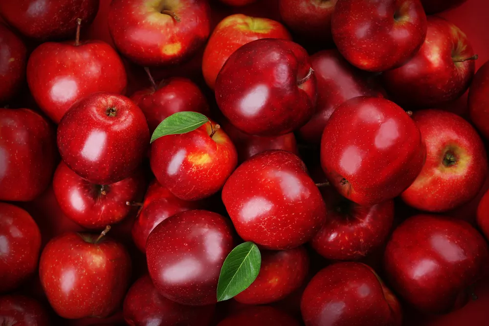{.w-50}

    Une pomme rouge paraît rouge parce qu’elle absorbe la plupart des autres couleurs et réfléchit surtout les longueurs d’onde rouges.

!!! example "Testons tes yeux"

    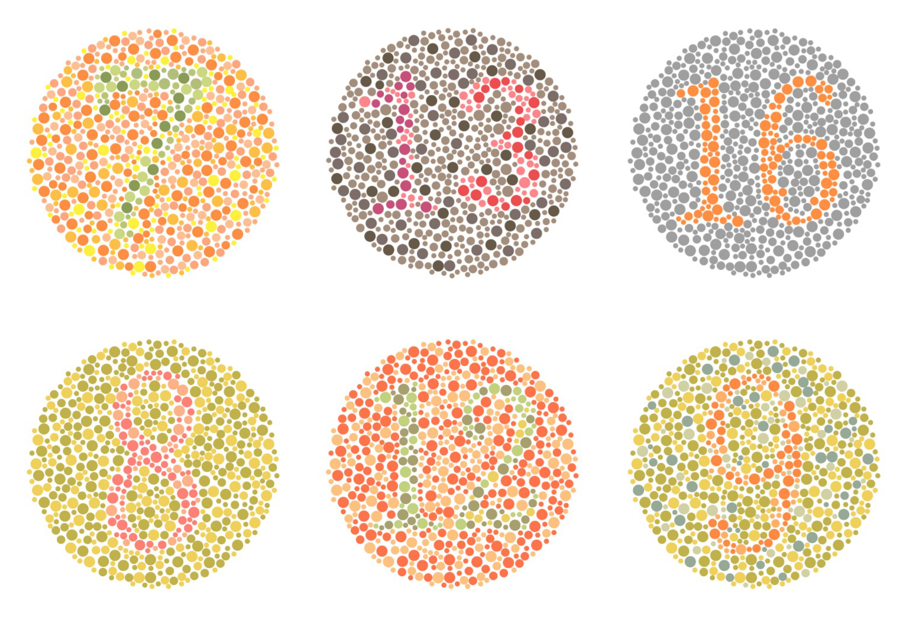{.w-25 data-zoom-image}

    Pour permettre à ceux et celles qui ont un [problème d’anomalie de la vision des couleurs](https://opto.ca/fr/bibliotheque-sante-oculovisuelle/anomalie-de-la-vision-des-couleurs), ne transmettez pas un message uniquement par la couleur.
    
    <!-- https://opto.ca/fr/bibliotheque-sante-oculovisuelle/anomalie-de-la-vision-des-couleurs -->

## Roue chromatique

Une [roue chromatique](https://www.figma.com/fr-fr/roue-chromatique/) est un outil pratique pour trouver de belles combinaisons de couleurs.

{data-zoom-image}

### Température de couleur

La température d'une couleur désigne sa tonalité chaude ou froide. Elle nous aide à exprimer des ambiances et à susciter des émotions chez nos utilisateurs. Toutefois, il est important de tenir compte du contexte culturel, car la perception émotionnelle des couleurs varie d'une personne à l'autre.

{data-zoom-image}

{data-zoom-image}

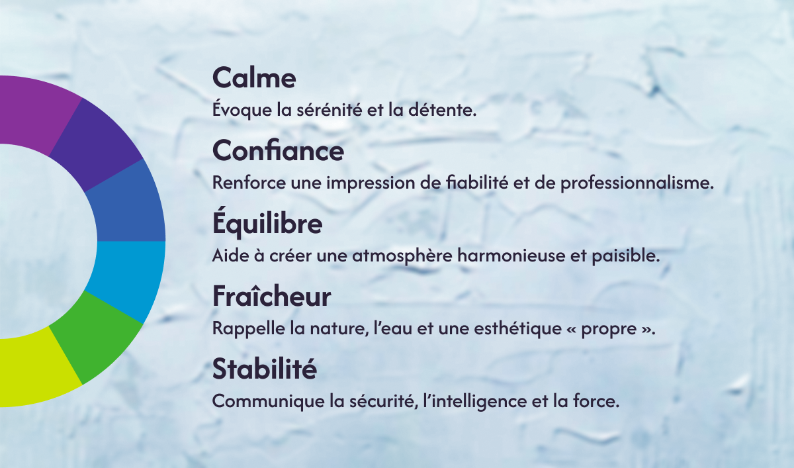{data-zoom-image}

<!-- https://www.floowitalent.com/tips/how-color-psychology-influences-consumer-behavior -->
<!-- https://www.zekagraphic.com/warm-vs-cool-colors-in-graphic-design-how-to-use-them-effectively/ -->

#### Kelvins

La température affecte la couleur à l'écran. Si vous configurez votre écran de travail avec un ton chaud, cela affectera les couleurs.

{data-zoom-image}

<!-- https://www.benq.eu/fr-fr/knowledge-center/knowledge/color-temperature.html -->

La température de couleur se mesure en **kelvin (K)**. Le blanc de référence pour l’œil humain est d’environ 6500 K.

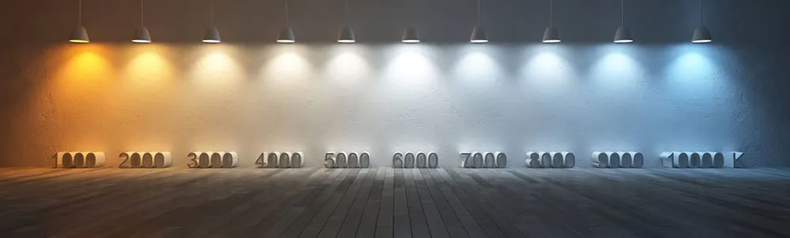{data-zoom-image .w-50}

!!! note "Savais-tu ça !?"

    Ce qu’on considère comme un blanc neutre est en fait la température de la surface du Soleil (5800 K).
    
    Évidemment, la couleur perçue varie avec l’atmosphère, mais le lien est direct.

### Neutres

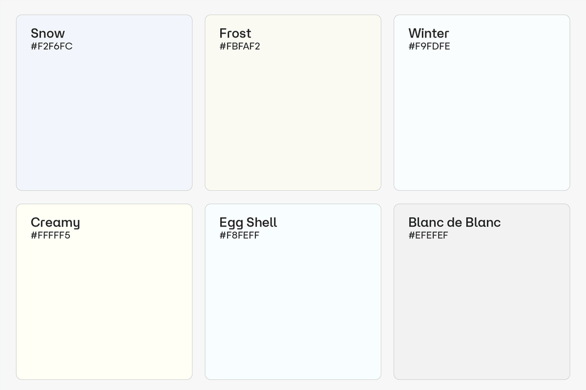{data-zoom-image}

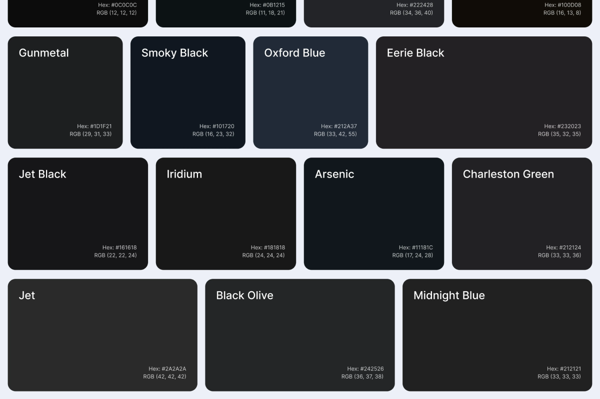{data-zoom-image}

Blancs, noirs, gris et beiges servent souvent à **stabiliser** une palette, créer de la respiration, soutenir la lisibilité ! 

<!-- https://www.smashingmagazine.com/2016/04/web-developer-guide-color/ -->

## Schémas de couleurs

La théorie des couleurs décrit plusieurs agencements prédéfinis de couleurs sur le cercle chromatique. 

L'utilisation de ces schémas de couleurs contribue à créer une **harmonie visuelle**.

<!-- https://zevendesign.com/color-harmony-hulk-wears-purple-pants/ -->

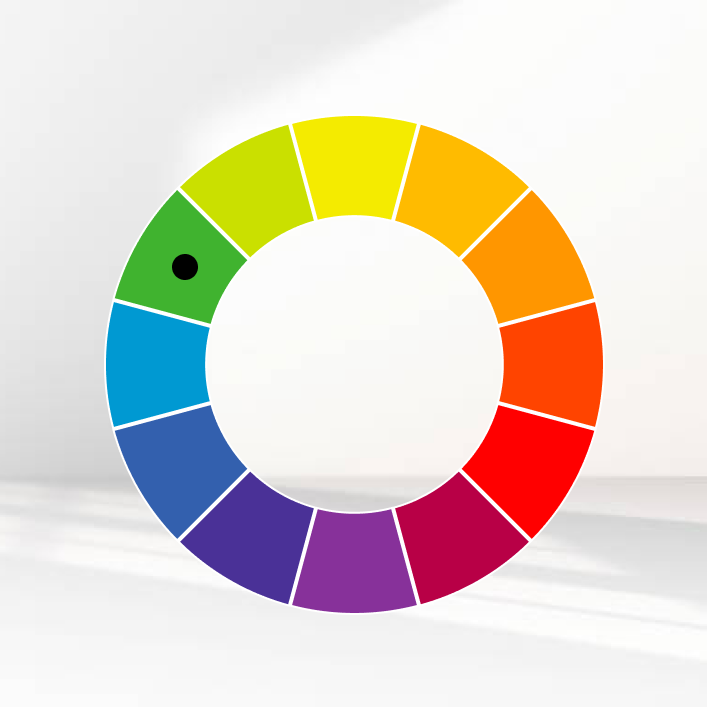{ data-zoom-image }

  **Monochromatique** : Teinte avec variations de saturation ou de luminosité
  > cohérent, sobre, mais risque d’être monotone
  

  { data-zoom-image .w-10 .d-inline-block }
  { data-zoom-image .w-10 .d-inline-block }
  { data-zoom-image .w-10 .d-inline-block }
  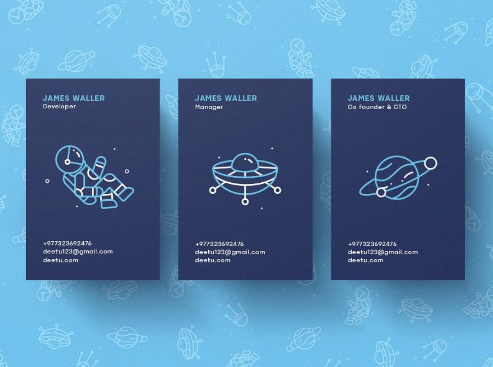{ data-zoom-image .w-10 .d-inline-block }
  

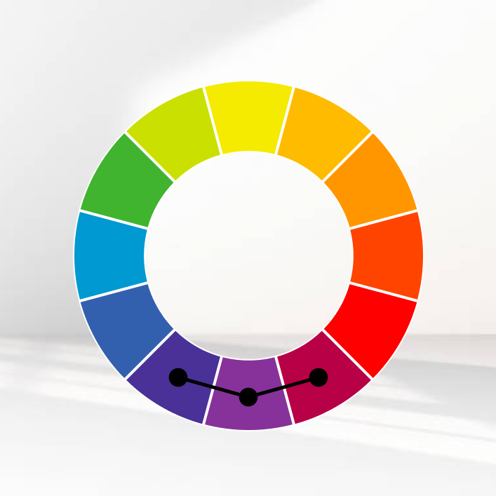{ data-zoom-image }

  **Analogues** : Teintes voisines
  > naturel, doux, bon pour des ambiances
  

  { data-zoom-image .w-10 .d-inline-block }
  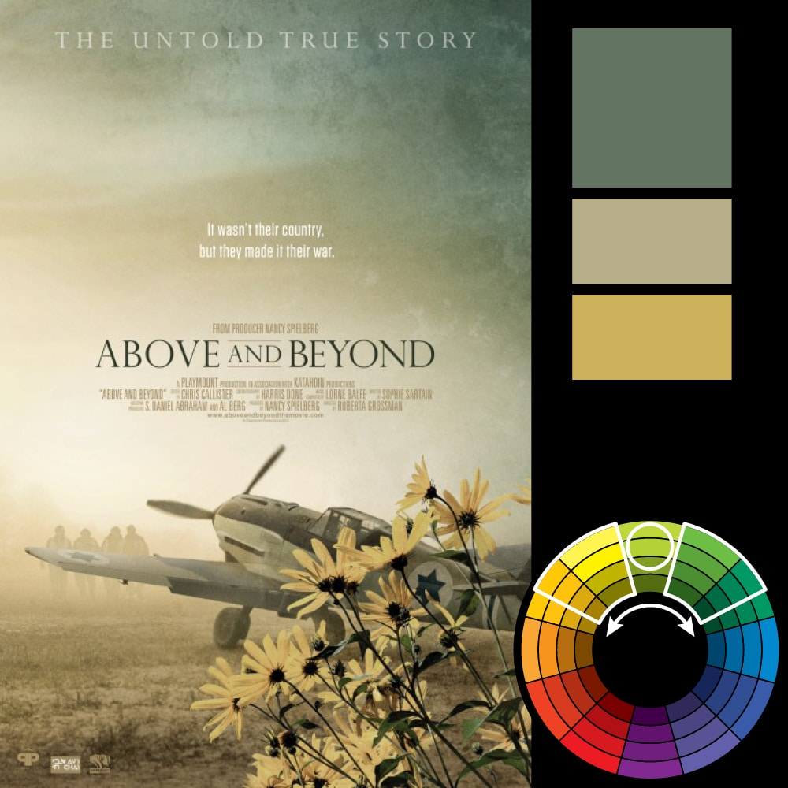{ data-zoom-image .w-10 .d-inline-block }
  { data-zoom-image .w-10 .d-inline-block }
  { data-zoom-image .w-10 .d-inline-block }
  

{ data-zoom-image }

  **Complémentaires** : opposées sur la roue chromatique
  > très dynamique, attention à l’agressivité si trop saturé
  

  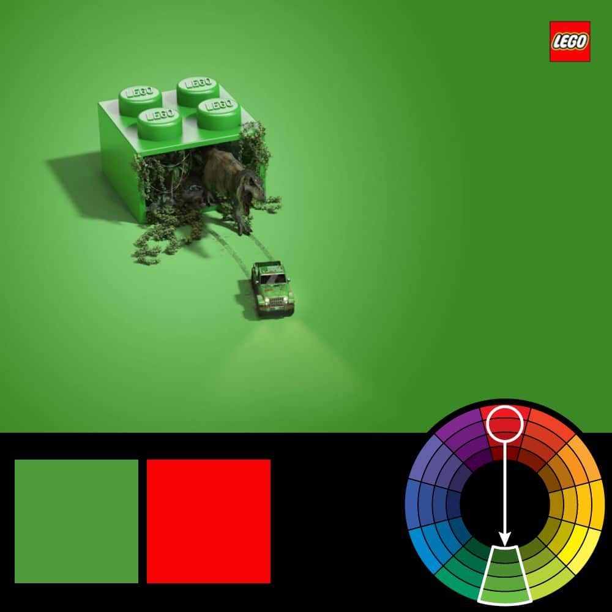{ data-zoom-image .w-10 .d-inline-block }
  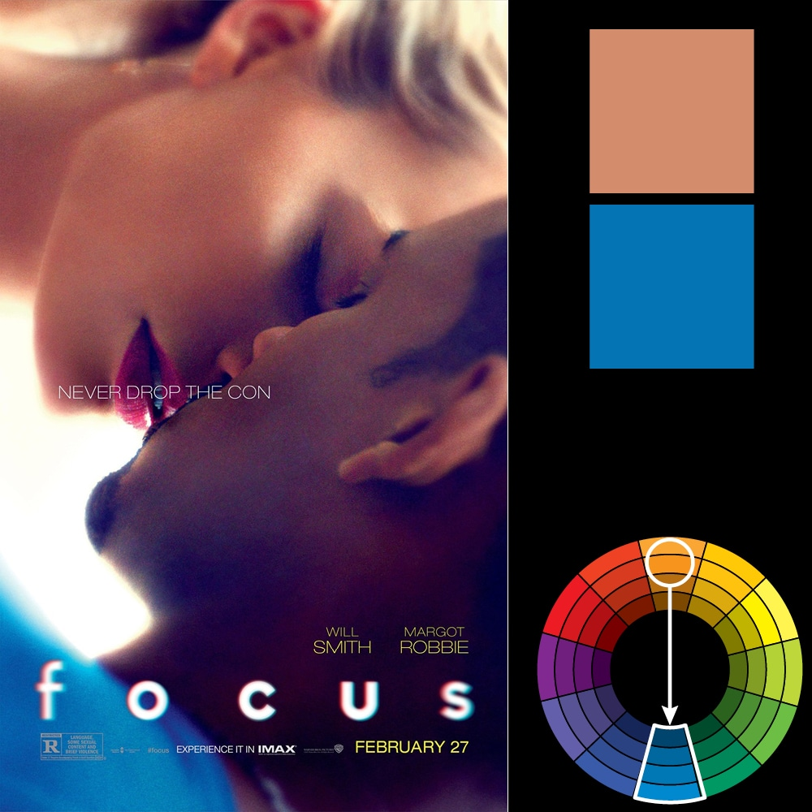{ data-zoom-image .w-10 .d-inline-block }
  { data-zoom-image .w-10 .d-inline-block }
  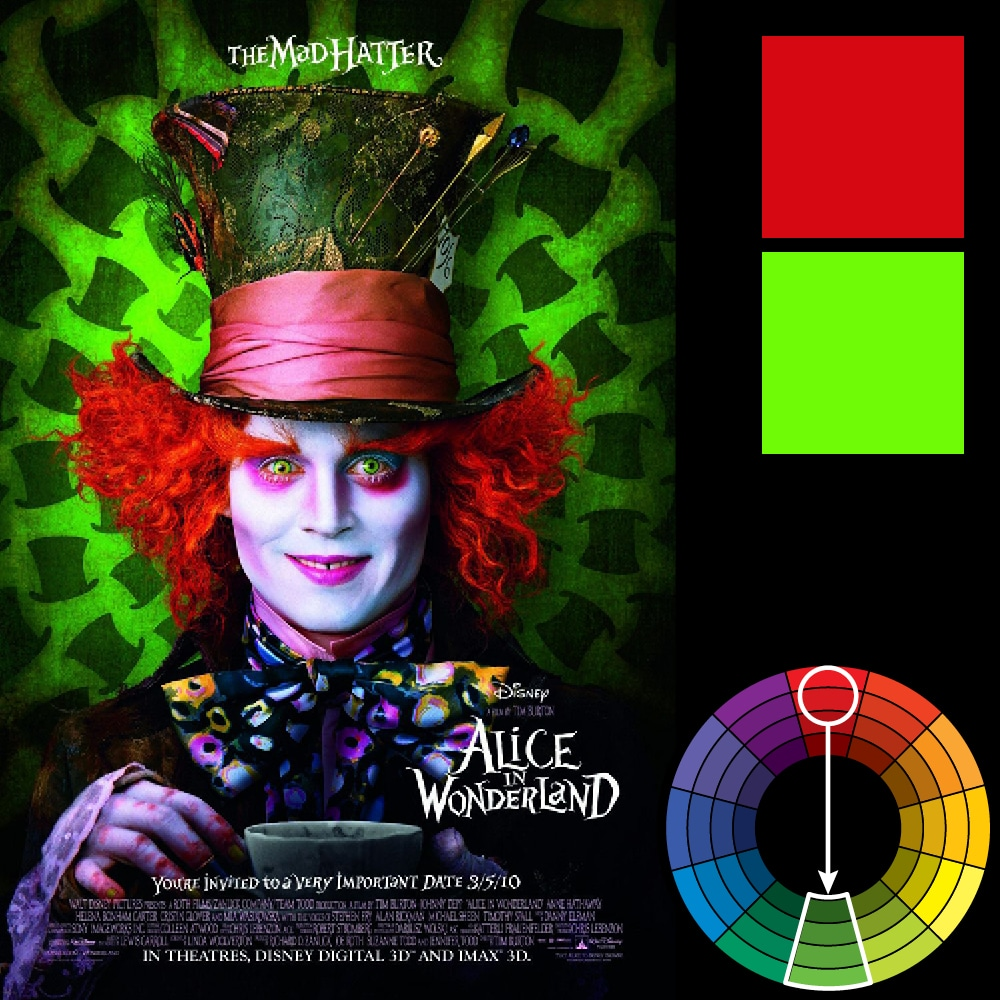{ data-zoom-image .w-10 .d-inline-block }
  

{ data-zoom-image }

  **Complémentaire scindée** : une teinte avec les voisines de sa complémentaire
  > contraste fort, plus facile à équilibrer que la complémentaire pure
  

  { data-zoom-image .w-10 .d-inline-block }
  { data-zoom-image .w-10 .d-inline-block }
  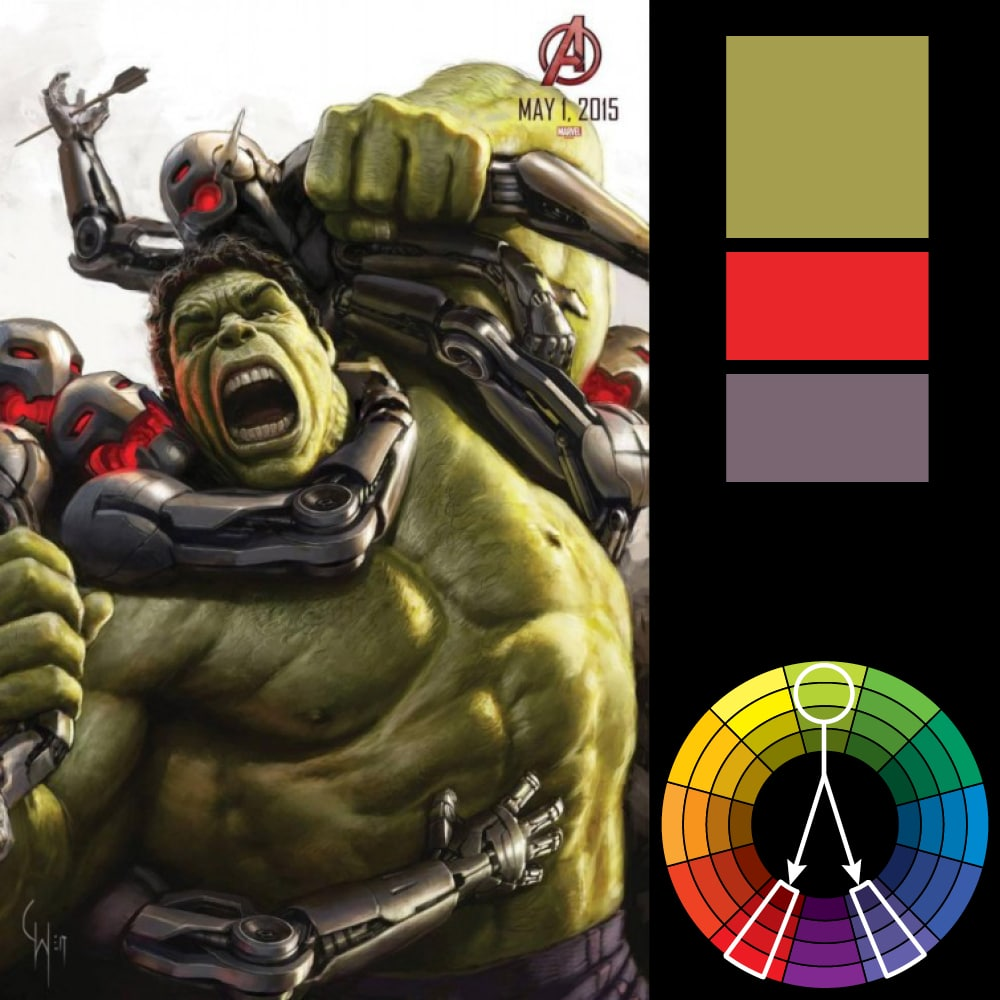{ data-zoom-image .w-10 .d-inline-block }
  

{ data-zoom-image }

  **Triadique** : 3 teintes espacées régulièrement
  > vibrant, demande une bonne hiérarchie (dominante + accents)
  

  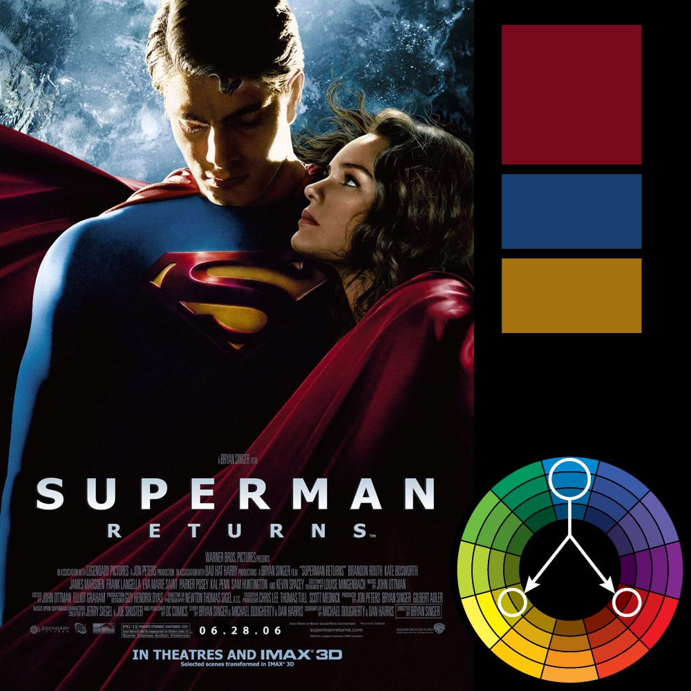{ data-zoom-image .w-10 .d-inline-block }
  { data-zoom-image .w-10 .d-inline-block }
  { data-zoom-image .w-10 .d-inline-block }
  { data-zoom-image .w-10 .d-inline-block }
  

Il y a aussi le tétradique et le carré, mais c'est trop difficile à maîtriser à ce stade. Laissons-les de côté pour le moment.

<!-- ### _Hue-shifting_ -->

!!! info "Outils d'harmonie chromatique"

    - <https://coolors.co/generate/>
    - <https://color.adobe.com/fr/create/color-wheel/>
    - <https://paletton.com/>

## Signification des couleurs

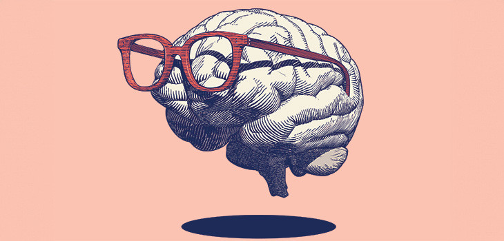{.w-100}

La couleur influence la perception, mais **le contexte domine toujours** (culture, marque, produit, public). 

C’est-à-dire que la même couleur peut envoyer des messages différents selon l’endroit où elle est utilisée, à qui elle s’adresse et avec quels autres éléments elle est combinée (typographie, images, mots, symboles et situation).

Donc oui, il faut considérer [ses effets](https://99designs.com/blog/tips/color-meanings/), mais avec une certaine prudence.

<!-- https://99designs.com/blog/tips/color-meanings/ -->
<!-- https://99designs.com/blog/tips/how-color-impacts-emotions-and-behaviors/ -->

### Rouge

> passion, énergie, colère, danger, chance

Le rouge suscite passion et énergie. Il est souvent associé à la passion et à l'amour, mais aussi à la colère et au danger. 

En Chine et dans d'autres cultures d'Asie de l'Est, le rouge est associé à la joie et à la chance.

{data-zoom-image}

{data-zoom-image}

### Orange

> énergie, enthousiasme, vif, joyeux

Couleur dynamique qui attire l'attention, mais sans être aussi envahissante que le rouge. 

Elle est accueillante et joyeuse et constitue un choix populaire pour les marques qui incitent leur public à agir (_CTA_) de manière ludique et conviviale.

{data-zoom-image}

{data-zoom-image}

### Jaune

> joyeux, spontané, optimiste

Le jaune évoque le soleil et les sourires et est souvent utilisé pour insuffler une énergie positive. 

C'est une couleur flamboyante qui peut aussi évoquer la prudence.

{data-zoom-image}

{data-zoom-image}

### Vert

> frais, équilibré, calme

Peut susciter un sentiment d'optimisme, de fraîcheur et de détente, probablement grâce à son association avec la nature. 

Agréable à l'œil, il permet d'équilibrer un design. C'est une couleur idéale pour les marques qui souhaitent illustrer la croissance, la sécurité ou inspirer un sentiment d'espoir.

{data-zoom-image}

{data-zoom-image}

### Bleu

> sécurité, détente, spiritualité, calme, froid

Évoque le calme, le professionnalisme et la confiance, ce qui explique sa popularité auprès des grandes entreprises. C'est [la couleur la plus utilisée pour les logos](https://martinforhire.com/blog-post/colors-in-logo-design-a-case-study-of-the-100-most-valuable-brands/).

Cependant, une utilisation excessive du bleu peut donner une impression de froideur et de détachement. Les bleus clairs sont quant à eux perçus comme plus apaisants et chaleureux.

{data-zoom-image}

{data-zoom-image}

### Violet

> créatif, mystérieux, royal, luxueux

Le violet est associé au mystère, à la créativité, à la royauté et à la richesse. 

Les nuances claires de violet sont souvent utilisées pour apaiser et calmer.

{data-zoom-image}

{data-zoom-image}

### Rose

> ludique, romantique, tendre, mignon, amusant

Traditionnellement, le rose évoque le romantisme, la douceur et la tendresse. Il peut souvent nous rendre enjoués ou romantiques. Mais le rose peut aussi être moderne, comme le [rose millénial](https://www.theguardian.com/artanddesign/shortcuts/2017/mar/22/millennial-pink-is-the-colour-of-now-but-what-exactly-is-it), ou extravagant, voyant et rebelle, comme le rose fuchsia.

{data-zoom-image}

{data-zoom-image}

### Marron

> chaleureux, rassurant, pratique, réconfortant

Le marron crée une impression de stabilité, de confort et de soutien (un peu comme le café du matin). 

Chaleureux et convivial, pratique et fiable, il peut aussi évoquer le charme désuet, le _vintage_ ou l'authenticité.

{data-zoom-image}

{data-zoom-image}

### Noir

> sophistiqué, classique, sérieux

Le noir évoque la puissance, le luxe et l'élégance, mais peut aussi symboliser le professionnalisme, la neutralité et la simplicité, à l'image du col roulé noir omniprésent de Steve Jobs ou de la « petite robe noire ». 

Il peut évoquer l'audace, la force et le mystère, comme la « magie noire », la cape de Dark Vador ou la tenue d'un ninja. 

Dans certains contextes et cultures, le noir peut également être associé au deuil ou à la tristesse.

{data-zoom-image}

{data-zoom-image}

### Blanc

> simple, paisible, élégant, froid

L'utilisation abondante du blanc en design crée une esthétique minimaliste, à la fois fraîche et apaisante dans sa simplicité. 

Dans de nombreuses cultures, le blanc évoque l'innocence et la sérénité (pensons aux vêtements de bébé et aux colombes blanches). 

Un excès de blanc peut toutefois donner une impression de froideur, d'impersonnalité et d'aseptisation excessive, à l'image d'une salle d'hôpital d'une blancheur aveuglante. 

Dans plusieurs cultures orientales, le blanc est porté lors des funérailles.

{data-zoom-image}

{data-zoom-image}

### Gris

> sérieux, professionnel, fiable

Le gris est souvent perçu comme une couleur synonyme de maturité, de responsabilité et de neutralité. 

Le gris est parfois considéré comme une alternative plus claire et moins formelle au noir. En revanche, il peut aussi être perçu comme synonyme d'indécision, de classicisme et d'ennui.

{data-zoom-image}

{data-zoom-image}

### Qu'en dit la science ?

!!! example "L'effet du rouge : performance et évitement" 

	  Andrew Elliot a démontré que l'exposition au rouge :red_circle:, même pendant une fraction de seconde avant une tâche intellectuelle, diminue significativement les performances des participants.

	  [Color and Psychological Functioning (2007)](https://www.researchgate.net/publication/6482505_Color_and_psychological_functioning_The_effect_of_red_on_performance_attainment)

!!! example "Le bleu et le rouge en Marketing" 

	  Kaltcheva & Weitz ont prouvé que les couleurs à haute stimulation (rouge :red_circle:/orange :orange_circle:) augmentent le rythme cardiaque (_arousal_), tandis que les couleurs froides (bleu :blue_circle:) favorisent la relaxation.

	  [When Should a Retailer Create an Exciting Store Environment? (2006)](https://www.researchgate.net/publication/228676121_When_Should_a_Retailer_Create_an_Exciting_Store_Environment)

!!! example "La lumière bleue : biologie et rythmes circadiens" 

	  Cette recherche de la Harvard Medical School montre que la lumière bleue :blue_circle: des écrans freine la mélatonine, retardant le sommeil et modifiant l'alerte matinale.

    En UX, le _dark mode_ et les filtres de nuit sont faits pour cela.

	  [Evening use of light-emitting eReaders (2015)](https://www.pnas.org/doi/10.1073/pnas.1418490112)

!!! example "Le Vert : Réduction de l'effort perçu" 

    Akers et al. ont découvert que les sportifs exposés au vert :green_circle: (couleur de la nature) ressentent moins la fatigue et ont une humeur plus stable que ceux devant du gris ou du rouge.

	  [Visual Color Perception in Green Exercise (2012)](https://pubs.acs.org/doi/10.1021/es301685g)

## Contexte de couleur

Notre perception des couleurs peut varier en fonction des couleurs environnantes. Certaines couleurs peuvent paraître plus claires ou plus foncées ou plus ou moins saturées, selon les couleurs qui les entourent.

<!-- https://www.provideocoalition.com/5-color-illusions-that-colorists-filmmakers-should-be-familiar-with/dr -->

!!! info "Un peu de sorcellerie chromatique ?"

    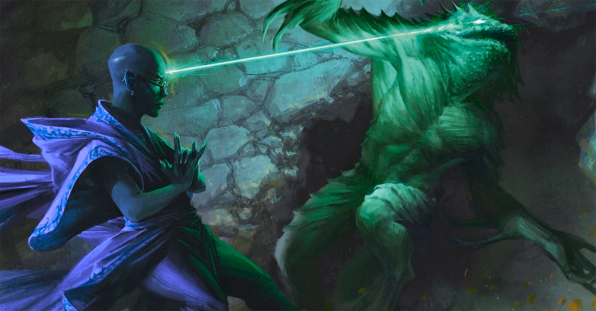

    Le cerveau complète, corrige et interprète. La plupart du temps ça nous aide, mais parfois ça nous trompe.

    <!-- https://commons.wikimedia.org/wiki/File:Wikipe-tan_wearing_The_Dress_reduced.svg -->

    {data-zoom-image .w-10}
    {data-zoom-image .w-10}
    {data-zoom-image .w-10}
    {data-zoom-image .w-10}

    [Illusions d'optique](https://www.illusionsindex.org/i)    

## Définition

<!-- {data-zoom-image .w-50} -->
<!-- 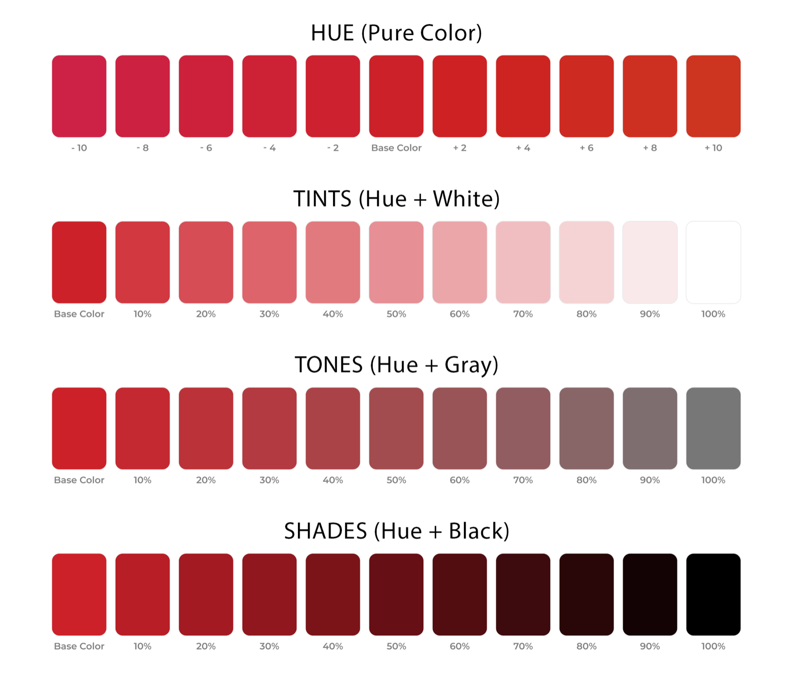{.w-25 data-zoom-image} -->

### Teinte

La teinte (_Hue_) est la famille de couleurs sur le cercle chromatique (rouge, bleu, vert, etc.).

### Saturation / Ton

{data-zoom-image}

Les deux se ressemblent beaucoup, mais sont légèrement différents.

- La **saturation** c'est comme si on ajoutait ou retirait des pigments de couleur.
- Le **ton** c'est la couleur à laquelle on ajoute du gris.

### Luminosité, nuances et ombres

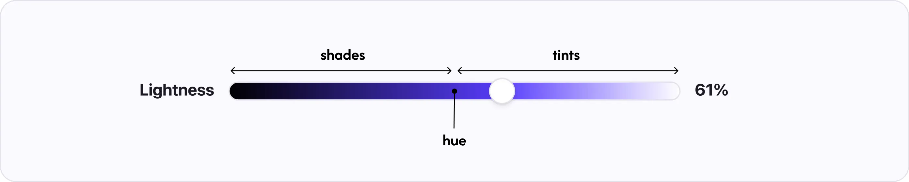{data-zoom-image}

La luminosité (_lightness_) mesure à quel point c’est clair vs. foncé pour une teinte donnée.

* **_Tints_** : Nuances (couleur + blanc)
* **_Shades_** : Ombres (couleur + noir)

## Espaces colorimétriques

{.w-100 data-zoom-image}

- **RGB** : lumière (écrans). Les couleurs s’additionnent vers le blanc.
- **CMYK** : encre (impression). Les couleurs se soustraient vers le noir.

Petit outil pratique : <https://www.hslpicker.com/>

### RGB

{data-zoom-image}

### HEX

Écriture compacte d’une couleur RGB (ex. `#1E90FF`).

<figure markdown>
{data-zoom-image .w-33}
<figcaption markdown>
[Hex Color – The Code Side Of Color](https://www.smashingmagazine.com/2012/10/the-code-side-of-color/#code-demands-precision)
</figcaption>
</figure>

<!-- https://www.smashingmagazine.com/2012/10/the-code-side-of-color/ -->

<!-- ### HSL

{.w-100 data-zoom-image} -->

## Accessibilité Web

L’accessibilité ne devrait pas être optionnelle. Elle assure une meilleure lisibilité et disponibilité du contenu pour le plus grand nombre de personnes. Ce n'est pas rien.

[_Contrast Checker_](https://colourcontrast.cc/)

## Palettes et règle 60–30–10

<!-- https://www.nngroup.com/articles/color-enhance-design/ -->

- **60%** : couleur dominante (souvent un neutre de fond)
- **30%** : couleur secondaire (sections, surfaces, blocs)
- **10%** : accent (CTA, éléments clés, états actifs)

{data-zoom-image}

{data-zoom-image}

{data-zoom-image}

## Figma

- Variable et palette
- Modes de fusion
- Règles

## Exercices

  

  <small>Exercice - Figma</small> 
  **[JO](./activite/exercice/jo/index.md){.stretched-link .back}**

  

  <small>Exercice - Figma</small> 
  **[Variable manquante](./activite/exercice/variable-manquante/index.md){.stretched-link .back}**

