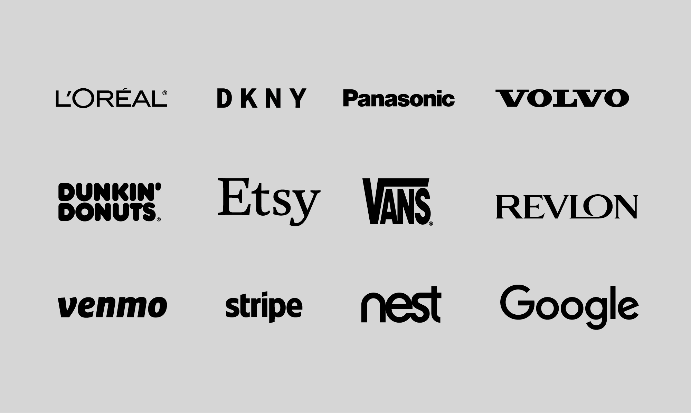
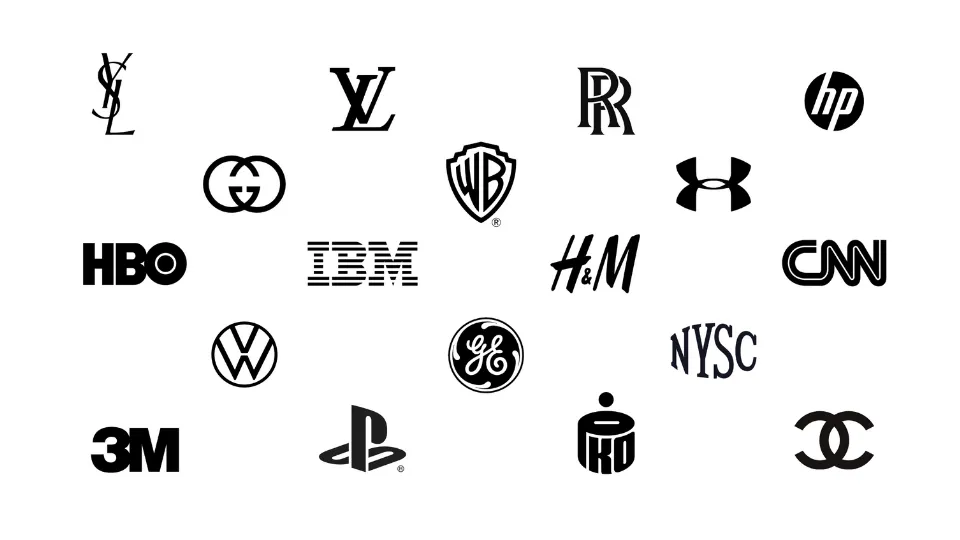
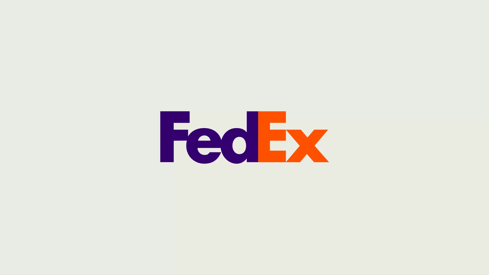
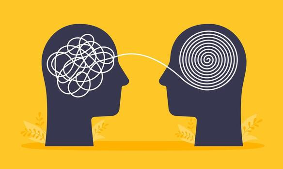
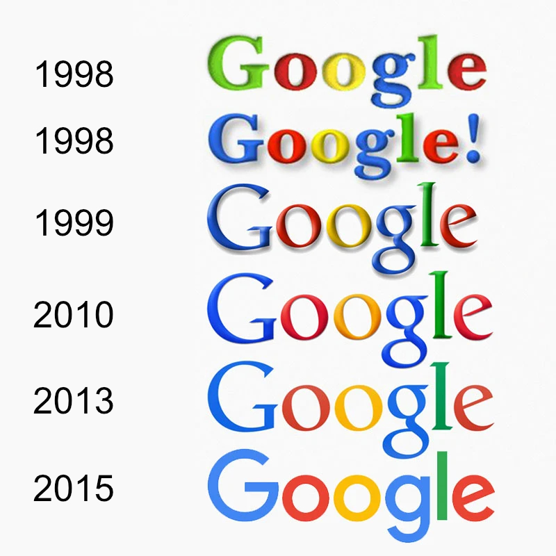
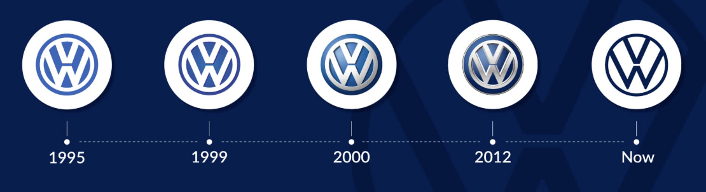
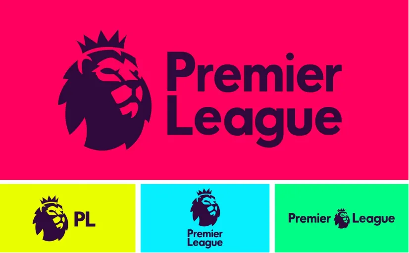
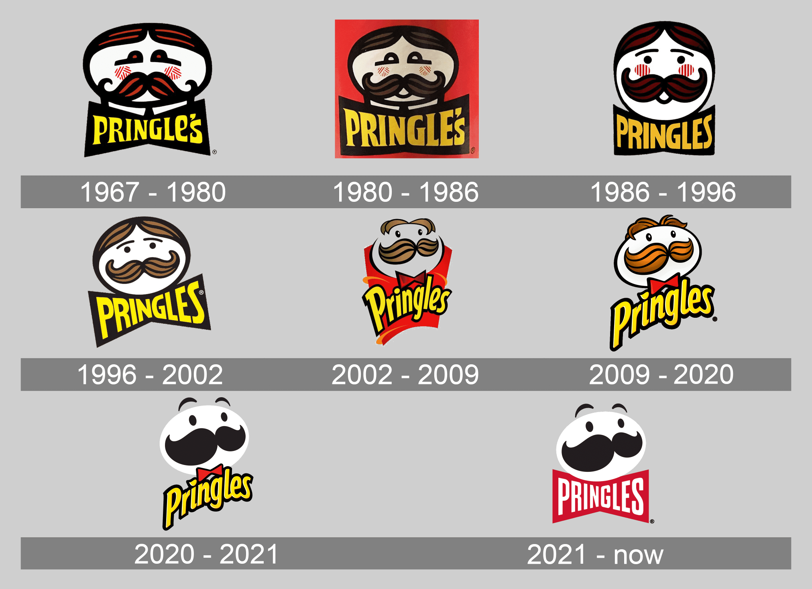
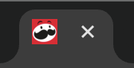
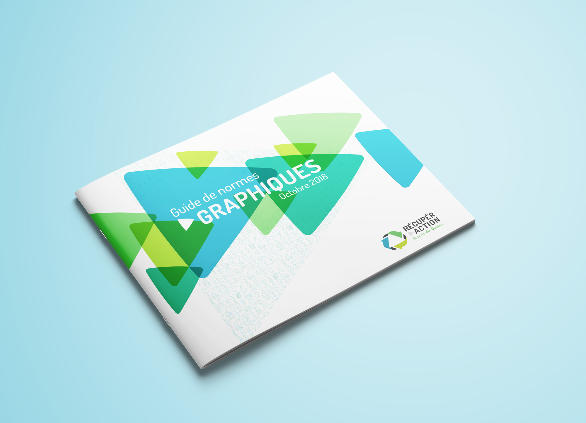

# Cours 5 | Logo

## Retour sur le Devoir 1 (moyenne d'environ 85%)

> « J'ai mis le texte plus gros pour que ça prenne plus de place. » 
> « J'ai mis du rouge parce que c'est plus beau » 
> « J'ai changé le format pour que ce soit plus carré. » 

Ce que j’essaie de comprendre ici, c’est l’intention de design derrière ce choix.

!!! question "Questions à te poser"

	* Quel problème cherchais-tu à résoudre en « prenant plus de place » ?
	  * Est-ce pour améliorer la lisibilité ?
	  * Pour créer une hiérarchie ?
	  * Pour équilibrer la composition ?
	* Si c’est plus important, pourquoi la taille est la meilleure solution dans ce contexte ?
	  * Pourquoi pas la couleur, le gras, le contraste, l’espacement, la position ou le cadre ?
	* Qu’est-ce qui te fait dire que c’est l’élément le plus important ?
	  * Quel est le message principal ?
	  * Comment ton choix aide concrètement ce message ?

!!! bug "IA"

	Pour ceux et celles qui ont utilisé l'IA pour décrire leur propre oeuvre, je vous recommande chaudement d'écouter [:simple-youtube: cette vidéo](https://www.youtube.com/watch?v=4xq6bVbS-Pw).

## Figjam

FigJam est un tableau blanc numérique conçu pour le brainstorming, la planification et l'idéation.

[FigJam](https://www.figma.com/fr-fr/figjam/)

Pour sauvegarder : 

{ data-zoom-image .w-25}
{ data-zoom-image .w-25}

## Étapes de création d'un logo

<!-- https://www.vistaprint.com/hub/brainstorm-logo-design-concepts -->
<!-- https://www.figma.com/resource-library/how-to-design-a-logo -->

### Brief

{.w-100}

Pour commencer, il faut connaître : 

- Le **nom** de la marque (accents, casse, slogan)
- Les **contextes d’usage** : favicon, réseaux sociaux, site web, impression, app, broderie, etc.
- Les **univers à éviter** : concurrents directs, styles trop proches, clichés
- Les **contraintes techniques** : monochrome obligatoire ? impression 1 couleur ? fond clair / sombre ?
- Le **ton** : sérieux vs ludique, premium vs accessible, institutionnel vs créatif

!!! success "Ça va servir à vous permettre de **justifier** vos choix !!!"

### Idéation

{.w-100}

C'est le moment du remue-méninges (*brainstorm*).

Nous allons essayer de séparer 3 thématiques.

- Description de la marque
- Ce qu'on aimerait qu'elle projette comme image
- Quels émotions on voudrait que le logo évoque

:brain: Dresser une liste d'environ 30 à 40 mots clés

> Exemple : 
> avant-gardiste, branché, sophistiqué, convivial, dynamique, accessible
> fiable, professionnelle, moderne, accessible, haut de gamme, responsable, humaine, innovante, locale, dynamique
> confiance, sécurité, calme, enthousiasme, curiosité, plaisir, proximité, inspiration

### Type de logo

:brain: Choisir un [type de logo](https://www.figma.com/resource-library/types-of-logos/) adapté aux mots-clés et à l’usage.

{data-zoom-image}

<strong>Wordmark (logotype)</strong> 
Le nom en typographie
 [:material-pinterest:](https://ca.pinterest.com/mattganser/wordmark/)

{data-zoom-image}

<strong>Lettermark (monogramme / letterform)</strong> 
Une lettre ou des initiales stylisées
 [:material-pinterest:](https://ca.pinterest.com/search/pins/?q=lettermark%20logo%20design)

{data-zoom-image}

<strong>Logos abstrait</strong> 
Pour les marques recherchant un style moderne et unique.
 [:material-pinterest:](https://ca.pinterest.com/search/pins/?q=abstract%20logo%20design)

{data-zoom-image}

<strong>Logos combinés</strong> 
Les logos combinés intègrent texte et symboles

{data-zoom-image}

<strong>Emblème</strong> 
Texte enfermé dans une forme. Souvent moins flexible et plus traditionnel.
 [:material-pinterest:](https://ca.pinterest.com/rickyfullen/emblem-logos/)

{data-zoom-image}

<strong>Logo mascotte</strong> 
Un personnage qui incarne l’identité de la marque, souvent pour créer une image sympathique et accessible.
 [:material-pinterest:](https://ca.pinterest.com/ideas/mascot-logo-design/905305804973/)

### Couleurs et typographie

{data-zoom-image}

{data-zoom-image}

!!! success "Pour guider vos choix"

	- Signification des couleurs
	- Théorie des couleurs
	- Principes de design (ex. : contraste, hiérarchie, équilibre)
	- Type de police (serif, sans serif, autre ?)
	- Lisibilité du texte

:brain: Ajouter une série de polices associées aux mots-clés du *brainstorm*.

:brain: Ajouter une série de palettes de couleurs associées aux mots-clés du *brainstorm*.

### Formes et croquis

{data-zoom-image}

:brain: Ajouter au *brainstorm* des inspirations.

!!! success "Inspiration"

	[Pinterest](https://ca.pinterest.com/inspirationfeed/logo-designs/) | [Behance](https://www.behance.net/search/projects/logo%20design) | [Dribbble](https://dribbble.com/tags/logo-design)

:brain: Commencer des croquis du logo. N’essayez pas d’être extrêmement précis. Allez-y en quantité plutôt qu'en qualité.

{data-zoom-image .w-50}

:brain: Sélectionnez les 2 ou 3 meilleures versions.

Si possible, demandez l'avis d'une ou plusieurs tierces personnes.

:brain: Vectoriser si ce n'est déjà fait.

{data-zoom-image .w-50}

!!! danger "À éviter"

	- Trop de détails
	- Trop de couleurs
	- Effets inutiles (ombres, dégradés)
	- Copier une tendance
	- Être trop littéral 

	> Si tu dois expliquer ton logo, il est raté 🤷

<!-- Si vous faites le logo d'un pizzeria, ne dessinez pas une pizza. Peut-être qu'un jour la marque vendra des spaghettis. Il faut mettre le focus sur l'identité et non le produit. -->

#### Espaces négatifs

À cette étape, vous pouvez également réfléchir à l'usage d'espaces négatifs 

{.w-25 data-zoom-image}
{.w-25 data-zoom-image}

### Simplification

{.w-100}

:brain: Simplifier en supprimant les dégradés, les ombres, les contours, etc.

{data-zoom-image .w-25}

{data-zoom-image .w-25}

!!! note "Idées de simplification"

	- Reconnaissable en 16px x 16px
	- Fonctionne en **1 couleur**
	- Pas d’effets nécessaires (ombre, dégradé, contour)
	- Formes nettes (vectoriel propre)

### Déclinaison

{data-zoom-image}

La déclinaison est devenue essentielle. Comme sur le web, les contextes sont nombreux et la robustesse de la marque est mise à l’épreuve.

:brain: Créer une **version verticale** du logo et une **version horizontale**.

{.w-25 data-zoom-image}
{.w-25 data-zoom-image}

:brain: Créer une version cohérente en **noir** seulement et une en **blanc** seulement.

{data-zoom-image}

[Logo de Firefox](https://mozilla.design/firefox/logos-usage/)

<!--  -->

## Études de cas

### Dunkin'

{data-zoom-image .w-100}
{data-zoom-image .w-33}

Ici, l'entreprise a voulu être plus cohérente avec ses services.

Le design a mis le focus sur l'identité et la signification de l'organisation. C'est "DUNKIN" qui différencie la marque, pas "DONUTS" !

!!! info "Savais-tu ça ?"

	{.w-25 data-zoom-image}

	Nintendo existe depuis 1889 et vendait des cartes à jouer !

### Pringles

Pringles a voulu rendre son logo plus flexible pour se diversifier.

{data-zoom-image .w-100}

On peut supposer que le texte, plus neutre, laisse désormais plus de place à la sous-marque 

{data-zoom-image .w-50}

Le logo reste reconnaissable facilement, peu importe le contexte !

{data-zoom-image .w-50}
{data-zoom-image .w-25}
{data-zoom-image .w-10}

### TIM

{data-zoom-image}

### Collège Montmorency

{data-zoom-image}

## Normes graphiques

Souvent l'organisation ne cherchera pas à ne changer que son logo. Elle voudra un redesign complet de son identité graphique. Pour ce faire, le ou la designer doit concevoir un guide sur l'usage du logo, sur sa signification et comment elle peut se décliner sur plusieurs contextes différents. On y inscrit également les limites de l'usage du logo, mais aussi des polices et des couleurs.

[Normes graphiques du cégep](https://www.cmontmorency.qc.ca/college/historique-et-logotype/normes-graphiques/)

<!-- ## Exercice

Demande : Fait un logo pour la TIM

- Selon vous, qu'est-ce que le logo de la technique devrait évoquer ? -->

## Devoir

  

  <small>Devoir - Figma</small> 
  **[Logo](./activite/devoir/logo/index.md){.stretched-link .back}**

[STOP]

Todo : Retirer l'exercice dasn le plan de cours.