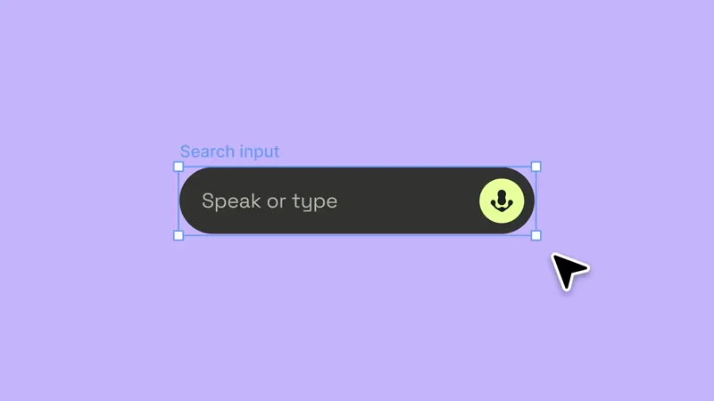
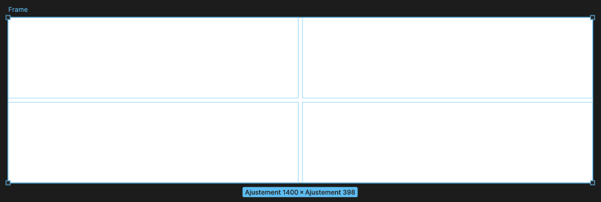
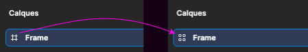
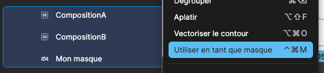

# Cours 6 | Composition avancée

## Retour sur le Devoir 02

## Guides de mise en page

{ data-zoom-image }

Les guides de mise en page s'affichen sous forme de grille ou de coloone / lignes.

{ data-zoom-image }

## Contraintes

Pour appliquer des contraintes sur des éléments, ceux-ci doivent se trouver dans un _Frame_.

{ data-zoom-image .w-50 }

[Documentation sur les contraintes](https://help.figma.com/hc/en-us/articles/360039957734-Apply-constraints-to-define-how-layers-resize)

## Verrouiller les proportions (_Aspect Ratio_)

{.w-100}

## Introduction à la mise en page automatique (_Auto Layout_)

_Auto Layout_ dans Figma est l’équivalent conceptuel des layouts Flexbox en CSS. Ça peut servir à construire des grilles via des frames imbriquées.

Pour ce faire, créer un nouveau _Frame_ et sélectionnez la mise en page automatique « Grille ».

{ data-zoom-image }

{ data-zoom-image }

!!! note "Notez que l'icône du Frame a été modifiée"

    { data-zoom-image }

## Masques

N'utilisez pas un masque si vous pouvez faire la même chose avec un remplissage.

{ data-zoom-image .w-50 }

Attention à l'ordre des calques. Le masque doit être en dessous.

### Masque par luminosité

{ data-zoom-image .w-50 }

## Exercices

  

  <small>Exercice - Figma</small> 
  **[Galerie d'art](./activite/exercice/galerie/index.md){.stretched-link .back}**

  

  <small>Exercice - Figma</small> 
  **[Trio](./activite/exercice/trio/index.md){.stretched-link .back}**

  

  <small>Exercice - Figma</small> 
  **[Cyberpunk 2077](./activite/exercice/cyberpunk/index.md){.stretched-link .back}**

