# Cours 7 | Pub Web

*[CTA] : Call To Action

## Retour sur le Devoir 02

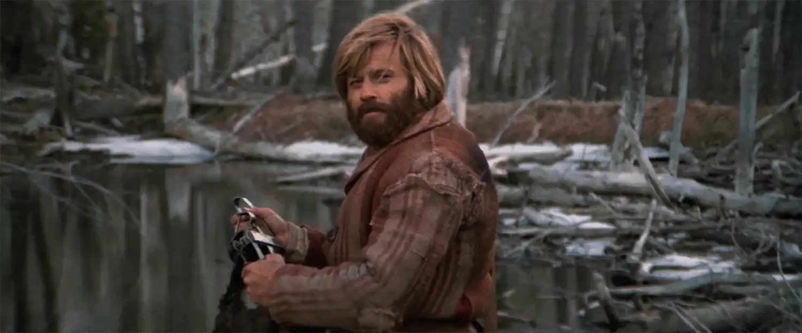{.w-100}

  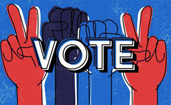

  **[Formulaire de vote](https://forms.office.com/r/KDiR9Pj93w?origin=lprLink)**

> J’ai sélectionné les logos qui me semblaient les plus adaptés à une impression sur un hoodie. Si votre proposition ne figure pas parmi les finalistes, cela ne remet pas en question sa qualité. D’ailleurs, certaines propositions ayant obtenu 100 % ne font pas partie de la sélection. Il s’agit simplement d’un choix lié au contexte particulier d’une impression sur un vêtement.

## La publicité, c'est du design graphique sous pression

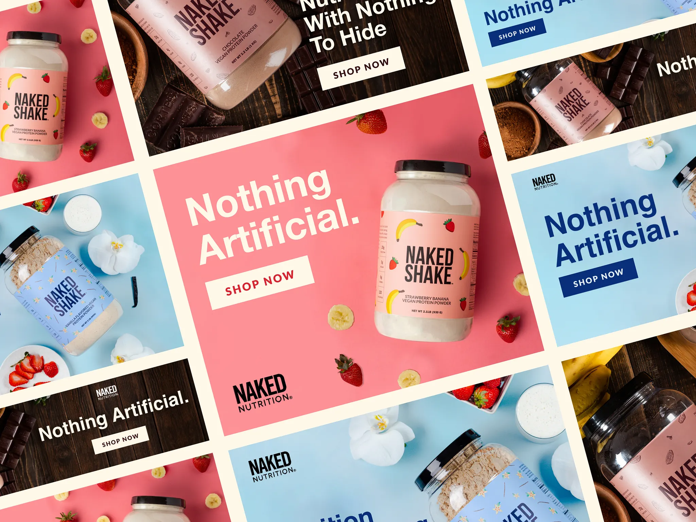{.w-100 data-zoom-image}

Une publicité Web, c'est du design graphique avec des contraintes supplémentaires :

- **Peu d'espace** pour s'exprimer
- **Très peu de temps** pour capter l'attention
- **Concurrence directe** : une pub apparaît dans un environnement chargé de plein d'autres informations

> On veut probablement _puncher_ oui, mais il faut surtout viser juste 🎯

## Anatomie d'une pub

### L'accroche

C'est **la première chose vue**. Son seul rôle est de stopper le regard.

- Une image forte ou inattendue
- Un titre provocateur ou intrigant
- Un contraste visuel
- Un visage

!!! bug "Erreur classique"

    Mettre le logo en premier plan. Le logo n'accroche personne, sauf si c'est :simple-nike: ou :simple-apple:

    👉 Utilise ce qui intéresse **l'utilisateur**, pas de ce qui intéresse **la marque**

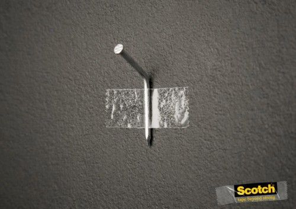{data-zoom-image .w-100}

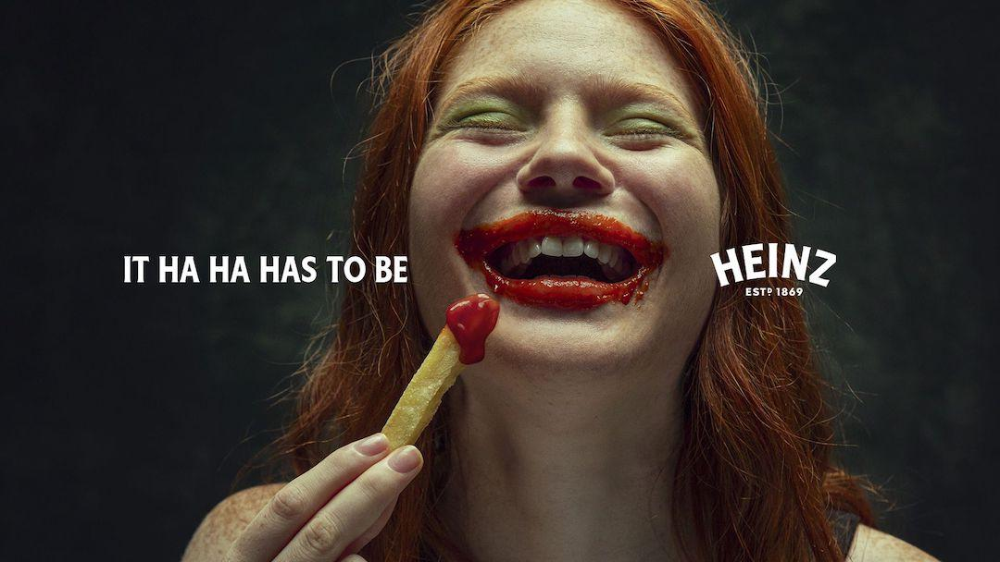{.w-100 data-zoom-image}

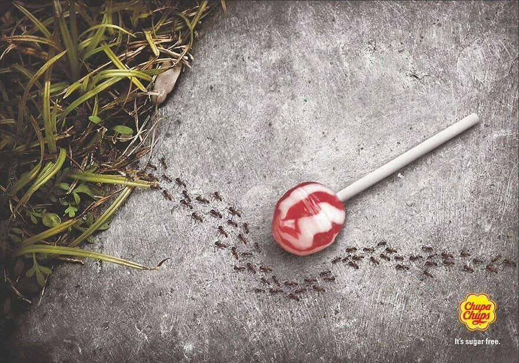{.w-100 data-zoom-image}

### La proposition de valeur

C'est la réponse à la question : **« en quoi ça me concerne ? »**

{.w-100 data-zoom-image}
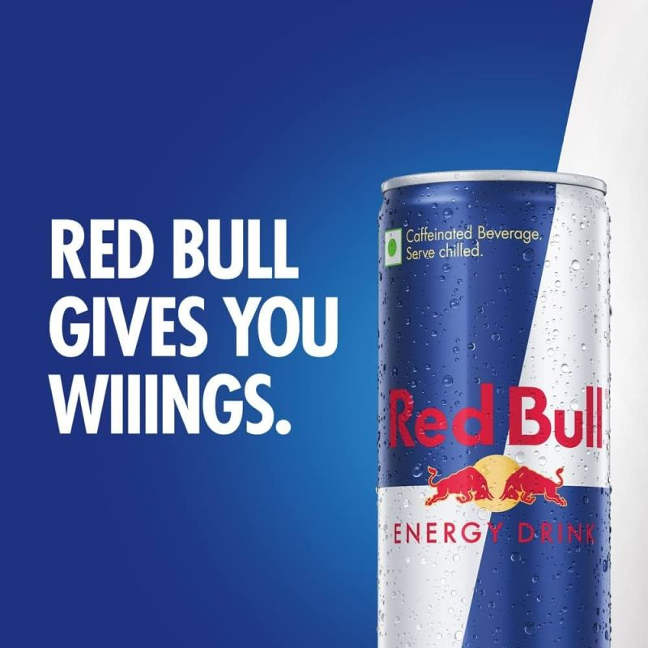{.w-33 data-zoom-image}
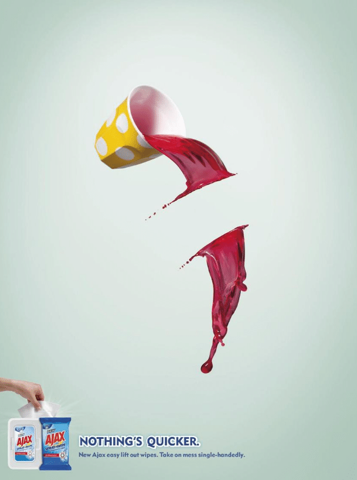{.w-33 data-zoom-image}

### L'appel à l'action (_CTA_)

C'est l'instruction explicite : **quoi faire** ?

- **Court** (4 mots max)
- Souvent un verbe à l'**impératif**
- Visuellement **distinct** (couleur, forme, position)
- **Honnête** : la promesse du CTA doit correspondre à ce qui arrive après le clic

| ❌ Trop vague | ✅ Précis |
|---|---|
| En savoir plus | Découvrir la collection |
| Cliquez ici | Essayer gratuitement |
| Soumettre | Réserver |

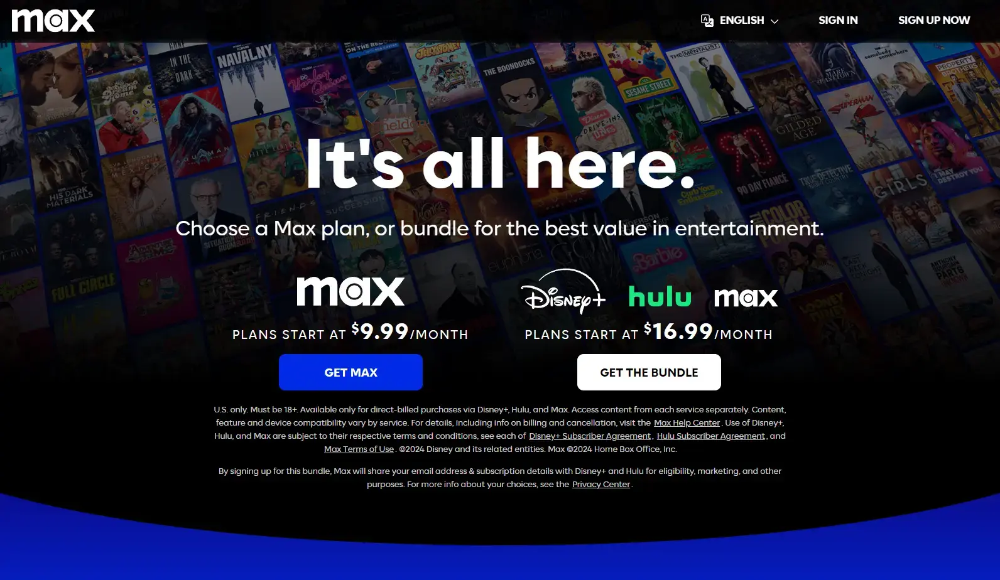{.w-100 data-zoom-image}

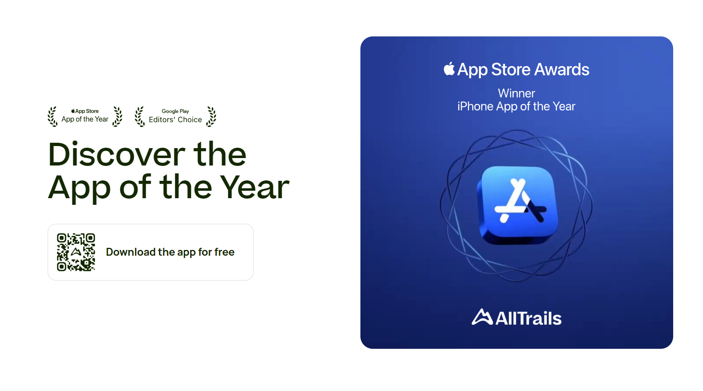{.w-33 data-zoom-image}
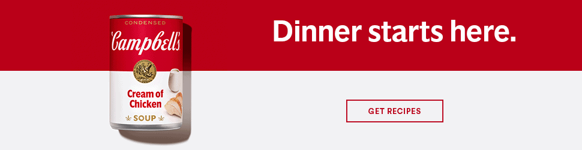{.w-66 data-zoom-image}

## Rappel de principes

**Hiérarchie**

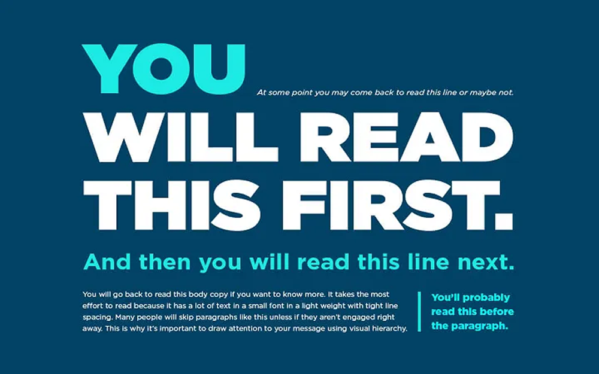{data-zoom-image .w-100}

**Contrast des couleurs**

Assurez-vous toujours d'un bon contrast des couleurs. Utilisez <https://colourcontrast.cc/> et essayer d'avoir le plus de "_Pass_" possible.

**Alignement**

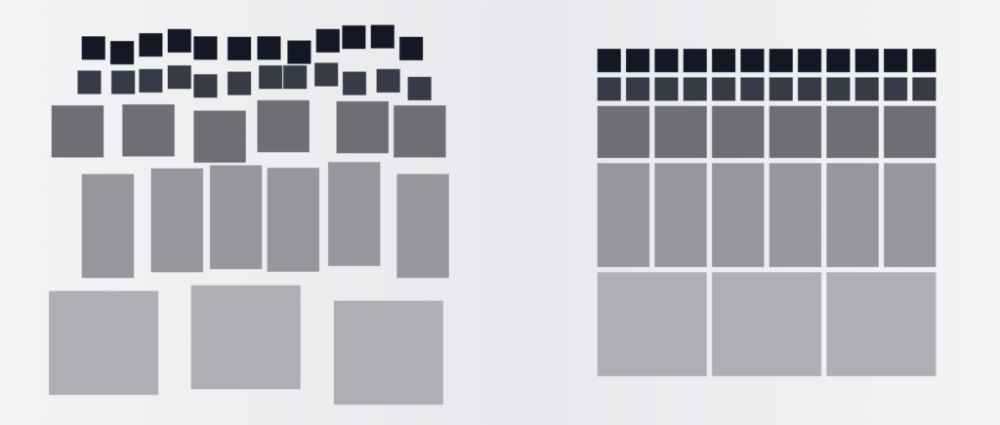{data-zoom-image}

## L'adaptation au contexte

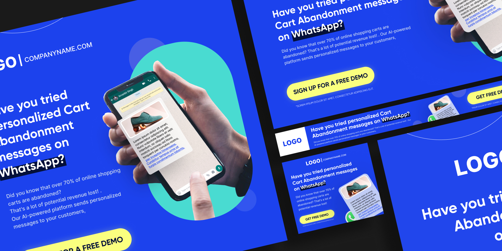{.w-100 data-zoom-image}

Le même message ne se présente pas toujours de la même façon selon l'endroit où il apparaît et selon la stratégie de la campagne publicitaire.

Certaines campagnes veulent faire connaitre le nom d'une marque, d'autres veulent vendre.

| Contexte            | Ce que l'utilisateur fait                | Ce que ça implique                                   |
| ------------------- | ---------------------------------------- | ---------------------------------------------------- |
| **Hero Web**        | Arrive sur un site, cherche à comprendre | Plus d'espace, message complet, hiérarchie élaborée  |
| **Story Instagram** | Scrolle vite, pouce sur l'écran          | Accroche ultra-rapide, peu de texte, format vertical |
| **Feed Instagram**  | Scrolle le fil, contexte social          | Image forte, texte court, identité visuelle visible  |
| **Google Display**  | Est en train de faire autre chose        | Intrusion légère, message minimaliste, CTA évident   |

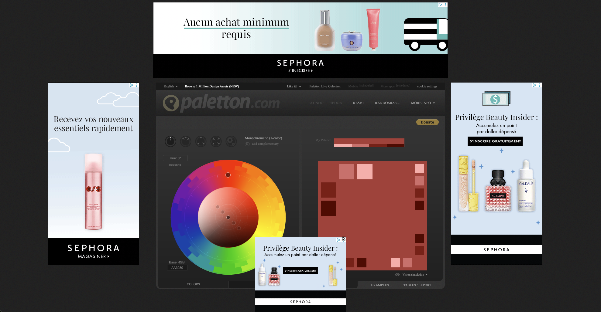{.w-50 data-zoom-image}

Voici quelques formats :

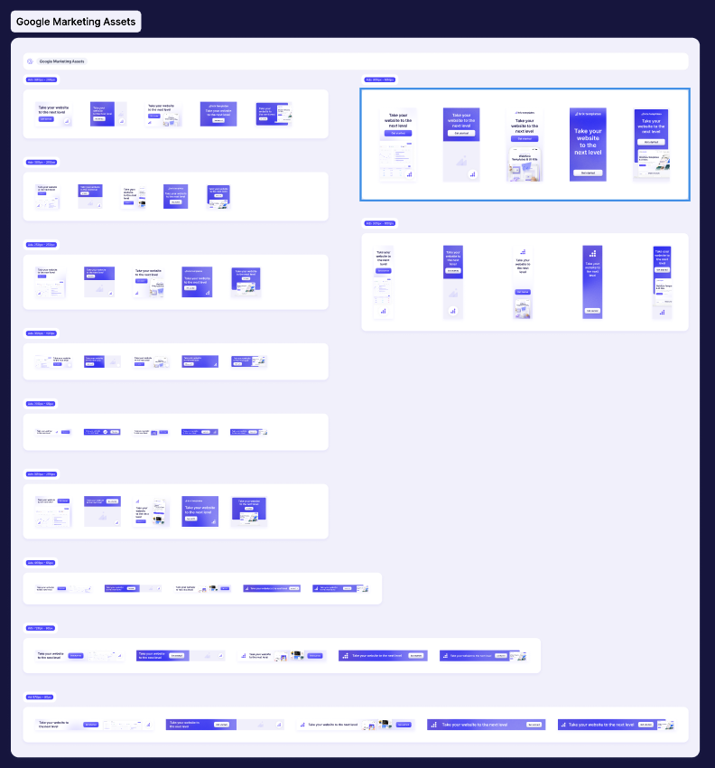{.w-20 data-zoom-image}
{.w-20 data-zoom-image}
{.w-20 data-zoom-image}
{.w-20 data-zoom-image}

## Un peu de science 🧪

**[Complexité visuelle des bannières](https://www.mdpi.com/2076-3417/13/24/13317)** (2023) : Une étude eye-tracking sur 90 participants démontre que **les publicités simples retiennent l'attention plus longtemps** et sont perçues comme plus attrayantes que les publicités complexes.

<!-- **[Contenu des bannières et attention visuelle](https://www.mdpi.com/1999-5903/13/1/18)** (2021) : Une étude eye-tracking sur 34 participants révèle que l'image est l'élément le plus accrocheur d'une bannière, et que les zones centrales et gauches sont vues en premier. -->

**[Banner blindness](https://www.researchgate.net/publication/372336015_Does_banner_advertising_still_capture_attention_An_eye-tracking_study)** (2024) : Une étude eye-tracking sur 100 participants montre que les utilisateurs ignorent les bannières quand ils effectuent une tâche concentrée, mais les reconnaissent quand même inconsciemment.

**[CTA en contexte social](https://www.tandfonline.com/doi/full/10.1080/02650487.2024.2433885)** (2024) : Trois expériences sur Instagram et WeChat démontrent que les boutons CTA nuisent au taux de clics dans les fils sociaux, mais l'améliorent sur les plateformes d'achat.

## La pub sur le Web

{.w-100}

On aborde aujourd'hui la publicité Web, mais il est important de comprendre aussi son écosystème.

### Le modèle économique

La plupart des plateformes que vous utilisez chaque jour (Instagram, TikTok, YouTube, Google) sont « gratuites ». Évidemment, on se doute qu'il y a une attrape quelque part.

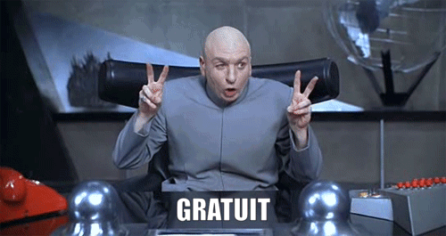{.w-50}

!!! question "Qui est le client ?"

    Non, vous n’êtes malheureusement pas le client. Vous êtes le produit !

    Le client, c’est l’annonceur. Ce qu’il achète, c’est l’accès à votre attention, ciblée le plus précisément possible.

### Cibler le public cible

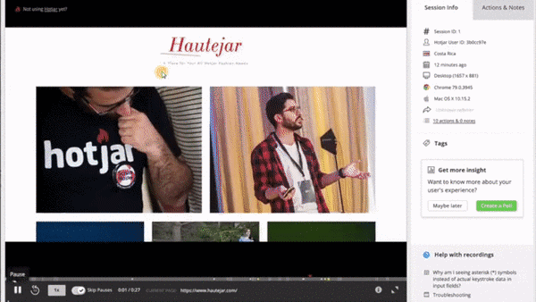{data-zoom-image .w-100}

Chaque **action** ou **état** en ligne peut laisser une trace exploitable commercialement.

#### Cookies

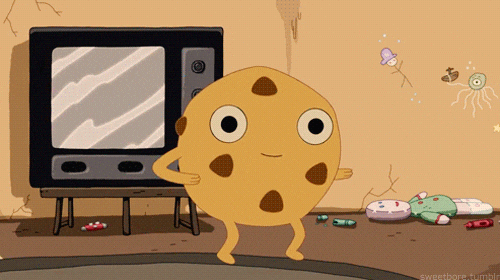{.w-25}

Un site peut enregistrer un *cookie* pour se souvenir de vous lors de vos prochaines visites, par exemple pour maintenir une connexion, conserver un panier ou mémoriser certaines préférences.

#### Pixels de tracking

{.w-25}

Un site peut installer un pixel Meta pour savoir si une personne qui visite ou achète sur son site provient d’une publicité Facebook ou Instagram.

#### Ciblage comportemental

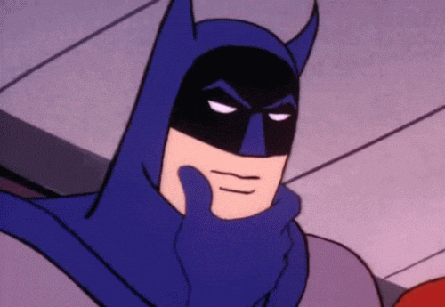{.w-25}

À partir de vos **recherches**, de vos **clics**, de votre **temps d’arrêt** sur une vidéo, de vos **achats**, de vos **interactions** ou même de vos **hésitations**, les plateformes construisent un profil probabiliste de vos intérêts et de vos intentions.

#### Audiences associées

{.w-25}

Une marque peut téléverser sa liste de clients existants sur Meta. L’algorithme peut ensuite trouver d’autres personnes qui leur ressemblent statistiquement, même si elles n’ont jamais interagi avec la marque.

#### Reciblage

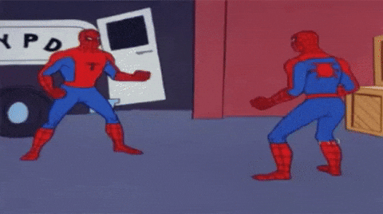{.w-25}

Vous regardez une paire de chaussures sur un site. Pendant plusieurs jours, cette paire réapparaît ensuite ailleurs dans votre navigation.

!!! question "Savais-tu ça ?"

    Quand un site charge de la publicité, des informations sur le visiteur peuvent être envoyées automatiquement à de nombreux acteurs publicitaires pour faire une enchère en temps réel. Selon l’ICCL, ce type de diffusion se produirait en moyenne 747 fois par jour pour un internaute américain[^iccl].

[^iccl]: [ICCL report on the scale of Real-Time Bidding data broadcasts in the U.S. and Europe](https://www.iccl.ie/news/iccl-report-on-the-scale-of-real-time-bidding-data-broadcasts-in-the-u-s-and-europe/)

### L’attention comme ressource rare

Les plateformes sont conçues pour maximiser le temps que vous y passez et capter ce qui vous fait **réagir**.

Plus vous restez longtemps, plus vous voyez de publicités.

Voici quelques stratégies de Google, Meta et cie. :

#### La récompense variable

{.w-25}

Comme au casino, le fil d’actualité offre parfois quelque chose d’intéressant, parfois non. Cette incertitude pousse à revenir ou à continuer de scroller.

!!! example "Skinner"

    Dans les [expériences du Skinner](https://www.bfskinner.org/wp-content/uploads/2015/05/Schedules_of_Reinforcement_PDF.pdf), quand la récompense arrivait de façon imprévisible, les pigeons maintenaient un rythme de réponse très élevé et très constant.

#### La validation sociale

{.w-25}

Les likes, commentaires et notifications activent des mécanismes de récompense sociale dans le cerveau, ce qui peut renforcer l’envie de revenir vérifier l’application.

#### L’infini

{.w-25}

L’absence de fin de page retire le signal naturel d’arrêt.

#### Le biais de négativité

{.w-25}

Notre attention est naturellement attirée par ce qui **choque**, **inquiète**, **fâche**, **humilie** ou **menace**. En ligne, les contenus négatifs attirent souvent davantage l’attention que les contenus positifs. Donc promouvoir ces contenus fait parti d'une stratégie pour garder l'attention des utilisateurs.

!!! note "La comparaison et l’insécurité"

    Plusieurs contenus exploitent l’idée qu’il vous manque quelque chose : **beauté**, **statut**, **performance**, **popularité**, **validation**.

    Chez les jeunes, entretenir des vulnérabilités pour garder l’attention plus longtemps est documenté : «[We make body image issues worse for one in three teen girls](https://www.wsj.com/tech/personal-tech/facebook-knows-instagram-is-toxic-for-teen-girls-company-documents-show-11631620739)», «[Facebook Knows Instagram Is Toxic for Teen Girls, Company Documents Show](https://www.congress.gov/117/meeting/house/114054/documents/HHRG-117-IF02-20210922-SD003.pdf)».

## Exercices

  

  <small>Exercice - Figma</small> 
  **[Programme](./activite/exercice/programme/index.md){.stretched-link .back}**

## Devoir

  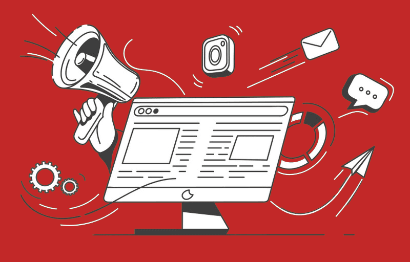

  <small>Devoir - Figma</small> 
  **[Publicité Web](./activite/devoir/pub/index.md){.stretched-link .back}**

