# Cours 8 | Impression et _responsive_

## Commandez votre veste TIM 2026 !

{.w-100}

C'est maintenant le temps de commander votre veste TIM 2026 🎉🎉🎉
 
📆 Vous avez jusqu'à vendredi prochain (27 mars) pour effectuer vos commandes !

[Feuille de commande](https://forms.office.com/r/f9FZ4r0BeD?origin=lprLink){ .md-button .md-button--primary }

## L'impression (_Print_)

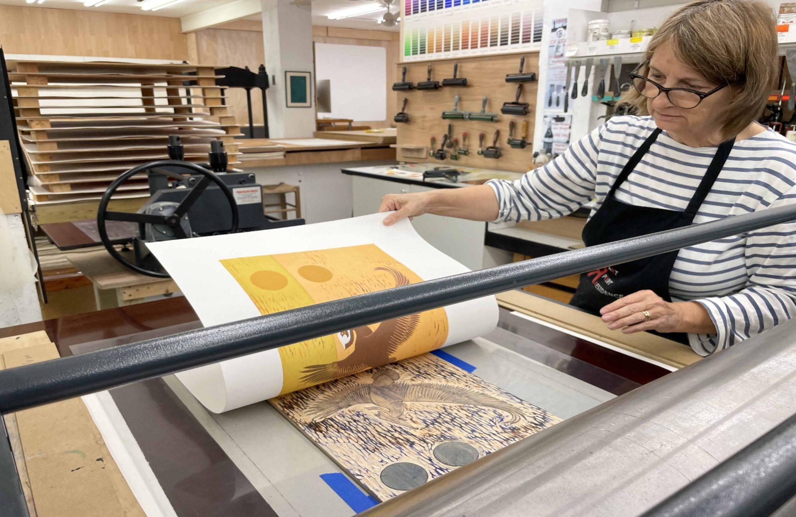{.w-100}

L'impression, quoique bien moins présente de nos jours, fait encore partie du décor. Que ce soit pour des **bannières** de spectacles, des **dépliants** chez le dentiste, des **menus** au restaurant ou des **publicités** dans les abribus, le concept est encore très présent.

### Résolution et qualité

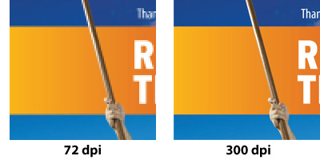

La résolution physique se mesure souvent en **pouces** ou en **centimètres**, pas en pixels.

La densité d’impression (qualité) se calcule en **dpi** (dots per inch) ou **ppp** (points par pouce) en français.

En général, une impression de qualité nécessite au moins **300 dpi**.

!!! info "Figma travaille en pixels à 72 dpi. Pour obtenir une qualité d'impression de 300 dpi, exporter à `4.17x` la taille d'origine."
 
### Formats

<!-- https://www.a0-size.com/american-paper-sizes/
https://www.adobe.com/fr/creativecloud/design/discover/a0-format.html -->

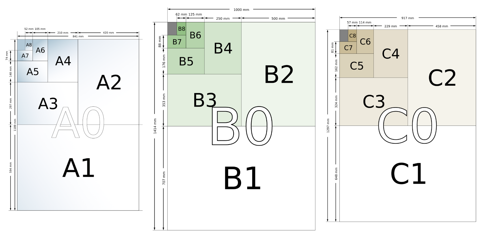{ data-zoom-image }

[Norme internationale](https://fr.wikipedia.org/wiki/Format_de_papier) : formats A, B et C

Autres formats très utilisés ici :

* Lettre (8.5 x 11)
* Légal (8.5 x 14)

### Spectre des couleurs

{.w-100 data-zoom-image}

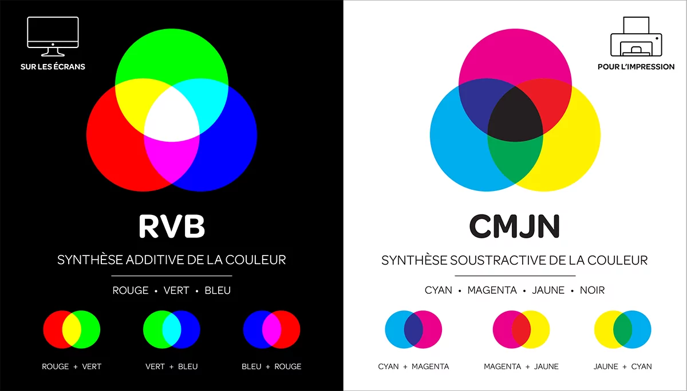{.w-50 data-zoom-image}
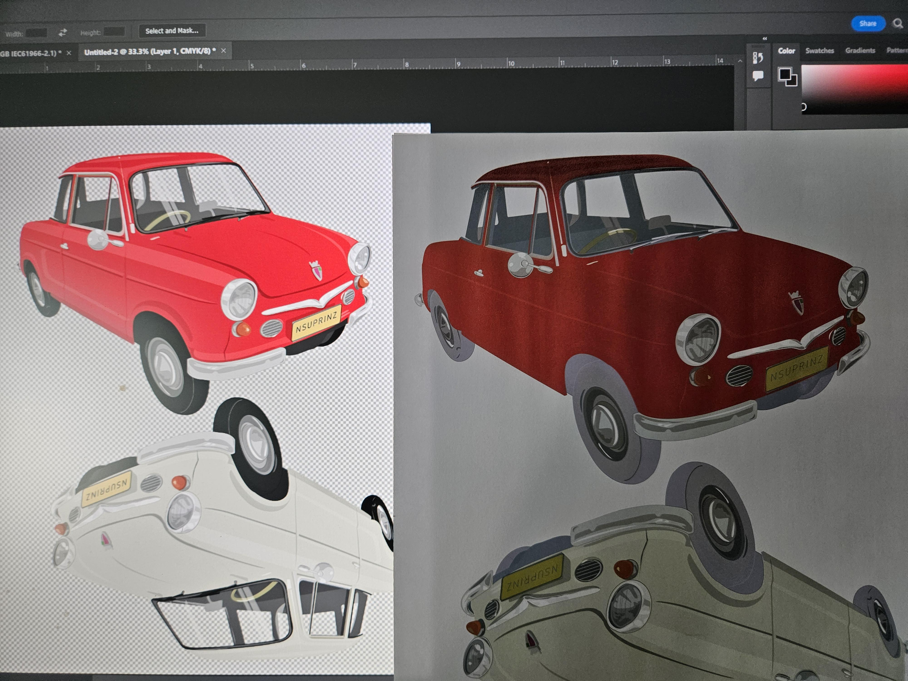{.w-25 data-zoom-image}

CMYK (ou CMJN) est le mode colorimétrique utilisé en imprimerie.

L’espace colorimétrique RGB est plus large que CMYK. Certaines couleurs très vives visibles à l’écran ne peuvent donc pas être reproduites exactement à l’impression.

### Fond perdu et marges

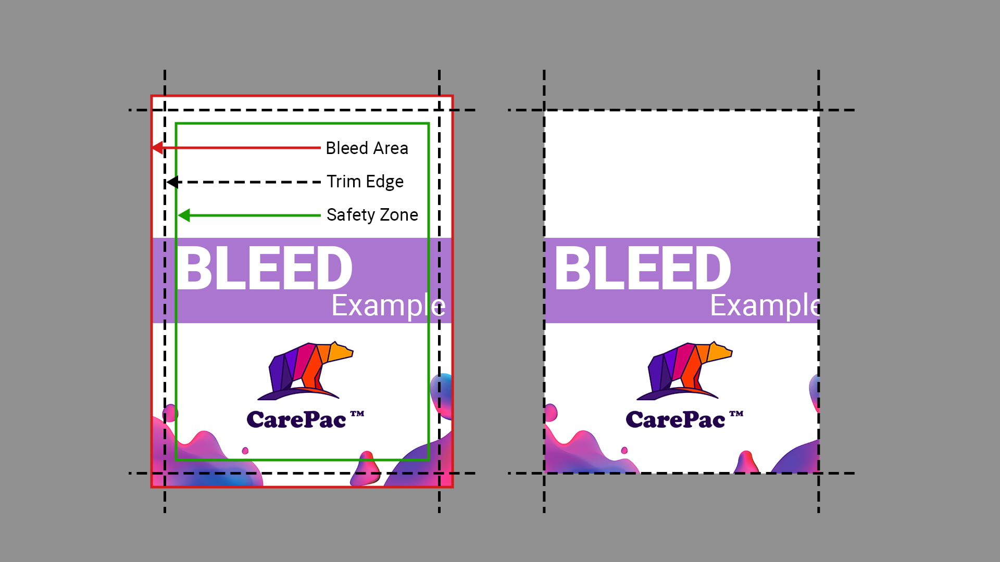{ data-zoom-image }

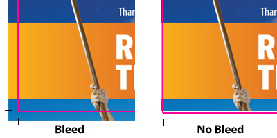{ data-zoom-image }

| Concept | Description |
| --- | --- |
| Fond perdu (_bleed_) | Zone qui dépasse la taille finale pour éviter un bord blanc après coupe. Souvent **3 mm**. |
| Ligne de coupe (_trim_) | Taille finale du document une fois coupé. |
| Marge de sécurité (_safety_) | Zone intérieure où placer textes et éléments importants. Souvent **5 mm**. |

!!! example "Quelles valeurs utiliser ?"

    C'est normalement **l'imprimeur** qui fournit ces spécifications.

    Vistaprint, par exemple, place ses modèles dans la section *Specs & Templates* du produit que l'on souhaite commander. 
    
    Utilisez SVG pour Figma.

    

    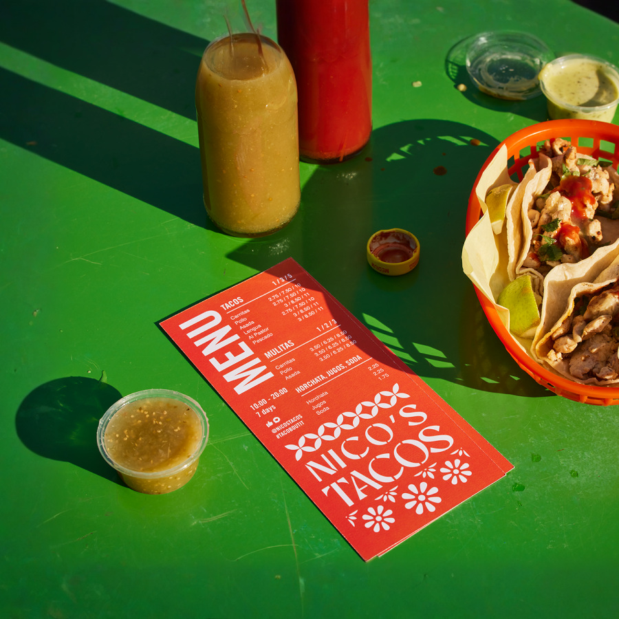

    [Impression de menus](https://www.vistaprint.ca/marketing-materials/flat-menus){.stretched-link}
    

### Exportation pour l'imprimeur

{.w-100}

L’imprimeur n’est pas responsable des oublis du designer. Il est donc impératif de bien préparer ses documents.

1. Retirer toutes les lignes de guide (marges, lignes de coupe, fond perdu).
1. Exporter en PDF. La plupart du temps, les imprimeurs préfèrent ce format parce qu’il conserve fidèlement la mise en page.
1. Vectoriser tous les textes. C’est très important : les polices utilisées ne sont pas nécessairement installées chez l’imprimeur.
  * Illustrator : Create Outlines
  * Figma : Aplatir

## Responsive

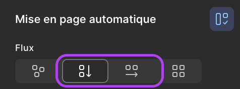

Un _Auto Layout_ peut s'organiser en **ligne** (horizontal) ou en **colonne** (vertical). Les deux peuvent être imbriqués pour créer des grilles complexes.

!!! tip "Raccourci"

    ++shift+a++ : ajouter l'Auto Layout à une sélection

### Exemple de mise en page automatique horizontale

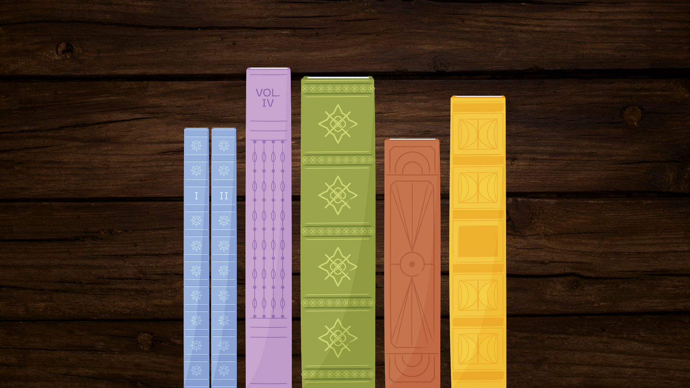{data-zoom-image}

[Télécharger les images des livres](./assets/documents/livres.zip)

On cherche ici à reproduire l'équivalent d'une mise en page CSS :

- `display: flex;`
- `justify-content: center;`
- `align-items: end;`

Première notion, le positionnement :

1. On applique d'abord la mise en page horizontale sur un _frame_ et on y ajoute les éléments désirés (les livres).
1. S'assurer d'avoir des dimensions fixes (`1920x1080`).
1. Choisir l'alignement désiré (centré en bas).
1. Corriger les espaces et marges en fonction des besoins.
1. On peut retirer le remplissage du frame.

Deuxième notion, l'enveloppage :

1. Changer l'alignement : en haut à gauche.
1. Cliquer sur l'icône « Envelopper ».
1. Changer la hauteur du frame pour l'ajuster au contenu.
1. Redimensionner le frame pour tester que l'enveloppage fonctionne comme désiré.

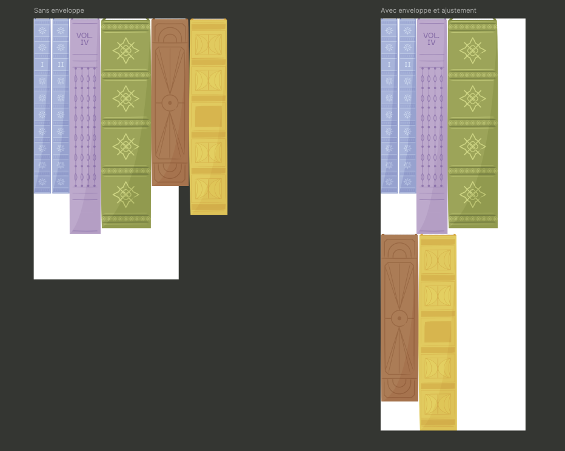{data-zoom-image}

!!! example "À la verticale alors ?"

    Même principe.

    L'avantage de ce type de mise en page, c'est aussi qu'on peut ajouter ou retirer des éléments à la volée !

    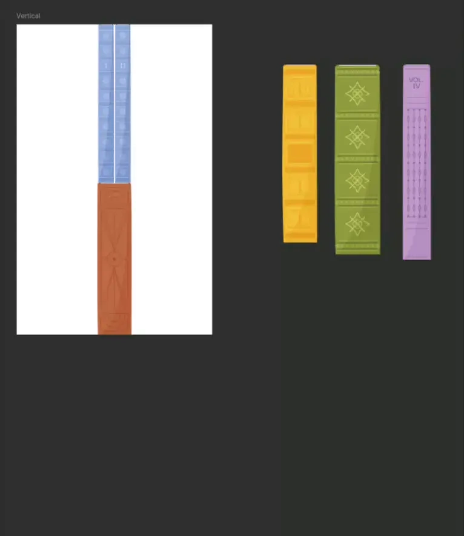{data-zoom-image .w-25}

### _Auto Layout_ imbriqué 

C'est ici que ça devient très intéressant !

On peut imbriquer des _frames_ _Auto Layout_ vectical, horizontal ou en grille, pour créer des mises en page complexes. 

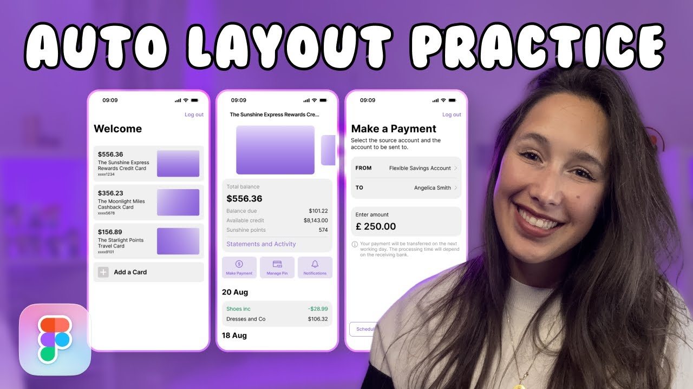

Pour ceux et celles qui aiment apprendre en vidéo, _TD Sunshine_ résume bien le concept de mise en page automatique. 
[Youtube](https://youtu.be/EVBaM-a8v4w?si=Wue8oGeEm1_dg2ce){.stretched-link}

## Technique du jour

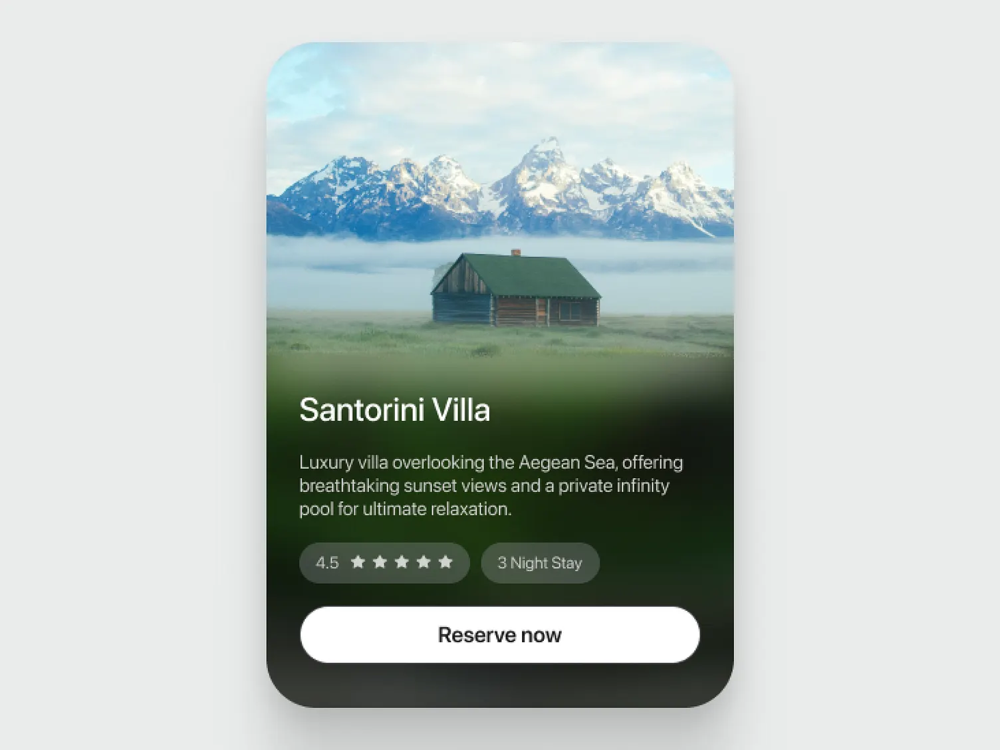{data-zoom-image}

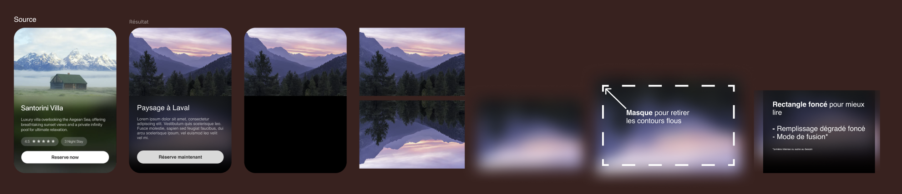{data-zoom-image}

[Idée originale | Dribbble](https://dribbble.com/shots/25800072-Cabin-Booking-Card-UI)

<!-- https://coolors.co/image-picker -->

## Communauté Figma

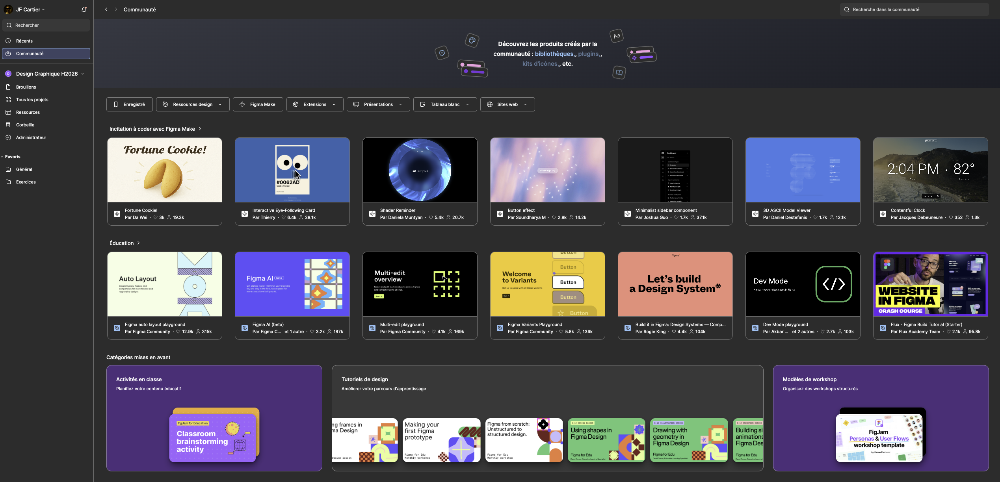

## Exercices

  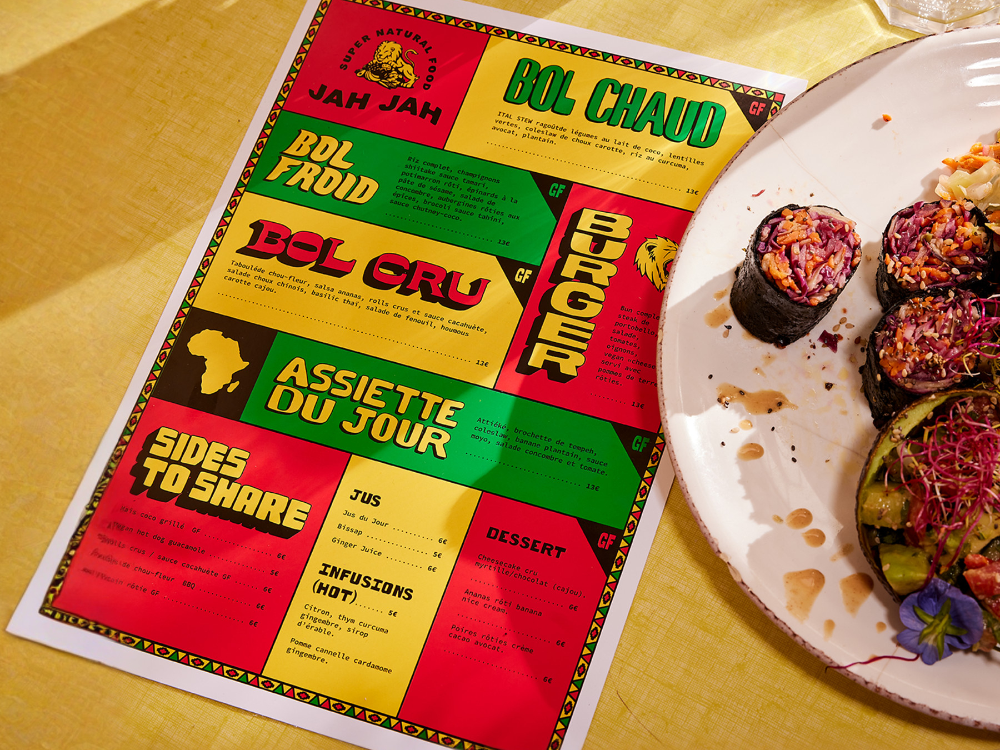

  <small>Exercice - Figma</small> 
  **[Menu du jour](./activite/exercice/menu/index.md){.stretched-link .back}**

  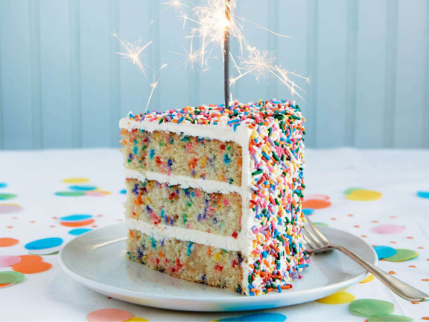

  <small>Exercice - Figma</small> 
  **[C'est du gâteau !](./activite/exercice/gateau/index.md){.stretched-link .back}**

## Devoir

  

  <small>Devoir - Figma</small> 
  **[Publicité Web](./activite/devoir/pub/index.md){.stretched-link .back}**

