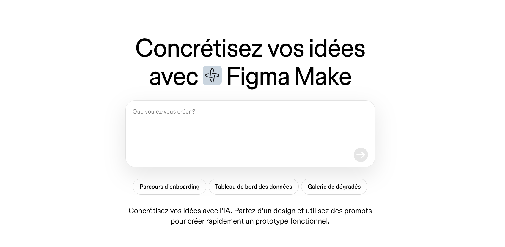
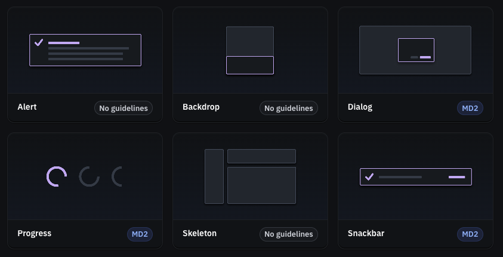

# Cours 9

[STOP]

https://www.youtube.com/watch?v=LTsIKT9dslU

<!-- @note : Le devoir 03 est remis la veille de ce cours
@note : Ce cours vise à discuter de l'intelligence artificiel en design graphique. Les composantes en Figma.

@idées : Aborder 3-4 techniques de création en design graphique et en design graphique web. -->

## Retour sur le Devoir 03

## L'IA en design graphique

L'intelligence artificielle est maintenant partout dans les outils de création. Ce n'est pas une tendance qui va disparaître. C'est une réalité du métier.

Mais attention : **l'IA ne remplace pas la réflexion de design**. Elle accélère l'exécution, elle inspire, elle automatise. La pensée stratégique, elle, reste entre vos mains.

### À quoi ça sert concrètement ?

Les outils IA en design graphique servent principalement à :

- **Générer des visuels** (images, textures, illustrations, icônes) à partir d'une description
- **Suggérer des palettes** et des combinaisons typographiques
- **Prototyper rapidement** à partir d'une simple idée
- **Retoucher ou compléter** des images existantes
- **Générer du contenu** (textes fictifs réalistes pour les maquettes)

### Les outils principaux

{data-zoom-image}

**Midjourney / DALL·E / Firefly**  
Génération d'images à partir de prompts textuels.  
Très utile pour créer des moodboards, des visuels d'ambiance ou des illustrations rapidement.

> ⚠️ Vérifiez toujours les droits d'utilisation des images générées.

{data-zoom-image}

**Figma AI (Make / First Draft)**  
Directement dans Figma, l'IA peut générer une première maquette à partir d'une description, renommer des calques automatiquement, remplir des données fictives, etc.  

[Figma Make](https://www.figma.com/fr-fr/ai/)

{data-zoom-image}

**Détourage et retouche IA**  
Des outils comme [remove.bg](https://www.remove.bg/fr) ou le détourage automatique dans Figma permettent de supprimer un arrière-plan en un clic.

### Les limites à connaître

!!! warning "Ce que l'IA ne fait pas bien (encore)"

    - Comprendre le **contexte stratégique** de votre projet
    - Respecter une **identité graphique** existante sans ajustement manuel
    - Générer du texte **en français sans fautes** dans les visuels
    - Produire des **vecteurs propres** utilisables directement
    - **Justifier** ses propres choix esthétiques

!!! danger "Le piège de l'IA en contexte scolaire"

    Utiliser l'IA pour décrire votre propre travail ou pour générer votre processus créatif, c'est contourner l'essentiel du cours : **apprendre à penser par vous-mêmes**.

    L'IA peut être un outil dans votre processus. Elle ne peut pas être le processus lui-même.

### Prompts efficaces pour le design

Un bon *prompt* IA, c'est un peu comme un brief de design : plus c'est précis, meilleur est le résultat.

| Élément | Exemple |
| --- | --- |
| **Sujet** | affiche de festival de musique électronique |
| **Style visuel** | style brutaliste, palette monochromatique violette |
| **Contexte/support** | format portrait, web, fond sombre |
| **Ce qu'on veut éviter** | pas de photos réalistes, pas de texte |

> **Exemple de prompt** : *"Minimalist poster for an electronic music festival, dark purple monochromatic palette, brutalist typography, abstract geometric shapes, no text, vertical format"*

---

## 4 techniques de création en design graphique Web

### 1. Flat Design

{data-zoom-image .w-100}

**C'est quoi ?**  
Des formes simples, des couleurs unies, pas d'ombres ni de dégradés. L'information est transmise par la forme et la couleur, sans effet 3D ni texture.

**Pourquoi ça marche ?**  
Rapide à charger, facile à adapter à tous les formats, très lisible. C'est le langage visuel dominant du Web depuis les années 2010.

**Exemples** : interfaces Google, icônes iOS, Material Design

**À retenir** : le flat design exige une excellente maîtrise de la hiérarchie et des couleurs, puisqu'il ne peut pas « tricher » avec des effets.

---

### 2. Glassmorphisme

{data-zoom-image .w-100}

**C'est quoi ?**  
Des éléments d'interface qui imitent du verre dépoli : fond semi-transparent avec flou de fond (_backdrop blur_), bordure lumineuse subtile, légère transparence.

**Pourquoi ça marche ?**  
Crée une profondeur élégante et moderne sans alourdir. Très populaire dans les interfaces premium (macOS, iOS, Windows 11).

**Figma** : utiliser l'effet **Flou de fond** (_Background blur_) + remplissage avec opacité réduite sur un **Frame**.

!!! warning "Attention à l'accessibilité"
    Le glassmorphisme peut réduire le contraste texte/fond. Toujours vérifier la lisibilité.

---

### 3. Brutalisme Web

{data-zoom-image .w-100}

**C'est quoi ?**  
Une esthétique volontairement crue, directe, non polie. Typographies massives, couleurs criardes, bordures épaisses, asymétrie assumée. C'est une réaction contre le design "trop propre".

**Pourquoi ça marche ?**  
Mémorable, identitaire, percutant. Très efficace pour des marques culturelles, créatives ou qui veulent se démarquer.

**Exemples** : [Balenciaga](https://www.balenciaga.com/), [Bloomberg Businessweek](https://www.bloomberg.com/businessweek), sites d'artistes indépendants.

!!! example "Le brutalisme c'est pas du mauvais design"

    Le paradoxe du brutalisme, c'est qu'il est **très difficile à bien faire**. Un design brutaliste raté ressemble à un bug. Un design brutaliste réussi est immédiatement reconnaissable et mémorable. La différence ? **L'intention**.

---

### 4. Micro-interactions et design statique

**C'est quoi ?**  
Même sans animation, le design peut **anticiper** les états interactifs : survol, clic, état actif, état désactivé. Ces états doivent être conçus dès la maquette graphique.

**Pourquoi c'est important en Web ?**  
Un bouton qui ne change pas visuellement au survol, c'est une mauvaise expérience utilisateur. Le design graphique Web doit prévoir ces états.

**Les états à designer systématiquement :**

| État | Description |
| --- | --- |
| `Default` | L'état normal |
| `Hover` | La souris est dessus |
| `Active` / `Pressed` | En cours de clic |
| `Focused` | Navigation clavier |
| `Disabled` | Non disponible |

---

## Figma | Composantes (_Components_)

{.w-100}

Un **composant** Figma, c'est un élément réutilisable. Vous le créez une fois, et vous pouvez l'utiliser partout dans votre projet. Si vous modifiez l'original (le *master*), toutes les copies se mettent à jour automatiquement.

C'est la base de tout design system.

### Composant maître et instances

{data-zoom-image}

**Composant maître** (icône violette ♦)  
L'original. Toute modification ici se propage automatiquement.

**Instance** (icône creuse ◇)  
Une copie liée au maître. On peut personnaliser certaines propriétés sans briser le lien.

**Créer un composant** : Sélectionner un ou plusieurs éléments → ++ctrl+alt+k++ (Windows) ou ++cmd+opt+k++ (Mac)

**Détacher une instance** : Clic droit → *Detach instance* (à éviter sauf cas exceptionnel)

### Pourquoi utiliser des composants ?

!!! success "3 bonnes raisons"

    1. **Cohérence** : Tous vos boutons ont exactement le même style partout.
    2. **Rapidité** : Modifier un composant maître = modifier 50 boutons en une seconde.
    3. **Organisation** : Vos composants apparaissent dans le panneau *Assets* et sont réutilisables entre pages.

### Variantes (_Variants_)

{data-zoom-image}

Les variantes permettent de regrouper plusieurs états d'un même composant dans une seule entité.

> **Exemple** : Un bouton avec ses 5 états (Default, Hover, Active, Focused, Disabled) est un seul composant avec 5 variantes.

**Créer des variantes** : Sélectionner plusieurs composants du même type → clic sur *Combine as variants* dans le panneau de droite.

### Propriétés de composant

{data-zoom-image}

Les propriétés permettent de rendre certains aspects d'un composant **modifiables par l'instance** sans briser le lien au maître.

| Propriété | Exemple d'usage |
| --- | --- |
| **Texte** | Changer le label d'un bouton |
| **Boolean** | Afficher/masquer une icône |
| **Instance swap** | Remplacer une icône par une autre |
| **Variant** | Changer l'état (Default → Hover) |

!!! tip "Bonne pratique"

    Nommez vos composants avec une structure claire :  
    `Catégorie/Nom/Variante`  
    Ex. : `Bouton/Primaire/Default`, `Bouton/Primaire/Hover`

### Organisation des composants

- Créez une **page dédiée** aux composants (ex. : « 🧩 Composants »)
- Regroupez-les dans des **frames nommées** par catégorie (Boutons, Icônes, Cartes, etc.)
- Utilisez le panneau **Assets** (++shift+i++) pour retrouver et glisser vos composants

---

## Exercices

  

  <small>Exercice - Figma</small> 
  **[États d'un bouton](./activite/exercice/button-states/index.md){.stretched-link .back}**

  

  <small>Exercice - Figma</small> 
  **[Carte réutilisable](./activite/exercice/card-component/index.md){.stretched-link .back}**

