# Cours 9 | Composantes et Figma Sites

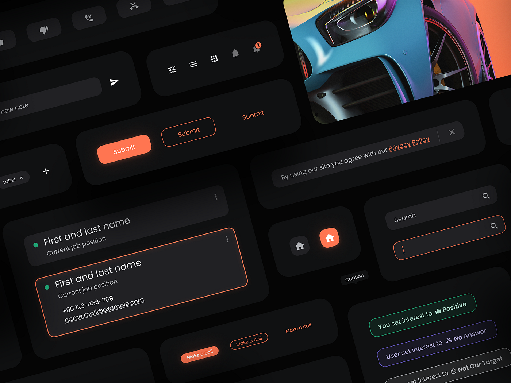{.w-100}

## Retour sur le Devoir 03

## Retour sur l'exercice du gâteau

* L'importance de comprendre les contraintes : les alignements et la mise à l'échelle
* Largeur et hauteur configurées dynamiquement : l'ajustement au contenu ou remplir le contenant

## Commandez votre veste TIM 2026 !

{.w-100}

C'est maintenant le temps de commander votre veste TIM 2026 🎉🎉🎉
 
📆 Vous avez jusqu'à vendredi prochain (27 mars) pour effectuer vos commandes !

[Feuille de commande](https://forms.office.com/r/f9FZ4r0BeD?origin=lprLink){ .md-button .md-button--primary }

## Composantes (_Components_)

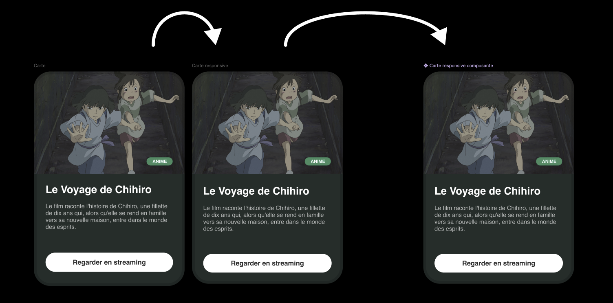{data-zoom-image}

Une **composante** Figma est un élément réutilisable.

On le crée une fois et on peut l'utiliser partout ensuite. Si on modifie la composante source, toutes les copies se mettent à jour automatiquement. 

Voici des exemples : 

- [ant.design](https://ant.design/components/overview/)
- [shadcn](https://ui.shadcn.com/docs/components/)
- [daisyui](https://daisyui.com/components/)
- [material ui](https://mui.com/material-ui/all-components/)

!!! tip "Créer une composante"

    Pour créer une composante, sélectionner un ou plusieurs éléments puis ++ctrl+alt+k++ (Windows) ou ++cmd+opt+k++ (Mac).

### Instances

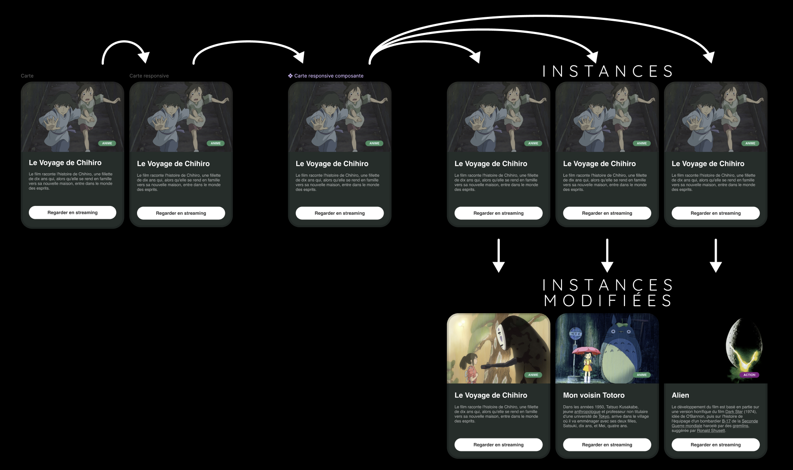{data-zoom-image}

Une instance c'est juste le nom donné à une copie d'une composante. Quand on fait un copier/coller d'une composante, ça crée une instance.

!!! tip "Modifications"

    On peut modifier les instances dans une certaine mesure. On ne peut pas toutefois déplacer des éléments. Le positionnement est géré par la composante de base.

    Aussi, il n'est pas possible de supprimer des éléments. Si on le fait, vous verrez que ce dernier est simplement caché dans la liste des calques.

!!! tip "Réinitialiser une instance"

    Pour **réinitialiser une instance** : Clic droit puis *Réinitialiser l'instance*. Ça va retirer les modifications effectuées à l'instance.

!!! tip "Détacher une instance"

    Pour **détacher une instance** : Clic droit puis *Detach instance* (à éviter sauf cas exceptionnel). Ainsi, il n'y aura plus de lien avec la composante source.

### Variantes

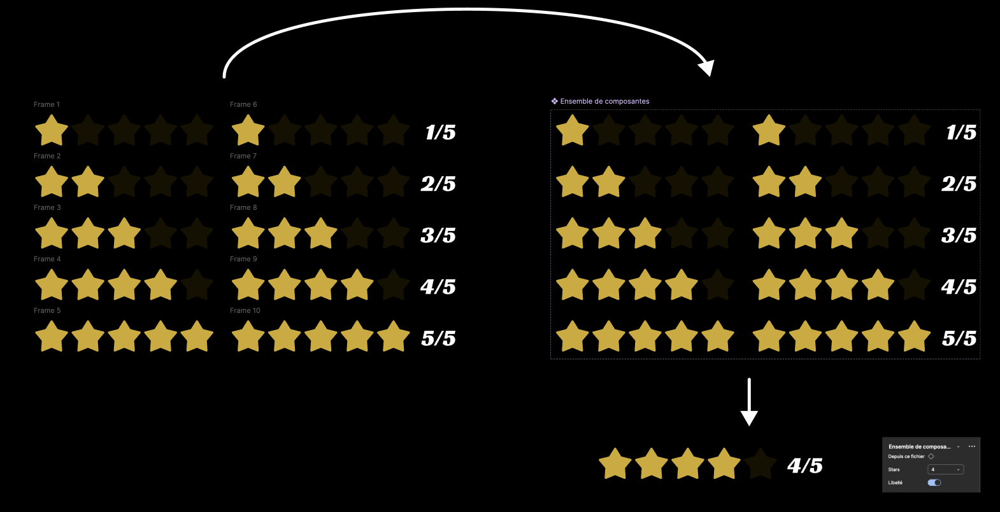{data-zoom-image}

Les variantes permettent de regrouper plusieurs états d'un même composant. Par exemple, un bouton avec ses 5 états (Default, Hover, Active, Focused, Disabled) est un seul composant avec 5 variantes.

IMPORTANT : Pour que cela fonctionne, il faut sélectionner l'ensemble de composantes et configurer les paramètres afin de spécifier chaque valeur associée à chaque état.

!!! tip "Créer des variantes"

    **Méthode 1**

    Pour créer des variantes, sélectionner plusieurs composants du même type, puis dans la colonne de droite, cliquer sur le bouton « Combiner en tant que variantes » : 

    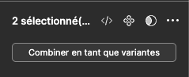{data-zoom-image}

    **Méthode 2**

    Si aucune composante n'est encore créée, sélectionner les éléments, puis dans la colonne de droite, cliquez sur les trois petits points et sélectionnez « Créer un ensemble de composants » :

    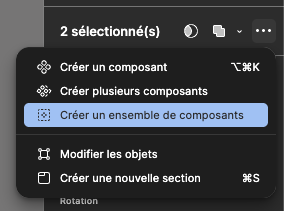{data-zoom-image}

!!! tip "Créer un instance"

    Dans l'onglet des ressources, vous pouvez simplement prendre votre nouvelle composante et la glisser dans votre composition.

!!! tip "Bonne pratique"

    Nommez vos composants avec une structure claire : `Catégorie/Nom/Variante`  
    
    Ex. : `Bouton/Primaire/Default`, `Bouton/Primaire/Hover`

### Propriétés de composant

Les propriétés permettent de rendre certains aspects d'un composant **modifiables par l'instance** sans briser le lien au composant de base.

| Propriété | Exemple d'usage |
| --- | --- |
| **Texte** | Changer le label d'un bouton |
| **Boolean** | Afficher/masquer une icône |
| **Instance swap** | Remplacer une icône par une autre |
| **Variant** | Changer l'état (Default → Hover) |

Les propriétés sont configurables sur les éléments d'une composante et quand on sélectionne la composante, on voit toutes les propriétés dans la colonne de droite.

!!! tip "Exemple concret"

    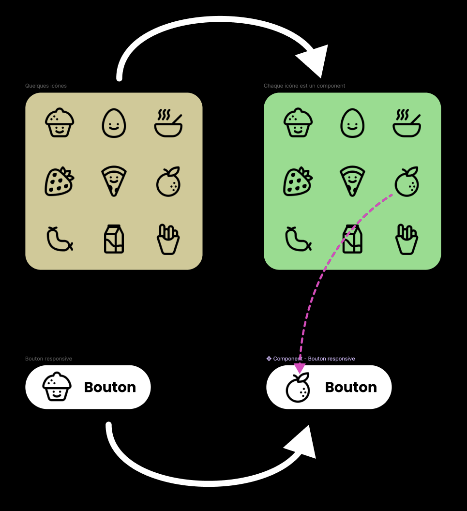{.w-50 data-zoom-image}

    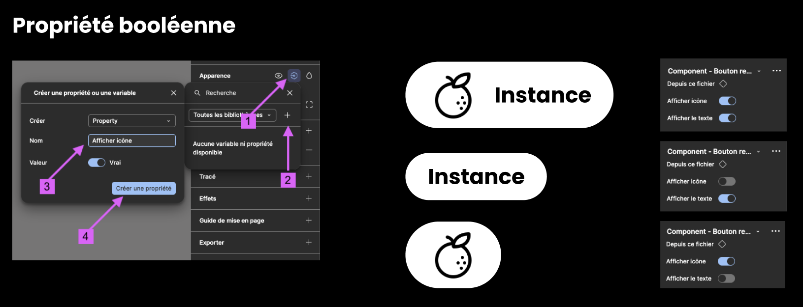{data-zoom-image}

    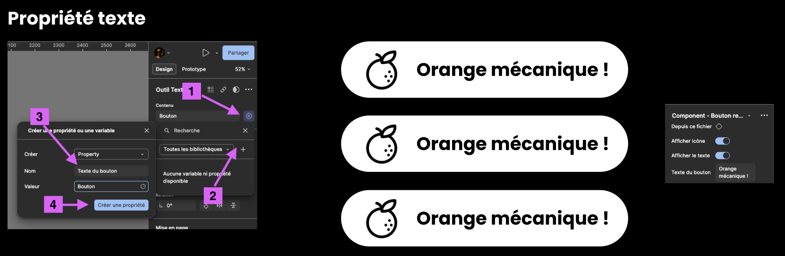{data-zoom-image}

    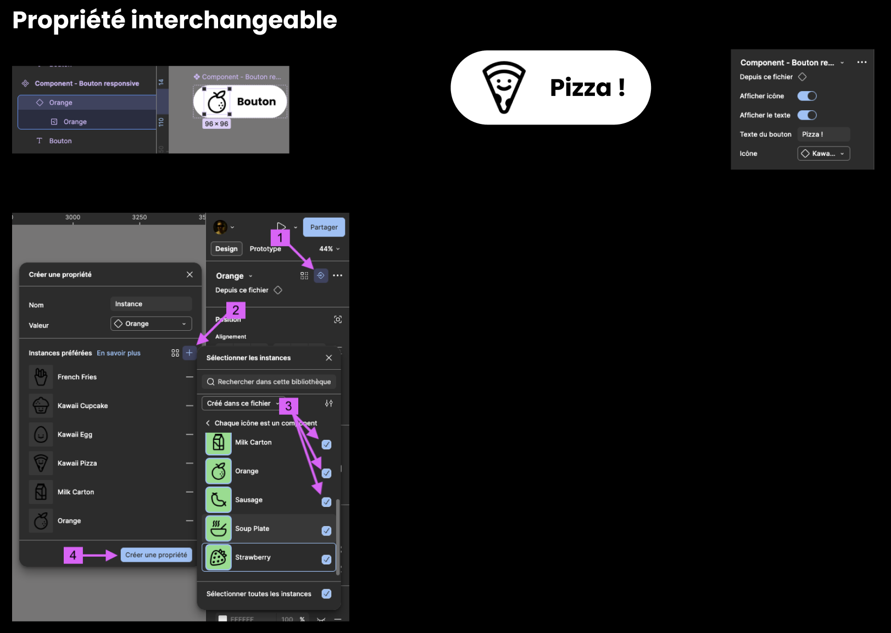{data-zoom-image}

### Organisation des composants

La bonne pratique est de créer une **page dédiée** aux composants (ex. : « Components ») :

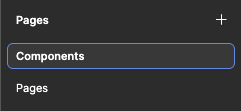{data-zoom-image}

Ils seront disponibles dans le panneau **Ressources** (_Assets_).

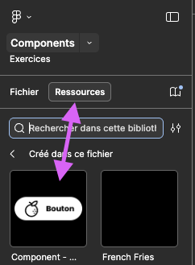{data-zoom-image}

Pour rendre ces composantes accessibles dans d'autres projets, vous devez publier la bibliothèque : 

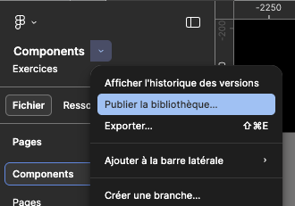{data-zoom-image}

## Introduction à Figma Sites

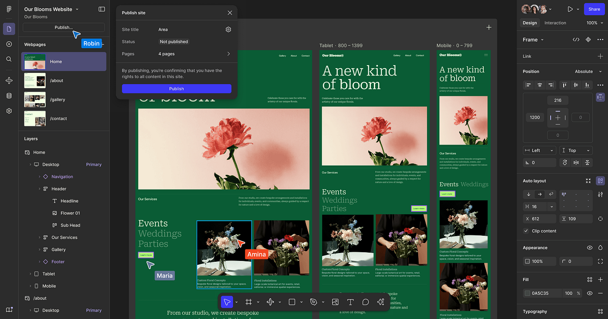{.w-100 data-zoom-image}

Figma Sites est une fonctionnalité qui permet de publier un design directement en site Web réel, avec une gestion des _breakpoints_ intégrée.

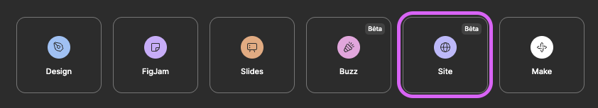{data-zoom-image}

<!-- 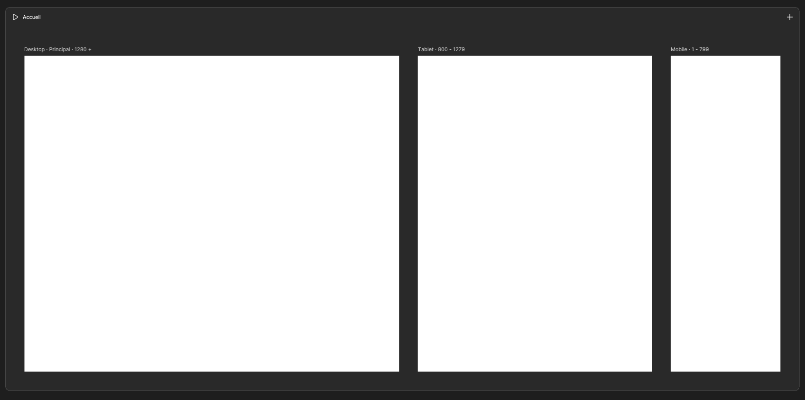{data-zoom-image} -->

### Blocs

Les **blocs** sont les éléments de base d'une page Figma Sites. Chaque section de votre site est un bloc distinct qui s'empile verticalement.

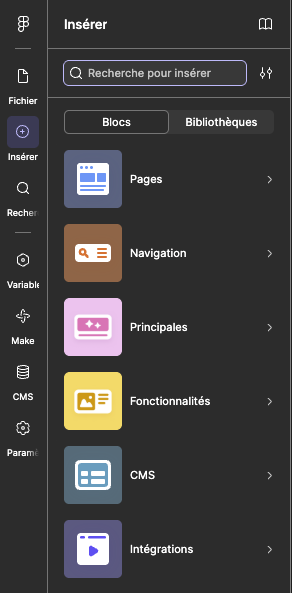{data-zoom-image}

Chaque bloc se comporte comme un _frame_ avec _Auto Layout_ vertical. On peut :

- **Ajouter un bloc** via le panneau de gauche ou le bouton `+` entre les sections
- **Réorganiser les blocs** par glisser-déposer
- **Configurer les blocs** pour chaque _breakpoints_ (desktop, tablette, mobile)

### Bibliothèques de composantes

Figma Sites donne accès aux composantes créées dans d'autres fichiers Figma à condition d'avoir publié la bibliothèque de celles-ci.

### Paramètres du site

Avant de publier, configurez les paramètres globaux de votre site via l'icône ⚙️ :

| Paramètre | Description |
| --- | --- |
| **Titre du site** | Apparaît dans l'onglet du navigateur (balise `<title>`) |
| **Description** | Texte affiché dans les résultats de recherche (balise `<meta>`) |
| **Favicon** | Petite icône affichée dans l'onglet du navigateur |
| **Domaine** | URL personnalisée ou sous-domaine Figma par défaut |
| **Image de partage** | Image affichée lors du partage sur les réseaux sociaux (_Open Graph_) |

### Publication

Une fois votre design prêt et vos paramètres configurés :

1. Cliquez sur **Publish** en haut à gauche de l'éditeur
2. Ajuster le titre du site au besoin
3. Confirmez la publication

Votre site est maintenant en ligne avec une URL Figma (ex. : `identifiant.figma.site`).

À chaque modification, il faut **republier** pour mettre à jour le site en ligne. 

!!! warning "Attention"

    Avec le forfait éducationnel, vous n'avez droit qu'à un seul site publié à la fois.

## Exercices

  

  <small>Exercice - Figma</small> 
  **[Angine de poitrine](./activite/exercice/angine-de-poitrine/index.md){.stretched-link .back}**

  

  <small>Exercice - Figma</small> 
  **[Avatar](./activite/exercice/avatar/index.md){.stretched-link .back}**

  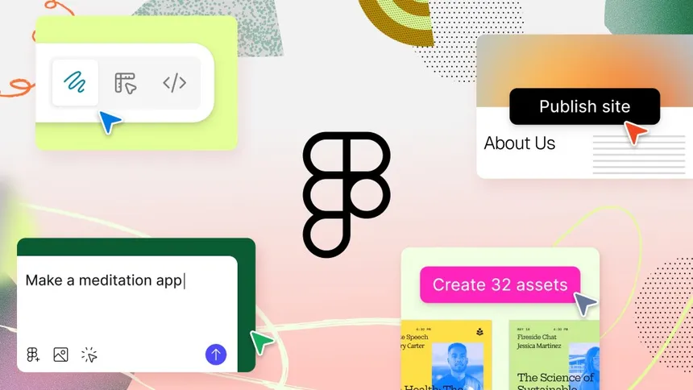

  <small>Exercice - Figma</small> 
  **[Un site et que ça saute !](./activite/exercice/figma-sites/index.md){.stretched-link .back}**

