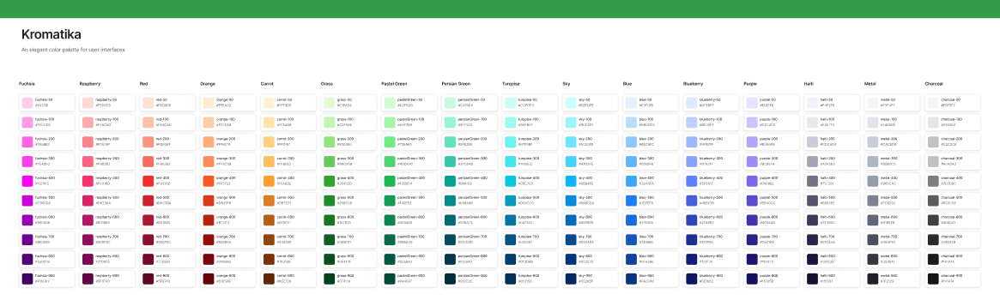
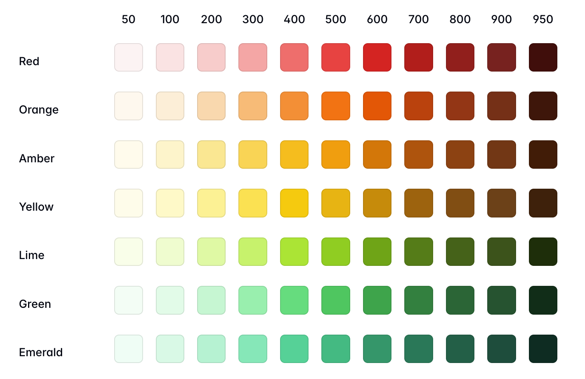
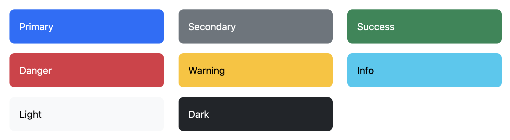
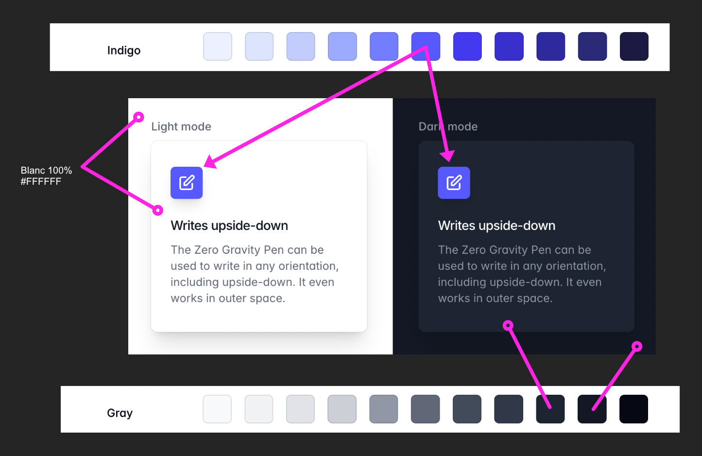
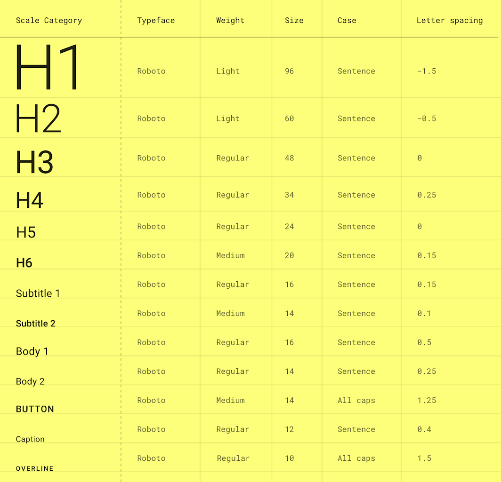
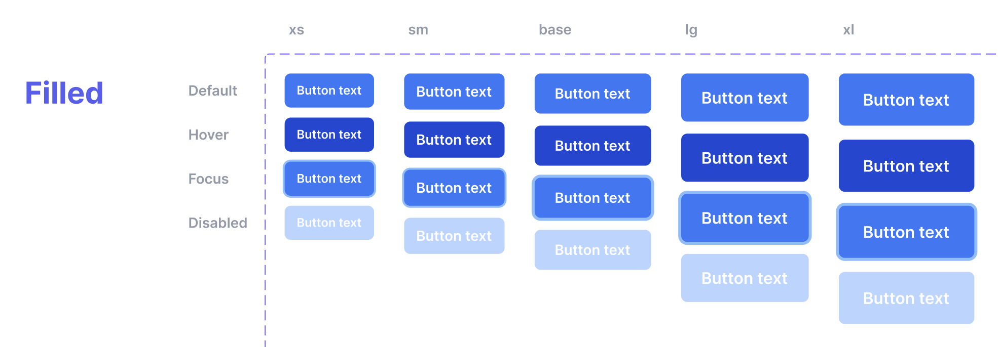
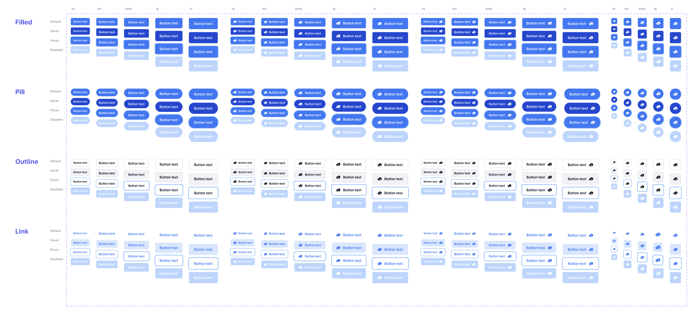
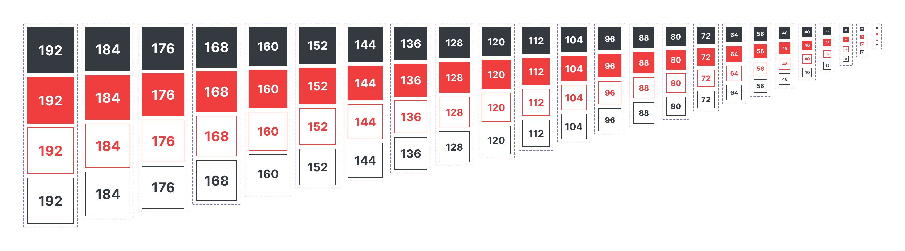
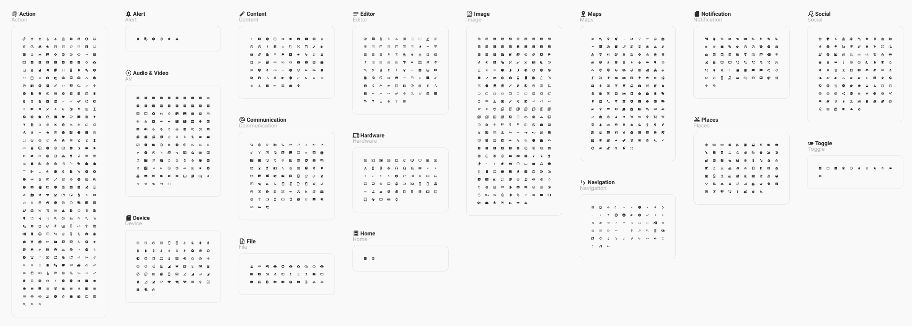
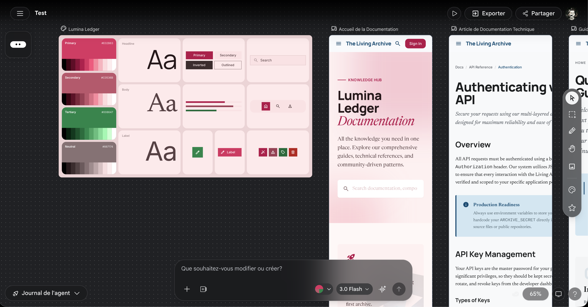

# Cours 10 | Le cours #10

[STOP]

## Séance de création dirigée

{.w-100}

## Système de design

{.w-100 data-zoom-image}

Un _design system_ (ou système de design), est un ensemble de règles, de composants réutilisables et de décisions de design documentées qui permettent à une équipe de créer des interfaces **cohérentes**, **rapidement** et **à grande échelle**.

### Ce que contient un _design system_

Un _[design system](https://www.figma.com/fr-fr/blog/design-systems-101-what-is-a-design-system/)_ complet est composé de 4 couches :

| Couche | Contenu |
| --- | --- |
| **Fondations** | Couleurs, typographie, espacements, icônes, grilles |
| **Composants** | Boutons, champs, cartes, menus, modals |
| **Patterns** | Formulaires, navigation, listes, états d'erreur |
| **Documentation** | Règles d'usage, _do/don't_, principes |

!!! example "Exemples"

    Plusieurs entreprises publient leur _design system_ :

    - Google : [Material Design](https://m3.material.io/)
    - Apple : [Human Interface Guidelines](https://developer.apple.com/design/human-interface-guidelines/)
    - Microsoft : [Fluent Design](https://fluent2.microsoft.design/)
    - Shopify : [Polaris](https://polaris.shopify.com/)
    - Atlassian : [Atlassian Design System](https://atlassian.design/) (Jira)

## Palette de couleurs

{data-zoom-image .w-100}

D'abord on défini l'ensemble des couleurs de notre système : rouge, bleu, vert, etc.

Ensuite on décline chacune de ces couleurs en plusieurs teintes (_tints_ / _shades_), de très pâle à très foncé. Traditionnellement, on les nomme par bond de 100 (entre 0 et 1000).

Notez qu'aux extrémités, on y va plus granulairement. En effet, les couleurs pâles et foncée demandent souvent plus de subtilités.

{data-zoom-image .w-50}

```css title="Exemple"
:root {
  /* TOKENS */
  --blue-500: #3b82f6;
  --blue-700: #1d4ed8;
  --red-500: #ef4444;
  --gray-100: #f3f4f6;
  --gray-900: #111827;
}
```

### Sémantique

Séparer le sens (intention) de l’apparence.

| Nom     | Signification |
| ------- | ------------- |
| primary | Couleur principale de la marque (Boutons, liens, éléments actifs) |
| secondaire | Couleur d'appui ou de contraste |
| success | confirmation |
| danger  | erreur |
| warning | attention |
| info    | neutre informatif |

{.w-50 data-zoom-image}

```css title="Exemple"
:root {
  /* TOKENS */
  --blue-500: #3b82f6;
  --blue-700: #1d4ed8;
  --red-500: #ef4444;

  /* RÔLES (sémantique) */
  --primary: var(--blue-500);
  --danger: var(--red-500);

  /* LOGIQUE D'USAGE */
  --primary-bg: var(--primary);
  --primary-text: #fff;
  --primary-border: var(--blue-700);
}
```

### Version foncée (_darkmode_)

On pourrait croire qu'en mode foncé, on a juste besoin d'inverser les déclinaisons pour s'adapter à un mode foncé, mais ce serait une erreur.

{data-zoom-image .w-50}

Si le fond est blanc, il n'est pas nécessairement noir dans le darkmode. On met souvent du gris foncé pour que ce soit moins fatigant pour les yeux. Les couleurs doivent alors aussi s'ajuster en conséquence.

!!! warning "L'accessibilité doit toujours faire partie du processus de décision des couleurs"

## Typographie

<figure markdown>
{data-zoom-image .w-50}
<figcaption>Typescale</figcaption>
</figure>

La typographie dans un design system définit **toutes les combinaisons** de police, taille, graisse et interlignage utilisées dans l'interface :

```
--font-family
--font-size
--font-weight
--line-height
--letter-spacing
```

!!! info "Généralement, pas plus de 2 polices dans un système de design"

!!! success "Typescale dynamique !"

    En vérité, les typescale contemporains ne sont plus fixes. 
    
    Par exemple, un H1 pourrait s'afficher entre 57px sur une tablette et en 64px sur desktop. Les tailles sont responsive.

    {data-zoom-image .w-25}

## Dimensions

Un design système cherche à encâdrer le plus de cas de figure possible. Pour ce faire, il se doit être assez flexible. Ainsi, il faut réfléchir à plusieurs cas de figure qu'on pourrait catégoriser :

* XS
* S
* M
* L
* XL

Ainsi, on peut baser nos composantes sur ce principe. Par exemples, les boutons :

{data-zoom-image}

### Variations

{data-zoom-image}

## Espacements



Les espacements, marges internes (_padding_), marges externes (_margin_), espacements entre items, doivent également être prévus.

Ils sont souvent normalisés par des **multiple de 4 ou 8** :

* 4px
* 8px
* 12px
* 16px
* 24px
* 32px
* 48px
* 64px
* 96px
* etc

## Icônes

{data-zoom-image}

Dépendament des usages, on va catégoriser les groupes d'icônes selon leurs fonctions : 

* Actions
* Alerts
* Médias
* Contenu
* Communications
* Fichiers
* Formulaire
* etc

!!! example "Quelques exemples"

    - [Material Symbols](https://fonts.google.com/icons) (Google)
    - [Heroicons](https://heroicons.com/) (Tailwind)
    - [Phosphor Icons](https://phosphoricons.com/)
    - [Lucide](https://lucide.dev/)

## Applicabilité d'un *design system*

Concevoir un système de design est une étape stratégique, mais son application dans un contexte de développement Web réel représente un défi technique majeur. Chaque composante doit être codée de manière isolée, testée et documentée, ce qui exige un investissement en temps considérable. 

Une fois qu'une composante est programmée et intégrée, les modifications ne sont jamais prises à la légère. Un changement, même minime (comme une variation d'espacement ou de couleur), peut avoir des répercussions en cascade sur l'ensemble de l'interface, nécessitant une nouvelle phase de développement, de tests de régression et de déploiement.

### Figma

L'outil **Figma** a transformé la transposition des maquettes vers le code. Grâce au **Mode Développeur (Dev Mode)**, les propriétés CSS (couleurs, typographies, flexbox) sont directement inspectables, ce qui réduit les erreurs d'interprétation. Cependant, Figma ne livre pas encore de code "prêt à la production" : le développeur doit toujours structurer la logique (React, Vue, etc.), gérer l'accessibilité (ARIA) et s'assurer de la réutilisabilité des composants. Cela reste une phase chronophage, bien que mieux balisée qu'auparavant.

### L'apport de l'intelligence artificielle

L'émergence de l'IA générative promet de réduire drastiquement ce fossé. La transformation est déjà visible avec des outils capables de convertir instantanément une image ou un fichier de design en code fonctionnel (comme **v0.dev**, **Anima** ou **Builder.io**). L'IA permet de générer la structure de base (boilerplate), laissant au développeur le rôle crucial de superviseur et d'architecte plutôt que de rédacteur de code répétitif.

### Stitch (Google)

**Stitch** est une initiative de Google qui vise à automatiser la création et la synchronisation des *design systems*. Plutôt que de coder manuellement chaque variation, Stitch facilite l'utilisation des **Design Tokens** (variables universelles de design) pour assurer une cohérence parfaite entre Figma et le code source.



> **Ressource :** Découvrez l'approche de Google sur [stitch.withgoogle.com](https://stitch.withgoogle.com/)

## Devoir

Devoir 04