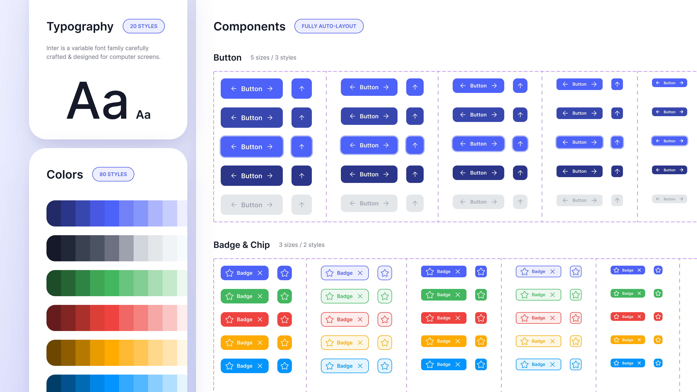

# Cours 10 | Système de design

[STOP]


<!-- 
@note : Ce cours vise à enseigner la notion de Design system dans Figma. 

Design system
https://www.figma.com/fr-fr/blog/design-systems-101-what-is-a-design-system/

https://www.youtube.com/watch?v=6_t66Ef0Llk -->

## Qu'est-ce qu'un design system ?

Un **design system** (ou système de design), c'est un ensemble de règles, de composants réutilisables et de décisions de design documentées qui permettent à une équipe de créer des interfaces **cohérentes**, **rapidement** et **à grande échelle**.

> C'est un peu la « grammaire » d'une interface : quand tout le monde parle le même langage visuel, la communication est plus fluide et les erreurs diminuent.

### Pourquoi ça existe ?

Imaginez une équipe de 10 designers et 5 développeurs qui travaillent sur la même application. Sans système commun :

- Les boutons ont 6 tailles différentes selon qui les a dessinés 😬
- Les couleurs varient d'une page à l'autre
- Chaque changement de couleur principale demande des heures de corrections

Avec un design system, **une seule modification** se propage partout automatiquement.

### Ce que contient un design system

<figure markdown>
{data-zoom-image}
<figcaption>Les grandes couches d'un design system</figcaption>
</figure>

Un design system complet est composé de plusieurs couches :

| Couche | Contenu |
| --- | --- |
| **Fondations** | Couleurs, typographie, espacements, icônes, grilles |
| **Composants** | Boutons, champs, cartes, menus, modales... |
| **Patterns** | Formulaires, navigation, listes, états d'erreur... |
| **Documentation** | Règles d'usage, do/don't, principes |

Dans ce cours, on va se concentrer sur les **fondations** et les **composants**, qui sont la base de tout le reste.

### Exemples de design systems publics

Plusieurs grandes entreprises publient leur design system. C'est une mine d'or pour apprendre.

- [Material Design](https://m3.material.io/) — Google
- [Human Interface Guidelines](https://developer.apple.com/design/human-interface-guidelines/) — Apple
- [Fluent Design](https://fluent2.microsoft.design/) — Microsoft
- [Polaris](https://polaris.shopify.com/) — Shopify
- [Atlassian Design System](https://atlassian.design/) — Jira/Confluence

!!! tip "Regardez comment ils documentent leurs composants"

    La façon dont ces entreprises décrivent leurs règles est presque aussi instructive que les règles elles-mêmes. Ça vous donnera une bonne idée de la rigueur attendue dans le milieu.

---

## Les fondations (_Foundations_)

Les fondations, c'est tout ce qui doit être défini **avant** de commencer à dessiner des composants. C'est la base sur laquelle tout le reste s'appuie.

### Palette de couleurs

Une palette bien construite pour le Web comporte plusieurs niveaux :

<figure markdown>
{data-zoom-image}
<figcaption>Exemple de palette structurée avec rôles sémantiques</figcaption>
</figure>

| Type | Rôle | Exemple |
| --- | --- | --- |
| **Primaire** | Couleur principale de la marque | Boutons, liens, éléments actifs |
| **Secondaire** | Couleur d'appui ou de contraste | Badges, accents |
| **Neutre** | Gris pour les fonds, les textes, les bordures | Fonds, textes de contenu |
| **Sémantique** | Couleurs à sens fixe | ✅ Succès, ⚠️ Avertissement, ❌ Erreur, ℹ️ Info |

!!! info "La règle du naming sémantique"

    Dans un design system, on ne nomme **jamais** une couleur par sa valeur visuelle.

    | ❌ À éviter | ✅ À préférer |
    | --- | --- |
    | `bleu-foncé` | `couleur-primaire` |
    | `gris-clair` | `fond-secondaire` |
    | `rouge` | `couleur-erreur` |

    Pourquoi ? Parce que si vous décidez un jour que votre couleur primaire devient verte, le nom `bleu-foncé` ne voudra plus rien dire.

### Typographie

<figure markdown>
{data-zoom-image}
<figcaption>Exemple d'échelle typographique</figcaption>
</figure>

La typographie dans un design system définit **toutes les combinaisons** de police, taille, graisse et interlignage utilisées dans l'interface.

| Niveau | Usage typique | Taille indicative |
| --- | --- | --- |
| **Display / H1** | Titres de page, héros | 48–72px |
| **H2** | Titres de section | 32–40px |
| **H3** | Sous-titres | 24–28px |
| **Body Large** | Intro, texte mis en valeur | 18–20px |
| **Body** | Texte courant | 14–16px |
| **Caption** | Légendes, notes, labels | 11–12px |

!!! warning "Pas plus de 2 polices dans un système"

    Dans la grande majorité des cas, un design system utilise **une police pour les titres** et **une pour le texte courant**, parfois la même pour les deux. Multiplier les polices crée de l'incohérence.

### Espacements (_Spacing_)

<figure markdown>
{data-zoom-image}
<figcaption>Système d'espacements basé sur une unité de base</figcaption>
</figure>

L'espacement, c'est la distance entre les éléments : marges internes (_padding_), marges externes (_margin_), espacements entre items, etc.

La plupart des systèmes utilisent un **multiple de 4 ou 8** comme unité de base :

`4 — 8 — 12 — 16 — 24 — 32 — 48 — 64 — 96...`

> Pourquoi 8 ? Parce que la plupart des écrans ont des densités de pixels multiples de 8, et les composants s'alignent naturellement.

!!! example "Analogie : la portée musicale 🎵"

    Une portée musicale a des lignes régulières et espacées de façon identique. Le musicien peut y placer n'importe quelle note, mais l'espacement reste toujours cohérent. Un système d'espacement, c'est pareil : les distances varient, mais selon une logique fixe.

### Icônes

Un design system définit **une bibliothèque d'icônes cohérente** : même style (trait, rempli, outline), même taille de grille de base (souvent 24×24px), même convention de nommage.

Des bibliothèques libres de référence :

- [Material Symbols](https://fonts.google.com/icons) — Google
- [Heroicons](https://heroicons.com/) — Tailwind
- [Phosphor Icons](https://phosphoricons.com/)
- [Lucide](https://lucide.dev/)

---

## Les variables Figma

{.w-100}

Les **variables** dans Figma permettent de stocker des valeurs (couleurs, nombres, textes, booléens) et de les réutiliser partout dans le fichier. C'est le mécanisme qui donne vie aux fondations d'un design system.

### Créer une variable de couleur

1. Ouvrir le panneau **Local variables** (icône en haut à droite du panneau des calques, ou via le menu ressources)
2. Créer une collection (ex. : `Couleurs`)
3. Ajouter une variable de type **Color**
4. Lui donner un nom sémantique (ex. : `primaire/500`)
5. L'appliquer au remplissage d'un élément via le panneau de droite

!!! success "La vraie puissance : les modes (_Modes_)"

    Les variables peuvent avoir plusieurs **modes**. C'est ce qui permet, par exemple, de basculer l'ensemble d'une interface entre **mode clair** et **mode sombre** en un seul clic.

    {data-zoom-image .w-50}

### Variables numériques

Vous pouvez aussi créer des variables pour vos espacements :

- `spacing/xs` = `4`
- `spacing/sm` = `8`
- `spacing/md` = `16`
- `spacing/lg` = `32`

Puis les appliquer aux _padding_ de vos auto-layouts. Modifier la valeur de `spacing/md` met à jour **tous** les composants qui l'utilisent.

---

## Construire un mini design system dans Figma

Voici la démarche recommandée pour construire un système minimal mais fonctionnel.

### Étape 1 — Organisation du fichier

Créez une page dédiée dans votre fichier Figma :

```
📄 🎨 Fondations
📄 🧩 Composants
📄 📐 Maquettes
```

### Étape 2 — Définir les variables

Dans la page **Fondations**, définissez vos variables :

- [ ] Palette de couleurs (primaire, neutre, sémantique)
- [ ] Échelle typographique (styles de texte)
- [ ] Espacements (variables numériques)

!!! tip "Les _Text Styles_ dans Figma"

    En plus des variables, Figma permet de créer des **styles de texte** réutilisables. Sélectionnez un texte formaté → icône « + » dans la section *Text* du panneau → nommez le style (ex. : `Titre/H1`).

### Étape 3 — Créer les composants de base

Dans la page **Composants**, construisez au minimum :

- [ ] Un bouton (avec variantes : Default, Hover, Disabled)
- [ ] Un champ de texte (_input_)
- [ ] Une carte (_card_) avec image, titre, description
- [ ] Une icône encapsulée dans un composant

### Étape 4 — Documenter

Chaque composant devrait être accompagné de règles d'usage minimales directement dans Figma, sous forme de notes ou de frames d'annotation.

<figure markdown>
{data-zoom-image}
<figcaption>Exemple de documentation inline dans Figma</figcaption>
</figure>

---

## Composants avancés : _Nested components_

Les composants peuvent être **imbriqués** les uns dans les autres. C'est là que la puissance du système se révèle vraiment.

<div class="grid grid-1-2" markdown>
{data-zoom-image}

<div markdown>
**Exemple : un composant Carte**

La carte contient :

- Un composant **Image** (avec variante portrait/paysage)
- Un composant **Badge** (avec variantes de couleur)
- Un composant **Bouton** (avec ses états)

Modifier le composant Bouton met à jour automatiquement **toutes** les cartes dans tout le projet.
</div>
</div>

!!! info "Règle d'or des composants imbriqués"

    Commencez toujours par les **plus petits composants** (atomes) avant d'assembler les plus grands (molécules, organismes). C'est la logique de l'**Atomic Design**, une méthode populaire pour structurer les design systems.

    {data-zoom-image .w-75}

---

## Mini _checklist_ design system 🧠

Avant de passer à la maquette de votre projet, vérifiez que votre système est en place :

1. **Couleurs** : palette définie, noms sémantiques, variables créées
2. **Typographie** : styles de texte créés pour chaque niveau (H1 → Caption)
3. **Espacements** : unité de base choisie (4 ou 8), valeurs cohérentes
4. **Composants** : boutons, inputs et cartes créés avec variantes
5. **Organisation** : pages et calques nommés clairement

---

## Exercices

<div class="grid grid-1-2" markdown>
  

  <small>Exercice - Figma</small><br>
  **[Fondations](./activite/exercice/design-system-fondations/index.md){.stretched-link .back}**
</div>

<div class="grid grid-1-2" markdown>
  

  <small>Exercice - Figma</small><br>
  **[Composants imbriqués](./activite/exercice/design-system-composants/index.md){.stretched-link .back}**
</div>
