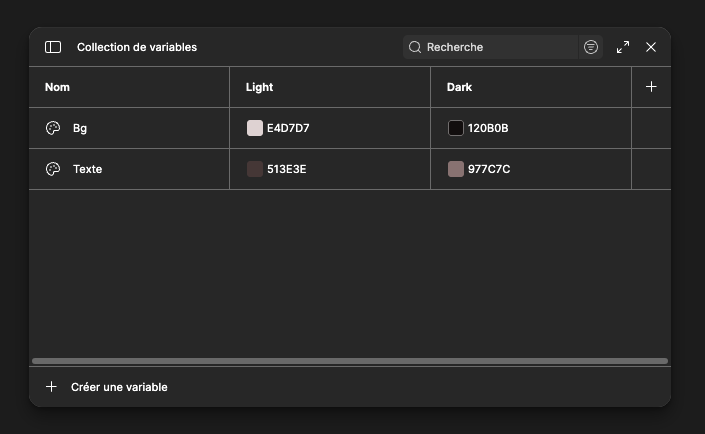
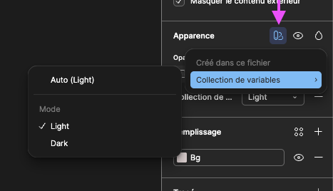
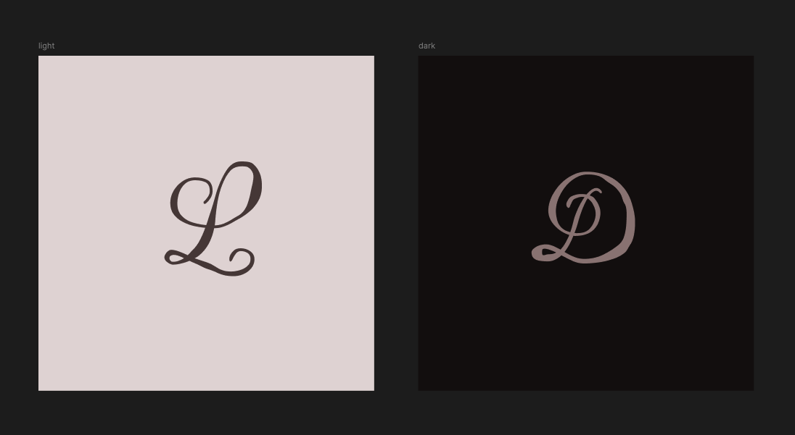
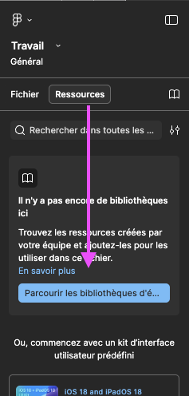
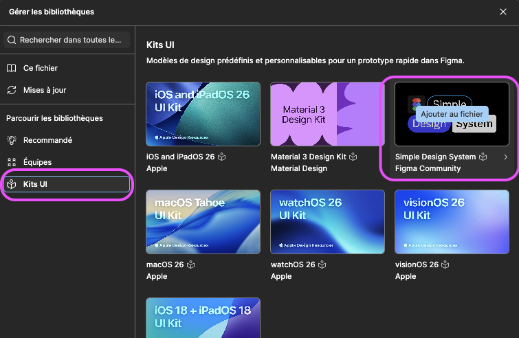
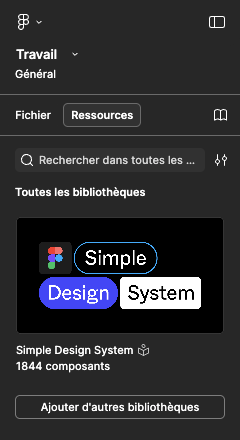
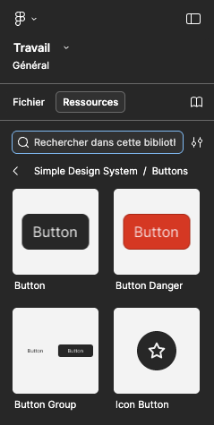
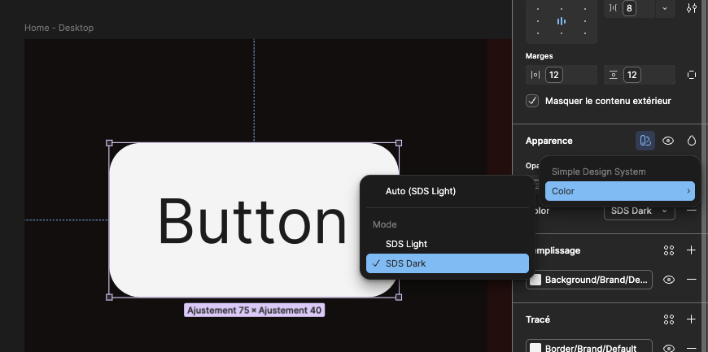
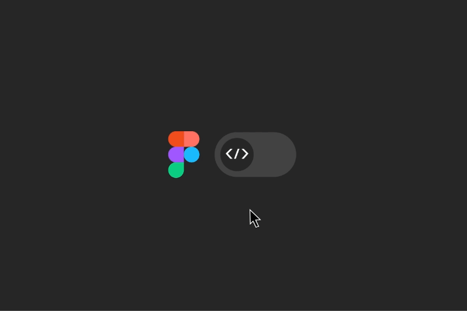

# Cours 10 | Le cours #10

<!-- /activite/exercice/seance-de-creation -->

## Exercices

Séance de création dirigée

{.w-100}

## Système de design

{.w-100 data-zoom-image}

Un _design system_ (ou système de design), est un ensemble de règles, de composants réutilisables et de décisions de design documentées qui permettent à une équipe de créer des interfaces **cohérentes**, **rapidement** et **à grande échelle**.

### Ce que contient un _design system_

Un _[design system](https://www.figma.com/fr-fr/blog/design-systems-101-what-is-a-design-system/)_ complet est composé de 4 couches :

| Couche | Contenu |
| --- | --- |
| **Fondations** | Couleurs, typographie, espacements, icônes, grilles |
| **Composants** | Boutons, champs, cartes, menus, modals |
| **Patterns** | Formulaires, navigation, listes, états d'erreur |
| **Documentation** | Règles d'usage, _do/don't_, principes |

!!! example "Exemples"

    Plusieurs entreprises publient leur _design system_ :

    - Google : [Material Design](https://m3.material.io/)
    - Apple : [Human Interface Guidelines](https://developer.apple.com/design/human-interface-guidelines/)
    - Microsoft : [Fluent Design](https://fluent2.microsoft.design/)
    - Shopify : [Polaris](https://polaris.shopify.com/)
    - Atlassian : [Atlassian Design System](https://atlassian.design/) (Jira)

## Palette de couleurs

{data-zoom-image .w-100}

D'abord on définit l'ensemble des couleurs de notre système : rouge, bleu, vert, etc.

Ensuite on décline chacune de ces couleurs en plusieurs teintes (_tints_ / _shades_), de très pâle à très foncé. Traditionnellement, on les nomme par bond de 100 (entre 0 et 1000).

Notez qu'aux extrémités, on y va plus granulairement. En effet, les couleurs pâles et foncées demandent souvent plus de subtilités.

<figure markdown>
{data-zoom-image .w-50}
<figcaption markdown>[Tailwind - Couleurs](https://tailwindcss.com/docs/colors)</figcaption>
</figure>

```css title="Exemple"
:root {
  --blue-500: #3b82f6;
  --blue-700: #1d4ed8;
  --red-500: #ef4444;
  --gray-100: #f3f4f6;
  --gray-900: #111827;

  /* On appelle ce type de variable des « design tokens », « tokens primitifs » ou « global tokens » */
}
```

### Sémantique

Séparer le sens (intention) de l’apparence. Un exemple qui le fait bien : [daisyui](https://daisyui.com/docs/colors/).

| Nom     | Signification |
| ------- | ------------- |
| primary | Couleur principale de la marque (Boutons, liens, éléments actifs) |
| secondaire | Couleur d'appui ou de contraste |
| success | confirmation |
| danger  | erreur |
| warning | attention |
| info    | neutre informatif |

{.w-50 data-zoom-image}

```css title="Exemple"
:root {
    /* ... */

    /* Rôles (sémantique) */
    --primary: var(--blue-500);
    --danger: var(--red-500);

    /* L'usage (composants) */
    --primary-bg: var(--primary);
    --primary-text: #fff;
    --primary-border: var(--blue-700);

    --btn-bg: #ffffff;
    --btn-text: #1a1a1a;
}
```

### Version foncée (_darkmode_)

On pourrait croire qu'en mode foncé, on a juste besoin d'inverser les déclinaisons pour s'adapter à un mode foncé, mais ce serait une erreur.

{data-zoom-image .w-50}

Si le fond est blanc, il n'est pas nécessairement noir dans le darkmode. On met souvent du gris foncé pour que ce soit moins fatigant pour les yeux. Les couleurs doivent alors aussi s'ajuster en conséquence.

!!! warning "L'accessibilité doit toujours faire partie du processus de décision des couleurs"

En code, ça pourrait ressembler à ceci : 

```css title="Exemple complet"

/* 1. Mode clair */

:root {
    /* Tokens (valeurs brutes) */
    --blue-500: #3b82f6;
    --blue-700: #1d4ed8;
    --red-500: #ef4444;

    /* Rôles (sémantique) */
    --primary: var(--blue-500);
    --danger: var(--red-500);

    /* L'usage (composants) */
    --primary-bg: var(--primary);
    --primary-text: #fff;
    --primary-border: var(--blue-700);

    --btn-bg: #ffffff;
    --btn-text: #1a1a1a;
}

/* 2. Mode Sombre (Automatique + Manuel) */

@media (prefers-color-scheme: dark) {
    :root:not([data-theme='light']) {
        --blue-500: #60a5fa;
        --btn-bg: #111827;
        --btn-text: #f9fafb;
    }
}

[data-theme='dark'] {
    --blue-500: #60a5fa;
    --btn-bg: #111827;
    --btn-text: #f9fafb;
}
```

#### Darkmode dans Figma

Pour activer la notion de darkmode, assurez-vous de mettre 2 valeurs (colonnes) à une même variable.

{data-zoom-image .w-33}

Dans la configuration du frame, on peut spécifier quelle version utiliser (clair ou sombre).

{data-zoom-image .w-33}

Ainsi, toutes les couleurs s'ajusteront en fonction du contexte de la maquette !

{data-zoom-image .w-33}

#### _Design system_ de la communauté

Plus souvent qu'autrement, les _Design system_ contemporains viennent avec une version sombre. 

Pour ajouter ce type de système dans votre document, passez par l'onglet Ressources : 

{data-zoom-image .w-25}
{data-zoom-image .w-25}
{data-zoom-image .w-25}

Pour l'activer, sélectionnez une de ses instances de composante et activez sa variation sombre dans la section Apparence.

{data-zoom-image .w-25}
{data-zoom-image .w-25}


## Typographie

<figure markdown>
{data-zoom-image .w-50}
<figcaption>Typescale</figcaption>
</figure>

La typographie dans un design system définit **toutes les combinaisons** de police, taille, graisse et interlignage utilisées dans l'interface :

```css title="Exemple de css"
:root {
    /* 1. Font Family */
    --font-family: 'Inter', system-ui, -apple-system, sans-serif;

    /* 2. Font sizes */
    --font-size-sm: 0.875rem;    /* 14px */
    --font-size-base: 1rem;      /* 16px - Par défaut */
    --font-size-lg: 1.125rem;    /* 18px */

    /* 3. Font weights */
    --font-weight-light: 300;
    --font-weight-normal: 400;
    --font-weight-bold: 700;

    /* 4. Line heights */
    --line-height-none: 1;
    --line-height-tight: 1.25;
    --line-height-snug: 1.375;
    --line-height-normal: 1.5;
}
```

!!! info "Généralement, pas plus de 2 polices dans un système de design"

!!! example "De nos jours ..."

    {data-zoom-image .w-25}

    En vérité, les typescale contemporains ne sont plus fixes. La tendance actuelle est d'utiliser `clamp()` en css.

    ```css
    :root {
        /* La police va varier de 1rem à 1.5rem selon la largeur de l'écran à cause du 2vw */
        --font-size-xyz: clamp(1rem, 2vw + 0.5rem, 1.5rem);
    }
    ```

## Dimensions

Un design system cherche à encadrer le plus de cas de figure possible. Pour ce faire, il se doit d'être assez flexible. Ainsi, il faut réfléchir à plusieurs cas de figure qu'on pourrait catégoriser : XS, S, M, L, XL

Ainsi, on peut baser nos composantes sur ce principe. Par exemple, les boutons :

{data-zoom-image}

### Variations

{data-zoom-image}

<!-- 
## Espacements

{data-zoom-image}

Les espacements, marges internes (_padding_), marges externes (_margin_), espacements entre items, doivent également être prévus.

Ils sont souvent normalisés par des **multiple de 4 ou 8** :

* 4px
* 8px
* 12px
* 16px
* 24px
* 32px
* 48px
* 64px
* 96px
* etc -->

## Icônes

{data-zoom-image}

Selon les usages, on va catégoriser les groupes d'icônes selon leurs fonctions : alertes, fichiers, formulaire, etc.

!!! example "Quelques exemples"

    - [Material Symbols](https://fonts.google.com/icons) (Google)
    - [Heroicons](https://heroicons.com/) (Tailwind)
    - [Feather](https://feathericons.com/)

## Applicabilité d'un *design system*

{.w-100}

L'intégration d'un _design system_ en développement Web reste exigeante. 

Chaque composante doit être codée, testée et documentée, ce qui demande beaucoup de temps. 

De plus, même de petits changements peuvent entraîner des effets en cascade et nécessiter de nouveaux tests et déploiements.

### Figma

{.w-50}

Figma facilite la transition vers le code grâce au Dev Mode, qui expose directement les propriétés CSS. 

Toutefois, le code généré n’est pas prêt pour la production : la logique, l’accessibilité et la réutilisabilité doivent encore être prises en charge par le développeur.

### IA

{.w-50}

L’IA générative réduit cet écart en produisant rapidement du code de base à partir de designs. 

Le développeur agit alors davantage comme **architecte** que comme **exécutant**.

!!! info "Connexion émotionnelle"

    <div class="grid" markdown>
    {data-zoom-image}
    {data-zoom-image}
    </div>
    
<!-- Source : https://www.youtube.com/watch?v=LTsIKT9dslU -->

### Stitch (Google)

Stitch vise à automatiser les _design systems_ via les Design Tokens, assurant une cohérence entre design et code sans avoir à gérer chaque variation manuellement.

<figure markdown>
{data-zoom-image}
<figcaption markdown>[stitch.withgoogle.com](https://stitch.withgoogle.com/)</figcaption>
</figure>

## Devoir

<div class="grid grid-1-2" markdown>
  

  <small>Devoir - Figma</small><br>
  **[Refonte d'un site Web](./activite/devoir/refonte/index.md){.stretched-link .back}**
</div>
