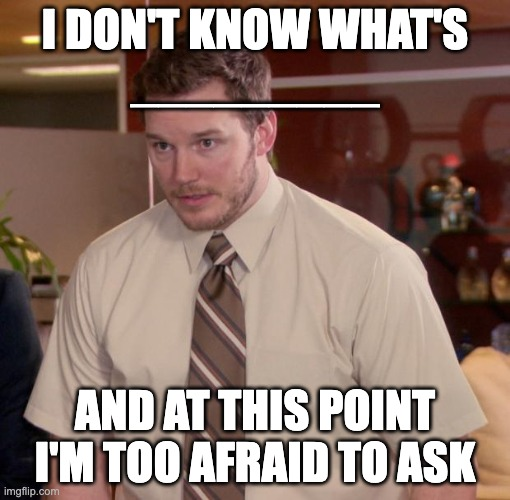
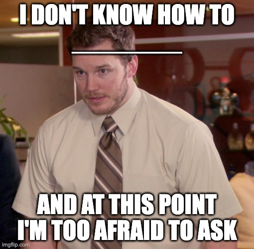

# Cours 11 | Prototype

[STOP]

## Annonces

### Exposition

<figure markdown>

<figcaption markdown>
[Montréal 1976 : une épreuve olympique](https://www.musee-mccord-stewart.ca/fr/expositions/montreal-1976-epreuve-olympique/)
</figcaption>
</figure>

### Concours d'essais audiovisuels

{.w-100}

Le fameux concours d'essais audiovisuels aura encore lieu cette année !
Ce concours est une belle occasion d'obtenir une bourse en argent (jusqu'à 175$) et de bonifier votre portfolio ! 
 
Date limite de remise : **10 mai 2026**
 
Vous trouverez ici les détails de l'appel à candidatures: [Appel a candidature 2026.pdf](./assets/documents/Appel-a-candidature-2026.pdf)
 
Des questions? Adressez-les à **Lora Boisvert** ou **Thomas O Fredericks** sur Teams.

## À ce point ci ...

[Wooclap](https://app.wooclap.com/ANDYMEME?from=instruction-slide)

## À partir de maintenant, on évite ces formulations

> « Depuis la nuit des temps » 
> « Grosso modo » 
> « En général » 
> « Tout le monde sait que » 
> « C’est évident que »

Ces expressions sont trop vagues, généralisantes ou non justifiées.

### En Web

« En savoir plus » est trop générique et manque de précision sur l’action. C'est dailleurs problématique pour l'accessibilité.

Il faut que l'étape après l'action soit limpide :

* « À propos du festival »
* « Découvrir le festival »
* « Voir la programmation »
* « Acheter un billet »

## Trois étapes

1. La maquette filaire (_Wireframe_)
1. La maquette graphique (_Mockup_)
1. Le prototype

**C'est quoi ?**  

Un prototype, c'est une maquette graphique à laquelle on ajoute des **interactions**. On peut cliquer sur des boutons, naviguer vers d'autres pages, ouvrir un _pop up_, _swiper_ pour changer l'écran, etc.

**À quoi ça sert ?**

- Simuler l'expérience réelle **avant** de coder
- Tester avec de vraies personnes (tests utilisateurs)
- Présenter et valider le design avec un client
- Repérer les problèmes de navigation tôt (avant que ça coûte cher)

## Parcours utilisateur (_User Flow_)

Avant de commencer à connecter des écrans dans Figma, il faut savoir **ce qu'on connecte**.

Un **parcours utilisateur**, c'est la séquence d'étapes qu'une personne suit pour accomplir une tâche dans l'interface.

## Figma 

Retirer le fond d'une image en 1 clic

Crédits IA

## Prototypage dans Figma

### L'onglet Prototype

### Connexions (_Connections_)

Pour connecter deux écrans :

1. Passez en mode **Prototype** (onglet en haut à droite)
2. Survolez un élément cliquable → une flèche bleue apparaît
3. Glissez cette flèche vers l'écran de destination
4. Configurez le déclencheur et l'action

<figure markdown>
{data-zoom-image}
<figcaption>Création d'une connexion entre deux frames</figcaption>
</figure>

### Déclencheurs (_Triggers_)

Le déclencheur définit **quelle action de l'utilisateur** lance l'interaction.

| Déclencheur | Usage typique |
| --- | --- |
| **On Click** | Boutons, liens, cartes cliquables |
| **On Hover** | Menus déroulants, tooltips |
| **On Drag** | Sliders, carousels, swipe mobile |
| **On Press** | Boutons tactiles, appui long |
| **While Hovering** | Animations de survol continues |
| **After Delay** | Splash screen, chargement automatique |
| **Key / Gamepad** | Interactions clavier |

### Actions

L'action définit **ce qui se passe** après le déclencheur.

| Action | Description |
| --- | --- |
| **Navigate to** | Aller vers un autre frame (navigation principale) |
| **Open overlay** | Afficher un élément par-dessus (modale, menu, tooltip) |
| **Scroll to** | Faire défiler jusqu'à un élément |
| **Back** | Revenir à l'écran précédent |
| **Close overlay** | Fermer un overlay ouvert |
| **Set variable** | Modifier la valeur d'une variable (états interactifs) |

---

## Transitions et animations

Une fois la connexion créée, vous pouvez définir **comment** la transition se produit.

<figure markdown>
{data-zoom-image .w-75}
<figcaption>Options de transition entre deux écrans</figcaption>
</figure>

### Types de transitions

| Type | Effet |
| --- | --- |
| **Instant** | Changement immédiat, sans animation |
| **Dissolve** | Fondu enchaîné |
| **Move In / Out** | L'écran entre ou sort par un côté |
| **Push** | L'écran suivant pousse l'actuel |
| **Slide In / Out** | Glissement (pour les menus latéraux, tiroirs) |
| **Smart Animate** | Animation intelligente basée sur les changements de propriétés |

!!! info "Smart Animate ✨"
    Si deux frames contiennent des éléments **avec le même nom**, Figma anime automatiquement la transition entre leurs propriétés (position, taille, opacité, couleur...). C'est l'outil le plus puissant pour des animations fluides sans effort.

### Courbes d'accélération (_Easing_)

{data-zoom-image .w-75}

L'easing définit le **rythme** de l'animation. Une animation linéaire semble mécanique. Une courbe d'easing la rend naturelle.

| Courbe | Effet ressenti |
| --- | --- |
| **Linear** | Mécanique, robotique |
| **Ease In** | Démarre lentement, accélère |
| **Ease Out** | Démarre rapidement, ralentit (le plus naturel pour les UI) |
| **Ease In and Out** | Doux au départ et à l'arrivée |
| **Spring** | Effet de rebond, vivant, tactile |

---

## Overlays

Un **overlay** est un élément qui s'affiche **par-dessus** l'écran actuel sans naviguer vers un nouvel écran. C'est le mécanisme derrière les modales, les menus contextuels, les _bottom sheets_, les _tooltips_.

<figure markdown>
{data-zoom-image}
<figcaption>Exemple d'overlay : une modale de confirmation</figcaption>
</figure>

### Configurer un overlay

1. Sélectionnez l'élément déclencheur (ex. : bouton "Supprimer")
2. Dans l'action, choisissez **Open overlay**
3. Sélectionnez le frame qui servira d'overlay
4. Configurez la **position** (centre, bas, haut, côté)
5. Activez **Close when clicking outside** si nécessaire

!!! tip "Préparez vos overlays sur la même page"
    Placez les frames d'overlay à côté de vos écrans principaux, pas dans un autre coin du fichier. Ça facilite la lecture du prototype et la gestion des connexions.

---

## Variables et états interactifs

Les **variables de prototype** permettent de créer des interfaces qui **réagissent** selon des conditions, sans naviguer vers un nouvel écran.

### Exemple concret : un bouton toggle

<figure markdown>
{data-zoom-image .w-50}
<figcaption>Un toggle qui change d'état avec une variable booléenne</figcaption>
</figure>

1. Créez une variable **Boolean** (ex. : `activé`) avec la valeur `false`
2. Sur le composant Toggle, ajoutez une interaction **On Click → Set variable** `activé = !activé`
3. Utilisez cette variable dans une **condition** pour afficher la version ON ou OFF du composant

!!! info "C'est l'équivalent d'un `useState` en React"
    Si vous avez déjà fait du React, la logique est exactement la même. Une variable change, l'interface se met à jour.

---

## Prévisualiser et partager

### Prévisualisation locale

Cliquez sur l'icône ▶ **Présenter** en haut à droite (ou ++ctrl+alt+enter++) pour lancer votre prototype dans le navigateur.

!!! tip "Choisissez un Frame de départ"
    Dans l'onglet Prototype, cliquez sur un frame et activez **Starting frame** pour définir par quel écran le prototype démarre.

### Partager le prototype

1. Cliquez sur **Share** en haut à droite
2. Activez **Anyone with the link → can view**
3. Copiez le lien et partagez-le

Le destinataire peut naviguer dans le prototype **sans avoir de compte Figma**.

!!! tip "Mode Présentation vs mode Design"
    Le lien partagé peut s'ouvrir en mode **Présentation** (prototype interactif) ou en mode **Design** (vue des calques). Assurez-vous que le lien pointe vers la présentation.

---

## Checklist du prototype ✅

Avant de remettre ou de présenter un prototype, vérifiez :

1. **Flow complet** : peut-on accomplir la tâche principale de bout en bout sans tomber sur une impasse ?
2. **Retour arrière** : y a-t-il toujours un moyen de revenir en arrière (bouton retour, fermer une modale) ?
3. **Frame de départ** : le prototype démarre bien sur le bon écran
4. **Transitions cohérentes** : le même type de transition est utilisé pour des gestes similaires
5. **Overlays fonctionnels** : les modales et menus s'ouvrent et se ferment correctement
6. **Nom des frames** : tous les écrans sont nommés clairement (pas "Frame 47")

---

## Exercices

  

  <small>Exercice - Figma</small> 
  **[Navigation multi-écrans](./activite/exercice/proto-navigation/index.md){.stretched-link .back}**

  

  <small>Exercice - Figma</small> 
  **[Modale et overlay](./activite/exercice/proto-overlay/index.md){.stretched-link .back}**

  

  <small>Exercice - Figma</small> 
  **[Toggle interactif](./activite/exercice/proto-toggle/index.md){.stretched-link .back}**

[STOP]

Note : Probablement traiter la notion de prototype avant Figma Sites afin que la création d'une url soit une nouveauté intéressante.
Parler du prototype ensuite est un léger pas en arrière.
La notion de prototype devrait s'ajouter par dessus Figma Sites. C'est plus logique ainsi. C'est d'ailleur ce que figma semble suggérer.

Faire un jeu avec 