# Cours 11 | Prototype

## Annonces

### Exposition

<figure markdown>
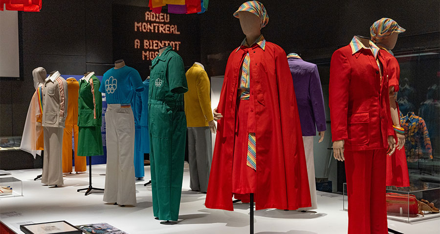
<figcaption markdown>
[Montréal 1976 : une épreuve olympique](https://www.musee-mccord-stewart.ca/fr/expositions/montreal-1976-epreuve-olympique/)
</figcaption>
</figure>

### Concours d'essais audiovisuels

{.w-100}

Le fameux concours d'essais audiovisuels aura encore lieu cette année !
Ce concours est une belle occasion d'obtenir une bourse en argent (jusqu'à 175$) et de bonifier votre portfolio !
 
Date limite de remise : **10 mai 2026**
 
Vous trouverez ici les détails de l'appel à candidatures: [Appel a candidature 2026.pdf](./assets/documents/Appel-a-candidature-2026.pdf)
 
Des questions? Adressez-les à **Lora Boisvert** ou **Thomas O Fredericks** sur Teams.

## Ajustement

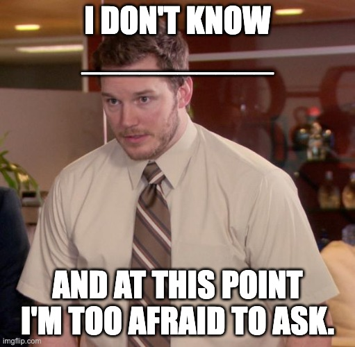{.w-50}

Y a-t-il quelque chose que tout le monde semble comprendre, sauf vous ? Au point où vous n’osez plus demander ce que c’est ou comment ça fonctionne ?

```txt title="Exemples"
- C'est quoi un frame dans Figma ?
- C'est quoi un breakpoint ?
- C'est quoi WASD ou QWERTY ?

- Comment faire un copy / paste.
- Comment zipper un fichier.

- Comment différencier «ça» et «sa» ou encore, quand mettre un «é» ou un «er» pour un verbe.
- Qu'est-ce que la gauche et la droite en politique ?
```

Ça peut être à propos du cours, du programme ou simplement quelque chose la vie en général.

## Formulations à éviter

Les expressions suivantes sont trop vagues, généralisantes ou non justifiées. Il est préférable de les éviter.

<div class="grid" markdown>
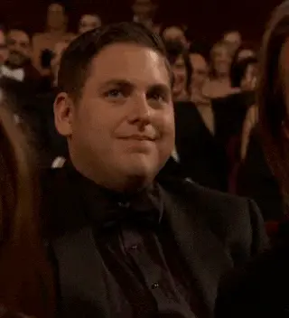

> « Depuis la nuit des temps »<br>
> « Tout le monde sait que »<br>
> « C’est évident que »<br>
> « Grosso modo »
</div>

!!! example "Dans le milieu académique, si on affirme quelque chose, il faut être en mesure de l'accompagner d'une preuve ou d'une justification."

### En Web

L'équivalent en Web et le « En savoir plus ». Beaucoup trop générique, cette mention manque de précision sur l’action. C'est par ailleurs problématique pour l'accessibilité.

Il faut que l'étape après l'action soit **limpide** :

* « À propos du festival »
* « Découvrir le festival »
* « Voir la programmation »
* « Acheter un billet »

## Prototype

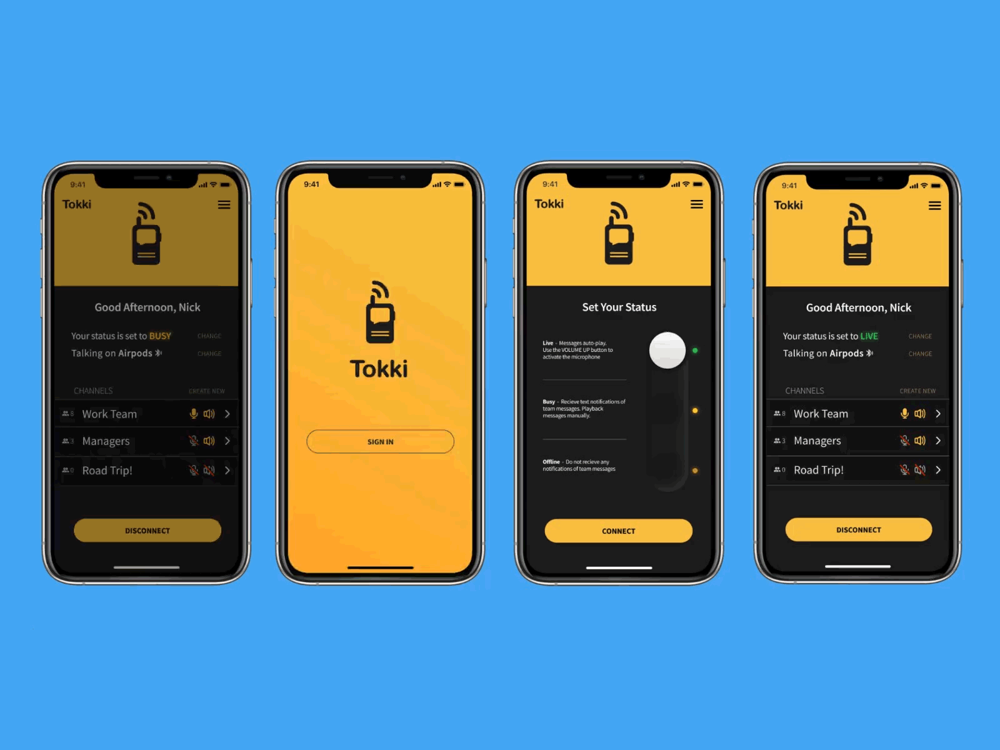{.w-100}

Phases de design pour un projet Web :

1. La maquette filaire (_Wireframe_) (:simple-figma: Sketchy Wireframes)
1. La maquette graphique (_Mockup_)
1. Le prototype

Ces étapes permettent de structurer la conception, de valider les choix progressivement et d’éviter les retours en arrière coûteux en temps et en effort.

**C'est quoi un prototype ?**  

Un prototype, c'est une maquette graphique à laquelle on ajoute des **interactions**. On peut cliquer sur des boutons, naviguer vers d'autres pages, ouvrir un _pop up_, _swiper_ pour changer l'écran, etc.

**À quoi ça sert ?**

- Simuler l'expérience réelle **avant** de coder
- Tester avec de vraies personnes (tests utilisateurs)
- Présenter et valider le design avec un client
- Repérer les problèmes de navigation tôt (avant que ça coûte cher)

!!! example "IA et professionnalisme"

    La génération de design se fera de plus en plus et on aura tendance à passer directement au prototype. 
    
    Toutefois, il reste préférable de conserver l’étape des wireframes (design d’information), afin de clarifier les besoins.

## Parcours utilisateur (_User Flow_)

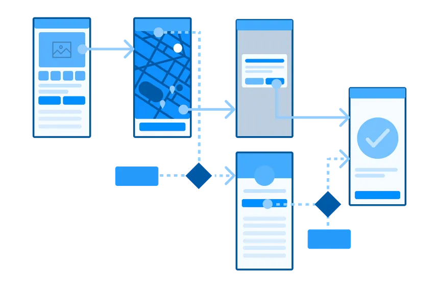

Avant de commencer à connecter des écrans dans Figma, il faut savoir **ce qu'on connecte**.

Un **parcours utilisateur**, c'est la séquence d'étapes qu'une personne suit pour accomplir une tâche dans l'interface.

Dans un site Web existant, il est possible de connaître le parcours utilisateur avec des outils comme Google Analytics.

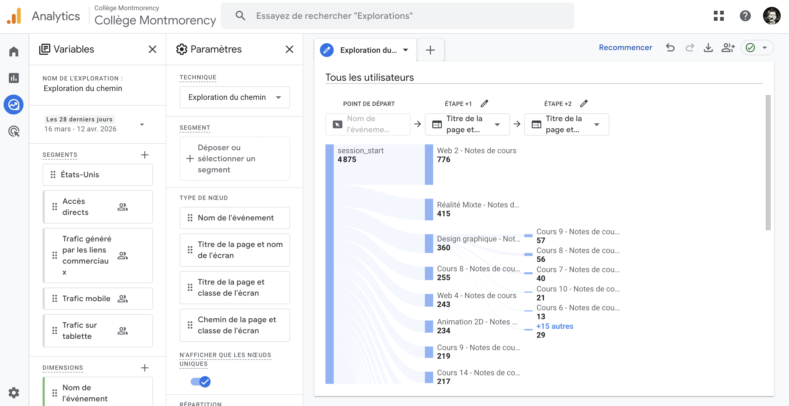{data-zoom-image .w-25}

## Prototypage dans Figma

Dans Figma, le prototypage s'oriente vers Figma Sites. Toutefois, comme celle-ci est encore en _beta_, toutes les options n'y sont pas encore disponibles. Concentrons-nous donc sur la méthode conventionnelle avec l'onglet Prototype.

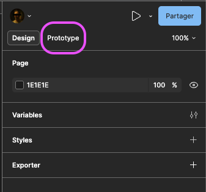

### Lien simple

Pour ajouter un lien qui pointe vers un autre écran (_frame_) :

1. Passez en mode **Prototype**
2. Survolez un élément. Un petit plus encerclé apparaît. Ça s'affiche seulement en mode « Prototype ».
3. Glissez du "plus" vers l'écran de destination

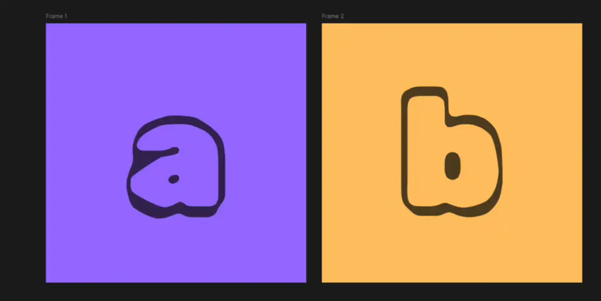{data-zoom-image}

#### Variation manuelle

{data-zoom-image}

### Tester

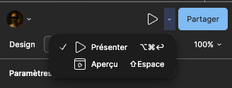{data-zoom-image}

Le mode **Présenter** affiche le prototype en pleine page, tandis que l'aperçu ouvre une fenêtre flottante que l'on peut déplacer. Cette dernière est beaucoup plus pratique lors de la conception. Le mode Présenter est plutôt destiné aux présentations officielles.

Le dernier frame sélectionné détermine le point de départ du test.

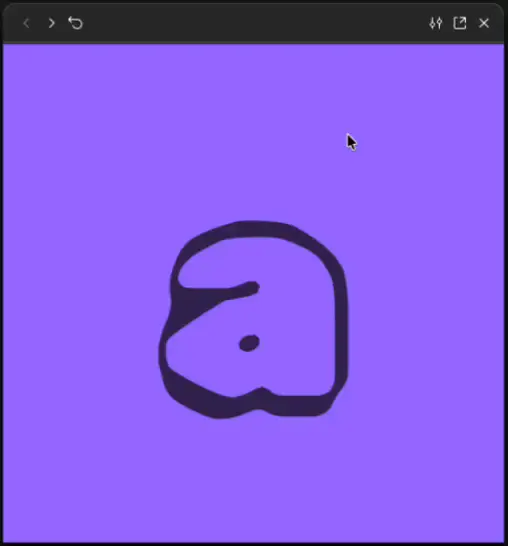{data-zoom-image .w-50}

!!! info "En mode présentation, lorsqu'on clique ailleurs que sur une zone interactive, un encadré bleu apparaît sur les zones cliquables."

#### Mode présentation et responsive

On peut activer l'option responsive, mais il faut avoir pensé le site Web en amont.

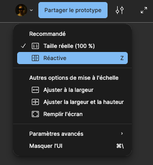{data-zoom-image .w-25}

### Superposition

Un **modal** (ou superposition dans Figma) est un élément qui s'affiche **par-dessus** l'écran actuel sans naviguer vers un nouvel écran. 

<!-- 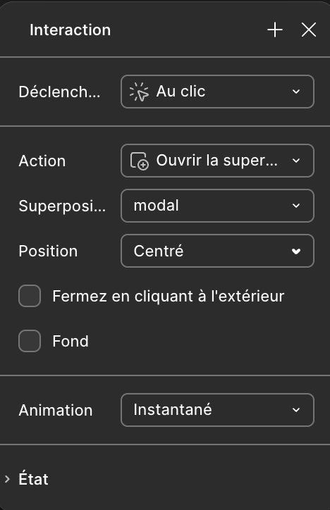{data-zoom-image .w-25} -->

{.h-auto}

Lorsqu'on ajoute une superposition, on peut aussi configurer un « overlay », c'est-à-dire une couleur de fond qui se place entre le site Web et le modal. Cela fait mieux ressortir le modal.
 
#### Fermer une superposition

<!-- 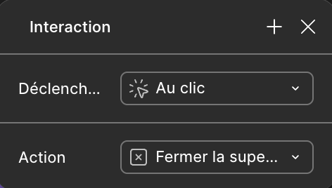{data-zoom-image .w-25} -->

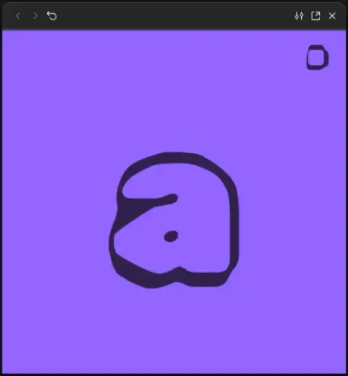{data-zoom-image}

### Délai

Les délais sont assez simples à configurer. Par exemple, un modal qui vient d'être affiché peut disparaître après 1 seconde.

{data-zoom-image}

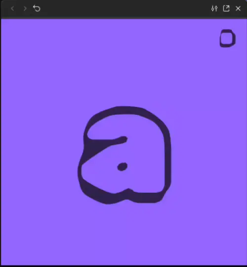{data-zoom-image}

### Scroll

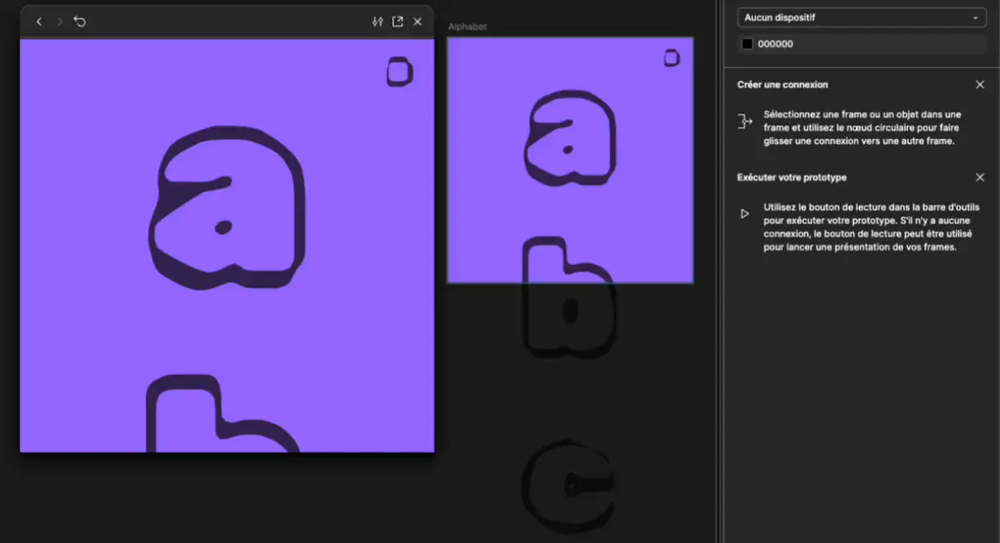{data-zoom-image}

#### Position fixed !

Comme en CSS, on peut reproduire le même effet qu'un `position: fixed;` !

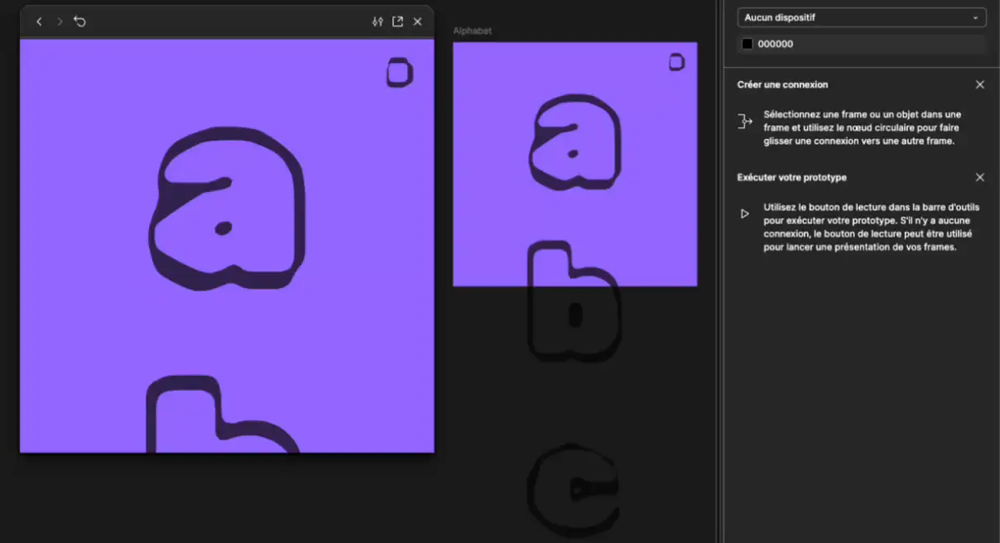{data-zoom-image}

### Variables et états interactifs

Les **variables de prototype** permettent de créer des interfaces qui **réagissent** selon des conditions, sans naviguer vers un nouvel écran.

Voici un exemple :

D'abord, créer une variable de type Nombre.

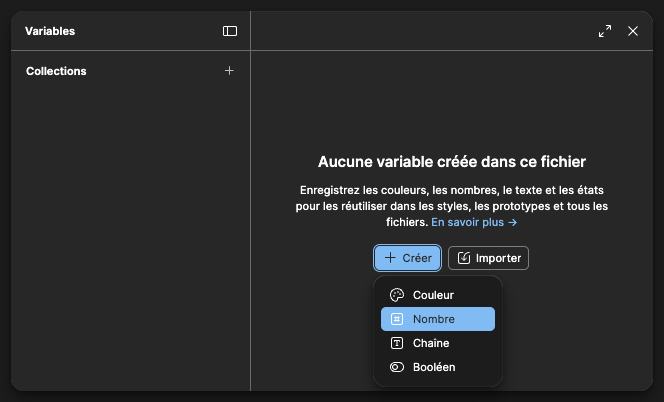{.w-25 data-zoom-image}
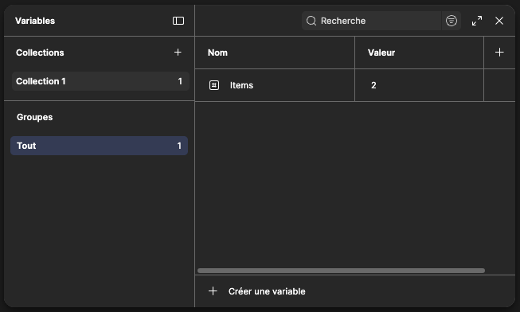{.w-25 data-zoom-image}

Ensuite, ajouter la variable à un champ texte !

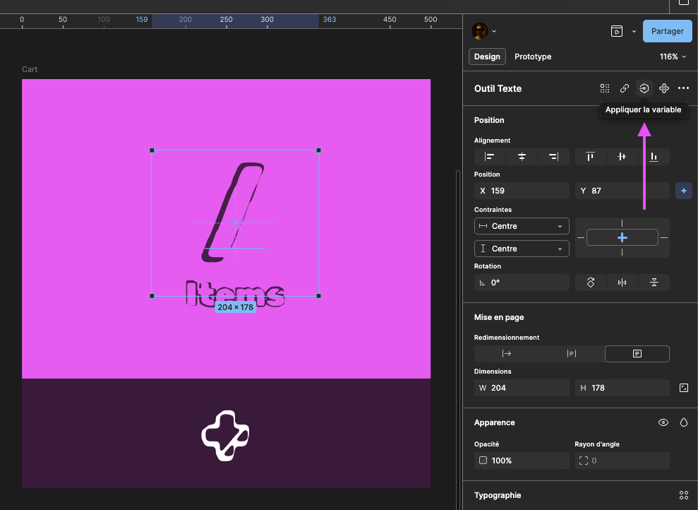{.w-25 data-zoom-image}

Ajouter une interaction au clic d'un autre élément dans la page. Choisir « Définir une variable » et configurer la cible et la valeur. Ici, on incrémente la même valeur de 1.

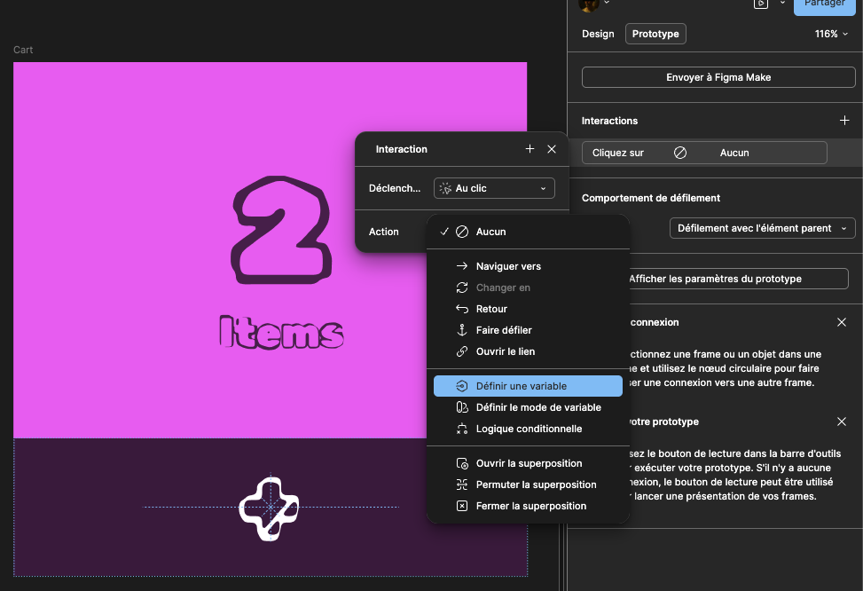{.w-25 data-zoom-image}
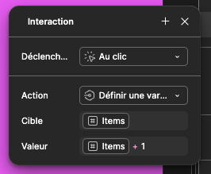{.w-25 data-zoom-image}

Voici le résultat :

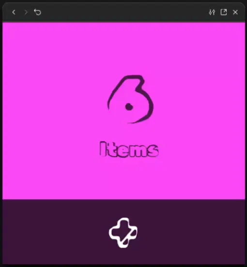{data-zoom-image}

### Conditions

On peut afficher un élément ou une image selon l'état d'une variable booléenne ! Par exemple, si la variable est à `true`, on voit le lien, sinon il est caché.

Voici comment faire.

D'abord, on crée une variable booléenne (ex : `patate`).

Ensuite, on sélectionne l'élément en question et on fait un clic droit sur le petit œil dans la section Apparence. On sélectionne la variable `patate`.

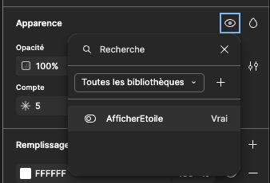{.w-25 data-zoom-image}

Maintenant, quand une action est faite, par exemple un clic sur un bouton, on peut effectuer une condition. Voici un exemple de logique :

- SI `patate` est égale à `FALSE`
- Définir `patate` sur `TRUE`

Dans la section autre (équivalent de `else`), on pourrait ajouter 

- Définir `patate` sur `FALSE`

Ainsi, on vient de créer un `toggle` !

!!! example "Exemple un peu plus complet"

    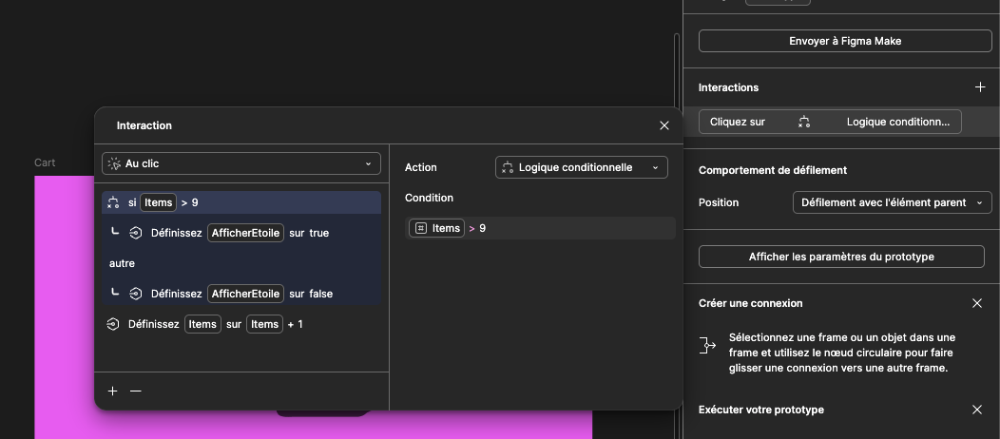{data-zoom-image}

## Exercices

<div class="grid grid-1-2" markdown>
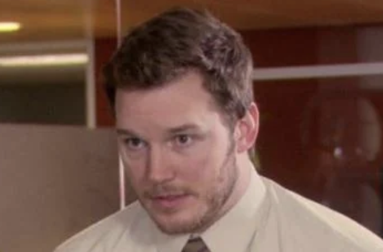

[Wooclap](https://app.wooclap.com/ANDYMEME?from=instruction-slide){.stretched-link}<br>Code : ANDYMEME
</div>

<div class="grid grid-1-2" markdown>
  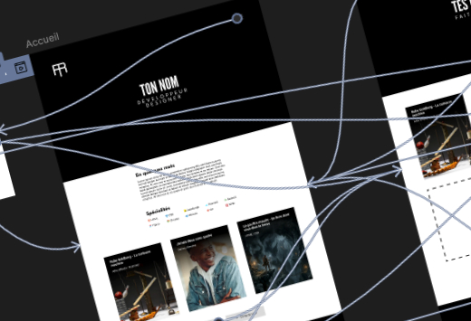

  <small>Exercice - Figma</small><br>
  **[Mon premier prototype](./activite/exercice/prototype/index.md){.stretched-link .back}**
</div>

<div class="grid grid-1-2" markdown>
  

  <small>Exercice - Figma</small><br>
  **[C'est logique !](./activite/exercice/lock/index.md){.stretched-link .back}**
</div>

## Devoir

<div class="grid grid-1-2" markdown>
  

  <small>Devoir - Figma</small><br>
  **[Refonte d'un site Web](./activite/devoir/refonte/index.md){.stretched-link .back}**
</div>

[STOP]

Note : Probablement traiter la notion de prototype avant Figma Sites afin que la création d'une url soit une nouveauté intéressante.
Parler du prototype ensuite est un léger pas en arrière.
La notion de prototype devrait s'ajouter par dessus Figma Sites. C'est plus logique ainsi. C'est d'ailleurs ce que Figma semble suggérer.

Faire un jeu avec 
