# Cours 12 | Animations

{.w-100}

## Calendrier 📅

|Groupes du mardi | Calendrier |
|---|---|
| Semaine 12 | 21 avril |
| Semaine 13 | 28 avril |
| Semaine 14 (cours libre) | 5 mai |
| Semaine 15 (TP + Oral) | 12 mai |

|Groupe du mercredi | Calendrier |
|---|---|
| Semaine 11 | 22 avril |
| Semaine 12 | 29 avril |
| Semaine 13 | 6 mai |
| Semaine 14 (cours libre) | ❗️ 14 mai  |
| Semaine 15 (TP + Oral) | 15 mai |

## Savais-tu qu'avec Figma on peut facilement ...

Ces fonctionnalités utilisent des crédits d'intelligence artificiel que vous avez gratuitement avec votre compte éducationnel. Profitez-en !!!

Pour connaître son solde, cliquer `Figma > Solde d'IA`.

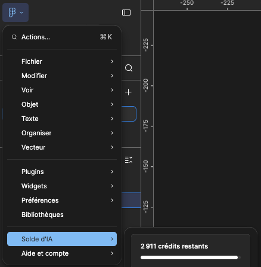{.w-10 data-zoom-image}

### retirer un fond uni

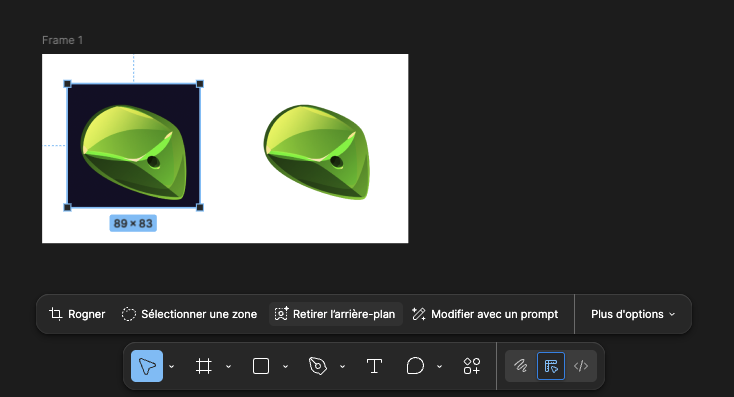{data-zoom-image}

### retirer un élément spécifique

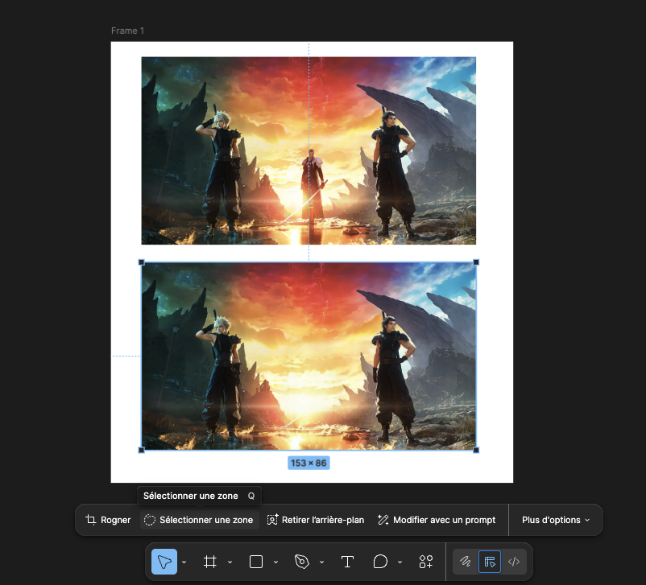{data-zoom-image}

### augmenter la résolution

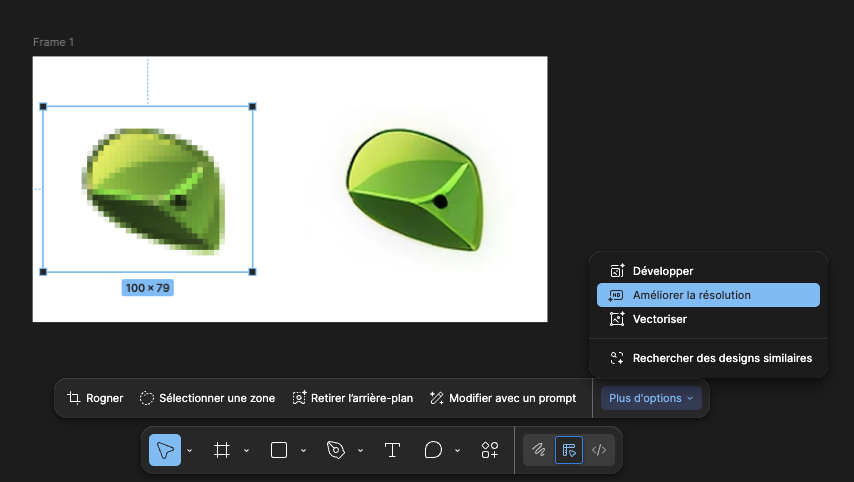{data-zoom-image}

### ajouter de l'image

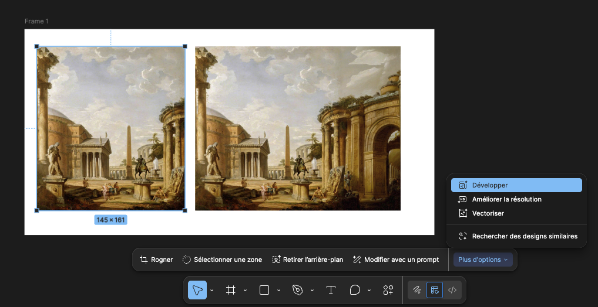{data-zoom-image}

### vectorizer une image

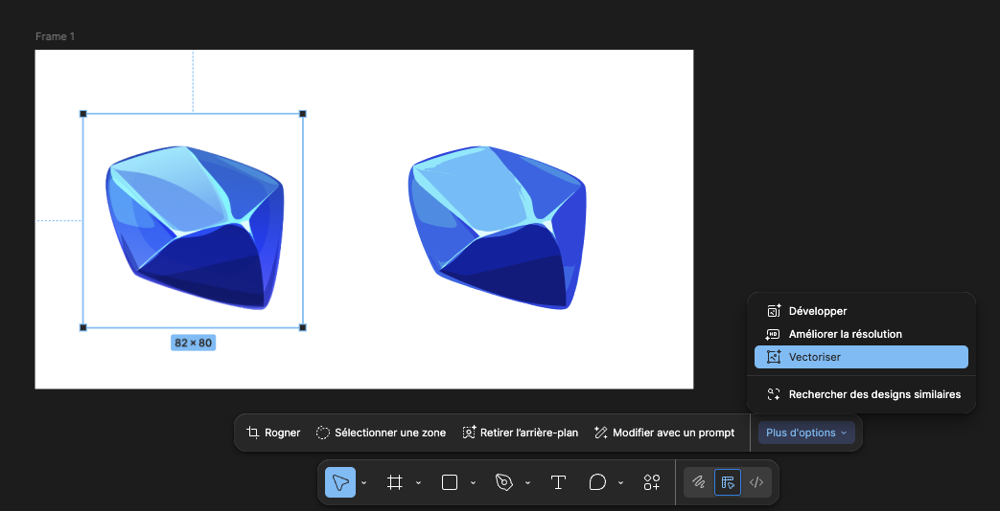{data-zoom-image}

## Gif animé

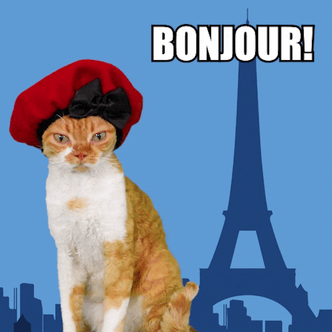{.w-33}

On peut ajouter des gif animés dans Figma. Ils sont visibles dans l'aperçu d'un prototype.

## Animations Figma

[Figma for Edu: Smart animate with Figma (Community)](https://www.figma.com/community/file/1530633211952065600/figma-for-edu-smart-animate-with-figma?q_id=6578031d-f87b-42b9-9e45-b1d9a12a1fd0)

<!-- @note : Ce cours vise à enseigner la notion d'animations dans Figma. -->

<!-- https://www.youtube.com/watch?v=oOJ5StJr-pU
https://www.youtube.com/watch?v=7rPa1GvX4Do&t=8s -->

## Types d'animation

### Transitions entre écrans

Surtout utilisé en mobile. C'est l'animation qui accompagne le **changement de contexte** dans une interface.

Sert surtout à maintenir la **continuité spatiale** (l'utilisateur comprend où il va).

Souvent ça suit l'interaction. Par exemple, un swipe vers la gauche anime la page vers la gauche.

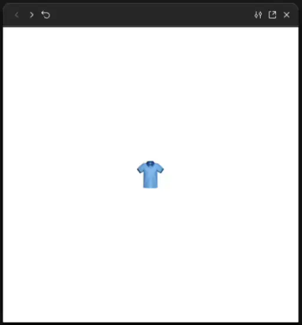{data-zoom-image}

### Animation automatique (_Smart Animate_)

Figma compare deux frames, trouve les éléments qui portent le **même nom** et anime automatiquement la différence de leurs propriétés !

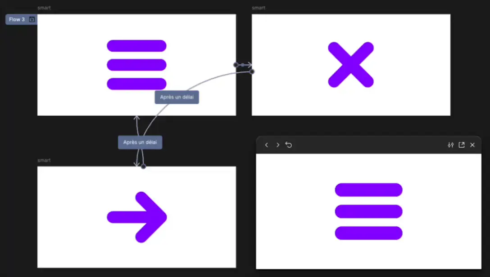{data-zoom-image}

!!! example "Menu hamberger"

!!! example "Animation de chargement"

#### Avec interaction

Une micro-interaction est une petite animation déclenchée par une **action précise** de l'utilisateur. 

Par exemple une animation au hover de la souris. Simplement une rétroaction visuel pour comprendre l'interaction.

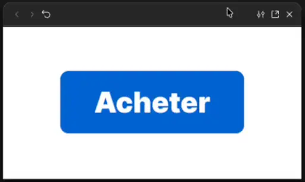{data-zoom-image .w-33}

## Lissage

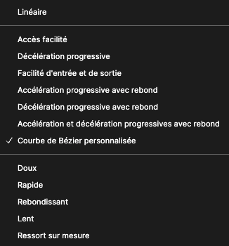{data-zoom-image}

## Devoir

  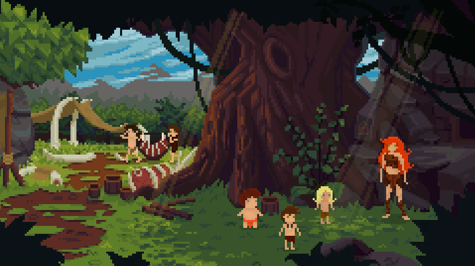

  <small>Devoir - Figma</small> 
  **[Figmorency](./activite/devoir/figmorency/index.md){.stretched-link .back}**

