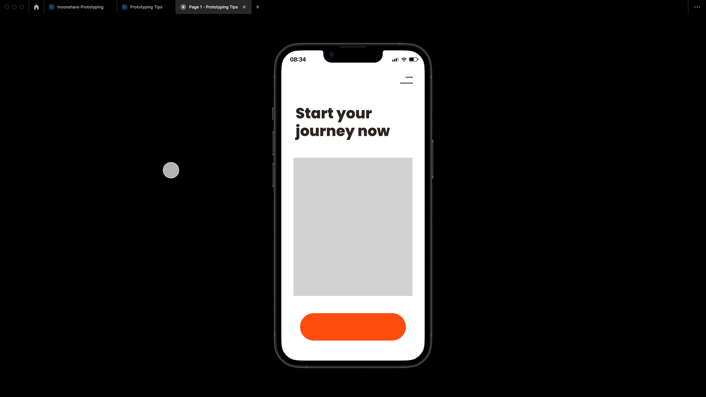

# Cours 12 | A/B

[STOP]

## Retour sur le Devoir 04

{.w-100}
<!-- 
@note : Le devoir 04 est remis la veille de ce cours
@note : Ce cours vise à enseigner le Prototype ainsi que la notion de test A/B. Intrduction aux animation Figma également.

https://www.youtube.com/watch?v=k1iwiHJrAWI&list=PLx-zZQ15gdAoBlqqy_kv0t4z07YYyGIZi -->

## Le prototype comme outil de validation

Au cours 11, on a appris à **construire** un prototype. Aujourd'hui, on apprend à s'en **servir** : valider des décisions de design avant d'investir du temps dans le développement.

Un prototype n'est pas une fin en soi. C'est un **outil de conversation** — avec un client, avec un utilisateur, avec soi-même.

!!! example "Analogie : la maquette d'architecte 🏗️"
    Un architecte ne construit pas un immeuble pour voir si les appartements sont trop petits. Il fait une maquette. Le prototype en design, c'est pareil : tester vite, échouer vite, corriger vite.

---

## Tests utilisateurs (_User Testing_)

### Pourquoi tester ?

<figure markdown>
{data-zoom-image}
<figcaption>L'écart entre ce que le designer pense et ce que l'utilisateur comprend</figcaption>
</figure>

Le problème classique en design : **vous n'êtes pas votre utilisateur**.

Vous connaissez trop bien votre propre interface. Vous savez où cliquer, ce que les icônes veulent dire, pourquoi tel bouton est là. Votre utilisateur, lui, arrive sans cette connaissance.

Les tests utilisateurs servent à combler cet écart **avant** le code.

!!! info "Le nombre magique : 5 utilisateurs"
    Des recherches de Nielsen Norman Group montrent que **5 utilisateurs** suffisent à identifier ~85% des problèmes d'utilisabilité d'une interface. Pas besoin de recruter 100 personnes.

### Comment mener un test simple

**Avant le test :**
- Préparez un **scénario** : "Tu viens d'ouvrir l'app. Trouve comment changer ton mot de passe."
- Ne donnez **aucune instruction de navigation** (on teste l'interface, pas la mémoire)
- Assurez-vous que le prototype couvre le parcours testé de bout en bout

**Pendant le test :**
- Demandez à la personne de **penser à voix haute** : "Dis-moi ce que tu regardes, ce que tu t'apprêtes à faire."
- Ne la guidez **jamais**. Si elle est bloquée, notez-le — c'est exactement ce qu'on cherche.
- Observez : où hésite-t-elle ? Où clique-t-elle d'abord ? Qu'est-ce qu'elle cherche des yeux ?

**Après le test :**
- Notez les points de friction (là où la personne a hésité, raté un clic, dit "huh ?")
- Regroupez les problèmes par fréquence et par gravité
- Priorisez : qu'est-ce qui **bloque** vs qu'est-ce qui **agace** ?

| Gravité | Description | Priorité |
| --- | --- | --- |
| 🔴 **Bloquant** | L'utilisateur ne peut pas accomplir la tâche | Corriger immédiatement |
| 🟠 **Majeur** | La tâche est accomplie avec difficulté | Corriger avant lancement |
| 🟡 **Mineur** | Irritant, mais la tâche est accomplie | Corriger si possible |
| 🟢 **Cosmétique** | Préférence subjective | Optionnel |

---

## Test A/B

### C'est quoi ?

{data-zoom-image .w-100}

Un test A/B consiste à **comparer deux versions** d'un même élément pour déterminer laquelle performe mieux selon un objectif précis (plus de clics, moins d'abandons, meilleur taux de conversion, etc.).

- **Version A** : la version actuelle (ou la première proposition)
- **Version B** : la variante à tester (un seul changement à la fois)

!!! warning "Un seul changement à la fois"
    Si vous changez simultanément la couleur du bouton, son texte et sa position, vous ne saurez jamais **lequel** de ces changements a fait la différence. En A/B testing, on isole chaque variable.

### Exemples de questions de test A/B

| Question | Version A | Version B |
| --- | --- | --- |
| Quel libellé de bouton génère plus de clics ? | "S'inscrire" | "Commencer gratuitement" |
| Quelle mise en page retient plus longtemps ? | Image à gauche | Image à droite |
| Quelle couleur d'alerte est plus remarquée ? | Rouge | Orange |
| Quel placement du CTA performe mieux ? | En haut de page | Après le texte de présentation |

### A/B testing en prototype Figma

Dans Figma, vous pouvez simuler un test A/B en créant **deux parcours parallèles** et en testant chaque version avec un groupe de personnes différent.

<figure markdown>
{data-zoom-image}
<figcaption>Deux flows distincts dans un même fichier Figma pour un test A/B</figcaption>
</figure>

**Étapes :**

1. Dupliquez le frame à tester
2. Modifiez **un seul élément** dans la version B
3. Créez deux starting frames distincts (A et B)
4. Partagez le lien A à un groupe, le lien B à l'autre
5. Observez et comparez les résultats

!!! tip "En contexte professionnel"
    Les vrais tests A/B en production se font avec des outils comme Google Optimize, VWO ou des solutions maison qui mesurent automatiquement les clics, le temps passé et les conversions. Le prototype Figma permet de valider l'hypothèse **avant** d'implémenter quoi que ce soit.

---

## Travail par itérations

Le design n'est jamais terminé du premier coup. Le processus professionnel fonctionne par **cycles d'itération**.

<figure markdown>
{data-zoom-image .w-75}
<figcaption>Le cycle d'itération en design</figcaption>
</figure>

```
Proposition → Feedback → Révision → Nouvelle proposition → ...
```

### Les commentaires dans Figma

<div class="grid grid-1-2" markdown>
{data-zoom-image}

<div markdown>
Figma intègre un système de commentaires directement sur le fichier.

**Pour laisser un commentaire :**
- Mode commentaire : ++c++
- Cliquez sur l'élément concerné
- Rédigez votre note
- Mentionnez un collaborateur avec `@nom`

**Pour résoudre un commentaire :**
- Cliquez sur ✓ **Resolve** une fois la correction apportée
</div>
</div>

!!! info "Bonne pratique"
    Un bon commentaire de révision précise **quoi** changer et **pourquoi**, pas juste "j'aime pas ça". Ex. : *"Le contraste texte/fond ne passe pas le ratio WCAG AA — essaie une teinte plus foncée."*

### Versions et historique

Figma sauvegarde automatiquement l'historique des versions. Vous pouvez nommer des versions clés :

**Menu principal → File → Save to Version History**

Nommez vos versions avec une convention claire :
- `v1.0 — Première proposition`
- `v1.1 — Corrections retour client`
- `v2.0 — Refonte navigation`

---

## _Smart Animate_ — Introduction

_Smart Animate_ est la fonctionnalité de transition la plus puissante de Figma. On l'a effleuré au cours 11 ; on le met vraiment en pratique ici.

### Le principe

Figma compare **automatiquement** deux frames et anime les différences de propriétés (position, taille, rotation, opacité, couleur) pour chaque élément **portant le même nom**.

<figure markdown>
{data-zoom-image}
<figcaption>Smart Animate entre deux états d'une carte</figcaption>
</figure>

### Règle fondamentale

!!! danger "Le nom des calques, c'est sacré"
    Pour que Smart Animate fonctionne, les éléments doivent porter **exactement le même nom** dans les deux frames. Un espace en trop, une majuscule différente, et Figma les traite comme deux éléments distincts — pas d'animation.

### Cas d'usage typiques

| Interaction | Ce que fait Smart Animate |
| --- | --- |
| Bouton au survol | Couleur de fond + légère montée |
| Carte qui s'expand | Hauteur augmente, nouveau contenu apparaît |
| Menu qui s'ouvre | Items glissent vers le bas |
| Onglet actif | Indicateur de soulignement se déplace |
| Loader → Résultat | Transition fluide entre deux états de page |

### Exercice de base : le bouton animé

**Objectif** : créer un bouton qui réagit visuellement au survol.

1. Créez un composant `Bouton/Default` avec fond `#5B5EF4` et texte blanc
2. Dupliquez-le → renommez `Bouton/Hover`, changez le fond à `#3D40D6` et ajoutez une légère ombre
3. Dans le composant `Bouton/Default`, ajoutez une interaction :
   - Déclencheur : **While Hovering**
   - Action : **Change to** `Bouton/Hover`
   - Transition : **Smart Animate**, Ease Out, 200ms
4. Testez en prévisualisation

---

## _Handoff_ — Passer le design au développement

{.w-100}

Une fois le prototype validé, il faut **transmettre le design à l'équipe de développement**. Ce moment s'appelle le _handoff_.

### Le mode Développement (_Dev Mode_)

Figma propose un **mode Dev** (icône `</>` en haut à droite) qui permet aux développeurs de :

- Inspecter chaque élément et récupérer ses propriétés exactes (taille, couleur, espacement, typographie)
- Copier automatiquement le code CSS, iOS ou Android d'un élément
- Voir quels composants sont liés à la bibliothèque
- Naviguer dans les assets exportables

<figure markdown>
{data-zoom-image}
<figcaption>Le panneau d'inspection en mode Dev</figcaption>
</figure>

### Ce que le développeur a besoin de trouver

Pour qu'un handoff se passe bien, votre fichier Figma doit être irréprochable sur ces points :

| Élément | Ce qu'on attend |
| --- | --- |
| **Calques** | Nommés clairement, groupés logiquement |
| **Couleurs** | Toutes dans des variables ou styles |
| **Typographie** | Tous les styles de texte définis |
| **Espacements** | Réguliers et cohérents (multiples de 4/8) |
| **Assets** | Images et icônes marquées comme exportables |
| **Composants** | Tous les états documentés |
| **Prototype** | Flow complet et fonctionnel |

!!! tip "Un fichier bien nommé, c'est du respect pour le développeur"
    Et pour vous dans six mois, quand vous devrez rouvrir ce fichier.

### Exporter les assets

Pour marquer un élément comme exportable :

1. Sélectionnez l'élément
2. Dans le panneau de droite, cliquez sur **+** dans la section *Export*
3. Choisissez le format (PNG, SVG, PDF, WebP...)
4. Définissez la résolution (1x, 2x, 3x pour le mobile)

!!! info "SVG pour les icônes et vecteurs, PNG/WebP pour les photos"
    Les icônes et illustrations en SVG restent nettes à toutes les tailles. Les photos en PNG ou WebP gardent leurs dégradés.

---

## Checklist avant remise du projet final 🧠

À partir du cours 12, vous commencez à travailler sur votre **projet final** (prototype d'app mobile). Voici ce que votre fichier devrait démontrer :

**Structure du fichier**
- [ ] Pages nommées clairement (Fondations, Composants, Maquettes, Prototype)
- [ ] Frames nommées avec le nom de l'écran (pas "Frame 1")
- [ ] Calques organisés et nommés

**Design System**
- [ ] Variables de couleur définies
- [ ] Styles de texte créés
- [ ] Composants principaux (boutons, inputs, cartes) avec variantes

**Prototype**
- [ ] Flow complet de bout en bout
- [ ] Au moins une transition Smart Animate
- [ ] Au moins un overlay fonctionnel (modale ou menu)
- [ ] Frame de départ défini
- [ ] Lien de partage fonctionnel

---

## Exercices

<div class="grid grid-1-2" markdown>
  

  <small>Exercice - Figma</small><br>
  **[Carte expandable](./activite/exercice/smart-animate-card/index.md){.stretched-link .back}**
</div>

<div class="grid grid-1-2" markdown>
  

  <small>Exercice - Figma</small><br>
  **[Test A/B](./activite/exercice/ab-test/index.md){.stretched-link .back}**
</div>
