# Cours 13 | Figma et IA

## Figma Make

Pour le moment, Figma Make permet de générer de petites applications à partir de commandes textuelles. C’est pratique pour explorer des idées ou obtenir rapidement un premier résultat.

Toutefois, le contenu généré est encore très générique et ne peut pas être édité directement dans l’interface. Il faut copier le design généré dans le presse-papiers, puis le coller dans un fichier de type Design.

Le résultat n’est pas nécessairement bien structuré, ni responsive, ni fonctionnel en prototype, mais il constitue une bonne base de départ.

## Figma Weave

<!-- https://civitai.com/ -->
<!-- https://app.weavy.ai/flow/YdTBfNeePQ6uURxVGsjVhj -->
<!-- https://app.weavy.ai/flow/fFAg4CfeFnl3ZKBLDV3NmX -->
<!-- https://app.weavy.ai/flow/lmQ3o3xBQw336nCQx6ee -->

{.h-auto .w-100}

[Figma Weave](https://weave.figma.com/) est une plateforme de génération et d'édition de médias basée sur l'IA.

Son système « _node-based_ » combine plusieurs modèles d'IA avec des outils d'édition qui permettent d'explorer et de raffiner des visuels sur un canvas. On peut entre autres faire du : 

* Text to Image
* Image to Image
* Image to 3D
* Image to video
* etc.

### Est-ce gratuit ?

Non, malheureusement 😅

La version non payante vient avec seulement **150 crédits par mois**, ce qui est relativement peu si on ne fait pas attention.

### Comment ça marche ?

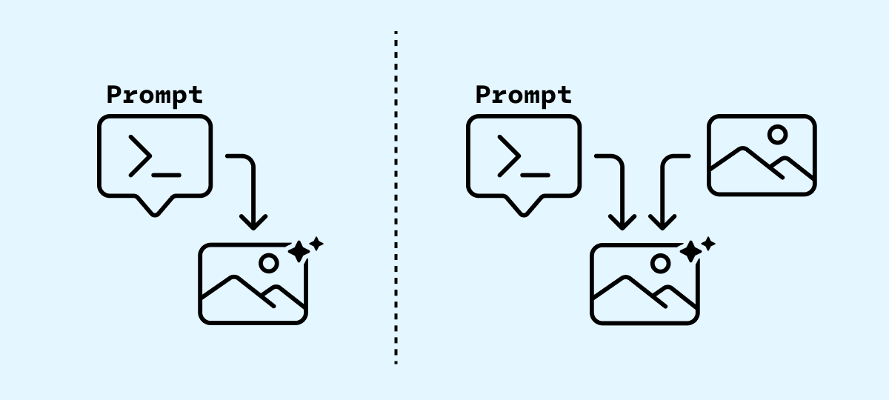{data-zoom-image}

Tout d'abord, pour créer de nouvelles images en intelligence artificielle, on se base sur une commande textuelle (_prompt_) unique ou accompagnée d'une image de référence.

Le _prompt_ peut parfois être écrit en français, mais il est recommandé d'utiliser l'anglais pour gagner en efficience.

#### Modèles

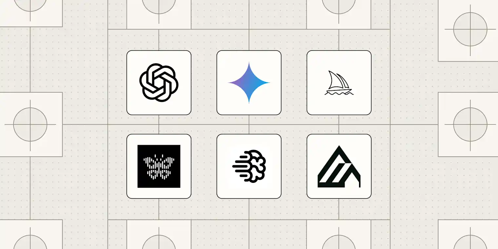{data-zoom-image .w-50}

Il existe plusieurs modèles de génération d'image, mais ils ne sont pas tous égaux. Certains demandent plus de ressources pour un résultat plus joli, ils coûtent plus cher en crédits.

!!! example "Modèles à utiliser dans Figma Weave"

    Le modèle rapide et pas cher est **Flux Fast**. Il permet de faire plein de petits tests sans trop vider sa banque de crédits.

    Quand on est prêt à faire quelque chose plus de qualité, on peut alors utiliser le modèle Nano Banana 2 (Google). Celui-ci permet entre autres d'inclure une image de référence.

### Text to Image

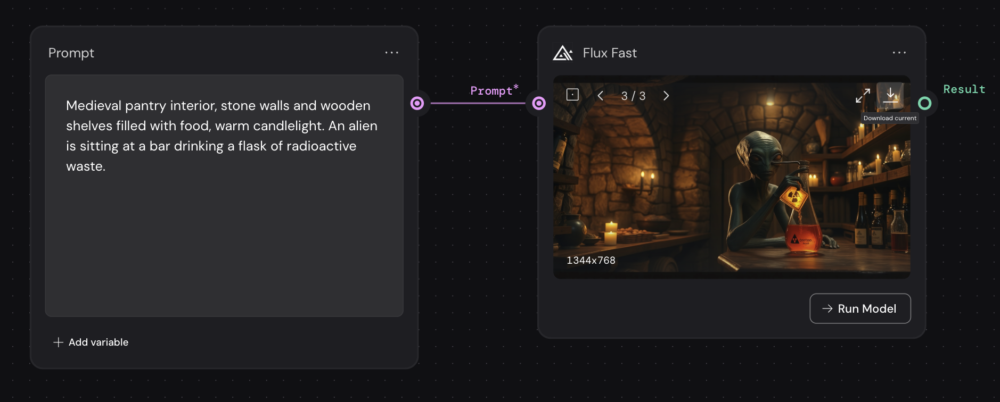{data-zoom-image}

Si vous n'êtes pas certain de votre _prompt_, une méthode assez simple mais efficace consiste à demander à un LLM de construire un prompt pour la génération d'une image par IA.

Utilisez le modèle **Flux Fast** pour cette étape.

Quand on est prêt à générer l'image, on doit cliquer sur le bouton «Run Model» dans le node «Flux Fast».

### Générer par itération

N'essayez pas de tout générer d'un coup !

En effet, nous allons voir comment générer progressivement une scène à partir de différentes itérations. 

#### Générer la base

Commencez par le fond de la scène. On pourra ensuite y ajouter ou y modifier des éléments.

<figure markdown>
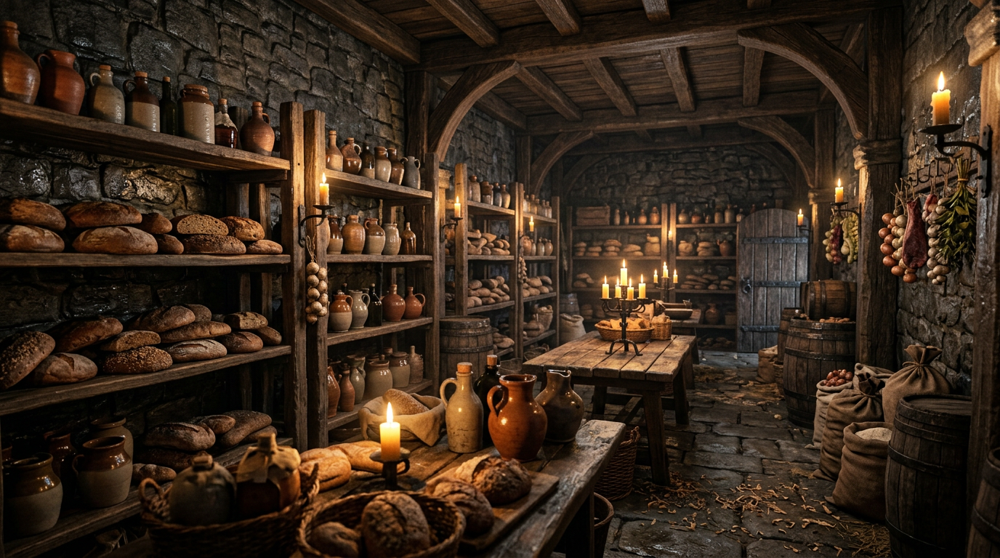{data-zoom-image}

<figcaption>Prompt : Interior of a massive castle pantry, fantasy medieval style. Walls of damp grey stone, rustic timber racks filled with rustic bread and ceramic jugs. Warm, moody candlelight flickering against the cold stone. Intricate textures, sharp focus, volumetric lighting, photorealistic.</figcaption>
</figure>

#### Générer des petites altérations

Une fois l'image de base générée, on peut modifier celle-ci comme on veut. 

À l'aide d'un nouveau _prompt_, ajoutons un personnage dans l'image sans altérer l'image originale.

Pour ce faire, on doit utiliser le modèle «Nano Banana 2», car il peut recevoir une image de référence.

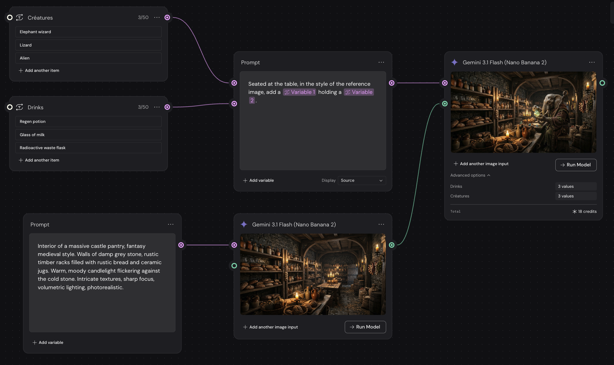{data-zoom-image}

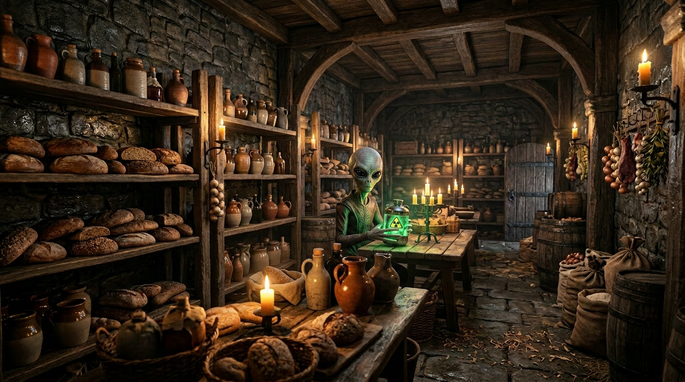{data-zoom-image .w-20}
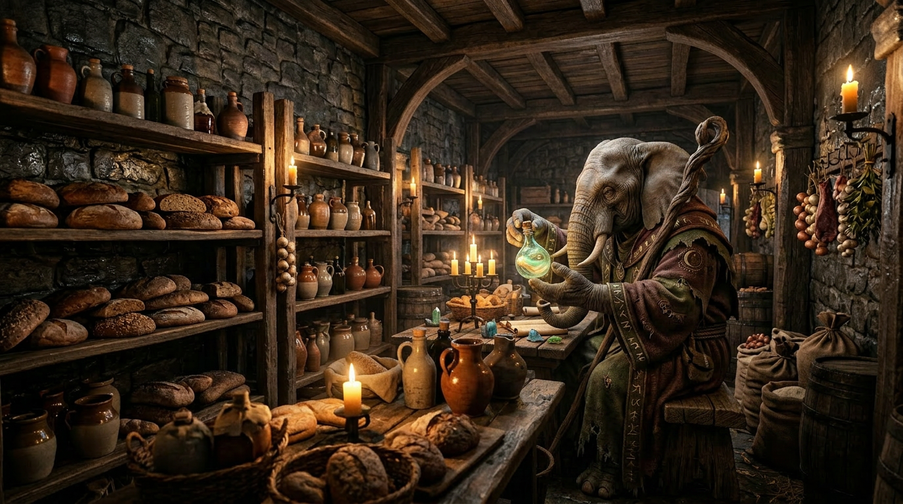{data-zoom-image .w-20}
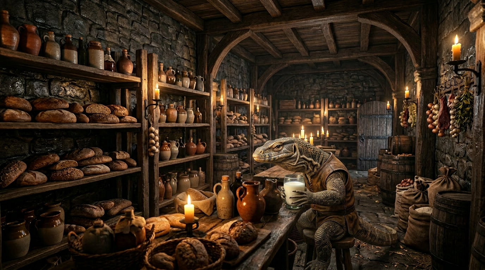{data-zoom-image .w-20}

!!! note "Variables"

    Vous avez sans doute remarqué que le prompt contient des variables. Elles sont facultatives, mais sachez qu'elles peuvent être très utile pour générer plusieurs images d'un seul coup.

#### Générer des changements plus importants

Retirons toutes les sources de lumière pour faire comme si on avait fermé la lumière de la pièce ! 

Même méthode 😅, c'est juste qu'ici, on introduit le node « Compare » afin de voir les changements d'une scène à l'autre. 

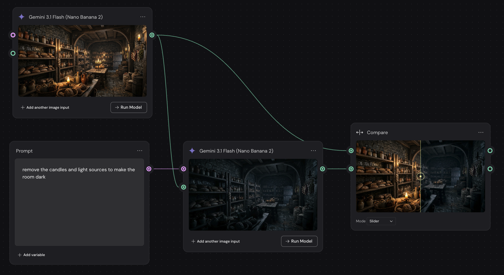{data-zoom-image}

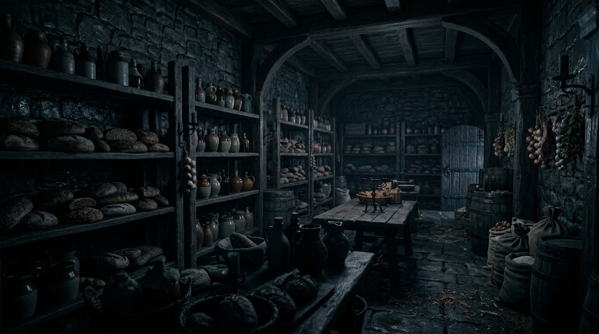{data-zoom-image}

### Inpainting

Parfois un seul prompt peut avoir du mal à modifier quelque chose de précis.

On peut orienter le modèle de manière très précise avec le node « Painter ». Cette technique s'appelle InPainting. Elle consiste à colorier la portion de l'image qui doit être modifiée et on indique dans un _prompt_ par quoi cette portion doit être remplacée.

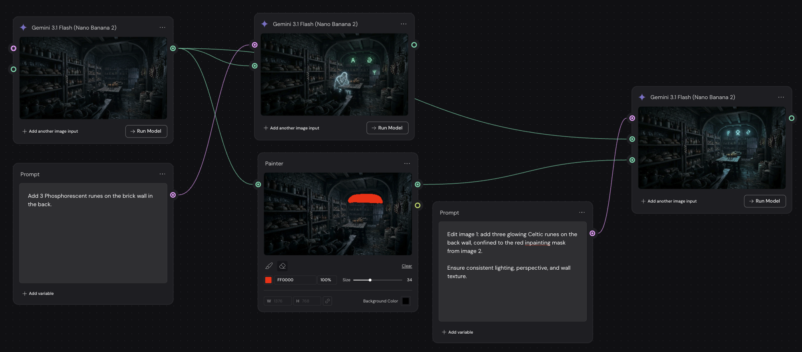{data-zoom-image}

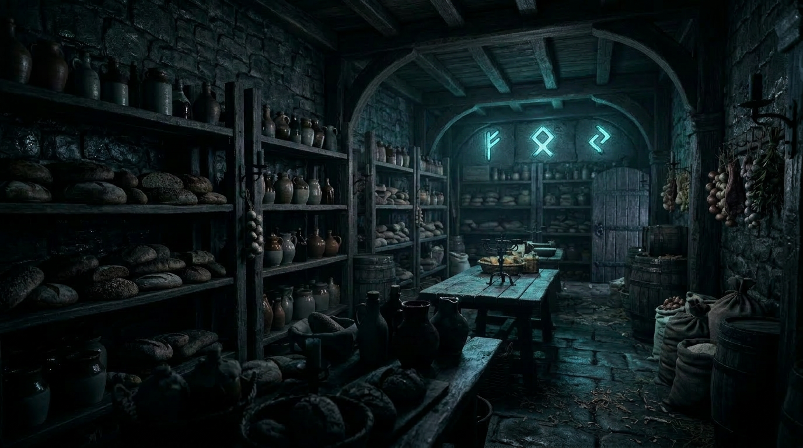{data-zoom-image}

## Partager son prototype

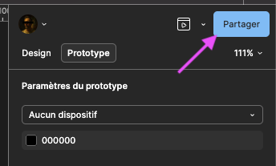{data-zoom-image}

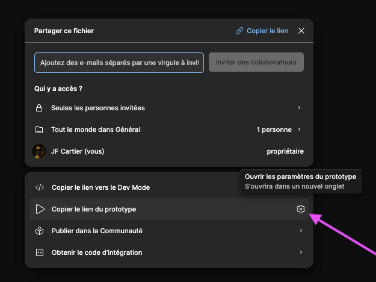{data-zoom-image}

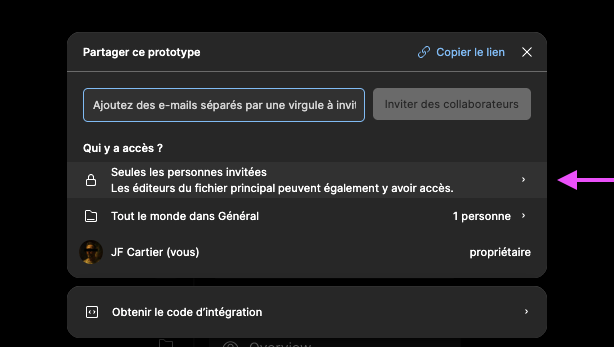{data-zoom-image}

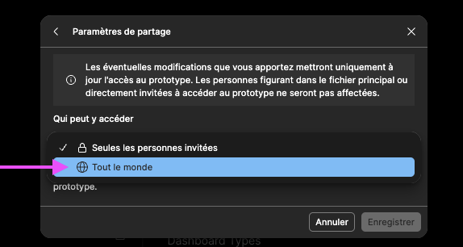{data-zoom-image}

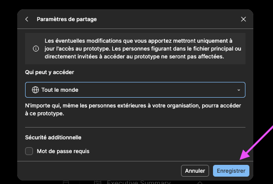{data-zoom-image}

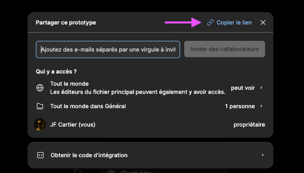{data-zoom-image}

## Devoir

  

  <small>Devoir - Figma</small> 
  **[Continuer Figmorency](./activite/devoir/figmorency/index.md){.stretched-link .back}**

