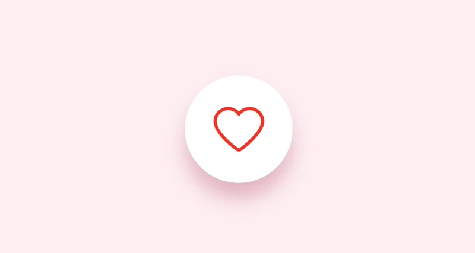

# Cours 13

[STOP]

{.w-100}

<!-- @note : Ce cours vise à enseigner la notion d'animations dans Figma. -->

https://www.youtube.com/watch?v=oOJ5StJr-pU
https://www.youtube.com/watch?v=7rPa1GvX4Do&t=8s

## L'animation, c'est pas de la décoration

Avant de plonger dans les outils, il faut démystifier ce que l'animation fait dans une interface.

Une animation bien conçue n'est **pas là pour impressionner**. Elle est là pour **communiquer**.

> Une interface qui bouge sans raison fatigue l'utilisateur.  
> Une interface qui bouge pour une raison le guide.

### Ce que l'animation communique

| Animation | Message implicite |
| --- | --- |
| Un élément glisse depuis le bas | « Ce contenu vient d'apparaître » |
| Un bouton rebondit légèrement au clic | « J'ai bien reçu ton action » |
| Une page se dissout en fondu | « On passe à autre chose » |
| Un élément tremble | « Il y a une erreur » |
| Un spinner tourne | « Attends, je traite ta demande » |
| Un élément se déplace latéralement | « On avance dans un flux séquentiel » |

!!! example "Analogie : la signalisation routière 🚦"
    Un feu de circulation ne change pas de couleur pour être beau. Il change pour dire « arrête » ou « avance ». L'animation en UI, c'est la même chose : chaque mouvement a une signification fonctionnelle.

---

## Les trois types d'animation en UI

### 1. Micro-interactions

{data-zoom-image .w-100}

**C'est quoi ?**  
Une micro-interaction est une petite animation déclenchée par une **action précise** de l'utilisateur. Elle dure rarement plus de 300ms.

**Son rôle** :
- Confirmer qu'une action a été reçue (_feedback_)
- Indiquer un changement d'état
- Guider subtilement vers l'action suivante

**Exemples concrets** :

**Like** 🤍 → ❤️  
L'icône cœur grossit brièvement avant de rester remplie. On comprend immédiatement que l'action a fonctionné.

**Toggle** ○ → ●  
L'indicateur glisse doucement. L'animation montre que l'état a basculé, pas juste que la couleur a changé.

**Bouton de chargement**  
Le texte "Envoyer" devient un spinner, puis une coche. Trois états, trois animations, zéro ambiguïté.

!!! info "Les 4 composantes d'une micro-interaction (Dan Saffer)"
    1. **Déclencheur** — Qu'est-ce qui lance l'animation ? (clic, survol, chargement)
    2. **Règles** — Qu'est-ce qui se passe exactement ?
    3. **Feedback** — Comment l'interface répond visuellement ?
    4. **Boucles et modes** — Est-ce que ça se répète ? Est-ce que ça s'arrête ?

---

### 2. Transitions entre écrans

{data-zoom-image .w-100}

**C'est quoi ?**  
L'animation qui accompagne le **changement de contexte** dans une interface : aller d'une page à une autre, ouvrir un panneau, revenir en arrière.

**Son rôle** :
- Maintenir la **continuité spatiale** (l'utilisateur comprend où il va)
- Indiquer la **direction** du flow (avancer vs revenir)
- Réduire la désorientation lors des changements brusques

### Logique directionnelle

La direction de la transition doit correspondre à la **logique de navigation** :

| Geste / Action | Direction attendue |
| --- | --- |
| Aller vers une sous-page | Glisse vers la **gauche** |
| Revenir en arrière | Glisse vers la **droite** |
| Ouvrir un panneau inférieur | Monte depuis le **bas** |
| Fermer le panneau | Redescend vers le **bas** |
| Ouvrir une modale | Fondu + légère montée |
| Navigation par onglets | Glisse selon la **position de l'onglet** |

!!! warning "Incohérence directionnelle = désorientation"
    Si parfois vous naviguez vers la gauche et parfois vers la droite pour la même action, l'utilisateur perd ses repères. La direction doit être **systématique et prévisible**.

---

### 3. Smart Animate — Approfondissement

On a introduit Smart Animate au cours 12. On l'applique maintenant à des cas plus complexes.

**Rappel du principe** : Figma compare deux frames, trouve les éléments qui portent le **même nom**, et anime automatiquement la différence de leurs propriétés.

#### Cas avancé 1 : menu hamburger → menu ouvert

<figure markdown>
{data-zoom-image .w-50}
<figcaption>Animation d'un menu hamburger en croix</figcaption>
</figure>

**Comment ça marche** :
- Frame A : 3 lignes horizontales nommées `ligne-1`, `ligne-2`, `ligne-3`
- Frame B : même noms, mais `ligne-1` pivotée à 45°, `ligne-2` à opacité 0, `ligne-3` pivotée à -45°
- Transition Smart Animate → Figma anime automatiquement la rotation de chaque ligne

#### Cas avancé 2 : liste → détail (_shared element transition_)

<figure markdown>
{data-zoom-image .w-50}
<figcaption>La carte de liste devient la page de détail</figcaption>
</figure>

**Comment ça marche** :
- Sur la page liste : une carte nommée `carte-produit` (petite, en bas)
- Sur la page détail : le même élément nommé `carte-produit` (plein écran, en haut)
- Smart Animate anime le changement de position et de taille → l'effet de zoom partagé

!!! tip "C'est exactement l'animation native d'iOS et Android"
    Les transitions de Google Play ou de l'App Store utilisent ce principe. Vos maquettes peuvent l'imiter fidèlement dans Figma.

#### Cas avancé 3 : onboarding avec progression

<figure markdown>
{data-zoom-image .w-50}
<figcaption>Indicateur de progression animé entre les étapes</figcaption>
</figure>

**Comment ça marche** :
- Chaque étape est un frame distinct
- L'indicateur de progression (barre ou points) porte le même nom dans chaque frame
- Sa largeur (ou position) change d'un frame à l'autre
- Smart Animate anime la progression

---

## Timing et rythme

L'animation la plus belle peut sembler cassée si son timing est mauvais.

### Les règles de durée

| Type d'animation | Durée recommandée |
| --- | --- |
| Micro-interaction (feedback) | 100–200ms |
| Transition entre états | 200–300ms |
| Transition entre écrans | 300–400ms |
| Animation d'entrée de page | 400–600ms |
| Animation ambiante (loop) | Selon le rythme voulu |

!!! warning "Trop lent = frustrant. Trop vite = imperceptible."
    200ms est souvent le sweet spot pour les interactions tactiles mobiles. En dessous, l'œil ne le voit pas. Au-dessus, l'attente devient perceptible.

### Les courbes d'easing revisitées

On les a vues au cours 11. Voici leur usage en contexte d'animation d'interface :

<figure markdown>
{data-zoom-image}
<figcaption>Quelle courbe pour quel usage</figcaption>
</figure>

| Courbe | Quand l'utiliser |
| --- | --- |
| **Ease Out** | Éléments qui **entrent** dans l'écran. Le mouvement part vite et s'installe doucement, comme quelque chose qui arrive et s'arrête. |
| **Ease In** | Éléments qui **sortent** de l'écran. Ils démarrent lentement puis s'éloignent rapidement. |
| **Ease In and Out** | Éléments qui se **déplacent** d'un point à un autre sur l'écran. |
| **Spring** | Feedback tactile, toggles, éléments qui ont une sensation de **poids physique**. |
| **Linear** | Loaders, spinners, animations continues. Pas pour des éléments qui entrent/sortent. |

!!! example "La métaphore physique 🌍"
    Dans la vraie vie, rien ne démarre et ne s'arrête instantanément. Une voiture accélère, puis freine. Une porte s'ouvre lentement au début, puis s'immobilise en s'arrêtant. Le **Ease Out** simule ce comportement naturel pour les éléments qui atterrissent dans l'interface.

---

## Animations d'interface : bonnes pratiques

### ✅ À faire

- **Cohérence** : utilisez les mêmes durées et courbes pour les mêmes types d'actions à travers toute l'application.
- **Intentionnalité** : chaque animation a un rôle fonctionnel (confirmer, guider, orienter). Si vous ne pouvez pas l'expliquer, supprimez-la.
- **Sobriété mobile** : sur mobile, les animations doivent être plus courtes que sur desktop (l'utilisateur est dans l'action, pas dans la contemplation).
- **Réduire le mouvement** : respectez le réglage système "Réduire les animations" (_prefers-reduced-motion_). Certains utilisateurs ont des troubles vestibulaires ou de l'épilepsie photosensible.

### ❌ À éviter

- **Animations de chargement sur tout** : si chaque élément entre en rebondissant à l'ouverture de la page, l'utilisateur attend juste que ça finisse.
- **Boucles infinies sans raison** : un GIF qui boucle en arrière-plan attire constamment l'attention, même quand ce n'est pas voulu.
- **Transitions opposées à la logique de navigation** : glisser vers la droite pour "avancer" casse les conventions mobiles.
- **Animations trop lentes** : au-delà de 500ms pour une interaction tactile, l'interface semble lente même si elle ne l'est pas.

---

## Animations dans Figma : récapitulatif des outils

| Outil | Usage |
| --- | --- |
| **Smart Animate** | Transitions fluides entre composants ou frames avec éléments identiquement nommés |
| **While Hovering** | État de survol animé (desktop uniquement) |
| **After Delay** | Déclencher une animation automatiquement après X ms |
| **Scroll Animate** | Animer des éléments lors du défilement de la page |
| **Component Interaction** | Interactions définies directement dans un composant réutilisable |

### Scroll Animate

{data-zoom-image .w-75}

Figma permet d'animer des éléments **en réponse au défilement** d'une frame scrollable.

**Comment l'activer** :

1. Créez une frame avec **Overflow scrolling** activé (dans les propriétés de la frame)
2. Sélectionnez un élément à l'intérieur
3. Dans l'onglet Prototype → **Scroll behavior** → choisissez l'animation (opacity, position, scale)

Utile pour simuler des effets de parallaxe, d'apparition progressive ou de navigation sticky.

---

## Préparer le projet final

Les cours 14 et 15 sont consacrés à la réalisation et à la présentation du **projet final** (prototype complet d'une app mobile Android ou Apple).

### Ce qu'on attend au niveau des animations

Le projet final n'est pas un exercice d'animation. Les animations doivent être **au service de l'expérience**, pas de la démonstration technique.

**Minimum attendu** :
- [ ] Au moins **3 micro-interactions** cohérentes (boutons, toggles, states)
- [ ] Transitions entre écrans avec **direction logique**
- [ ] Au moins **une transition Smart Animate** sur un élément partagé

**Bonus** :
- [ ] Animation d'onboarding
- [ ] Scroll animate sur au moins un écran
- [ ] Animation d'état de chargement (_loading state_)

!!! tip "Commencez par le flow, terminez par les animations"
    N'animez pas une interface dont la navigation n'est pas encore finalisée. Les animations sont la **dernière couche** qu'on ajoute, pas la première.

---

## Exercices

  

  <small>Exercice - Figma</small> 
  **[Micro-interaction Like](./activite/exercice/like-animation/index.md){.stretched-link .back}**

  

  <small>Exercice - Figma</small> 
  **[Transition liste → détail](./activite/exercice/screen-transition/index.md){.stretched-link .back}**

  

  <small>Exercice - Figma</small> 
  **[Menu hamburger animé](./activite/exercice/hamburger-menu/index.md){.stretched-link .back}**

