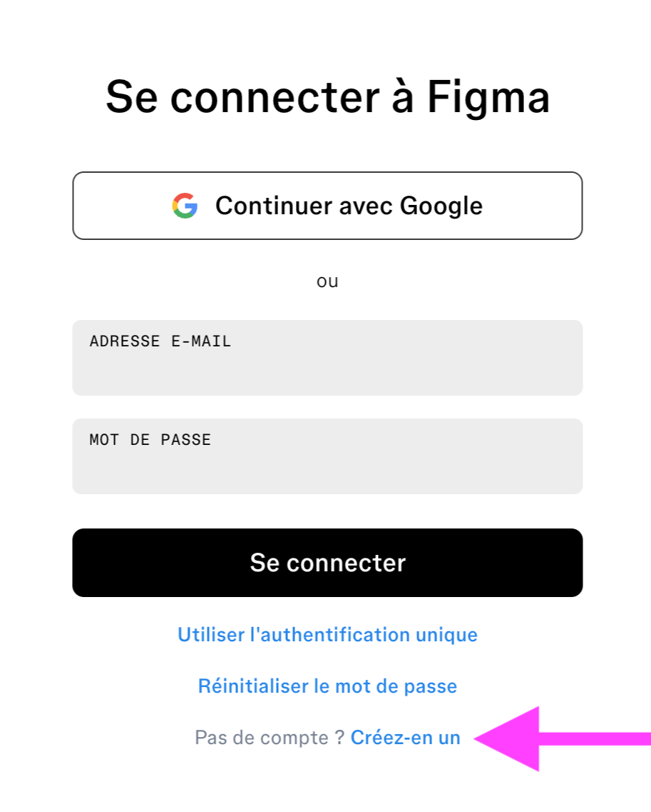
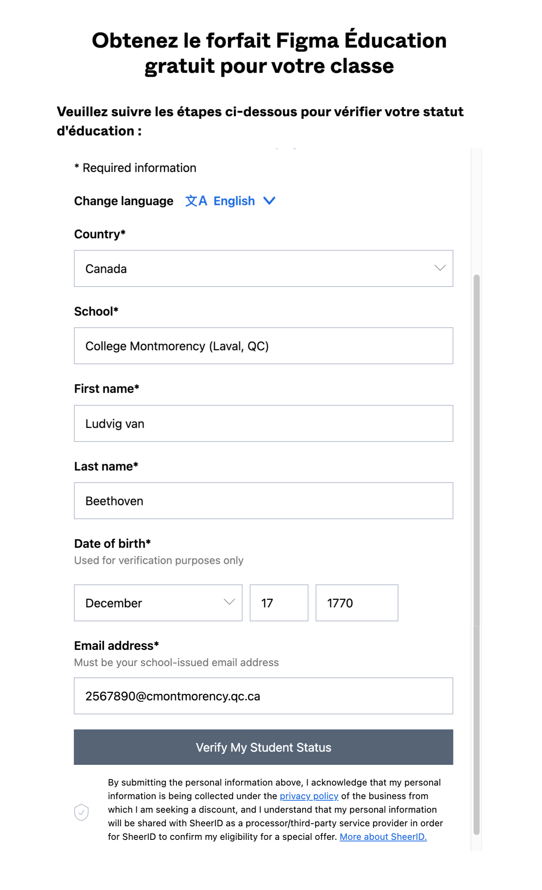

# Cours 1

[STOP]

## Présentation du plan de cours

## Qu’est-ce que le design graphique ?

C'est l'art de communiquer un message visuellement en combinant des images, du texte et des idées. Ça ne se limite pas à seulement « faire quelque chose de beau ».

Son objectif est de résoudre un problème de communication : comment faire comprendre une idée ou vendre un produit en un coup d'œil ?

* Art : souvent centré sur l’expression personnelle, l’interprétation libre.
* Design graphique : centré sur un problème de communication à résoudre (but, cible, contraintes).

Supports typiques : Logos, affiches, emballages (packaging), magazines, cartes de visite, signalétique.

Compétences clés : Théorie des couleurs, typographie, mise en page, branding.

Outils principaux : Adobe Illustrator (vectoriel), Adobe InDesign (mise en page), Photoshop.

### Design graphique Web

Différences avec le design graphique classique : 

* Expérience interactive. L'utilisateur clique, scrolle, survole et navigue. Le design doit réagir à ces actions (ex: un bouton qui change de couleur au survol).
* On travaille en basse résolution (72 PPI - pixels par pouce) pour l'écran. L'obsession est la légèreté : le site doit charger vite, donc les images doivent être optimisées.
* On utilise le mode Rouge, Vert, Bleu. C'est de la lumière projetée par un écran. Note : Certaines couleurs très vives (néons) possibles sur écran sont impossibles à imprimer.
* Responsive. Le design doit s'adapter automatiquement si l'utilisateur regarde le site sur un iPhone, une tablette ou un écran géant de 27 pouces. Le designer web ne dessine pas une seule version, il dessine un système qui s'adapte.

### UI / UX

* Design graphique : visuel, composition, couleur, typographie, hiérarchie.
* UI (User Interface) : design de l’interface (boutons, formulaires, navigation).
* UX (User Experience) : expérience globale (parcours, fluidité, logique).

Dans ce cours, on touche un peu aux trois, mais focus sur le visuel.

### Rôle du design graphique

* Donner une première impression forte.
* Guider le regard (où regarder en premier ? et après ?).
* Rendre le contenu plus compréhensible et mémorable.
* S’assurer que le style correspond à la marque et à la cible.

## Message, clientèle cible, contexte

### Message

* Ce qu’on veut faire comprendre ou faire ressentir.
* Souvent, ça se résume en 1–2 phrases simples.

Exemples :

> « Informer sur un événement qui s’en vient »
> « Donner envie d’essayer un nouveau produit »
> « Rassurer l’utilisateur sur la sécurité d’un service »
	
### Clientèle cible

* À qui on s’adresse ?
* Caractéristiques : âge, intérêts, niveau de connaissance, contexte d’utilisation.

Exemples :

> Adolescents qui jouent à des jeux vidéo
> Parents avec de jeunes enfants
> Professionnels qui n’ont pas beaucoup de temps

### Contexte

* Où et comment le visuel sera vu ?
* Sur un cellulaire dans le métro ? Sur un écran d’ordi au travail ? Sur une affiche ?

Conséquences sur :

* la taille du texte
* la quantité d’information
* le contraste et la lisibilité

### Objectifs de communication

Informer ? Convaincre ? Vendre ? Faire agir (cliquer, s’inscrire, acheter) ?

Un même produit peut avoir plusieurs objectifs, mais il faut en prioriser un.

!!! example "Mini-exercice"

	Afficher 2 ou 3 visuels (sites, affiches, pubs) à l’écran.
	
        1.	Quel pourrait être le message principal ?
        2.	Qui est la clientèle cible ?
        3.	Dans quel contexte ce visuel est probablement vu ?
	
<!-- Noter quelques réponses pour montrer qu’il peut y avoir plusieurs interprétations, mais qu’on cherche à être le plus précis possible. -->

⸻

3.4 Analyse collective de quelques exemples (≈ 25 min)
Objectif : commencer à développer le regard critique.

Préparer à l’avance 4–6 visuels (ou pages Web) :
	•	Quelques-uns bien conçus.
	•	Quelques-uns avec des défauts évidents (trop de texte, contraste faible, hiérarchie confuse, etc.).

Pour chaque visuel, guider l’analyse avec des questions simples :
	1.	Où va votre œil en premier ? Est-ce voulu / logique ?
	2.	Comprenez-vous rapidement de quoi il s’agit ?
	3.	Est-ce que le texte est lisible (taille, contraste, police) ?
	4.	Les couleurs semblent-elles cohérentes avec le sujet / la cible ?
	5.	Est-ce que vous auriez envie d’interagir avec ce site / cette publicité ?

Tu peux déjà évoquer (sans les détailler) les grands principes qu’on reverra plus tard :
	•	C.R.A.P. (Contraste, Répétition, Alignement, Proximité)
	•	Hiérarchie visuelle
	•	Simplicité vs surcharge

## Figma 

{ .w-100 }

[Figma](https://www.figma.com) est un outil de conception collaboratif en ligne qui permet de créer, prototyper et commenter des interfaces (maquettes, UI, UX) en temps réel directement dans le navigateur.

### Création de compte

{ data-zoom-image }

Rendez-vous sur <https://www.figma.com/login>

{ data-zoom-image }

Utiliser l'adresse courriel du CÉGEP

{ data-zoom-image }

Finaliser la création de compte

### Activer la version étudiante gratuite

Figma est offert gratuitement aux étudiantes et aux étudiants.

{ data-zoom-image }

1. Un fois connecté, rendez-vous sur <http://www.figma.com/education/apply>
1. Sélectionner « Enseignement Suppérieur »
1. Compléter le formulaire avec des « oui » partout

{ data-zoom-image }

1. Sélectionner l'option « Étudiant »
1. Sélectionner l'option « Homme-Machine »
1. Entrer la date prévue d'obtention de diplôme

{ data-zoom-image }

Compléter le formulaire (en anglais) et assurez-vous de sélectionner « Collège Montmorency (Laval, Qc) » dans la liste sous "School".

	1.	Se connecter / créer un compte
	•	Aller sur figma.com
	•	Création de compte (ideal : compte avec adresse du cégep si possible)
	2.	Créer un nouveau fichier
	•	Bouton New design file
	•	Renommer le fichier :
	•	ex. 582-201 - Prénom Nom - Séance 1
	3.	Interface de base
	•	Zone de canvas au centre
	•	Panneau de calques à gauche
	•	Panneau de propriétés à droite
	•	Barre d’outils en haut (Move, Frame, Shape, Pen, Text)
	4.	Frames (artboards)
	•	Outil Frame (F)
	•	Choisir un format Desktop (ex. 1440 x 1024)
	•	Renommer la frame : Moodboard S1
	5.	Objets de base
	•	Outil Rectangle (R), Ellipse (O)
	•	Ajouter quelques formes, modifier Fill et Stroke
	•	Outil Text (T) pour écrire un titre sur la frame
	6.	Sauvegarde
	•	Expliquer que Figma sauvegarde automatiquement, mais l’importance de :
	•	nommer clairement ses fichiers
	•	organiser les projets / dossiers (à détailler dans un autre cours)

Tip : tu peux préparer un petit fichier « démo » à dupliquer en classe si tu vois que le groupe a du mal à suivre.

⸻

3.6 Atelier – Moodboard d’inspiration rapide (≈ 40 min)
Objectif : amorcer un premier projet visuel simple, sans les bloquer sur la technique.

Consigne générale :

Créez un moodboard pour un projet fictif, par exemple :
	•	un café local qui veut moderniser son site Web
	•	un festival de jeux vidéo
	•	une petite marque de vêtements écoresponsables

L’objectif est de rassembler sur une même page des images, couleurs, typos et mots-clés qui représentent bien l’ambiance et la personnalité de ce projet.

Étapes guidées en classe :
	1.	Choix du thème
	•	Tu peux :
	•	imposer un thème à tout le monde
	•	proposer 2–3 thèmes et laisser choisir
	•	Demander :
	•	Quel est le message principal ?
	•	Qui est la clientèle cible ?
	2.	Structure du moodboard dans Figma
	•	Utiliser la frame Moodboard S1 créée plus tôt.
	•	Créer :
	•	une zone pour les images (captures, photos, textures)
	•	une zone pour les couleurs (rectangles de couleur)
	•	une zone pour des mots-clés / adjectifs (texte simple)
	3.	Contenus à mettre sur le moodboard
	•	4–6 images (capturées à partir de sites / portfolios, ou banques d’images libres – en donnant consignes de ne pas tout garder pour usage commercial, c’est pour l’inspiration).
	•	2–3 idées de palettes de couleurs (3–5 couleurs chacune).
	•	5–10 mots-clés décrivant l’ambiance (ex. chaleureux, minimaliste, énergique, rétro…).
	4.	Accompagnement
	•	Passer dans la classe pour :
	•	aider à manipuler les images (drag & drop / copy-paste)
	•	aider à aligner et organiser le contenu
	•	rappeler qu’un moodboard n’a pas besoin d’être « parfait » : c’est un outil de travail

⸻

3.7 Mise en commun & consignes du devoir (≈ 20 min)
Mini-présentations spontanées (si le temps le permet)
	•	Demander à 3–4 étudiant·es de partager brièvement leur moodboard :
	•	Quel thème ?
	•	Quel message / cible ?
	•	Quel mot-clé ils ou elles trouvent le plus important ?

Devoir pour la séance 2

À remettre à la prochaine séance :
	•	Finaliser votre moodboard dans Figma (images, couleurs, mots-clés).
	•	Ajouter un petit texte (3–5 lignes) dans un coin de la frame qui répond à ces questions :
	1.	Quel est le message principal de votre futur site ?
	2.	Quelle est la clientèle cible ?
	3.	Dans quel contexte votre design sera surtout vu (mobile, desktop, rapide coup d’œil, lecture prolongée, etc.) ?

Format de remise :
	•	Lien Figma partagé selon tes consignes de cours (ex. déposer l’URL dans Moodle / Teams).
	•	Nom du fichier standardisé, par exemple :
582-201 - S1 Moodboard - Prénom Nom

Tu peux préciser dans la grille de correction que ce devoir sera évalué plus tard (par exemple intégré à une note d’exercices), ou simplement compté comme participation si tu préfères garder les premières productions « low stakes ».

⸻

4. Résumé prof (ce que tu veux absolument couvrir en Séance 1)
	•	Présenter l’architecture du cours (ce qu’on va faire, avec quoi on sera évalué).
	•	Ancrer l’idée que le design graphique sert à communiquer un message à une cible dans un contexte.
	•	Faire au moins une analyse collective de visuels (développer l’œil).
	•	S’assurer que tout le monde a un compte Figma fonctionnel et sait créer un fichier.
	•	Lancer un premier moodboard qui servira d’appui pour les cours suivants.

