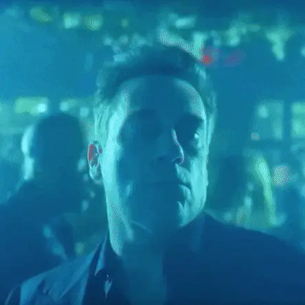

# Cours 1 | Intro

[STOP]

{.w-100}

## Présentation du plan de cours

## Quelques définitions

### Art

{data-zoom-image}

Expression

> L'art est une expression personnelle. L'artiste crée pour exprimer une vision, une émotion ou une idée.

🎯 Poser des questions, choquer ou émouvoir.

### Graphisme

{data-zoom-image}

Style et technique

> Le graphisme concerne la **mise en forme visuelle** : couleurs, formes, typographies, images et composition.

🎯 Créer un objet visuel cohérent et esthétique.

### Design

{data-zoom-image}

Solution et utilité

> Le design est une **méthode de réflexion** pour répondre à un problème selon des **contraintes** (public, contexte, support, temps, budget, accessibilité, etc.). 
> On recherche une solution pratique, simple, efficace.

🎯 L'objet (ou l'image) fonctionne bien pour la personne qui l'utilise.

### Design graphique

{data-zoom-image}

Mission !

> Le design graphique est l'art de concevoir des images pour transmettre un message précis à un public, dans un contexte donné. 
> C'est une communication visuelle qui se veut surtout **stratégique**.

🎯 Convaincre, informer ou guider l'utilisateur rapidement.

## Communication

<figure markdown>

<figcaption markdown>:simple-apple: Steve Jobs (2015)</figcaption>
</figure>

L'expertise du designer graphique, c'est la **communication**.

Il faut savoir faire passer un **message** (ou une information) le plus **efficacement** possible.

<figure markdown>
{data-zoom-image}
<figcaption>😨</figcaption>
</figure>

<figure markdown>
{data-zoom-image}
<figcaption>💅</figcaption>
</figure>

### Quoi

Qu'est-ce qu'on veut obtenir ?

- Informer ?
- Convaincre ?
- Vendre ?
- Faire agir (cliquer, s'inscrire, acheter) ?

Le message, c'est :

- Ce qu'on veut faire comprendre **ou** faire ressentir.
- Souvent, ça se résume en 1–2 phrases simples.

Exemples :

> « Informer sur un événement à venir »   
> « Donner envie d'essayer un nouveau produit »   
> « Rassurer l'utilisateur sur la sécurité d'un service »

!!! example "Mini-exercice"
	@todo : Afficher 2 ou 3 visuels (sites, affiches, pubs) à l'écran.  

<!-- Demander ce qu'est le message -->

### Comment

Comment faire passer le message ?

- **Support / format**  
  Affiche, story, bannière, landing page, packaging, écran en classe, panneau, etc.
- **Ton et intention**  
  Sérieux, ludique, premium, urgent, rassurant, institutionnel, etc.
- **Stratégies visuelles (leviers)**  
  - Hiérarchie (ce qui doit être vu en premier, deuxième, troisième)  
  - Contraste (taille, couleur, densité, poids typographique)  
  - Divulgation progressive (montrer l'essentiel, puis le détail)  
  - Cohérence (styles, alignements, grilles, répétitions)  
  - Accessibilité (lisibilité, tailles minimales, contrastes, clarté des icônes)
- **Contraintes**  
  Distance de lecture, lumière (extérieur/intérieur), temps d'attention, langue, normes, accessibilité, etc.

!!! example "Mini-exercice"
    Afficher 2 ou 3 visuels (sites, affiches, pubs) à l'écran.  
    1) Quel choix visuel aide vraiment le message ?  
    2) Quel choix nuit au message ?

### Qui

Pour communiquer un message, il faut comprendre **qui** le recevra et comment il sera interprété.

On parle alors de **public cible** :

- **Démographie** : âge, genre, localisation, revenu, niveau d'éducation, situation familiale.
- **Psychographie** : intérêts, valeurs, attitudes, style de vie, loisirs, défis.
- **Comportements** : habitudes d'achat, usage des réseaux sociaux, interaction avec le contenu.
- **Besoins et problèmes** : que recherchent-ils ? quel problème le design peut-il aider à résoudre ?

Exemples :

> Adolescents qui jouent à des jeux vidéo  
> Parents avec de jeunes enfants  
> Professionnels qui n'ont pas beaucoup de temps

!!! example "Mini-exercice"
    Afficher 2 ou 3 visuels (sites, affiches, pubs) à l'écran.  
    - À qui ça s'adresse ? (donner 1–2 hypothèses)

### Où / contexte

Où et comment le visuel sera vu ?

- Plateforme de diffusion (web, print, réseaux sociaux, signalétique, etc.)
- Sur un cellulaire dans le métro ? Sur un écran d'ordi au travail ? Sur un panneau publicitaire ? Sur une montre ?

Conséquences possibles sur :

- la taille du texte
- la quantité d'information
- le contraste et la lisibilité
- la vitesse de compréhension

!!! example "Mini-exercice"
    Afficher 2 ou 3 visuels (sites, affiches, pubs) à l'écran.  
    - Est-ce que c'est bien adapté au contexte ? Pourquoi ?

### Quand

Le **moment** influence la réception :

- Saison (été, hiver), météo, luminosité
- Périodes fortes : rentrée, examens, fêtes, Black Friday, etc.
- Contexte social/culturel : tendances, fatigue publicitaire, sensibilités du moment

!!! example "Mini-exercice"
    À partir d'un même message :  
    - Comment le visuel changerait en **rentrée** vs **période des fêtes** ?

### En résumé

- Pour qui est le message ?  
- Quel effet on veut créer ?  
- Quel contexte (où/quand) ?  
- Quelle connotation le style apporte ?

## Pièges

### Cool et confus

Un style peut être impressionnant… mais si le message est flou, le visuel échoue.

### Connotation involontaire

Exemple : Constructivisme russe

- Références :  
  - <https://en.wikipedia.org/wiki/Alexander_Rodchenko>  
  - <https://www.seattletimes.com/entertainment/visual-arts/the-revolution-will-be-posted-soviet-street-art-at-the-frye-museum/>
- Discussion :
  - Qu'est-ce qui est intéressant visuellement ? (couleurs, typographie, dynamisme, diagonales, formes, etc.)
  - Ce style évoque aussi une époque et un contexte (propagande, révolution, autorité, modernité industrielle).
  - Le style apporte donc une **connotation** — parfois incompatible avec le message.

> On éviterait d'utiliser un code visuel « propagande révolutionnaire » pour promouvoir un produit de maquillage, mais ce code peut être pertinent pour une affiche militante, une manifestation, un message d'action collective, etc.

### Connotation erronée

{.w-50 data-zoom-image}

C'est quoi « Expo Six Seven » ?

!!! example "L'importance de la recherche en design"

	Informez-vous sur les références que vous utilisez ! 

	<https://imgops.com/>, LLM, Pinterest ou la bibliothèque 📚 du collège

## Courants

Art nouveau
Constructivisme russe
Bauhaus / De Stij
Style suisse / Modernisme typographique

Mecha japonais
Cyberpunk

## Composition

En image, on fait comment ? Il existe des techniques.

Vous connaissez sans doute C.R.A.P., mais une liste plus exhaustive aide à mieux observer et décrire.

### Principes (leviers)

- Alignement
- Contraste
- Équilibre
- Hiérarchie
- Couleurs
- Le vide (espace "blanc")
- Proportion
- Répétition
- Rythme
- Mouvement
- Accentuation
- Proximité
- Unité

<!-- https://www.figma.com/resource-library/graphic-design-principles/ -->

> Idée clé : ce ne sont pas des “règles esthétiques”, ce sont des **leviers** pour rendre le message plus clair, plus lisible et plus convaincant.

!!! example "Mini-exercice"
    Afficher 2 ou 3 visuels (sites, affiches, pubs) à l'écran.  
    - Quels principes vois-tu ? Quels principes manquent ?

### Outils (matière première)

- Couleurs
- Textures
- Typographie
- Lignes et formes
- Espacements
- Images et illustrations

<!-- https://www.figma.com/resource-library/what-is-graphic-design/#key-elements-of-graphic-design -->

## Figma 

{ .w-100 }

[Figma](https://www.figma.com) est un outil de conception collaboratif en ligne qui permet de créer, prototyper et commenter des interfaces (maquettes, UI, UX) en temps réel directement dans le navigateur.

### Création de compte

{ data-zoom-image }

Rendez-vous sur <https://www.figma.com/login>

{ data-zoom-image }

Utiliser l'adresse courriel du CÉGEP

{ data-zoom-image }

Finaliser la création de compte

### Activer la version étudiante gratuite

Figma est offert gratuitement aux étudiantes et aux étudiants.

{ data-zoom-image }

1. Un fois connecté, rendez-vous sur <http://www.figma.com/education/apply>
1. Sélectionner « Enseignement Suppérieur »
1. Compléter le formulaire avec des « oui » partout

{ data-zoom-image }

1. Sélectionner l'option « Étudiant »
1. Sélectionner l'option « Homme-Machine »
1. Entrer la date prévue d'obtention de diplôme

{ data-zoom-image }

Compléter le formulaire (en anglais) et assurez-vous de sélectionner « Collège Montmorency (Laval, Qc) » dans la liste sous "School".

### Introduction à Figma

1. Aller sur figma.com  
2. Se connecter  
3. Créer un fichier **Design**  
4. Renommer le fichier : `Cours01`  
5. Renommer la **Page 1** : `Début`  
6. Créer un **Frame** (équivalent d'un *artboard*)  
7. Renommer le frame : `Test`

#### Navigation (essentiels)

- Déplacements et zoom
- Ordre des calques (Layers)
- Sélection, multi-sélection, verrouillage
- Alignements et distribution

#### Formes (Shape tools)

**Rectangle**

- Panneau de droite (propriétés)
- Carré avec ++shift++ (garde les proportions)
- Coins arrondis
- Grouper / dégrouper
- Snap, alignement et distribution
- Redimensionnement et rotation (outil Rotation : ++r++)
- Flip horizontal / vertical (effet miroir)

**Ligne / Vector**

- Entrer en édition vectorielle : ++enter++ (ou double-clic)
- Manipulations de tracé (points d'ancrage, courbes Bézier)
- Opérations booléennes (Union, Soustraction, Intersection, etc.)

#### Propriétés visuelles

- Remplissages (solid, gradients)
- Contours / tracés (stroke)
- Effets (ombres, flou, etc.)
- Opacité

#### Texte

- Outil texte
- Styles de base : taille, graisse, interlignage, alignement

#### Démonstrations rapides (idées)

- Jeux olympiques (formes + simplification)
- Logo Figma (formes + opérations booléennes)
- Triptique Piet Mondrian (grille + proportions + couleurs)

#### Sauvegarde et bonnes pratiques

- Figma sauvegarde automatiquement **dans le cloud**.
- Renommer clairement les fichiers, pages et frames (éviter “Untitled” / “Frame 1”).
- Exporter au besoin (PNG/SVG/PDF) et (optionnel) exporter un fichier `.fig`.

> À venir prochainement : Auto-layout (mise en page) et styles/variables (cohérence).
	
## Exercices

## Devoir