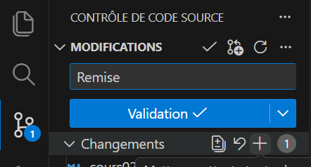

# Cours 2

  
  Utilisation de l'IA générative ou d'agent IA interdits à cette phase dans la session: vous devez solidifier les bases d'abord !

## RÉSUMÉ DU CONTENU VU AUJOURD'HUI

- [📚 Contenu de cours: Les spécificités CSS](./css/specificite.md)
- [📚 Contenu de cours: Emmet dans VS Code](https://tim-montmorency.com/timdoc/582-211/html/emmet/)

**CSS Web 1**

- [📚 CSS Cours 08](https://tim-montmorency.com/compendium/582-111-web1/cours08.html) (CSS Syntaxe et règles de base, Sélecteur CSS: (balise, .classe, #id), combinaison de sélecteur, descendant, *sélecteur universel , ordre de priorité, spécificité, héritage, Modèle de boîte CSS (box model) :`padding`, `margin`, `border`, Propriété `display`)
- [📚 CSS Cours 09](https://tim-montmorency.com/compendium/582-111-web1/cours09.html) (Unités de mesure CSS (relative, absolue))
- [📚 CSS Cours 10](https://tim-montmorency.com/compendium/582-111-web1/cours10.html) (Sélecteurs avancés)
- [📚 CSS Cours 11](https://tim-montmorency.com/compendium/582-111-web1/cours11.html) (Nomenclatures CSS, hygyène de code, méthodologie BEM)

**BEM**

- [📚 Nomenclature BEM](https://tim-montmorency.com/compendium/582-111-web1/cours11.html#bem)

**Ajouts sur la méthodologie BEM (contenu supplémentaire sur le sujet)**

- [📚 La méthodologie de nomenclature BEM](https://alticreation.com/blog/bem-pour-le-css/)
- [📚 Nomenclature BEM exemples concrets](https://css-tricks.com/bem-101/#aa-more-examples-of-bem-in-action)

**Documentation/résumé Web 1 pré 2025 :**

- [📚 Résumé HTML](https://tim-montmorency.com/timdoc/582-211/html/resume/)
- [📚 Résumé CSS](https://tim-montmorency.com/timdoc/582-211/css/resume-css/)

<!--

  
  Utilisation de l'IA générative interdite à cette phase dans la session: vous devez solidifier les bases

## Tutorat cette session

| **NOM**            | **PLAGE HORAIRE**              | **LIEU**                                      | **DATES**                     |
|---------------------|--------------------------------|-----------------------------------------------|--------------------------------|
| Alexis Guilbault    | Trou horaire – Mardi 12h30-14h10 | En personne au Centre d’aide C-1612           | 3 février au 27 avril inclus. |
| Olivier Laliberté   | Mercredi soir – 19h-20h15      | En ligne sur TEAMS : canal Tutorat de l'équipe TIM-Programme TIM | 4 février au 28 avril inclus. |
| Iryna Lysenko       | Dimanche soir – 18h-19h15      | En ligne sur TEAMS : canal Tutorat de l'équipe TIM-Programme TIM | 8 février au 3 mai inclus.    |

-->

## Retour sur l'activité pratique: Analyse de code (Bloc 5 du dernier cours)

[👩🏻‍💻 Activité pratique : Analyse de code](./exercices/cours1-analyse-de-code/index.md){ .md-button }

[Lien GitHub Classsroom de l'activité](https://classroom.github.com/a/LXvtgKKT){ .md-button }

## Retour sur la lecture du devoir du dernier cours

[L’importance d’investir dans les compétences non techniques à l’ère de l’IA, notamment les compétences relationnelles humaines](https://css-tricks.com/the-importance-of-investing-in-soft-skills-in-the-age-of-ai/)

### Activité

- Individuellement,  répond par écrit à ces 3 questions :
  - Une idée du texte que je retiens particulièrement
  - Une idée qui m’a surpris ou dérangé
  - Une phrase qui pourrait s’appliquer à mon futur métier
- Mise en commun en petits groupes
- Discussion collective (toute la classe)

## Atelier: Schéma de navigation

[👩🏻‍💻 Activité : Schéma de navigation - GitHub Classroom](https://classroom.github.com/a/NuaqM5Jc){ .md-button }

Important: si exercice d'équipe lorsqu'on demande *Create new team*, nommez la: `nomfamille-prenom1_nomfamille-prenom2` ex:  `ouellet-marie_lambert-jean`

<!--
[👩🏻‍💻 Activité pratique : Analyse de code](./exercices/cours1-schema-navigation/index.md){ .md-button }
-->

## Révision CSS du cours Web1

[📚 Contenu de cours: Les spécificités CSS](./css/specificite.md){ .md-button .md-button--primary }

[📚 Contenu de cours: Emmet dans VS Code](https://tim-montmorency.com/timdoc/582-211/html/emmet/){ .md-button .md-button--primary }

**CSS Web 1**

- [📚 CSS Cours 08](https://tim-montmorency.com/compendium/582-111-web1/cours08.html)
  - CSS Syntaxe et règles de base
  - Sélecteur CSS: (balise, .classe, #id), combinaison de sélecteur, descendant, *sélecteur universel , ordre de priorité, spécificité, héritage.
  - Modèle de boîte CSS (box model) : `padding`, `margin`, `border`
  - Propriété `display`.
- [📚 CSS Cours 09](https://tim-montmorency.com/compendium/582-111-web1/cours09.html)
  - Unités de mesure CSS (relative, absolue)
- [📚 CSS Cours 10](https://tim-montmorency.com/compendium/582-111-web1/cours10.html)
  - Sélecteurs avancés
- [📚 CSS Cours 11](https://tim-montmorency.com/compendium/582-111-web1/cours11.html)
  - Nomenclatures CSS, hygyène de code, méthodologie BEM

**BEM**

- [📚 Nomenclature BEM](https://tim-montmorency.com/compendium/582-111-web1/cours11.html#bem)

**Ajouts sur la méthodologie BEM (contenu supplémentaire sur le sujet)**

- [📚 La méthodologie de nomenclature BEM](https://alticreation.com/blog/bem-pour-le-css/)
- [📚 Nomenclature BEM exemples concrets](https://css-tricks.com/bem-101/#aa-more-examples-of-bem-in-action)

**Documentation/résumé Web 1 pré 2025 :**

- [📚 Résumé HTML](https://tim-montmorency.com/timdoc/582-211/html/resume/)
- [📚 Résumé CSS](https://tim-montmorency.com/timdoc/582-211/css/resume-css/)

## Les spécificités CSS

[📚 Les spécificités CSS](./css/specificite.md){ .md-button .md-button--primary }

### Exercice spécificité

Un quiz amusant pour apprendre et pratiquer la spécificité en CSS.

[👩🏻‍💻 Exercice: spécificité CSS - 20 questions 20 questions. ](https://css-specificity.smnarnold.com){ .md-button }

## Emmet

Moteur d’autocomplétions permettant d’augmenter votre vitesse de création de balises HTML dans VS Code.

<iframe src="https://cmontmorency365-my.sharepoint.com/personal/mariem_ouellet_cmontmorency_qc_ca/_layouts/15/embed.aspx?UniqueId=ab510bf3-acce-4ffe-82a7-87b6a11438c4&embed=%7B%22hvm%22%3Atrue%2C%22ust%22%3Atrue%7D&referrer=StreamWebApp&referrerScenario=EmbedDialog.Create" width="800" height="450" frameborder="0" scrolling="no" allowfullscreen title="demo-emmet02.mp4" style="border:none; position: absolute; top: 0; left: 0; right: 0; bottom: 0; height: 100%; max-width: 100%;"></iframe>

[📚 Emmet dans VS Code](https://tim-montmorency.com/timdoc/582-211/html/emmet/){ .md-button .md-button--primary }

## DEVOIRS à faire pour le prochain cours

### Bootcamp de révision & diagnostique HTML+CSS

[🍽️ Menu de restaurant](./exercices/cours3-menu-resto/index.md){ .md-button }

Remettre avant le début du cours 3 : `+`, `commit "Remise"`, [...] `push`.

Si vous n'arrivez pas à faire le `push`, nous allons trouver une solution ensemble en début de cours 3.

!!! info
    Rappel concernant les exercices : il est primordial de compléter tous les exercices afin de développer les compétences visées dans ce cours. La première évaluation sommative est le Projet 1 — pour y être évalué adéquatement, *vous devez avoir participé activement à toutes les activités d'apprentissage précédentes*.

    Par ailleurs, tel que précisé au plan de cours, la complétion de l'ensemble des exercices de la session vous permet d'obtenir la note maximale de 10/10, ce qui représente *10 % de la note finale*.