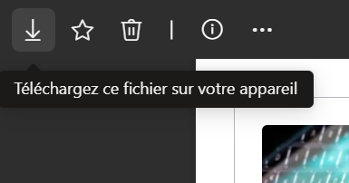

# Cours 3

  
  Utilisation de l'IA générative ou d'agent IA interdits à cette phase dans la session: vous devez solidifier les bases d'abord !

<!--
**Prévu au cours 2**
Architecture CSS maintenable 
  · Classes de composants vs classes utilitaires 
  · Quand utiliser l'un ou l'autre 
  · Lisibilité et maintenabilité du code 
  · Nomenclature cohérente (BEM ou autre méthodologie)

**Prévu au cours 3**
CSS fluide et système de design (jetons et variables) 
  · Unités relatives (rem, em, %, vw/vh) 
  · Fonctions CSS (clamp, min, max, calc) 
  · Variables CSS (custom properties) pour couleurs, espacements, typographie 
  · Design tokens et système cohérent 
  · CSS fluide AVANT le responsive
-->

## RÉSUMÉ DU CONTENU VU AUJOURD'HUI

- [👩‍🏫 Exposé 3a: Pourquoi l'architedcture CSS compte: Télécharger le PPT :material-download:](./assets/cours03-p01-importance-architecture-css.pptx)
- [👩‍🏫 Exposé 3b: Nomenclature cohérente: Télécharger le PPT :material-download:](./assets/cours03-p02-nomenclature-coherente.pptx)
- [📚 Contenu de cours: Les variables CSS](https://tim-montmorency.com/timdoc/582-211/css/variables/)

## Bloc0: REMISE de l'exercice de *🍽️Menu de restaurant*

- Si ce n'est pas fait, svp le remettre maintenant.
- Si vous avez eu de la difficiulté avec le git, n'hésitez pas à me le faire savoir, nous allons trouver une solution ensemble.

## Tutorat cette session

| **NOM**            | **PLAGE HORAIRE**              | **LIEU**                                      | **DATES**                     |
|---------------------|--------------------------------|-----------------------------------------------|--------------------------------|
| Alexis Guilbault    | Trou horaire – Mardi 12h30-14h10 | En personne au Centre d’aide C-1612           | 3 février au 27 avril inclus. |
| Olivier Laliberté   | Mercredi soir – 19h-20h15      | En ligne sur TEAMS : [canal Tutorat de l'équipe TIM-Programme TIM](https://teams.microsoft.com/l/channel/19%3A68fb96c731e7460ba846ff328a9fe109%40thread.tacv2/Tutorat?groupId=924057af-2255-4c2a-8ce7-f0a1809ad4a4&tenantId=ffa995c7-10de-4ec8-95db-28ed0576455d) | 4 février au 28 avril inclus. |
| Iryna Lysenko       | Dimanche soir – 18h-19h15      | En ligne sur TEAMS : [canal Tutorat de l'équipe TIM-Programme TIM](https://teams.microsoft.com/l/channel/19%3A68fb96c731e7460ba846ff328a9fe109%40thread.tacv2/Tutorat?groupId=924057af-2255-4c2a-8ce7-f0a1809ad4a4&tenantId=ffa995c7-10de-4ec8-95db-28ed0576455d) | 8 février au 3 mai inclus.    |

## Bloc1: RETOUR sur *Atelier: Schéma de navigation* du cours2

[👩🏻‍💻 Activité : Schéma de navigation - GitHub Classroom](https://classroom.github.com/a/NuaqM5Jc){ .md-button }

C'était un exercice en équipe. Un des membres de votre équipe doit ouvrir le dossier de l'exercice dans VS Code et ouvrir le fichier du schéma `.drawio`.

On va faire un tour de table pour analyser chaque schéma de navigation. et en discuter ensemble.

## Bloc2: ACTIVITÉ - *Analyse de la qualité du code CSS spaghetti*

Exercice individuel

#### Étape 1

!!! tip Classement de vos fichiers du cours Web 2
    Que les fichiers de l'exercice proviennent de GitHub Classroom ou d'un lien direct comme ci-bas, je vous demande de toujours télécharger et classer vos fichiers d'exercice et d'atelier au même endroit. Cet endroit doit être accessible en tout temps et sur n'importe quel poste de travail. Par exemple :

    - votre **disque dur exerne**
    - votre **clé USB**
    - votre **OneDrive**

[:material-download: Cliquez pour télécharger](https://cmontmorency365-my.sharepoint.com/:u:/g/personal/mariem_ouellet_cmontmorency_qc_ca/IQBMvRc4m4pqRYE-aTkRova9Ae9TwW96uHJflp7f-VpSFOw?e=Z2JYeV){ .md-button }

  { data-zoom-image }

  

    Ensuite en haut à droite, le premier icône [⤓] te permet de télécharger le fichier de l'atelier (n'oublie pas de bien choisir ou tu le places, sur ton disque dur externe, ta clé USB ou ton OneDrive).
  

#### Étape 2

Ouvrez le fichier téléchargé dans VS Code pour l'analyser.

#### Étape 3

- [Groupe lundi AM: Accéder au questionnaire](https://forms.office.com/r/j3FyHzC6pk)
- [Groupe lundi PM: Accéder au questionnaire](https://forms.office.com/r/wVdwjhtnsc)
- [Groupe merc. AM: Accéder au questionnaire](https://forms.office.com/r/sPsT4LpiRv)

## Bloc3: EXPOSÉ - Pourquoi l'*architecture CSS* est importante

[👩‍🏫 Exposé 3a: Pourquoi l'architedcture CSS compte: Télécharger le PPT :material-download:](./assets/cours03-p01-importance-architecture-css.pptx){ .md-button}

## Bloc4: DÉMO LIVE - *Composant VS utilitaire*

- card-composant.html
- card-utilitaires.html

## Bloc5: ATELIER - *Identifier composants/utilitaires*

#### Étape 1

!!! tip Classement de vos fichiers du cours Web 2
    Que les fichiers de l'exercice proviennent de GitHub Classroom ou d'un lien direct comme ci-bas, je vous demande de toujours télécharger et classer vos fichiers d'exercice et d'atelier au même endroit. Cet endroit doit être accessible en tout temps et sur n'importe quel poste de travail. Par exemple :

    - votre **disque dur exerne**
    - votre **clé USB**
    - votre **OneDrive**

[:material-download: Récupérer de GitHub Classroom](https://classroom.github.com/a/TY_vd_9u){ .md-button }

#### Étape 2

Ouvrez le fichier téléchargé dans VS Code pour l'analyser.

#### Étape 3 - Consignes

Analysez la page `c3-composant-utilitaire.html` et identifiez :

- Les COMPOSANTS réutilisables (éléments qui se répètent identiquement)
- Les UTILITAIRES potentiels (styles ponctuels qu'on pourrait réutiliser ailleurs)
- La nomenclature que vous proposez pour chaque composant

 
Créez un tableau sur Microsoft Whiteboard avec 3 colonnes :

| Composant | Éléments concernés | Classes proposées |
|-----------|--------------------|-------------------|
| Card projet | articles de projets | `.project-card`, `.project-card__image`, etc. |

#### Étape 4 - Remise

- Éditez le fichier remise.md pour y ajouter le lien vers votre Whiteboard et vos noms
- Faire un commit et push de vos modifications sur GitHub Classroom.

## Bloc6: EXPOSÉ - *Nomenclature cohérente*

[👩‍🏫 Exposé 3b: Nomenclature cohérente: Télécharger le PPT :material-download:](./assets/cours03-p02-nomenclature-coherente.pptx){ .md-button}

## Bloc7: EXPOSÉ - Les *variables CSS*

[📚 Contenu de cours 3c: Les variables CSS](https://tim-montmorency.com/timdoc/582-211/css/variables/){ .md-button}

## Bloc8: EXERCICE - *Renommer code mal structuré (code spaghetti)*

#### Étape 1

!!! tip Classement de vos fichiers du cours Web 2
    Que les fichiers de l'exercice proviennent de GitHub Classroom ou d'un lien direct comme ci-bas, je vous demande de toujours télécharger et classer vos fichiers d'exercice et d'atelier au même endroit. Cet endroit doit être accessible en tout temps et sur n'importe quel poste de travail. Par exemple :

    - votre **disque dur exerne**
    - votre **clé USB**
    - votre **OneDrive**

[:material-download: Récupérer de GitHub Classroom](https://classroom.github.com/a/CYpdc1jC){ .md-button }

#### Étape 2

Ouvrez le fichier téléchargé dans VS Code.

#### Étape 3 - Consignes

Les consignes sont dans le README.md de l'exercice.

#### Étape 4 - Remise

Faire un commit et push de vos modifications sur GitHub Classroom.

## [Annulé] ~~BLOC 9 : ATELIER-*Portfolio: Créer un système CSS*~~

À ne pas faire pour cette semaine. On verra ça au prochain cours.

<!--
#### Étape 1

!!! tip Classement de vos fichiers du cours Web 2
    Que les fichiers de l'exercice proviennent de GitHub Classroom ou d'un lien direct comme ci-bas, je vous demande de toujours télécharger et classer vos fichiers d'exercice et d'atelier au même endroit. Cet endroit doit être accessible en tout temps et sur n'importe quel poste de travail. Par exemple :

    - votre **disque dur exerne**
    - votre **clé USB**
    - votre **OneDrive**

[:material-download: Récupérer de GitHub Classroom](https://classroom.github.com/a/s1rEev0T){ .md-button }

#### Étape 2

Ouvrez le fichier téléchargé dans VS Code.

#### Étape 3 - Consignes

Les consignes sont dans le README.md de l'exercice.

#### Étape 4 - Remise

Faire un commit et push de vos modifications sur GitHub Classroom.
-->
## DEVOIRS

#### Devoirs à compléter et remettre pour le prochain cours

Terminer et remettre les exercices non complétés en classe:

- celle du [bloc 5](#bloc5-atelier-identifier-composantsutilitaires) en équipe (whiteboard)
- celle du [bloc 8](#bloc8-exercice-renommer-code-mal-structure-code-spaghetti) individuel

- ~~celle du [bloc 9](#bloc-9-atelier-portfolio-creer-un-systeme-css-documente)~~