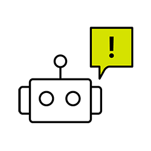

# Cours 7

  
  PHASE 2: Utilisation de l'IA permise mais limitée. VOUS POUVEZ vérifier et comparer après avoir codé. VOUS NE POUVEZ PAS générer la structure de base du code. Pourquoi ? Vous devez démontrer votre maîtrise autonome.

## RAPPEL Politique d'utilisation de l'IA — Phase 2

Si vous utilisez l'IA pour le projet 1, vous devez l'inscrire dans le fichier  *documentation.md* : quel outil IA, quelle version, la date, le prompt et quelle partie du code pour avez validé ou amélioré avec l'IA.

Durant le Projet 1, vous êtes en Phase 2 de la politique IA du cours :

- PERMIS : Vérifier et comparer votre code après l'avoir écrit vous-même
- PERMIS : Poser des questions conceptuelles pour comprendre
- PERMIS : Déboguer un problème spécifique dans votre code
- INTERDIT : Générer la structure de base ou des sections complètes
- INTERDIT : Copier-coller du code IA sans le comprendre
- INTERDIT : Utiliser l'IA comme substitut à votre apprentissage

IMPORTANT: Vous êtes responsable de tout le code remis. Vous devez comprendre et pouvoir justifier chaque ligne à la demande de l’enseignante qui vous évaluera.

## Travail en classe sur le Projet 1 

Travail en classe sur le Projet 1 : assemblage d’interface (35%) 

Objectif : Avancer sur le projet 1 en classe avec la possibilité de poser des questions à l’enseignante et d’avoir des rencontres individuelles pour la rétroaction.

