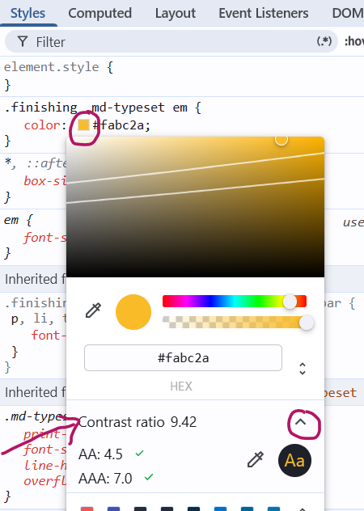

# Accessibilité & robustesse du UI

**Ce n'est pas une checklist**

L'accessibilité n'est pas une étape qu'on ajoute à la fin. C'est une série de *décisions techniques* qu'on prend tout au long de l'intégration.

Ce qui distingue un intégrateur compétent d'un outil qui génère du code : le code généré par l'IA passe rarement les audits d'accessibilité sans correction. Il produit du HTML qui fonctionne visuellement, mais ignore systématiquement ce qui n'est pas visible à l'écran.

## Grandes lignes

- Contraste et lisibilité¶
- Focus visible et navigation clavier
- Tailles de clic et états interactifs
- Structure sémantique et textes alternatifs
- Auditer avec Lighthouse et axe DevTools

## Contraste et lisibilité

### Les deux seuils à retenir (WCAG AA)

Le *WCAG* (Web Content Accessibility Guidelines) définit des ratios de contraste minimaux entre la couleur du texte et son arrière-plan.

| Type de contenu | Ratio minimal |
|---|---|
| Texte normal (moins de 18px) | **4.5 : 1** |
| Grand texte (18px+ ou 14px gras) | **3 : 1** |
| Éléments d'interface (icônes, bordures de champs) | **3 : 1** |

```css
/* ❌ Problème fréquent : texte trop pâle sur fond clair */
.label {
  color: #aaaaaa; /* ratio ~2.3:1 sur blanc : insuffisant */
}

/* ✅ Correction */
.label {
  color: #767676; /* ratio ~4.5:1 sur blanc : seuil exact */
}
```

<br>

<p class="codepen" data-theme-id="50173" data-height="100" data-pen-title="DEMO Accessibilité - Contraste" data-version="2" data-default-tab="result" data-slug-hash="GgjLGpY" data-user="tim-momo" style="height: 100px; box-sizing: border-box; display: flex; align-items: center; justify-content: center; border: 2px solid; margin: 1em 0; padding: 1em;">
  <span>See the Pen <a href="https://codepen.io/editor/tim-momo/pen/019dab5c-3444-7a74-893a-298f54d139eb">
  DEMO Accessibilité - Contraste</a> by TIM Montmorency (<a href="https://codepen.io/tim-momo">@tim-momo</a>)
  on <a href="https://codepen.io">CodePen</a>.</span>
</p>
<script async src="https://public.codepenassets.com/embed/index.js"></script>

<br>

### Vérifier le contraste directement dans *DevTools*

*Chrome DevTools* affiche le ratio de contraste directement dans le *color picker* :

1. Inspecte un élément texte
2. Clique sur la pastille de couleur dans le panneau CSS
3. Le ratio s'affiche : un ✓ indique que le seuil AA est atteint, ✓✓ indique AAA



### Petit exercice d'observation

- [ ] 1. Ouvre le wiki du cours, la page courante dans Google Chrome: https://tim-montmorency.com/compendium/582-211-web2/css/accessibilite.html
- [ ] 2. Si ce n'est pas le cas, mets le site en **dark mode** via cet icône en haut à droite: 
- [ ] 3. Inspecte *ce texte jaune* ⬅️
- [ ] 4. Clique sur la pastille de couleur dans le panneau CSS
- [ ] 5. Observe le ratio de contraste...  Quel est-il? Est-ce que ça passe les normes de lisiblité et d'accessibilité selon WCAG ?
- [ ] 6. Change maintenet le site en **light mode** via cet icône en haut à droite: 
- [ ] 7. Inspecte *ce texte jaune* ⬅️
- [ ] 8. Clique sur la pastille de couleur dans le panneau CSS
- [ ] 9. Observe le ratio de contraste...  Maintenant qu'est-il? Est-ce que ça passe les normes de lisiblité et d'accessibilité selon WCAG ?


<br>

!!! warning "Rappel : les variables CSS ne règlent pas le problème"
    Définir `--couleur-texte: #aaa` dans `:root` et l'utiliser partout ne garantit pas un contraste suffisant. Le ratio dépend toujours de la **combinaison texte + arrière-plan**. Un même gris peut être acceptable surfond blanc et inaccessible sur fond coloré.

<br>

<p class="codepen" data-theme-id="50173" data-height="1000" data-pen-title="DEMO accessibilité: constrate" data-version="2" data-default-tab="result" data-slug-hash="JoRVEKx" data-user="tim-momo" style="height: 1000px; box-sizing: border-box; display: flex; align-items: center; justify-content: center; border: 2px solid; margin: 1em 0; padding: 1em;">
  <span>See the Pen <a href="https://codepen.io/editor/tim-momo/pen/019da899-7223-79fb-8060-f2b5ecabf817">
  DEMO accessibilité: constrate</a> by TIM Montmorency (<a href="https://codepen.io/tim-momo">@tim-momo</a>)
  on <a href="https://codepen.io">CodePen</a>.</span>
</p>
<script async src="https://public.codepenassets.com/embed/index.js"></script>


## Focus visible et navigation clavier

### Pourquoi c'est important

Certains utilisateurs ne peuvent pas utiliser une souris : personnes avec des troubles moteurs, malvoyants qui utilisent un lecteur d'écran, utilisateurs avancés qui naviguent au clavier. Pour eux, le focus visible est le seul indicateur de leur position sur la page.

<br>

### Le lien direct avec `:focus-visible`

Tu as vu `:focus-visible` dans la section précédente. C'est ici que son importance prend tout son sens :

```css
/* ❌ Ce pattern est partout : et il brise l'accessibilité */
* {
  outline: none;
}

/* ✅ La bonne approche */
:focus {
  outline: none; /* retire l'outline au clic souris */
}

:focus-visible {
  outline: 2px solid currentColor;
  outline-offset: 3px;
}
```

<br>

### Ce que doit indiquer un état de focus

Un indicateur de focus accessible doit être :

- **Visible** : contraste suffisant avec le fond (ratio 3:1 minimum)
- **Distinct** : différent de l'état normal au repos
- **Stable** : ne disparaît pas trop vite, n'est pas masqué par un `overflow: hidden`

```css
/* Exemple d'un focus robuste */
.bouton:focus-visible {
  outline: 2px solid #2d6a4f;
  outline-offset: 3px;
  /* outline-offset sépare le contour de l'élément
     : évite qu'il se confonde avec la bordure */
}
```

<br>

<p class="codepen" data-theme-id="50173" data-height="340" data-pen-title="DEMO accessibilité: focus" data-version="2" data-default-tab="result" data-slug-hash="pvEBYzP" data-user="tim-momo" style="height: 400px; box-sizing: border-box; display: flex; align-items: center; justify-content: center; border: 2px solid; margin: 1em 0; padding: 1em;">
  <span>See the Pen <a href="https://codepen.io/editor/tim-momo/pen/019dad33-ad5a-767e-8a34-921a551e4fee">
  DEMO accessibilité: focus</a> by TIM Montmorency (<a href="https://codepen.io/tim-momo">@tim-momo</a>)
  on <a href="https://codepen.io">CodePen</a>.</span>
</p>
<script async src="https://public.codepenassets.com/embed/index.js"></script>

<br>

### Tester soi-même

La méthode la plus rapide : **pose ta souris et navigue avec ++tab++**.

- ++tab++ : avancer vers l'élément focusable suivant
- ++shift+tab++ : reculer
- ++enter++ ou ++space++ : activer un bouton ou un lien
<!--
- ++Tab ↹++ : avancer vers l'élément focusable suivant
- ++Shift ⇧++ + ++Tab ↹++ : reculer
- ++Enter ⏎++ ou ++Espace ␠++ : activer un bouton ou un lien
-->

Si tu perds ta position à un moment, c'est un problème d'accessibilité.


## Tailles de clic et états interactifs

### La taille minimale recommandée

Le WCAG 2.5.5 recommande une zone cliquable d'au moins **44 × 44 pixels** pour les éléments interactifs, particulièrement sur mobile et écran tactile.

```css
/* ❌ Icône cliquable trop petite */
.btn-icone {
  width: 16px;
  height: 16px;
}

/* ✅ Zone de clic étendue sans changer l'apparence visuelle */
.btn-icone {
  width: 16px;
  height: 16px;
  padding: 14px; /* zone de clic : 44×44px */
}

/* ✅ Ou avec min-width / min-height */
.btn-icone {
  min-width: 44px;
  min-height: 44px;
  display: flex;
  align-items: center;
  justify-content: center;
}
```

<br>

### Les trois états interactifs obligatoires

Un élément cliquable doit avoir un style distinct pour chacun de ces états :

```css
.bouton {
  background: #f5f4f0;
  border: 1px solid #e0ddd6;
  cursor: pointer;
}

/* 1. Survol souris */
.bouton:hover {
  background: #e8e6e0;
  border-color: #2d6a4f;
}

/* 2. Focus clavier */
.bouton:focus-visible {
  outline: 2px solid #2d6a4f;
  outline-offset: 3px;
}

/* 3. Clic / activation */
.bouton:active {
  transform: scale(0.97);
  background: #d8f3dc;
}
```

<br>

!!! warning "L'erreur la plus fréquente"
    Définir uniquement `:hover` et oublier `:focus-visible` et `:active`. Sur mobile, `:hover` n'existe pas : l'état actif est le seul feedback visuel disponible.

<br>

<p class="codepen" data-theme-id="50173" data-height="1000" data-pen-title="DEMO accessibilité: états interactifs" data-version="2" data-default-tab="result" data-slug-hash="ZYpZLpo" data-user="tim-momo" style="height: 1000px; box-sizing: border-box; display: flex; align-items: center; justify-content: center; border: 2px solid; margin: 1em 0; padding: 1em;">
  <span>See the Pen <a href="https://codepen.io/editor/tim-momo/pen/019da89c-0ae6-760e-98ff-1fc52dde791d">
  DEMO accessibilité: états interactifs</a> by TIM Montmorency (<a href="https://codepen.io/tim-momo">@tim-momo</a>)
  on <a href="https://codepen.io">CodePen</a>.</span>
</p>
<script async src="https://public.codepenassets.com/embed/index.js"></script>


## Structure sémantique et textes alternatifs

### Le HTML sémantique comme fondation

Un code accessible commence par un HTML qui utilise les **bonnes balises** pour les bons usages. Les lecteurs d'écran se fient à la sémantique pour annoncer le contenu aux utilisateurs.

```html
<!-- ❌ Div soup : aucune information structurelle -->
<div class="header">
  <div class="nav">
    <div class="nav-item">Accueil</div>
    <div class="nav-item">À propos</div>
  </div>
</div>

<!-- ✅ Sémantique correcte -->
<header>
  <nav>
    <ul>
      <li><a href="/">Accueil</a></li>
      <li><a href="/a-propos">À propos</a></li>
    </ul>
  </nav>
</header>
```

<br>

### Hiérarchie des titres

Les titres (`h1` à `h6`) structurent la page comme une table des matières. Un lecteur d'écran peut naviguer directement d'un titre à l'autre.

```html
<!-- ❌ Titres choisis pour leur taille, pas leur hiérarchie -->
<h1>Titre de page</h1>
<h3>Section importante</h3> <!-- on a sauté h2 -->
<h5>Sous-section</h5>       <!-- on a sauté h4 -->

<!-- ✅ Hiérarchie logique -->
<h1>Titre de page</h1>
<h2>Section importante</h2>
<h3>Sous-section</h3>
```

> ℹ️ Si tu veux un `h3` qui ressemble visuellement à un `h2`, **change le style CSS** : ne change pas la balise.

<br>

### Textes alternatifs

Toute image qui porte une **information** doit avoir un attribut `alt` descriptif. Une image purement décorative doit avoir un `alt` vide pour être ignorée par les lecteurs d'écran.

```html
<!-- ❌ Alt manquant : le lecteur d'écran lit le nom du fichier -->


<!-- ❌ Alt inutile : répète ce que l'entourage dit déjà -->


<!-- ✅ Alt informatif -->


<!-- ✅ Image décorative : ignorée par les lecteurs d'écran -->

```


## Auditer avec Lighthouse et axe DevTools

### Deux outils, deux usages

**Lighthouse** (intégré à Chrome DevTools) donne un **score global** et une liste de problèmes avec leur impact. Idéal pour un audit rapide et une vue d'ensemble.

**axe DevTools** (extension Chrome) est plus précis sur les **violations spécifiques** du WCAG. Il indique exactement quel critère est violé et pourquoi.

<br>

### Comment lancer un audit Lighthouse

1. Ouvre DevTools (`F12` ou `Cmd+Option+I`)
2. Onglet **Lighthouse**
3. Coche **Accessibility** (décoche les autres pour aller plus vite)
4. Clique **Analyze page load**
5. Lis le rapport : chaque problème est expliqué avec sa cause et son impact

<br>

### Ce que Lighthouse ne détecte pas

Lighthouse automatise environ **30 à 40% des vérifications** d'accessibilité. Le reste requiert une vérification manuelle. Un score de 100 ne garantit pas une page accessible.

Ce qu'il ne peut pas détecter automatiquement :

- Si les textes alternatifs sont **pertinents** (il détecte leur absence, pas leur qualité)
- Si la navigation clavier est **logique** (ordre du focus)
- Si le contenu est **compréhensible** pour quelqu'un qui ne voit pas la page

!!! tip "Cette semaine (semaine 4), avant la remise"
    Tu auras à faire un audit d'accessibilité avec Lighthouse sur ton propre projet intégrateur. L'objectif n'est pas d'atteindre 100 : c'est de comprendre chaque problème signalé et de pouvoir expliquer comment tu le corrigerais.

<br>

### Démo en classe

La démo suivante présente une page avec des erreurs d'accessibilité intentionnelles. On va l'auditer ensemble avec Lighthouse et axe DevTools pour voir exactement ce que les outils détectent : et ce qu'ils manquent.

[Voir la page de démo →](https://elated-meadow-ladybird.codepen.app/)


## Résumé : Ce qu'un intégrateur doit toujours vérifier

| Quoi vérifier | Comment |
|---|---|
| Contraste texte / fond | DevTools color picker, ou [WebAIM Contrast Checker](https://webaim.org/resources/contrastchecker/) |
| Focus clavier visible | Naviguer à la ++Tab ↹++ et observer |
| Zones cliquables ≥ 44px | Inspecter les dimensions dans DevTools |
| États hover, focus, active | Tester manuellement chaque état |
| Hiérarchie des titres | Onglet Accessibility dans DevTools |
| Textes alternatifs pertinents | Lire chaque alt à voix haute : est-ce utile? |
| Audit global | Lighthouse > Accessibility |
