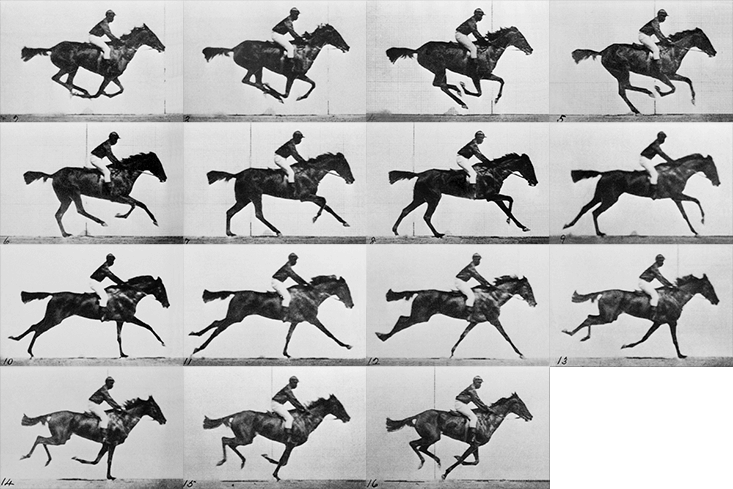
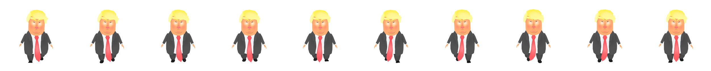
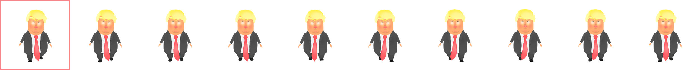

# Animation Sprite Sheet

Pensez au cinéma 📽️. Une pellicule contient de nombreuses images 🎞️. Chaque image représente une étape dans un mouvement.



Pour voir un mouvement continu, ces 15 images doivent s'afficher à un intervalle régulier. Plus le nombre d'images est élevé, plus le mouvement est fluide.

<video controls autoplay loop>
  <source src="../assets/spritesheet-horse-animated.mp4" type="video/mp4">
  Votre navigateur ne supporte pas la vidéo.
</video>

Les animations de type sprite sheet fonctionnent sur le même principe.


##  Fichier image

Il est nécessaire d'avoir une sprite sheet regroupant toutes les images clés *(keyframes)* constituant l'animation. Toutes les images clés doivent avoir la même dimension et être placées à une distance équivalente.



Par exemple, chaque image clé constituant l'animation de Donald Trump mesure 250px de large par 250px de haut. Puisque la sprite sheet est constituée de dix images clés, elle mesure donc 2500px de large pour une hauteur de 250px.




!!! warning "Dimension et espacement des images clés"
    Il est important que les images clés aient toutes la même dimension et soient placées à des distances équivalentes, sinon un *"glitch"* sera visible dans l'animation.


<br>

> 🛠️ **Outil** — [Responsive CSS Sprites](https://responsive-css.spritegen.com/)  
> Permet, si chaque image clé est un fichier séparé, de les combiner en une sprite sheet.

<br>

Les images sources ont parfois besoin d'être redimensionnées ou recadrées avant d'être utilisées pour générer une sprite sheet. Dans ce cas, l'option la plus efficace est d'utiliser une [Action Photoshop](https://tim-montmorency.com/timdoc/582-211/autres/actions-photoshop/).


##  Animation

Si nous pouvions *"flasher"* chaque image à intervalle régulier, nous pourrions voir l'animation.

Il faut d'abord créer un élément HTML dont la dimension correspond à celle d'une image clé. Dans cet exemple, 250px par 250px. Et y ajouter notre sprite sheet en `background-image`.

```css
.element {
  width: 250px;
  height: 250px;
  background-image: url(spritesheet-trump.png);
}
```

Ainsi, seule la première image clé devrait être visible.


<p class="codepen" data-theme-id="50210" data-height="300" data-pen-title="Spritesheet - Trump 1" data-default-tab="result" data-slug-hash="BaOaBOJ" data-user="tim-momo" style="height: 300px; box-sizing: border-box; display: flex; align-items: center; justify-content: center; border: 2px solid; margin: 1em 0; padding: 1em;">
  <span>See the Pen <a href="https://codepen.io/tim-momo/pen/BaOaBOJ">
  Spritesheet - Trump 1</a> by TIM Montmorency (<a href="https://codepen.io/tim-momo">@tim-momo</a>)
  on <a href="https://codepen.io">CodePen</a>.</span>
</p>
<script async src="https://public.codepenassets.com/embed/index.js"></script>

<br> <br>

Il faut ensuite animer la propriété `background-position` de sorte que la sprite sheet se déplace vers la gauche et que toutes les images clés défilent une à la suite de l'autre.

Dans cet exemple, nous déplaçons donc la sprite sheet de sa largeur soit `-2500px` :


```css
@keyframes anim {
  from { background-position: 0px }
  to   { background-position: -2500px }
}

.element {
  animation: anim 1s infinite;
}
```


<p class="codepen" data-theme-id="50210" data-height="300" data-pen-title="Spritesheet - Trump 2" data-default-tab="result" data-slug-hash="QWVWLZV" data-user="tim-momo" style="height: 300px; box-sizing: border-box; display: flex; align-items: center; justify-content: center; border: 2px solid; margin: 1em 0; padding: 1em;">
  <span>See the Pen <a href="https://codepen.io/tim-momo/pen/QWVWLZV">
  Spritesheet - Trump 2</a> by TIM Montmorency (<a href="https://codepen.io/tim-momo">@tim-momo</a>)
  on <a href="https://codepen.io">CodePen</a>.</span>
</p>
<script async src="https://public.codepenassets.com/embed/index.js"></script>


<br> <br>

Malheureusement, l'effet n'est pas convaincant puisqu'il y a une interpolation sur la propriété `background-position`.

Il est néanmoins possible d'ajuster la propriété [`animation-timing-function`](../animation/#animation-timing-function) afin de remédier à cette situation. Plutôt que de lui donner une valeur telle que `ease` ou `linear`, il est possible de lui passer la fonction `steps()`. Cette dernière permet de spécifier le nombre d'étapes devant constituer l'animation.

Par exemple, nous avons dix images clés constituant l'animation de Donald Trump. Il faudra donc spécifier `steps(10)` :

```css
.element {
  animation: anim 1s steps(10) infinite;
}
```


<p class="codepen" data-theme-id="50210" data-height="300" data-pen-title="Spritesheet - Trump 3" data-default-tab="result" data-slug-hash="MWqWgzx" data-user="tim-momo" style="height: 300px; box-sizing: border-box; display: flex; align-items: center; justify-content: center; border: 2px solid; margin: 1em 0; padding: 1em;">
  <span>See the Pen <a href="https://codepen.io/tim-momo/pen/MWqWgzx">
  Spritesheet - Trump 3</a> by TIM Montmorency (<a href="https://codepen.io/tim-momo">@tim-momo</a>)
  on <a href="https://codepen.io">CodePen</a>.</span>
</p>
<script async src="https://public.codepenassets.com/embed/index.js"></script>


> 🙏 **Crédits** — Shout out à Denys Almaral et Jose Sinchicay pour l'[animation de Donald Trump](https://denysalmaral.com/2017/02/joining-images-to-create-sprite-sheet-update-to-px-spritesrender-script.html)!

<br> <br>

> 📝 **Exercice** — [Animation Sprite Sheet - Sonic Knuckles](exercices/sonic-knuckles/)  
> Pour cet exercice, vous devrez animer l'ancien rival et maintenant meilleur ami de Sonic : Knuckles!
