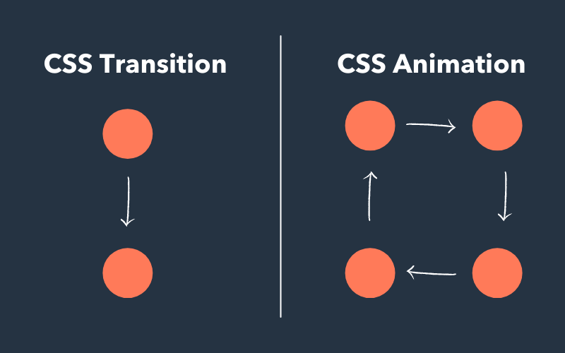

# Animation en CSS

Quelques ressources intéressantes à explorer

- [Animista](https://animista.net/): Une biliothèque d'animations CSS à la demande
- [UIverse](https://uiverse.io/): Une biliothèque Open-Source d'élément UI animés
- [Cool CSS Animations](https://coolcssanimation.com/)
- [Scroll driven animations](https://scroll-driven-animations.style/)
- [CSS Scroll Effects: 50 Interactive Animations to Try](https://prismic.io/blog/css-scroll-effects)


## Utiliser les animations CSS

[MDN : Utiliser les animations CSS](https://developer.mozilla.org/fr/docs/Web/CSS/Guides/Animations/Using)


## Règle CSS @keyframes

Les *keyframes* indiquent les étapes constituant une animation.

### 2 keyframes: `from` et `to`

Dans son expression la plus simple, il est possible de spécifier un état de départ `from` *(0%)* et un état de fin `to` *(100%)* :

```css
@keyframes nom-animation {
  from { transform: translateX(0%) }
  to   { transform: translateX(400%) }
}
```

Une interpolation sera effectuée entre ces deux états.


### Plusieurs keyframes `%`

Pour une animation plus élaborée, il est possible de spécifier plusieurs états représentant des pourcentages (%) de la durée totale de l'animation. Par exemple, `25%` représente un quart de la durée totale de l'animation.

```css
@keyframes nom-animation {
  0%,  100% { transform: translate(0%,    0%) }
  25%        { transform: translate(400%,  0%) }
  50%        { transform: translate(400%, 200%) }
  75%        { transform: translate(0%,   200%) }
}
```

<br>

<p class="codepen" data-theme-id="50210" data-height="400" data-pen-title="Animation-name / Keyframes" data-default-tab="result" data-slug-hash="QWBoOQm" data-user="tim-momo" style="height: 400px; box-sizing: border-box; display: flex; align-items: center; justify-content: center; border: 2px solid; margin: 1em 0; padding: 1em;">
  <span>See the Pen <a href="https://codepen.io/tim-momo/pen/QWBoOQm">
  Animation-name / Keyframes</a> by TIM Montmorency (<a href="https://codepen.io/tim-momo">@tim-momo</a>)
  on <a href="https://codepen.io">CodePen</a>.</span>
</p>
<script async src="https://public.codepenassets.com/embed/index.js"></script>

<small>À gauche, `@keyframes` utilisant un `from` et un `to`. <br>
À droite, `@keyframes` utilisant des pourcentages (%).</small>

> 📖 [En savoir plus sur la règle CSS `@keyframes` via MDN](https://developer.mozilla.org/fr/docs/Web/CSS/Reference/At-rules/@keyframes)

## Propriétés d'animation CSS

animation (raccourcie)
animation-composition
animation-delay
animation-direction
animation-duration
animation-fill-mode
animation-iteration-count
animation-name
animation-play-state
animation-timeline
animation-timing-function

<!--
## Événements

Toutes les animations, même celles d'une durée de 0 seconde, déclenchent des évènements d'animation.

Vous pouvez ensuite les capter en JavaScript pour exécuter autre chose...

- animationstart
- animationend
- animationcancel
- animationiteration

-->


### `animation-name`

Permet d'attribuer une animation à partir de son nom de référence en indiquant quel [@keyframes](#keyframes) appliquer à quel élément.

Par exemple, pour appliquer l'animation nommée `anim` à l'élément ayant la classe `.element` :

```css
.element {
  animation-name: anim;
}
```

> 📖 [En savoir plus sur la propriété `animation-name` via MDN](https://developer.mozilla.org/fr/docs/Web/CSS/Reference/Properties/animation-name)

---

### `animation-duration`

Définit la durée d'une animation. Ce nombre peut être en secondes ou en millisecondes. `1s = 1000ms`.

Par exemple, trois fois la même animation `animation-name: left-to-right`, mais à des durées différentes :

1. 1 seconde
2. 2 secondes
3. 3 secondes


<p class="codepen" data-theme-id="50210" data-height="400" data-pen-title="Animation-duration" data-default-tab="result" data-slug-hash="xxJBYEp" data-user="tim-momo" style="height: 400px; box-sizing: border-box; display: flex; align-items: center; justify-content: center; border: 2px solid; margin: 1em 0; padding: 1em;">
  <span>See the Pen <a href="https://codepen.io/tim-momo/pen/xxJBYEp">
  Animation-duration</a> by TIM Montmorency (<a href="https://codepen.io/tim-momo">@tim-momo</a>)
  on <a href="https://codepen.io">CodePen</a>.</span>
</p>
<script async src="https://public.codepenassets.com/embed/index.js"></script>

---

### `animation-timing-function`

Dicte à l'animation son rythme. Par exemple, dans l'animation précédente on remarque que chaque carré accélère progressivement avant de ralentir ensuite. Ce rythme est appelé `ease` et est celui par défaut des animations.

L'exemple suivant contient six fois la même animation, mais avec des rythmes différents :

1. `linear` — vitesse constante, n'accélère ou ne ralentit jamais ↗️
2. `ease` — accélère progressivement et ralentit en fin de parcours *(comportement par défaut)*
3. `ease-in-out` — commence lentement et ralentit en fin de parcours
4. `ease-in` — commence lentement ⤴️
5. `ease-out` — ralentit en fin de parcours ⤵️
6. `cubic-bezier` — rythme personnalisable via une courbe de Bézier

<p class="codepen" data-theme-id="50210" data-height="400" data-pen-title="Animation-timing-function" data-default-tab="result" data-slug-hash="KKBEQaM" data-user="tim-momo" style="height: 400px; box-sizing: border-box; display: flex; align-items: center; justify-content: center; border: 2px solid; margin: 1em 0; padding: 1em;">
  <span>See the Pen <a href="https://codepen.io/tim-momo/pen/KKBEQaM">
  Animation-timing-function</a> by TIM Montmorency (<a href="https://codepen.io/tim-momo">@tim-momo</a>)
  on <a href="https://codepen.io">CodePen</a>.</span>
</p>
<script async src="https://public.codepenassets.com/embed/index.js"></script>

<br>

> 📖 [En savoir plus sur la propriété `animation-timing-function` via MDN](https://developer.mozilla.org/fr/docs/Web/CSS/Reference/Properties/animation-timing-function)

<br>

> 🛠️ **Outil** — [Cubic-Bezier.com](https://cubic-bezier.com/)  
> Outil développé par Lea Verou permettant de créer et de visualiser facilement des courbes de Bézier.

---

### `animation-iteration-count`

Indique le nombre de fois qu'une animation doit être jouée *(par défaut `1`)*. Ce nombre peut être compris entre `0` et `∞` et accepte les fractions. Il est aussi possible de spécifier `infinite` pour qu'elle joue à l'infini.

Par exemple :

1. Joue 1×
2. Joue 2×
3. Joue à l'infini ♾️


<p class="codepen" data-theme-id="50210" data-height="400" data-pen-title="Animation-iteration-count" data-default-tab="result" data-slug-hash="LYBaQLB" data-user="tim-momo" style="height: 400px; box-sizing: border-box; display: flex; align-items: center; justify-content: center; border: 2px solid; margin: 1em 0; padding: 1em;">
  <span>See the Pen <a href="https://codepen.io/tim-momo/pen/LYBaQLB">
  Animation-iteration-count</a> by TIM Montmorency (<a href="https://codepen.io/tim-momo">@tim-momo</a>)
  on <a href="https://codepen.io">CodePen</a>.</span>
</p>
<script async src="https://public.codepenassets.com/embed/index.js"></script>

<br>

> 📖 [En savoir plus sur la propriété `animation-iteration-count` via MDN](https://developer.mozilla.org/fr/docs/Web/CSS/Reference/Properties/animation-iteration-count)


<br>

> 📝 **Exercice** — [Animation - Fantôme](https://tim-montmorency.com/timdoc/582-211/css/animation/exercices/fantome/)  
> Pour cet exercice nous allons animer le déplacement d'un fantôme 👻.

---

### `animation-delay`
`
Définit le délai d'attente avant de démarrer une animation. Par défaut, cette propriété est à `0s`. Si une valeur négative est attribuée, l'animation débutera déjà commencée, comme si l'équivalent de la valeur s'était déjà écoulée.

Par exemple :

1. Aucun délai
2. Délai de 0.5s
3. Délai d'une seconde


!!! warning "Le délai n'est effectif qu'au tout début"
    Le délai n'est effectif qu'au démarrage d'une animation. Si celle-ci joue plus d'une fois, le délai ne sera pas effectif à chaque itération.

<br>

> 📖 [En savoir plus sur la propriété `animation-delay` via MDN](https://developer.mozilla.org/fr/docs/Web/CSS/Reference/Properties/animation-delay)


---

### `animation-direction`

Indique la direction dans laquelle une animation doit être jouée.

Valeurs possibles :

- `normal` — du début vers la fin *(par défaut)*
- `reverse` — de la fin vers le début
- `alternate` — alterne entre `normal` et `reverse` à chaque itération
- `alternate-reverse` — alterne entre `reverse` et `normal` à chaque itération

Par exemple :

1. Normal
2. Renversé
3. Alterné

<p class="codepen" data-theme-id="50210" data-height="400" data-pen-title="Animation-direction" data-default-tab="result" data-slug-hash="VwBRQxg" data-user="tim-momo" style="height: 400px; box-sizing: border-box; display: flex; align-items: center; justify-content: center; border: 2px solid; margin: 1em 0; padding: 1em;">
  <span>See the Pen <a href="https://codepen.io/tim-momo/pen/VwBRQxg">
  Animation-direction</a> by TIM Montmorency (<a href="https://codepen.io/tim-momo">@tim-momo</a>)
  on <a href="https://codepen.io">CodePen</a>.</span>
</p>
<script async src="https://public.codepenassets.com/embed/index.js"></script>

<br>

> 📖 [En savoir plus sur la propriété `animation-direction` via MDN](https://developer.mozilla.org/fr/docs/Web/CSS/Reference/Properties/animation-direction)

<br>

> 📝 **Exercice** — [Animation - Pong](https://tim-montmorency.com/timdoc/582-211/css/animation/exercices/pong/)  
> Pour cet exercice vous devrez animer en CSS la balle d'un des premiers jeux vidéo d'arcade au monde, c'est-à-dire Pong!

> 📝 **Exercice** — [Animation - Yo-yo](https://tim-montmorency.com/timdoc/582-211/css/animation/exercices/yo-yo/)  
> Pour cet exercice nous allons animer l'un des plus vieux jeux au monde, le Yo-yo!

> 📝 **Exercice** — [Animation - Pendule](https://tim-montmorency.com/timdoc/582-211/css/animation/exercices/pendule/)  
> Pour cet exercice nous allons animer un pendule.

---

### `animation-fill-mode`

Indique l'apparence que doit prendre l'élément lorsque l'animation est terminée.

Valeurs possibles :

- `none` : redevient tel qu'avant l'animation *(par défaut)*
- `forwards` : garde l'apparence donnée par l'animation à la fin
- `backwards` : garde l'apparence donnée par l'animation au début
- `both` : combine l'apparence donnée par l'animation au début et à la fin

Par exemple :

1. 1 en vert : `animation-fill-mode : none`
2. 2 en bleu: `animation-fill-mode : forwards`

<p class="codepen" data-theme-id="50210" data-height="400" data-pen-title="Animation-fill-mode" data-default-tab="result" data-slug-hash="KKBEoKX" data-user="tim-momo" style="height: 400px; box-sizing: border-box; display: flex; align-items: center; justify-content: center; border: 2px solid; margin: 1em 0; padding: 1em;">
  <span>See the Pen <a href="https://codepen.io/tim-momo/pen/KKBEoKX">
  Animation-fill-mode</a> by TIM Montmorency (<a href="https://codepen.io/tim-momo">@tim-momo</a>)
  on <a href="https://codepen.io">CodePen</a>.</span>
</p>
<script async src="https://public.codepenassets.com/embed/index.js"></script>

<br>

> 📖 [En savoir plus sur la propriété `animation-fill-mode` via MDN](https://developer.mozilla.org/fr/docs/Web/CSS/Reference/Properties/animation-fill-mode)

<br>


> 📝 **Exercice** — [Animation - Billes](https://tim-montmorency.com/timdoc/582-211/css/animation/exercices/billes/)  
> Pour cet exercice nous allons animer 5 billes blanches.

---

### `animation-play-state`

Indique si une animation doit jouer ou être en pause.

Valeurs possibles :

- `running` — l'animation joue
- `paused` — l'animation est en pause

<p class="codepen" data-theme-id="50210" data-height="400" data-pen-title="Animation-play-state" data-default-tab="result" data-slug-hash="JjBzLGz" data-user="tim-momo" style="height: 400px; box-sizing: border-box; display: flex; align-items: center; justify-content: center; border: 2px solid; margin: 1em 0; padding: 1em;">
  <span>See the Pen <a href="https://codepen.io/tim-momo/pen/JjBzLGz">
  Animation-play-state</a> by TIM Montmorency (<a href="https://codepen.io/tim-momo">@tim-momo</a>)
  on <a href="https://codepen.io">CodePen</a>.</span>
</p>
<script async src="https://public.codepenassets.com/embed/index.js"></script>

<br>

> 📖 [En savoir plus sur la propriété `animation-play-state` via MDN](https://developer.mozilla.org/fr/docs/Web/CSS/Reference/Properties/animation-play-state)

<br>

> 📝 **Exercice** — [Animation - New Super Luigi](https://tim-montmorency.com/timdoc/582-211/css/animation/exercices/new-super-luigi/)  
> Pour cet exercice, vous devrez recréer une scène du château du niveau Frosted Glacier du jeu New Super Luigi sur la Wii U.

---

### Animations activées par le *scroll*, sans JavaScript!

*NOUVEAU NOUVEAU NOUVEAU*

- [AlsaCreation: Les animations liées au scroll avec css](https://www.alsacreations.com/article/lire/1935-animations-liees-au-scroll-en-css.html) (FR)
- [MDN: `animation-timeline: scroll`](https://developer.mozilla.org/fr/docs/Web/CSS/Reference/Properties/animation-timeline/scroll) (FR)
- [MDN: CSS scroll-driven animations](https://developer.mozilla.org/en-US/docs/Web/CSS/Guides/Scroll-driven_animations) (EN)
- [Webkit: A guide to Scroll-driven Animations with just CSS](https://webkit.org/blog/17101/a-guide-to-scroll-driven-animations-with-just-css/) (EN)


#### `animation-timeline`

`animation-timeline: scroll()` et `animation-timeline: view()` : les animations pilotées par le *scroll* sont maintenant supportées dans tous les navigateurs majeurs (Safari 26 vient de les adopter en 2025, Chrome/Firefox depuis 2023).

C'est une révolution : zéro JavaScript pour des *effets de parallaxe*, d'*apparition au scroll*, etc.


#### `animation-trigger`

Propriété CSS très récent (support de Chrome 145, fin 2025), permet de déclencher une animation CSS à un `offset` de *scroll* précis, sans `IntersectionObserver`.


## Démo résumé

<p class="codepen" data-theme-id="50210" data-height="600" data-pen-title="DEMO animation css au scoll timeline, trigger, stagger etc" data-version="2" data-default-tab="result" data-slug-hash="VYKovOO" data-user="tim-momo" style="height: 600px; box-sizing: border-box; display: flex; align-items: center; justify-content: center; border: 2px solid; margin: 1em 0; padding: 1em;">
  <span>See the Pen <a href="https://codepen.io/editor/tim-momo/pen/019dc1e6-61a8-7a86-a046-6cba82ddab35">
  DEMO animation css au scoll timeline, trigger, stagger etc</a> by TIM Montmorency (<a href="https://codepen.io/tim-momo">@tim-momo</a>)
  on <a href="https://codepen.io">CodePen</a>.</span>
</p>
<script async src="https://public.codepenassets.com/embed/index.js"></script>


## Différence entre transition et animation

| TRANSITIONS CSS | ANIMATIONS CSS |
| --- | --- |
| Ne peut passer que de l'état initial à l'état final — pas d'étapes intermédiaires | Peut passer de l'état initial à l'état final, avec des étapes intermédiaires |
| Ne peut être exécutée qu'une seule fois | Peut tourner en boucle à l'infini grâce à `animation-iteration-count` |
| Nécessite un déclencheur (comme le survol de la souris) | Peut être déclenchée ou s'exécuter automatiquement |
| S'exécute en avant lorsque déclenchée, en arrière lorsque supprimée | Peut s'exécuter en avant, en arrière ou dans des directions différentes |
| Plus facile à utiliser avec JavaScript | Plus difficile à utiliser avec JavaScript |
| Meilleure pour créer un changement simple d'un état à un autre | Idéale pour créer une série complexe de mouvements |



<small>Source : [Hubspot](https://blog.hubspot.com/website/css-transition-vs-animation)</small>
