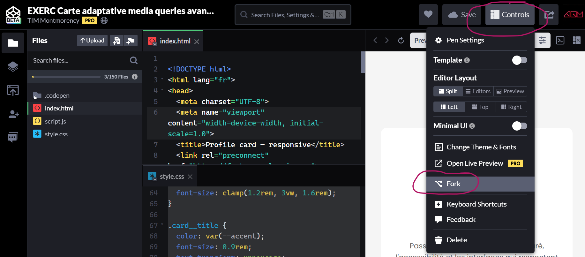

# Composants adaptatifs intelligents

<!-- https://laconsole.dev/formations/css/container-queries -->

Jusqu'ici, vos composants s'adaptaient à la *taille de l'écran*. Maintenant, ils vont s'adapter à la *taille de leur conteneur* : ce qui change tout à la façon d'écrire du CSS réutilisable!


<!-- badges mkdocs-badges à installer correctement....

[](https://squidfunk.github.io/mkdocs-material/)

|Example badge|works|

S|container queries||  S|media queries|| S|@container||  S|container-type|| S|composants réutilisables||

-->

## Pourquoi les media queries ne suffisent pas

Avec les *media queries classiques*, on dit au composant comment se comporter selon la largeur totale de la *fenêtre du navigateur*. Ça fonctionne bien dans des cas simples, mais dès qu'on place le même composant dans des contextes différents, ça devient un cauchemar.


## Exemple concret du problème

> Pour mieux observer 🔎 le phénomène dans le CodePen ci-dessous, cliquer sur **Edit on CodePen** et redimensionner la fenêtre. Vous pouvez aussi explorer le code CSS.

Une carte `.card` affichée en pleine largeur doit être en *format horizontal*.

La même `.card` placée dans une *sidebar* très étroite doit être en *format vertical*.

Avec les media queries, impossible de le savoir: le composant *ne connaît pas son contexte*.

> Pour mieux observer 🔎 le phénomène dans le CodePen ci-dessous, cliquer sur **Edit on CodePen** et redimensionner la fenêtre. Vous pouvez aussi explorer le code CSS.

<p class="codepen" data-theme-id="50210" data-height="550" data-pen-title="DEMO sans Container queries" data-version="2" data-default-tab="result" data-slug-hash="XJjomrv" data-user="tim-momo" style="height: 550px; box-sizing: border-box; display: flex; align-items: center; justify-content: center; border: 2px solid; margin: 1em 0; padding: 1em;">
  <span>See the Pen <a href="https://codepen.io/editor/tim-momo/pen/019d89aa-76a0-774e-ae00-525ae307729c">
  DEMO sans Container queries</a> by TIM Montmorency (<a href="https://codepen.io/tim-momo">@tim-momo</a>)
  on <a href="https://codepen.io">CodePen</a>.</span>
</p>
<script async src="https://public.codepenassets.com/embed/index.js"></script>


Imaginez : vous créez un composant `.card` avec une media query qui dit *« à partir de 600px, passe en horizontal »*. 

Mais 600px, c'est 600px de *quoi* ? De l'écran (viewport), pas du conteneur de la carte. 

Donc si la carte est dans une colonne de 300px sur un grand écran, elle sera quand même en horizontal, et ça casse tout.

```css
/* ❌ Le problème : on se fie à la fenêtre, pas au conteneur */
@media (min-width: 600px) {
  .card {
    flex-direction: row; /* 600px de l'ÉCRAN... pas de la carte */
  }
}
```


## La solution: *Container Queries*


Les **container queries** (`@container`) permettent à un composant de s'adapter à la taille de son *propre conteneur parent*, pas à celle de l'écran. C'est exactement ce dont on a besoin pour créer des composants vraiment réutilisables.

## ✦ Syntaxe de base : deux étapes

1. **Définir le conteneur**
  avec un nom `container-name` et un type `container-type`
2. **Déclarer un container query** 
  `@container nom-du-container (min-width: 400px){ }`

### ✦ 1. Définir le conteneur

Pour déclarer un container query, il faut d'abord *définir un conteneur* !

Cela équivaut à dire à la balise parent quelle incarnera le *contexte de mesure*, qu'elle sera *conteneur du composant à adapter*.

Cela se fait via les propriétés `container-type` et `container-name` sur le parent du composant. 


```css title="Définir le conteneur sur le PARENT"
/* Étape 1 : Définir le conteneur */
.card-wrapper {
  container-type: inline-size;
  container-name: card-wrap;
}
```

!!! tip "Le plus courant: inline-size"
    Le type le plus courant: `container-type: inline-size` avec lequel mesure seulement la largeur (l'axe inline).

    Les autres type de conteneur sont:
    - `container-type: size` (largeur ET hauteur) 
    - `container-type: normal` (pas de mesure, mais le nom est disponible pour du style conditionnel).


### ✦ 2. Déclarer la requête *Container query*

Écrire la *container query* : « si mon conteneur fait X de large (ou plus), alors... ».


```css title="Déclarer la requête"
/* Étape 2 : Déclarer la requête avec @container 
et le nom attribué au conteneur plus haut, 
dans ce cas-ci, nous l'avons appelé `card-wrap` */
@container card-wrap (min-width: 400px) {
  .card {
    flex-direction: row;
    gap: 1.5rem;
  }
  .card__image {
    width: 30%;
    flex-shrink: 0;
  }
}
```


<!-- CODEPEN: Exemple interactif — Carte qui s'adapte à son conteneur -->
### Exemple interactif: Carte qui s'adapte à son conteneur

!!! example "🔎 À observer"
    Ouvrez l'exemple ci-dessous en cliquant sur **Edit on CodePen**. Redimensionnez la fenêtre. La carte dans la colonne étroite reste verticale même sur grand écran. La carte en pleine largeur passe en horizontal. C'est parce que chaque carte répond à son *conteneur*, pas à l'écran.

<p class="codepen" data-theme-id="50210" data-height="600" data-pen-title="DEMO Container queries - Carte qui s'adapte à son conteneur" data-version="2" data-default-tab="result" data-slug-hash="PwGxZNM" data-user="tim-momo" style="height: 600px; box-sizing: border-box; display: flex; align-items: center; justify-content: center; border: 2px solid; margin: 1em 0; padding: 1em;">
  <span>See the Pen <a href="https://codepen.io/editor/tim-momo/pen/019d7f51-4aed-7415-9a6b-a495b73df6ea">
  DEMO Container queries - Carte qui s'adapte à son conteneur</a> by TIM Montmorency (<a href="https://codepen.io/tim-momo">@tim-momo</a>)
  on <a href="https://codepen.io">CodePen</a>.</span>
</p>


## Media queries vs Container queries

Les deux ont leur utilité, ce ne sont pas des ennemis. La clé c'est de savoir **quand utiliser lequel**.

| | 📐 MEDIA QUERIES | 📦 CONTAINER QUERIES |
|---|---|---|
| Se base sur | La **taille de l'écran** | La **taille du conteneur parent** |
| Idéal pour | Le **layout global** (sidebar, colonnes de page) | Les **composants placés partout** |
| Réutilisabilité | Moins flexible | Composants **vraiment indépendants** |
| Support | Universel | Tous navigateurs récents ✓ |
| Déclaration | Depuis le composant lui-même | Nécessite de déclarer le conteneur sur le parent |

### La règle de décision simple

Posez-vous la question : **est-ce que le changement de style concerne la mise en page globale de la page, ou le comportement d'un composant réutilisable ?**

```css
/* ✅ Media query → décisions de LAYOUT PAGE */
@media (min-width: 768px) {
  .page-layout {
    grid-template-columns: 280px 1fr; /* la sidebar apparaît */
  }
}

/* ✅ Container query → comportement d'affichage d'un COMPOSANT */
@container (min-width: 350px) {
  .product-card {
    flex-direction: row; /* la carte se met en horizontal */
  }
}
```

<!-- CODEPEN: Comparaison côte à côte — Media query vs Container query -->

<p class="codepen" data-theme-id="50210" data-height="800" data-pen-title="DEMO Container queries - Comparaison media query vs container query" data-version="2" data-default-tab="result" data-slug-hash="zxKMrKp" data-user="tim-momo" style="height: 800px; box-sizing: border-box; display: flex; align-items: center; justify-content: center; border: 2px solid; margin: 1em 0; padding: 1em;">
  <span>See the Pen <a href="https://codepen.io/editor/tim-momo/pen/019d7f57-9ee3-7b64-8aef-1f0c2693a24d">
  DEMO Container queries - Comparaison media query vs container query</a> by TIM Montmorency (<a href="https://codepen.io/tim-momo">@tim-momo</a>)
  on <a href="https://codepen.io">CodePen</a>.</span>
</p>


## Nommer ses conteneurs

Quand on a plusieurs conteneurs imbriqués, nommer ses conteneurs devient **essentiel pour la clarté**. Sans nom, `@container` cible le conteneur parent le plus proche. Avec un nom, on peut cibler n'importe quel ancêtre.

```css
/* Déclarer deux conteneurs différents */
.page {
  container-type: inline-size;
  container-name: page;
}

.sidebar {
  container-type: inline-size;
  container-name: sidebar;
}

/* Cibler un conteneur nommé précis */
@container page (min-width: 900px) {
  .widget { flex-direction: row; }
}

@container sidebar (max-width: 250px) {
  .widget { font-size: 0.85rem; }
}
```

!!! info Bonne pratique
    💡 Même si vous n'avez qu'un seul conteneur, prenez l'habitude de le nommer. Ça documente l'intention, ça évite les surprises si vous ajoutez un conteneur parent plus tard, et ça rend le code beaucoup plus lisible.


## Architecture CSS pour composants adaptatifs

Une bonne architecture isole chaque composant dans son propre contexte. L'idée : **le composant ne sait pas où il va être placé**: il s'adapte simplement à l'espace disponible.

### Le pattern "wrapper conteneur"

On déclare le `container` sur un élément *wrapper* autour du composant, pas sur le composant lui-même. Pourquoi ? Parce qu'un élément ne peut pas se mesurer lui-même (ça créerait une dépendance circulaire).

```html title="HTML - Pattern recommandé : wrapper + composant"
<div class="card-container"> <!-- wrapper conteneur -->
  <article class="card"> <!-- composant carte -->
    
    <h2 class="card__title">Titre de la carte</h2>
    <p class="card__excerpt">Extrait de la carte...</p>
  </article>
</div>
```

```css title="CSS - Pattern recommandé : wrapper + composant"
/* 1. Le wrapper déclare le contexte */
.card-container {
  container-type: inline-size;
  container-name: card-container;
  /* le wrapper n'a pas de style visuel propre */
}

/* 2. Le composant définit ses styles de base (mobile-first) */
.card {
  display: flex;
  flex-direction: column;
  gap: 1rem;
  background: var(--surface);
  border-radius: var(--radius);
  padding: 1.25rem;
}
/* Résumé de l'article (excerpt) CACHÉ sur petit conteneur */
.card__excerpt  { display: none; } 

/* 3. Le composant s'adapte via @container */
@container card-container (min-width: 400px) {
  .card           { flex-direction: row; }
  .card__image    { width: 35%; flex-shrink: 0; }
}

@container card-container (min-width: 600px) {
  .card__title    { font-size: 1.5rem; }
   /* Résumé de l'article (excerpt) AFFICHÉ sur grand conteneur */
  .card__excerpt  { display: block; } 
 
}
```

#### Exemple interactif

!!! example "🔎 À observer"
    Redimensionnez la fenêtre et observez les trois cartes. Elles s'adaptent chacune à leur conteneur, pas à l'écran. La carte dans la sidebar reste verticale même sur grand écran, tandis que les autres passent en horizontal.

<!-- CODEPEN: Le même composant dans 3 contextes différents -->

<p class="codepen" data-theme-id="50210" data-height="750" data-pen-title="DEMO Container queries - même composant dans 3 contextes différents" data-version="2" data-default-tab="result" data-slug-hash="azmQdmY" data-user="tim-momo" style="height: 750px; box-sizing: border-box; display: flex; align-items: center; justify-content: center; border: 2px solid; margin: 1em 0; padding: 1em;">
  <span>See the Pen <a href="https://codepen.io/editor/tim-momo/pen/019d7f59-464c-7bbd-9e9f-0dae69e417d1">
  DEMO Container queries - même composant dans 3 contextes différents</a> by TIM Montmorency (<a href="https://codepen.io/tim-momo">@tim-momo</a>)
  on <a href="https://codepen.io">CodePen</a>.</span>
</p>


### *Unités* : nouvelles unités de mesure pour container queries

<!-- https://laconsole.dev/formations/css/container-queries -->

Tout comme les media queries ont leurs propres unités, les *container queries* introduisent des **unités relatives au conteneur** :


| Unité  | Description                                          | Exemple d’usage           |Équivalent Viewport|
|--------|------------------------------------------------------|---------------------------|-------------------|
| `cqw`  | 1% de la largeur du conteneur                        | `width: 50cqw;`           | `vw`              |
| `cqh`  | 1% de la hauteur du conteneur                        | `height: 100cqh;`         | `vh`              |
| `cqmin`| La plus petite des deux dimensions (`cqw` ou `cqh`)  | `font-size: 5cqmin;`      | `vmin`            |
| `cqmax`| La plus grande des deux dimensions (`cqw` ou `cqh`)  | `font-size: 5cqmax;`      | `vmax`            |
| `cqi`  | 1% de la taille du conteneur sur l'axe inline (largeur)| `font-size: 20cqi;`     | `vi`              |
| `cqb`  | 1% de la taille du conteneur sur l'axe block (hauteur)| `font-size: 20cqb;`      | `vb`              |


<!--
- `cqw` : 1% de la largeur du conteneur
- `cqh` : 1% de la hauteur du conteneur
- `cqmin` : la plus petite des deux dimensions (entre cqw et cqh)
- `cqmax` : la plus grande des deux dimensions (entre cqw et cqh)
- `cqi` : 1% de la taille du conteneur sur l'axe inline (généralement la largeur du conteneur)
- `cqb` : 1% de la taille du conteneur sur l'axe block (généralement la hauteur du conteneur)
-->

```css
@container (min-width: 300px) {
  .card__title {
    /* cqi = container query inline (= largeur du conteneur) */
    font-size: clamp(1rem, 5cqi, 2rem);
  }
}
```

!!! tip Analogie
    `cqw` ou `cqi` sont aux container queries ce que `vw` est aux media queries, mais relatifs au conteneur plutôt qu'à la fenêtre.


## Cas d'usage réels

Les container queries ne servent pas qu'aux cartes. Voici d'autres situations concrètes où ils font une différence.

### Navigation qui se replie

```html title="HTML - Navigation qui se replie"
<div class="nav-wrapper">
  <nav class="nav"> <!-- composant nav -->
    <button class="nav__burger">☰</button>
    <ul class="nav__links">
      <li class="nav__item"><a href="#">Accueil</a></li>
      <li class="nav__item"><a href="#">À propos</a></li>
      <li class="nav__item"><a href="#">Contact</a></li>
    </ul>
  </nav>
</div>
```

```css title="CSS - Navigation qui se replie"
.nav-wrapper {
  container-type: inline-size;
  container-name: nav;

  /* ou la version racourcie: */
  container: nav / inline-size;
}

/* Par défaut (mobile first) : navigation hamburger */
.nav__links  { display: none; }
.nav__burger { display: block; }

/* Si l'en-tête est assez large : navigation complète */
@container nav (min-width: 500px) {
  .nav__links  { display: flex; }
  .nav__burger { display: none; }
}
```

### Liste de tags qui se réorganise


```html  title="HTML - Liste de tags qui se réorganise"
<div class="tags-wrapper">
  <div class="tags-list"> <!-- composant liste de badges -->
    <span class="tag">CSS</span> <!-- composant d'un badge -->
    <span class="tag">JavaScript</span> <!-- composant d'un badge -->
    <span class="tag">HTML</span> <!-- composant d'un badge -->
  </div>
</div>
```

```css title="CSS - Liste de tags qui se réorganise"
.tags-wrapper {
  container-type: inline-size;
  container-name: tags;

  /* ou la version racourcie: */
  container: tags / inline-size;
}

.tags-list {
  /* les tags s'empilent par défaut sur une seule colonne */
  display: flex;
  flex-direction: column;
  gap: 0.5rem;
}

.tag {
  padding: 0.5rem 1rem;
  background: var(--surface);
  border-radius: 999px;
  font-size: 0.875rem;
}

@container tags (min-width: 400px) {
  .tags-list {
    /* sur conteneur plus large, les tags s'alignent en rangée
     et passent à la 2e ou 3e ligne si besoin */
    flex-direction: row;
    flex-wrap: wrap;
  }
}

@container tags (min-width: 600px) {
  .tag{
    /* plus de padding et texte plus gros sur conteneur large */
    padding: 0.75rem 1.5rem;
    font-size: 1rem;
  }
}
```

### Liste de cartes qui s'adapte

```html title="HTML - Liste de cartes qui s'adapte"
<div class="cards-wrapper">

  <div class="cards-list"> <!-- composant liste de cartes -->
    <article class="card"> <!-- composant carte -->
      
      <p class="card__desc">...</p>
      ...
    </article>
    <article class="card"> <!-- composant carte -->
      
      <p class="card__desc">...</p>
    </article>
  </div>

</div>

```

```css title="CSS - Liste de cartes qui s'adapte"
.cards-wrapper {
  container-type: inline-size;
  container-name: cards;

  /* ou la version racourcie: */
  container: cards / inline-size;
}

.cards-list {
  display: flex;
  flex-direction: column;
  gap: 1rem;
}

@container cards (min-width: 500px) {
  .cards-list {
    flex-direction: row;
    flex-wrap: wrap;
  }

  .card {
    flex-grow: 1;
    flex-shrink: 1;
    /* chaque carte prend au moins 200px */
    flex-basis: 200px; 
  }
}
```


<!-- Grille Grid mais ils ne l'ont pas vu... 
### Grille qui s'auto-organise

```css
.grid-wrapper { 
  container-type: inline-size;
  container-name: grid;

  /* ou la version racourcie: */
  container: grid / inline-size;
}

.auto-grid {
  display: grid;
  grid-template-columns: 1fr;
  gap: 1rem;
}


@container grid (min-width: 400px) {
  .auto-grid { grid-template-columns: repeat(2, 1fr); }
}

@container grid (min-width: 700px) {
  .auto-grid { grid-template-columns: repeat(3, 1fr); }
}
```
-->

## Exercice: Transformer un composant media-query en container-query

<span class="important-label">IMPORTANT</span> : Connectez-vous à CodePen d'abord et ensuite faites un *FORK* du Pen de départ pour l'enregistrer dans votre compte, archiver l'exercice et pouvoir avoir un lien unique vers votre exercice complété pour la remise.

<!--  -->

[Pen de départ | FAIRE UN FORK](https://codepen.io/editor/tim-momo/pen/019d7f5b-5857-7693-85e5-47c41b4acdf3){ .md-button }

<!-- CODEPEN: Atelier — Transformer un composant media-query en container-query -->

<p class="codepen" data-theme-id="50210" data-height=750" data-pen-title="EXERC container queries -  transformer un composant media-query en container-query" data-version="2" data-default-tab="result" data-slug-hash="ByLGjQy" data-user="tim-momo" style="height: 750px; box-sizing: border-box; display: flex; align-items: center; justify-content: center; border: 2px solid; margin: 1em 0; padding: 1em;">
  <span>See the Pen <a href="https://codepen.io/editor/tim-momo/pen/019d7f5b-5857-7693-85e5-47c41b4acdf3">
  EXERC container queries -  transformer un composant media-query en container-query</a> by TIM Montmorency (<a href="https://codepen.io/tim-momo">@tim-momo</a>)
  on <a href="https://codepen.io">CodePen</a>.</span>
</p>


## Support navigateurs

Les container queries sont **supportées par tous les navigateurs modernes** depuis 2023. En 2026, vous pouvez les utiliser en production sans souci.

```css
/* Pas besoin de @supports pour la plupart des projets.
   Si vous devez quand même gérer d'anciens navigateurs : */
@supports (container-type: inline-size) {
  .card-wrapper {
    container-type: inline-size;
  }
  @container (min-width: 400px) {
    .card { flex-direction: row; }
  }
}

/* Fallback pour navigateurs non supportés */
.card {
  flex-direction: column; /* toujours vertical par défaut */
}
```

> ✅ Chrome 105+, Firefox 110+, Safari 16+ — tous supportent `@container`. En 2026, la couverture mondiale dépasse 95 %.


## Résumé

1. **Définissez le conteneur sur le parent** avec `container: nom / inline-size`.
2. **Déclarez la requête container query** avec `@container nom (min-width: Xpx) { ... }`.
3. **Styles de base = mobile-first**. Les container queries enrichissent, elles ne remplacent pas.
4. **Media queries pour le layout global**, container queries pour les composants réutilisables.
5. **Toujours nommer ses conteneurs** pour la lisibilité et la maintenabilité.