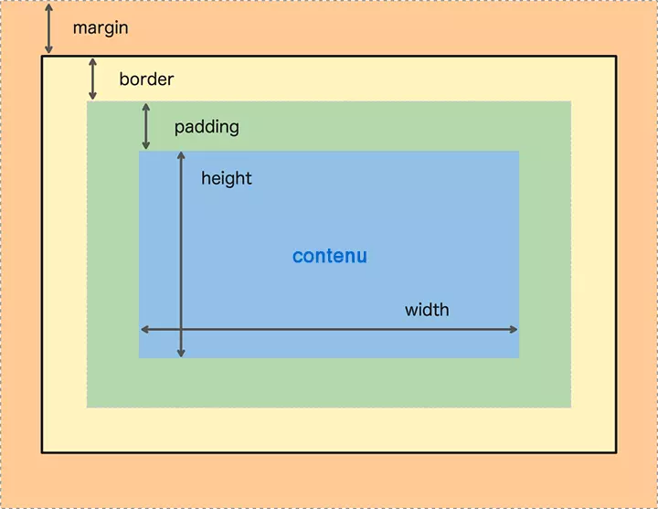
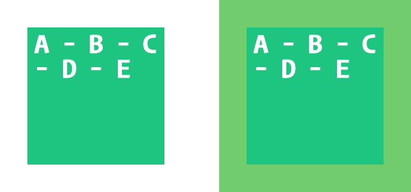
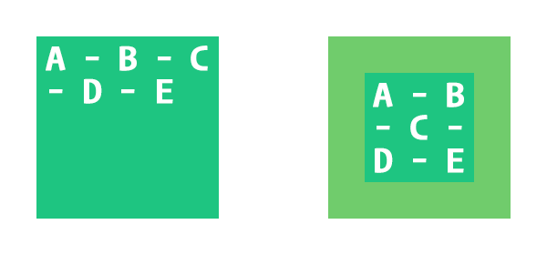

# Résumé CSS vu en Web 1

Voici un résumé de ce que vous avez appris en CSS lors de votre cours de Web 1 la session dernière. Vous pouvez vous y référer lorsque vous aurez besoin de rafraîchir vos connaissances sur les bases du CSS.

## Règle CSS

Une règle CSS est constituée d'un sélecteur CSS, d'accolades `{…}` et de tout ce qui se trouve entre elles.

Par exemple, voici une règle CSS simple :

```css
p {
  font-size: 16px;
  font-family: Arial;
}
```


## Sélecteur

Le sélecteur est ce qui se trouve avant l'accolade ouvrante.

### Groupe de sélecteurs

Un groupe de sélecteurs est le nom donné lorsque plusieurs sélecteurs sont présents avant une accolade.

Par exemple :

```css
.article p {
  font-size: 16px;
  font-family: Arial;
}
```


!!! info 
    Dans un groupe de sélecteurs, les sélecteurs sont lus de droite à gauche ⬅️.

    Autrement dit, dans l'exemple précédent, le navigateur sélectionnerait en premier temps tous les paragraphes de la page. Ensuite, il ne garderait que ceux ayant un ancêtre possédant la classe `.article`.

### Ancêtre

Le ou les ancêtres sont les sélecteurs séparés par un espace se trouvant à gauche du dernier sélecteur.

Par exemple :

```html
<div class="article">
  <div class="intro">
    <p>Lorem ipsum</p>
  </div>
</div>
```

- La classe `.intro` est le parent du paragraphe.
- La classe `.article` est le grand-parent du paragraphe.
- `.intro` et `.article` sont tous deux des ancêtres du paragraphe.


!!! info
    Puisque les règles CSS sont lues de droite à gauche ⬅️, il n'est pas nécessaire de nommer tous les sélecteurs disponibles dans une règle CSS.

    `.article p { ... }` sélectionnera tous les paragraphes à l'intérieur de l'élément avec la classe `.article`, même si `.intro` est omis.


## Déclaration

Par exemple, le code suivant est une déclaration :

```css
font-size: 16px;
```

Un **bloc de déclaration** peut en contenir plusieurs :

```css
font-size: 16px;
font-family: Arial;
```

### Propriété & Valeur

Chaque déclaration est constituée d'une **propriété** et d'une **valeur**.


## Padding

La propriété `padding` définit l'espace entre le contenu et ses extrémités.

Par défaut, cette propriété a une valeur de `0`.

Lorsqu'une seule valeur est fournie, celle-ci est appliquée aux 4 côtés de l'élément.

<p class="codepen" data-theme-id="50210" data-height="300" data-pen-title="CSS" data-default-tab="result" data-slug-hash="rNrKjeY" data-user="tim-momo" style="height: 300px; box-sizing: border-box; display: flex; align-items: center; justify-content: center; border: 2px solid; margin: 1em 0; padding: 1em;">
  <span>See the Pen <a href="https://codepen.io/tim-momo/pen/rNrKjeY">CSS — padding</a> by TIM Montmorency (<a href="https://codepen.io/tim-momo">@tim-momo</a>)
  on <a href="https://codepen.io">CodePen</a>.</span>
</p>
<script async src="https://public.codepenassets.com/embed/index.js"></script>


!!! warning
    La propriété `padding` n'accepte pas les valeurs négatives.

> 📖  Pour en savoir plus, consultez la page [padding](https://developer.mozilla.org/fr/docs/Web/CSS/padding) de MDN.

---

### Sous-propriétés

- `padding-top`
- `padding-right`
- `padding-bottom`
- `padding-left`

Par exemple:

<p class="codepen" data-theme-id="50210" data-height="300" data-pen-title="CSS" data-default-tab="result" data-slug-hash="OJwEWbV" data-user="tim-momo" style="height: 300px; box-sizing: border-box; display: flex; align-items: center; justify-content: center; border: 2px solid; margin: 1em 0; padding: 1em;">
  <span>See the Pen <a href="https://codepen.io/tim-momo/pen/OJwEWbV">CSS — padding sous-propriétés</a> by TIM Montmorency (<a href="https://codepen.io/tim-momo">@tim-momo</a>)
  on <a href="https://codepen.io">CodePen</a>.</span>
</p>
<script async src="https://public.codepenassets.com/embed/index.js"></script>

---

### Syntaxe courte

<p class="codepen" data-theme-id="50210" data-height="300" data-pen-title="CSS" data-default-tab="result" data-slug-hash="BaPVpRj" data-user="tim-momo" style="height: 300px; box-sizing: border-box; display: flex; align-items: center; justify-content: center; border: 2px solid; margin: 1em 0; padding: 1em;">
  <span>See the Pen <a href="https://codepen.io/tim-momo/pen/BaPVpRj">CSS — padding syntaxe courte</a> by TIM Montmorency (<a href="https://codepen.io/tim-momo">@tim-momo</a>)
  on <a href="https://codepen.io">CodePen</a>.</span>
</p>
<script async src="https://public.codepenassets.com/embed/index.js"></script>

---

### Ratio à partir de %

Le ratio **se base toujours sur la largeur** de l'élément.

Afin d'obtenir un format 16/9, il suffit de ramener la valeur de hauteur de cette fraction en pourcentage, soit `9 ÷ 16 × 100% = 56.25%` :

```css
.element {
  width: 100%;
  height: 0;
  padding-bottom: 56.25%; /* 16/9 */
}
```

Cet élément sera donc toujours dans un format 16/9, peu importe la largeur de son parent.


## Margin

La propriété `margin` définit un espace vide devant être respecté autour d'un élément — bref, une marge.

Par défaut, cette propriété a une valeur de `0`.

!!! info
    Contrairement à `padding`, `margin` accepte les valeurs négatives.

Lorsqu'une seule valeur est fournie, celle-ci est appliquée aux 4 côtés de l'élément.

!!! warning
    Les éléments ayant un `display: inline` *(span, a, etc.)* ne sont pas affectés par les marges verticales ↕️ par défaut.

<p class="codepen" data-theme-id="50210" data-height="300" data-pen-title="CSS" data-default-tab="result" data-slug-hash="WNKyjGW" data-user="tim-momo" style="height: 300px; box-sizing: border-box; display: flex; align-items: center; justify-content: center; border: 2px solid; margin: 1em 0; padding: 1em;">
  <span>See the Pen <a href="https://codepen.io/tim-momo/pen/WNKyjGW">CSS — margin</a> by TIM Montmorency (<a href="https://codepen.io/tim-momo">@tim-momo</a>)
  on <a href="https://codepen.io">CodePen</a>.</span>
</p>
<script async src="https://public.codepenassets.com/embed/index.js"></script>


> Pour en savoir plus, consultez la page [margin](https://developer.mozilla.org/fr/docs/Web/CSS/margin) de MDN.


### Sous-propriétés

- `margin-top`
- `margin-right`
- `margin-bottom`
- `margin-left`

<p class="codepen" data-theme-id="50210" data-height="300" data-pen-title="CSS" data-default-tab="result" data-slug-hash="xxJzddd" data-user="tim-momo" style="height: 300px; box-sizing: border-box; display: flex; align-items: center; justify-content: center; border: 2px solid; margin: 1em 0; padding: 1em;">
  <span>See the Pen <a href="https://codepen.io/tim-momo/pen/xxJzddd">CSS</a> by TIM Montmorency (<a href="https://codepen.io/tim-momo">@tim-momo</a>)
  on <a href="https://codepen.io">CodePen</a>.</span>
</p>
<script async src="https://public.codepenassets.com/embed/index.js"></script>

---

### Syntaxe courte

<p class="codepen" data-theme-id="50210" data-height="300" data-pen-title="CSS" data-default-tab="result" data-slug-hash="xxJzdXr" data-user="tim-momo" style="height: 300px; box-sizing: border-box; display: flex; align-items: center; justify-content: center; border: 2px solid; margin: 1em 0; padding: 1em;">
  <span>See the Pen <a href="https://codepen.io/tim-momo/pen/xxJzdXr">CSS — margin syntaxe courte</a> by TIM Montmorency (<a href="https://codepen.io/tim-momo">@tim-momo</a>)
  on <a href="https://codepen.io">CodePen</a>.</span>
</p>
<script async src="https://public.codepenassets.com/embed/index.js"></script>

---

### Syntaxe courte à deux valeurs

- La première valeur : la marge verticale ↕️ *(top et bottom)*
- La deuxième valeur : la marge horizontale ↔️ *(left et right)*

<p class="codepen" data-theme-id="50210" data-height="300" data-pen-title="CSS" data-default-tab="result" data-slug-hash="MWBXmQK" data-user="tim-momo" style="height: 300px; box-sizing: border-box; display: flex; align-items: center; justify-content: center; border: 2px solid; margin: 1em 0; padding: 1em;">
  <span>See the Pen <a href="https://codepen.io/tim-momo/pen/MWBXmQK">CSS — margin syntaxe courte deux valeurs</a> by TIM Montmorency (<a href="https://codepen.io/tim-momo">@tim-momo</a>)
  on <a href="https://codepen.io">CodePen</a>.</span>
</p>
<script async src="https://public.codepenassets.com/embed/index.js"></script>

---

### Alignement horizontal ↔️

Pour centrer horizontalement des éléments dans leur parent, il faut attribuer la valeur `auto` aux marges de gauche et de droite. Cette technique est généralement utilisée avec la syntaxe à deux valeurs : `margin: 0 auto;`

<p class="codepen" data-theme-id="50210" data-height="300" data-pen-title="CSS" data-default-tab="result" data-slug-hash="dyjKWem" data-user="tim-momo" style="height: 300px; box-sizing: border-box; display: flex; align-items: center; justify-content: center; border: 2px solid; margin: 1em 0; padding: 1em;">
  <span>See the Pen <a href="https://codepen.io/tim-momo/pen/dyjKWem">CSS</a> by TIM Montmorency (<a href="https://codepen.io/tim-momo">@tim-momo</a>)
  on <a href="https://codepen.io">CodePen</a>.</span>
</p>
<script async src="https://public.codepenassets.com/embed/index.js"></script>


!!! danger "Errreur fréquente"
    Pour centrer horizontalement un élément avec `margin: auto`, l'élément doit être en `display: block`.


## Background

La propriété `background` et ses différentes sous-propriétés permettent de contrôler l'apparence de l'arrière-plan d'un élément.

### background-color

La propriété `background-color` permet de définir la couleur d'arrière-plan d'un élément.

### background-image

La propriété `background-image` permet de définir une image d'arrière-plan. Elle accepte une ou plusieurs images et des fonctions permettant de générer un dégradé.

!!! info
    Par défaut, l'image se répète pour couvrir l'ensemble de l'élément.

<p class="codepen" data-theme-id="50210" data-height="300" data-pen-title="CSS" data-default-tab="result" data-slug-hash="jOpZRmj" data-user="tim-momo" style="height: 300px; box-sizing: border-box; display: flex; align-items: center; justify-content: center; border: 2px solid; margin: 1em 0; padding: 1em;">
  <span>See the Pen <a href="https://codepen.io/tim-momo/pen/jOpZRmj">CSS</a> by TIM Montmorency (<a href="https://codepen.io/tim-momo">@tim-momo</a>)
  on <a href="https://codepen.io">CodePen</a>.</span>
</p>
<script async src="https://public.codepenassets.com/embed/index.js"></script>

---

### Dégradé

Il est possible de générer un dégradé à titre d'image d'arrière-plan en utilisant les fonctions CSS `linear-gradient()` et `radial-gradient()`. La première génère un dégradé linéaire, la deuxième un dégradé circulaire.

```css
background-image: linear-gradient(#3FC774, #3C38BA);
```

<p class="codepen" data-theme-id="50210" data-height="300" data-pen-title="CSS" data-default-tab="result" data-slug-hash="jOpZRag" data-user="tim-momo" style="height: 300px; box-sizing: border-box; display: flex; align-items: center; justify-content: center; border: 2px solid; margin: 1em 0; padding: 1em;">
  <span>See the Pen <a href="https://codepen.io/tim-momo/pen/jOpZRag">CSS</a> by TIM Montmorency (<a href="https://codepen.io/tim-momo">@tim-momo</a>)
  on <a href="https://codepen.io">CodePen</a>.</span>
</p>
<script async src="https://public.codepenassets.com/embed/index.js"></script>

---

### Combinaison

Il est possible de donner plus d'une valeur d'image d'arrière-plan en séparant chaque valeur par une virgule.

```css
background-image: url('dessus.jpg'), url('dessous.jpg');
```

!!! warning
    La première valeur passée à `background-image` correspond à l'élément sur le dessus, et ainsi de suite.

<p class="codepen" data-theme-id="50210" data-height="300" data-pen-title="CSS" data-default-tab="result" data-slug-hash="poZaBKv" data-user="tim-momo" style="height: 300px; box-sizing: border-box; display: flex; align-items: center; justify-content: center; border: 2px solid; margin: 1em 0; padding: 1em;">
  <span>See the Pen <a href="https://codepen.io/tim-momo/pen/poZaBKv">CSS — background-image</a> by TIM Montmorency (<a href="https://codepen.io/tim-momo">@tim-momo</a>)
  on <a href="https://codepen.io">CodePen</a>.</span>
</p>
<script async src="https://public.codepenassets.com/embed/index.js"></script>

---

### background-repeat

La propriété `background-repeat` définit la façon dont une image en arrière-plan est répétée.

Valeurs disponibles :

- `repeat` *(par défaut)*
- `no-repeat`
- `repeat-x`
- `repeat-y`

`repeat` répète l'image aussi souvent que nécessaire pour couvrir l'ensemble de l'élément. 

`no-repeat` indique au contraire de ne pas répéter l'image.

<p class="codepen" data-theme-id="50210" data-height="300" data-pen-title="CSS" data-default-tab="result" data-slug-hash="yLqvrZe" data-user="tim-momo" style="height: 300px; box-sizing: border-box; display: flex; align-items: center; justify-content: center; border: 2px solid; margin: 1em 0; padding: 1em;">
  <span>See the Pen <a href="https://codepen.io/tim-momo/pen/yLqvrZe">CSS — background-repeat</a> by TIM Montmorency (<a href="https://codepen.io/tim-momo">@tim-momo</a>)
  on <a href="https://codepen.io">CodePen</a>.</span>
</p>
<script async src="https://public.codepenassets.com/embed/index.js"></script>

<br>

`repeat-x` répète uniquement sur l'axe des X ↔️.

`repeat-y` répète uniquement sur l'axe des Y ↕️.

<p class="codepen" data-theme-id="50210" data-height="300" data-pen-title="CSS" data-default-tab="result" data-slug-hash="bGjLJXb" data-user="tim-momo" style="height: 300px; box-sizing: border-box; display: flex; align-items: center; justify-content: center; border: 2px solid; margin: 1em 0; padding: 1em;">
  <span>See the Pen <a href="https://codepen.io/tim-momo/pen/bGjLJXb">CSS — background-repeat</a> by TIM Montmorency (<a href="https://codepen.io/tim-momo">@tim-momo</a>)
  on <a href="https://codepen.io">CodePen</a>.</span>
</p>
<script async src="https://public.codepenassets.com/embed/index.js"></script>


---

### background-position

La propriété `background-position` permet de définir la position d'un arrière-plan. Il est possible de définir deux valeurs correspondant à la position X et Y. Ces valeurs peuvent être n'importe quelle unité CSS *(px, %, em, etc.)*, ainsi que des mots-clés *(top, bottom, left, right, center)*.

```css
background-position: 75% 25%;   /* 75% horizontalement, 25% verticalement */
background-position: center bottom; /* centré, en bas */
```

<p class="codepen" data-theme-id="50210" data-height="300" data-pen-title="CSS" data-default-tab="result" data-slug-hash="WNKMBvv" data-user="tim-momo" style="height: 300px; box-sizing: border-box; display: flex; align-items: center; justify-content: center; border: 2px solid; margin: 1em 0; padding: 1em;">
  <span>See the Pen <a href="https://codepen.io/tim-momo/pen/WNKMBvv">CSS — background-position</a> by TIM Montmorency (<a href="https://codepen.io/tim-momo">@tim-momo</a>)
  on <a href="https://codepen.io">CodePen</a>.</span>
</p>
<script async src="https://public.codepenassets.com/embed/index.js"></script>

---

### background-size

Par défaut, une image en arrière-plan s'affiche selon sa dimension réelle. La propriété `background-size` permet de contrôler cette dimension.

Il est possible de définir deux valeurs correspondant à la largeur et la hauteur.

Mots-clés disponibles :

- `contain` — garde le ratio intact et redimensionne l'image pour qu'elle soit entièrement visible. 🚫 rognage.
- `cover` — garde le ratio intact, mais redimensionne l'image pour que l'élément soit entièrement couvert. Quitte à rogner certaines parties.

<p class="codepen" data-theme-id="50210" data-height="300" data-pen-title="CSS" data-default-tab="result" data-slug-hash="bGjLXKJ" data-user="tim-momo" style="height: 300px; box-sizing: border-box; display: flex; align-items: center; justify-content: center; border: 2px solid; margin: 1em 0; padding: 1em;">
  <span>See the Pen <a href="https://codepen.io/tim-momo/pen/bGjLXKJ">CSS — background-size</a> by TIM Montmorency (<a href="https://codepen.io/tim-momo">@tim-momo</a>)
  on <a href="https://codepen.io">CodePen</a>.</span>
</p>
<script async src="https://public.codepenassets.com/embed/index.js"></script>

---

### Syntaxe courte

```css
/* Forme longue */
.demo {
  background-image: url('image.png');
  background-size: 100px 100px;
  background-repeat: no-repeat;
}

/* Syntaxe courte équivalente */
.demo {
  background: url('image.png') 100px 100px no-repeat;
}
```

> 📖  Pour en savoir plus, consultez la page [background](https://developer.mozilla.org/fr/docs/Web/CSS/background) de MDN.


## Le flux natif de la page HTML

### Ordre d'affichage

L'élément apparaissant en premier dans le code sera aussi celui apparaissant en premier dans la page.

### Affichage d'un élément de type bloc (block)

Nativement, les éléments de type *bloc* tels que `<div>`, `<p>`, `<ul>`, `<li>`, `<article>`, `<section>`, `<header>`, etc. s'affichent un en dessous de l'autre dans la balise parent qui les contient.

<p class="codepen" data-theme-id="50210" data-height="300" data-pen-title="CSS" data-default-tab="result" data-slug-hash="ZEjxqKe" data-user="tim-momo" style="height: 300px; box-sizing: border-box; display: flex; align-items: center; justify-content: center; border: 2px solid; margin: 1em 0; padding: 1em;">
  <span>See the Pen <a href="https://codepen.io/tim-momo/pen/ZEjxqKe">CSS</a> by TIM Montmorency (<a href="https://codepen.io/tim-momo">@tim-momo</a>)
  on <a href="https://codepen.io">CodePen</a>.</span>
</p>
<script async src="https://public.codepenassets.com/embed/index.js"></script>

> « Les éléments de type bloc sont *disposés l'un après l'autre, verticalement*, en débutant tout en haut de l'élément parent qui les contient. La distance verticale entre deux blocs voisins est déterminée par leurs marges. Pour chaque élément de type bloc, le côté gauche de l'élément touche le côté gauche de son parent. Même chose pour le côté droit. »
>
> — Traduction libre de : [9.4.1 Block formatting contexts - W3C](https://www.w3.org/TR/CSS2/visuren.html#normal-flow)

---

### Affichage d'un élément de type en ligne (inline)

Nativement, les éléments de type *en ligne* tels que `<span>`, `<em>`, `<strong>`, `<i>`, etc. s'affichent sur la même ligne que l'élément précédent ou suivant, dans un flux horizontal.


> 📖  Pour en savoir plus, consultez la page [Disposition de bloc et en ligne avec le flux normal](https://developer.mozilla.org/fr/docs/Web/CSS/Guides/Display/Block_and_inline_layout) de MDN.


## Display

Chaque élément possède une propriété `display` qui dicte son affichage.

Par exemple, les balises `<div>`, `<p>` ou `<ul>` prennent toute la largeur disponible et s'affichent l'une au-dessus de l'autre, car leur `display` est à `block` par défaut. Tandis que les balises `<span>`, `` ou `<a>` s'affichent l'une à la suite de l'autre, car leur `display` est à `inline` par défaut.


À gauche, `display: block;`, à droite, `display: inline;`:

<p class="codepen" data-theme-id="50210" data-height="300" data-pen-title="CSS" data-default-tab="result" data-slug-hash="OJwvBZJ" data-user="tim-momo" style="height: 300px; box-sizing: border-box; display: flex; align-items: center; justify-content: center; border: 2px solid; margin: 1em 0; padding: 1em;">
  <span>See the Pen <a href="https://codepen.io/tim-momo/pen/OJwvBZJ">CSS</a> by TIM Montmorency (<a href="https://codepen.io/tim-momo">@tim-momo</a>)
  on <a href="https://codepen.io">CodePen</a>.</span>
</p>
<script async src="https://public.codepenassets.com/embed/index.js"></script>


---


### block

Les éléments `display: block` en bref :

- Prennent toute la largeur disponible.
- S'affichent sur une nouvelle ligne *(logique puisqu'ils prennent toute la largeur)*.
- Acceptent les propriétés `width` et `height`.
- Peuvent contenir n'importe quel autre type d'éléments *(block, inline, etc.)*.

---

### inline

Les éléments `display: inline` en bref :

- Prennent la largeur de ce qu'ils contiennent, sans plus.
- S'affichent un à côté de l'autre, comme des mots dans une phrase.
- **N'acceptent pas** les propriétés `width`, `height`, `margin-top` et `margin-bottom`.
- Peuvent contenir d'autres éléments `inline`, mais **pas** `block`.

---

### inline-block

Les éléments `display: inline-block` sont des hybrides entre `inline` et `block`. Par exemple, les balises `<button>`, `<select>` ou `<input>` s'affichent l'une à la suite de l'autre, mais peuvent avoir une `width` et une `height` définies.

- Ne prennent que la largeur de leur contenu par défaut, mais acceptent `width`, `height`, `margin-top` et `margin-bottom`.
- S'affichent un à côté de l'autre.

!!! warning 
    Deux éléments `inline-block` peuvent s'afficher côte à côte. Cependant, dès qu'un espace ou un retour de ligne les sépare dans le code, un espace vide apparaît entre eux dans le rendu du navigateur.

---

### none

```css
.element {
  display: none;
}
```

`display: none` indique au navigateur de faire complètement abstraction d'un élément. Utile par exemple pour masquer un popup jusqu'à ce qu'un événement le déclenche.


## Vertical align

La propriété CSS `vertical-align` permet de spécifier comment deux éléments `inline` ou `inline-block` affichés côte à côte doivent s'aligner l'un par rapport à l'autre.

Valeurs disponibles :

- `baseline` — aligne avec la ligne de base
- `top` ⬆️ — aligne en haut
- `middle` — aligne au centre
- `bottom` ⬇️ — aligne vers le bas
- `super` — équivalent d'un exposant
- `sub` — équivalent d'un indice

<p class="codepen" data-theme-id="50210" data-height="300" data-pen-title="CSS" data-default-tab="result" data-slug-hash="abjYQNP" data-user="tim-momo" style="height: 300px; box-sizing: border-box; display: flex; align-items: center; justify-content: center; border: 2px solid; margin: 1em 0; padding: 1em;">
  <span>See the Pen <a href="https://codepen.io/tim-momo/pen/abjYQNP">CSS — vertical-align</a> by TIM Montmorency (<a href="https://codepen.io/tim-momo">@tim-momo</a>)
  on <a href="https://codepen.io">CodePen</a>.</span>
</p>
<script async src="https://public.codepenassets.com/embed/index.js"></script>


## Position

Dans le flux normal, les éléments `block` *(div, p, section, etc.)* sont positionnés un à la suite de l'autre. Les éléments `inline` *(span, strong, em, etc.)* sont positionnés un à côté de l'autre selon leur ordre d'apparition dans le HTML.

<p class="codepen" data-theme-id="50210" data-height="300" data-pen-title="CSS" data-default-tab="result" data-slug-hash="PoBRxKb" data-user="tim-momo" style="height: 300px; box-sizing: border-box; display: flex; align-items: center; justify-content: center; border: 2px solid; margin: 1em 0; padding: 1em;">
  <span>See the Pen <a href="https://codepen.io/tim-momo/pen/PoBRxKb">CSS — position</a> by TIM Montmorency (<a href="https://codepen.io/tim-momo">@tim-momo</a>)
  on <a href="https://codepen.io">CodePen</a>.</span>
</p>
<script async src="https://public.codepenassets.com/embed/index.js"></script>

!!! tip
    📖 [Être ou ne pas être dans le flux](https://developer.mozilla.org/fr/docs/Web/CSS/CSS_flow_layout/In_flow_and_out_of_flow) — MDN

### position: static

Par défaut, le navigateur attribue `position: static` à tous les éléments.

### position: relative

Les éléments en `position: relative` se positionnent d'abord selon le flux normal de la page, puis sont déplacés relativement à cet emplacement.

<p class="codepen" data-theme-id="50210" data-height="300" data-pen-title="CSS" data-default-tab="result" data-slug-hash="qByoQVe" data-user="tim-momo" style="height: 300px; box-sizing: border-box; display: flex; align-items: center; justify-content: center; border: 2px solid; margin: 1em 0; padding: 1em;">
  <span>See the Pen <a href="https://codepen.io/tim-momo/pen/qByoQVe">CSS — position</a> by TIM Montmorency (<a href="https://codepen.io/tim-momo">@tim-momo</a>)
  on <a href="https://codepen.io">CodePen</a>.</span>
</p>
<script async src="https://public.codepenassets.com/embed/index.js"></script>

### position: absolute

Les éléments en `position: absolute` ignorent complètement le flux de la page et se positionnent en fonction du parent le plus proche ayant une `position` autre que `static`.

<p class="codepen" data-theme-id="50210" data-height="300" data-pen-title="CSS" data-default-tab="result" data-slug-hash="wvxmQye" data-user="tim-momo" style="height: 300px; box-sizing: border-box; display: flex; align-items: center; justify-content: center; border: 2px solid; margin: 1em 0; padding: 1em;">
  <span>See the Pen <a href="https://codepen.io/tim-momo/pen/wvxmQye">CSS — position</a> by TIM Montmorency (<a href="https://codepen.io/tim-momo">@tim-momo</a>)
  on <a href="https://codepen.io">CodePen</a>.</span>
</p>
<script async src="https://public.codepenassets.com/embed/index.js"></script>

### position: fixed

Les éléments en `position: fixed` ignorent également le flux de la page, mais se positionnent en fonction de la fenêtre *(viewport)* plutôt que d'un parent.

<p class="codepen" data-theme-id="50210" data-height="300" data-pen-title="CSS" data-default-tab="result" data-slug-hash="JjBLeLg" data-user="tim-momo" style="height: 300px; box-sizing: border-box; display: flex; align-items: center; justify-content: center; border: 2px solid; margin: 1em 0; padding: 1em;">
  <span>See the Pen <a href="https://codepen.io/tim-momo/pen/JjBLeLg">CSS — position</a> by TIM Montmorency (<a href="https://codepen.io/tim-momo">@tim-momo</a>)
  on <a href="https://codepen.io">CodePen</a>.</span>
</p>
<script async src="https://public.codepenassets.com/embed/index.js"></script>

### position: sticky

Les éléments en `position: sticky` se positionnent d'abord selon le flux normal. Cependant, lorsqu'une de leurs propriétés `top`, `right`, `bottom` ou `left` correspond au défilement de la page, l'élément devient fixe.

<p class="codepen" data-theme-id="50210" data-height="300" data-pen-title="CSS" data-default-tab="result" data-slug-hash="xxJWQzv" data-user="tim-momo" style="height: 300px; box-sizing: border-box; display: flex; align-items: center; justify-content: center; border: 2px solid; margin: 1em 0; padding: 1em;">
  <span>See the Pen <a href="https://codepen.io/tim-momo/pen/xxJWQzv">CSS — position</a> by TIM Montmorency (<a href="https://codepen.io/tim-momo">@tim-momo</a>)
  on <a href="https://codepen.io">CodePen</a>.</span>
</p>
<script async src="https://public.codepenassets.com/embed/index.js"></script>


## Unités de mesure

### Absolues

Les unités absolues gardent leurs dimensions peu importe leur contexte. Elles peuvent causer des enjeux pour les sites responsives.

- `px` — pixels *(unité absolue la plus répandue)*
- `cm` — centimètres
- `mm` — millimètres
- `in` — pouces

!!! warning
    Les unités absolues peuvent causer des enjeux lorsque l’on souhaite créer des sites responsives.

### Relatives

Les unités relatives se basent sur la dimension d'un parent pour déterminer leur dimension, ce qui les rend particulièrement utiles pour les sites responsives.

- `%` — relatif au parent
- `em` — relatif à la taille de fonte courante
- `rem` — relatif à la taille à la racine du document `<html>`

### Quand utiliser quelle unité ?

**`%`** — Pour qu'un élément prenne la moitié de la largeur de son parent, peu importe la largeur du parent :

```css
.element { width: 50%; }
```

**`em`** — Pour qu'un texte ait une taille équivalente à la moitié du texte courant :

```css
.small { font-size: 0.5em; }
```

**`rem`** — Pour que les titres affichent toujours à 2× la taille du texte de base :

```css
.title { font-size: 2rem; }
```

!!! tip
    `0`, peu importe l'unité de mesure, reste `0`. Il n'est donc pas nécessaire de spécifier l'unité : `0px`, `0em`, `0%` = `0`.

## Font

### color

<p class="codepen" data-theme-id="50210" data-height="300" data-pen-title="CSS" data-default-tab="result" data-slug-hash="XWBBdGp" data-user="tim-momo" style="height: 300px; box-sizing: border-box; display: flex; align-items: center; justify-content: center; border: 2px solid; margin: 1em 0; padding: 1em;">
  <span>See the Pen <a href="https://codepen.io/tim-momo/pen/XWBBdGp">CSS — color</a> by TIM Montmorency (<a href="https://codepen.io/tim-momo">@tim-momo</a>)
  on <a href="https://codepen.io">CodePen</a>.</span>
</p>
<script async src="https://public.codepenassets.com/embed/index.js"></script>

---

### font-family

La propriété `font-family` permet de spécifier la police de caractères. Elle accepte le nom d'une police ou une liste de polices de secours :

```css
font-family: Helvetica, Arial, sans-serif;
```

<p class="codepen" data-theme-id="50210" data-height="300" data-pen-title="CSS" data-default-tab="result" data-slug-hash="QWBBNPW" data-user="tim-momo" style="height: 300px; box-sizing: border-box; display: flex; align-items: center; justify-content: center; border: 2px solid; margin: 1em 0; padding: 1em;">
  <span>See the Pen <a href="https://codepen.io/tim-momo/pen/QWBBNPW">CSS — font-family</a> by TIM Montmorency (<a href="https://codepen.io/tim-momo">@tim-momo</a>)
  on <a href="https://codepen.io">CodePen</a>.</span>
</p>
<script async src="https://public.codepenassets.com/embed/index.js"></script>


--- 

### font-weight

La propriété `font-weight` permet de définir la graisse d'un texte.

```css
font-weight: bold;
```

| NUMÉRIQUE | NOM |
| --- | --- |
| 100 | thin |
| 200 | extra light |
| 300 | light |
| 400 | normal |
| 500 | medium |
| 600 | semi-bold |
| 700 | bold |
| 800 | extra bold |
| 900 | black |

Par défaut, si aucune graisse n'est spécifiée, le texte est en `normal` *(400)*.

<p class="codepen" data-theme-id="50210" data-height="300" data-pen-title="CSS" data-default-tab="result" data-slug-hash="LYBBNoQ" data-user="tim-momo" style="height: 300px; box-sizing: border-box; display: flex; align-items: center; justify-content: center; border: 2px solid; margin: 1em 0; padding: 1em;">
  <span>See the Pen <a href="https://codepen.io/tim-momo/pen/LYBBNoQ">CSS — font-weight</a> by TIM Montmorency (<a href="https://codepen.io/tim-momo">@tim-momo</a>)
  on <a href="https://codepen.io">CodePen</a>.</span>
</p>
<script async src="https://public.codepenassets.com/embed/index.js"></script>

---

### font-size

La propriété `font-size` permet de définir la taille du texte.

```css
font-size: 16px;
```

Par défaut, la majorité des navigateurs attribuent `16px`. Bien que les `px` soient très répandus, les `rem` et `em` offrent des avantages notables.

<p class="codepen" data-theme-id="50210" data-height="300" data-pen-title="CSS" data-default-tab="result" data-slug-hash="xxJJVoX" data-user="tim-momo" style="height: 300px; box-sizing: border-box; display: flex; align-items: center; justify-content: center; border: 2px solid; margin: 1em 0; padding: 1em;">
  <span>See the Pen <a href="https://codepen.io/tim-momo/pen/xxJJVoX">CSS — font-size</a> by TIM Montmorency (<a href="https://codepen.io/tim-momo">@tim-momo</a>)
  on <a href="https://codepen.io">CodePen</a>.</span>
</p>
<script async src="https://public.codepenassets.com/embed/index.js"></script>

---

### font-style

La propriété `font-style` permet de définir si un texte doit apparaître en italique :

- `normal` *(par défaut)*
- `italic`

<p class="codepen" data-theme-id="50210" data-height="300" data-pen-title="CSS" data-default-tab="result" data-slug-hash="rNrreXj" data-user="tim-momo" style="height: 300px; box-sizing: border-box; display: flex; align-items: center; justify-content: center; border: 2px solid; margin: 1em 0; padding: 1em;">
  <span>See the Pen <a href="https://codepen.io/tim-momo/pen/rNrreXj">CSS — font-style</a> by TIM Montmorency (<a href="https://codepen.io/tim-momo">@tim-momo</a>)
  on <a href="https://codepen.io">CodePen</a>.</span>
</p>
<script async src="https://public.codepenassets.com/embed/index.js"></script>

---

### line-height

```css
line-height: 1.5;
```

Définit une hauteur de ligne de `24px` si la taille de texte est de `16px`, puisque `16px × 1.5 = 24px`. Généralement, un `line-height` de base est défini sur la balise `<body>` afin d'affecter tous les éléments de la page.

<p class="codepen" data-theme-id="50210" data-height="300" data-pen-title="CSS" data-default-tab="result" data-slug-hash="ZEjjOzB" data-user="tim-momo" style="height: 300px; box-sizing: border-box; display: flex; align-items: center; justify-content: center; border: 2px solid; margin: 1em 0; padding: 1em;">
  <span>See the Pen <a href="https://codepen.io/tim-momo/pen/ZEjjOzB">CSS — line-height</a> by TIM Montmorency (<a href="https://codepen.io/tim-momo">@tim-momo</a>)
  on <a href="https://codepen.io">CodePen</a>.</span>
</p>
<script async src="https://public.codepenassets.com/embed/index.js"></script>

---

### letter-spacing

La propriété `letter-spacing` permet de spécifier l'espacement entre chacune des lettres d'un texte. Les valeurs négatives sont permises.

```css
letter-spacing: 0.5em; /* 16px × 0.5 = 8px d'espace entre chaque lettre */
```

<p class="codepen" data-theme-id="50210" data-height="300" data-pen-title="CSS" data-default-tab="result" data-slug-hash="yLqqJLJ" data-user="tim-momo" style="height: 300px; box-sizing: border-box; display: flex; align-items: center; justify-content: center; border: 2px solid; margin: 1em 0; padding: 1em;">
  <span>See the Pen <a href="https://codepen.io/tim-momo/pen/yLqqJLJ">CSS — letter-spacing</a> by TIM Montmorency (<a href="https://codepen.io/tim-momo">@tim-momo</a>)
  on <a href="https://codepen.io">CodePen</a>.</span>
</p>
<script async src="https://public.codepenassets.com/embed/index.js"></script>


## Text

### text-align

La propriété `text-align` détermine l'alignement horizontal du texte.

- `left` *(par défaut)*
- `right`
- `center`
- `justify`

<p class="codepen" data-theme-id="50210" data-height="300" data-pen-title="CSS" data-default-tab="result" data-slug-hash="QWBBGwJ" data-user="tim-momo" style="height: 300px; box-sizing: border-box; display: flex; align-items: center; justify-content: center; border: 2px solid; margin: 1em 0; padding: 1em;">
  <span>See the Pen <a href="https://codepen.io/tim-momo/pen/QWBBGwJ">CSS — text-align</a> by TIM Montmorency (<a href="https://codepen.io/tim-momo">@tim-momo</a>)
  on <a href="https://codepen.io">CodePen</a>.</span>
</p>
<script async src="https://public.codepenassets.com/embed/index.js"></script>

---

### text-decoration

La propriété `text-decoration` permet d'ajouter ou de retirer une ligne à un texte. Elle accepte plusieurs arguments : le type de ligne, sa couleur et son style.

<p class="codepen" data-theme-id="50210" data-height="300" data-pen-title="CSS" data-default-tab="result" data-slug-hash="KKBBNdE" data-user="tim-momo" style="height: 300px; box-sizing: border-box; display: flex; align-items: center; justify-content: center; border: 2px solid; margin: 1em 0; padding: 1em;">
  <span>See the Pen <a href="https://codepen.io/tim-momo/pen/KKBBNdE">CSS — text-decoration</a> by TIM Montmorency (<a href="https://codepen.io/tim-momo">@tim-momo</a>)
  on <a href="https://codepen.io">CodePen</a>.</span>
</p>
<script async src="https://public.codepenassets.com/embed/index.js"></script>

---

### text-transform

La propriété `text-transform` permet de modifier la casse d'un texte.

- `none` — aucun impact *(par défaut)*
- `lowercase` — transforme en minuscules
- `uppercase` — transforme en majuscules
- `capitalize` — met en majuscule la première lettre de chaque mot

<p class="codepen" data-theme-id="50210" data-height="300" data-pen-title="CSS" data-default-tab="result" data-slug-hash="vYaayGJ" data-user="tim-momo" style="height: 300px; box-sizing: border-box; display: flex; align-items: center; justify-content: center; border: 2px solid; margin: 1em 0; padding: 1em;">
  <span>See the Pen <a href="https://codepen.io/tim-momo/pen/vYaayGJ">CSS — text-transform</a> by TIM Montmorency (<a href="https://codepen.io/tim-momo">@tim-momo</a>)
  on <a href="https://codepen.io">CodePen</a>.</span>
</p>
<script async src="https://public.codepenassets.com/embed/index.js"></script>

---

### text-stroke

La propriété `-webkit-text-stroke`, bien que non standard *(d'où son préfixe `-webkit-`)*, est supportée par tous les navigateurs majeurs. Elle accepte deux valeurs : l'épaisseur du trait entourant le texte et sa couleur.

!!! danger "Erreur fréquente"
    Lorsque le préfixe `-webkit-` est oublié, l'effet ne s'affiche pas.

<p class="codepen" data-theme-id="50210" data-height="300" data-pen-title="CSS" data-default-tab="result" data-slug-hash="VwBBmmW" data-user="tim-momo" style="height: 300px; box-sizing: border-box; display: flex; align-items: center; justify-content: center; border: 2px solid; margin: 1em 0; padding: 1em;">
  <span>See the Pen <a href="https://codepen.io/tim-momo/pen/VwBBmmW">CSS — -webkit-text-stroke</a> by TIM Montmorency (<a href="https://codepen.io/tim-momo">@tim-momo</a>)
  on <a href="https://codepen.io">CodePen</a>.</span>
</p>
<script async src="https://public.codepenassets.com/embed/index.js"></script>

---

### text-shadow

La propriété `text-shadow` permet d'ajouter une ombre à un texte. Elle accepte dans l'ordre : le décalage sur X, le décalage sur Y, le niveau de flou, et la couleur. Il est possible d'ajouter plusieurs ombres en les séparant par une virgule.

```css
.element {
  text-shadow: 2px 2px red, 4px 4px blue;
}
```

<p class="codepen" data-theme-id="50210" data-height="300" data-pen-title="CSS" data-default-tab="result" data-slug-hash="rNrrWjV" data-user="tim-momo" style="height: 300px; box-sizing: border-box; display: flex; align-items: center; justify-content: center; border: 2px solid; margin: 1em 0; padding: 1em;">
  <span>See the Pen <a href="https://codepen.io/tim-momo/pen/rNrrWjV">CSS — text-shadow</a> by TIM Montmorency (<a href="https://codepen.io/tim-momo">@tim-momo</a>)
  on <a href="https://codepen.io">CodePen</a>.</span>
</p>
<script async src="https://public.codepenassets.com/embed/index.js"></script>


## width & height

Les propriétés `width` et `height` permettent de définir respectivement la *largeur* et la *hauteur* d'un élément. Par défaut, leur valeur est `auto`.


### min-width & min-height

Permettent de définir une **largeur et une hauteur minimum** à un élément.

```css
.element {
  width: 50%;
  min-width: 400px; /* prend le dessus sur width si nécessaire */
}
```

### max-width & max-height

Permettent de définir une **largeur et une hauteur maximale** à un élément.

```css
.element {
  width: 50%;
  max-width: 400px; /* prend le dessus sur width si nécessaire */
}
```

> 💡 `max-width: 100%` est régulièrement appliqué aux images afin qu'elles ne dépassent jamais de l'écran.


## Border

La propriété `border` permet d'ajouter une bordure à un élément.

### border-width

Définit la taille de la bordure.

<p class="codepen" data-theme-id="50210" data-height="300" data-pen-title="CSS" data-default-tab="result" data-slug-hash="rNrKMRN" data-user="tim-momo" style="height: 300px; box-sizing: border-box; display: flex; align-items: center; justify-content: center; border: 2px solid; margin: 1em 0; padding: 1em;">
  <span>See the Pen <a href="https://codepen.io/tim-momo/pen/rNrKMRN">CSS — border-width</a> by TIM Montmorency (<a href="https://codepen.io/tim-momo">@tim-momo</a>)
  on <a href="https://codepen.io">CodePen</a>.</span>
</p>
<script async src="https://public.codepenassets.com/embed/index.js"></script>

---

### border-style

Définit le style de la bordure. Styles disponibles :

- `none` *(par défaut)*
- `solid` — ligne standard *(le plus commun)*
- `dotted` — pointillé
- `dashed` — hachuré
- `double` — double ligne
- `groove` — bordure 3D donnant l'impression d'être gravée
- `ridge` — bordure 3D donnant l'impression de ressortir
- `inset` — bordure 3D donnant l'impression que l'élément est enfoncé
- `outset` — bordure 3D donnant l'impression que l'élément ressort

<p class="codepen" data-theme-id="50210" data-height="300" data-pen-title="CSS" data-default-tab="result" data-slug-hash="QWBxKXY" data-user="tim-momo" style="height: 300px; box-sizing: border-box; display: flex; align-items: center; justify-content: center; border: 2px solid; margin: 1em 0; padding: 1em;">
  <span>See the Pen <a href="https://codepen.io/tim-momo/pen/QWBxKXY">CSS — border-style</a> by TIM Montmorency (<a href="https://codepen.io/tim-momo">@tim-momo</a>)
  on <a href="https://codepen.io">CodePen</a>.</span>
</p>
<script async src="https://public.codepenassets.com/embed/index.js"></script>

---

### border-color

Définit la couleur de la bordure.

<p class="codepen" data-theme-id="50210" data-height="300" data-pen-title="CSS" data-default-tab="result" data-slug-hash="rNrKWNV" data-user="tim-momo" style="height: 300px; box-sizing: border-box; display: flex; align-items: center; justify-content: center; border: 2px solid; margin: 1em 0; padding: 1em;">
  <span>See the Pen <a href="https://codepen.io/tim-momo/pen/rNrKWNV">CSS — border-color</a> by TIM Montmorency (<a href="https://codepen.io/tim-momo">@tim-momo</a>)
  on <a href="https://codepen.io">CodePen</a>.</span>
</p>
<script async src="https://public.codepenassets.com/embed/index.js"></script>

---

### Syntaxe courte

`border:` largeur type couleur

```css
border: 1px solid #000000;
```

<p class="codepen" data-theme-id="50210" data-height="300" data-pen-title="CSS" data-default-tab="result" data-slug-hash="eYjKBNN" data-user="tim-momo" style="height: 300px; box-sizing: border-box; display: flex; align-items: center; justify-content: center; border: 2px solid; margin: 1em 0; padding: 1em;">
  <span>See the Pen <a href="https://codepen.io/tim-momo/pen/eYjKBNN">CSS — border syntaxe courte</a> by TIM Montmorency (<a href="https://codepen.io/tim-momo">@tim-momo</a>)
  on <a href="https://codepen.io">CodePen</a>.</span>
</p>
<script async src="https://public.codepenassets.com/embed/index.js"></script>

---

### border-radius

Permet de définir des coins arrondis sur un élément. 

!!! info
    Cette propriété s'applique qu'une bordure soit visible ou non.

### Contrôle des coins individuellement

- `border-top-left-radius`
- `border-top-right-radius`
- `border-bottom-right-radius`
- `border-bottom-left-radius`

Les coins peuvent aussi être spécifiés à même la propriété `border-radius`, dans le sens des aiguilles d'une montre ⌚️ en commençant par le coin supérieur gauche.

Par exemple: 

<p class="codepen" data-theme-id="50210" data-height="300" data-pen-title="CSS" data-default-tab="result" data-slug-hash="KKBeNmK" data-user="tim-momo" style="height: 300px; box-sizing: border-box; display: flex; align-items: center; justify-content: center; border: 2px solid; margin: 1em 0; padding: 1em;">
  <span>See the Pen <a href="https://codepen.io/tim-momo/pen/KKBeNmK">CSS — border syntaxe courte</a> by TIM Montmorency (<a href="https://codepen.io/tim-momo">@tim-momo</a>)
  on <a href="https://codepen.io">CodePen</a>.</span>
</p>
<script async src="https://public.codepenassets.com/embed/index.js"></script>


## Box-model

En CSS, chaque élément est une boîte rectangulaire — qu'il s'agisse d'un texte, d'une image ou de n'importe quel autre élément. Ce concept est appelé le **Box model** 📦.

La boîte CSS est constituée de 4 parties :

1. Le **contenu** — la zone de base définie par le texte/image ou le `width` et le `height`.
2. La **marge intérieure** (`padding`) — l'espace vide entre le contenu et sa bordure.
3. La **bordure** (`border`) — la bordure entourant l'élément.
4. La **marge extérieure** (`margin`) — l'espace entre la boîte et celles à proximité.



Pour obtenir la dimension réelle de l'élément, il faut additionner le `padding` et le `border`. 

!!! warning
    La `margin` n'affecte pas la dimension réelle puisqu'elle se trouve à l'extérieur.

Par exemple, si un élément a un `width` de `200px` et un `padding` de `50px` :

| Valeur | Propriété |
| --- | --- |
| 200px | `width` |
| 50px | `padding-left` |
| 50px | `padding-right` |
| **300px** | **Total** |


## Linear gradient

La propriété `background-image` accepte la fonction `linear-gradient()` pour définir un dégradé.

```css
background-image: linear-gradient(#00c774, #3c38ba);
```

<p class="codepen" data-theme-id="50210" data-height="300" data-pen-title="CSS" data-default-tab="result" data-slug-hash="gOjjpdQ" data-user="tim-momo" style="height: 300px; box-sizing: border-box; display: flex; align-items: center; justify-content: center; border: 2px solid; margin: 1em 0; padding: 1em;">
  <span>See the Pen <a href="https://codepen.io/tim-momo/pen/gOjjpdQ">CSS — box-model</a> by TIM Montmorency (<a href="https://codepen.io/tim-momo">@tim-momo</a>)
  on <a href="https://codepen.io">CodePen</a>.</span>
</p>
<script async src="https://public.codepenassets.com/embed/index.js"></script>

---

### Orientation

Par défaut, les dégradés sont verticaux. Mots-clés disponibles :

- `to top`
- `to right`
- `to bottom` *(par défaut)*
- `to left`

<p class="codepen" data-theme-id="50210" data-height="300" data-pen-title="CSS" data-default-tab="result" data-slug-hash="rNrrxGP" data-user="tim-momo" style="height: 300px; box-sizing: border-box; display: flex; align-items: center; justify-content: center; border: 2px solid; margin: 1em 0; padding: 1em;">
  <span>See the Pen <a href="https://codepen.io/tim-momo/pen/rNrrxGP">CSS — box-model</a> by TIM Montmorency (<a href="https://codepen.io/tim-momo">@tim-momo</a>)
  on <a href="https://codepen.io">CodePen</a>.</span>
</p>
<script async src="https://public.codepenassets.com/embed/index.js"></script>

Pour des dégradés diagonaux :

- `to top left`
- `to top right`
- `to bottom left`
- `to bottom right`

<br>

<p class="codepen" data-theme-id="50210" data-height="300" data-pen-title="CSS" data-default-tab="result" data-slug-hash="NWBBxwX" data-user="tim-momo" style="height: 300px; box-sizing: border-box; display: flex; align-items: center; justify-content: center; border: 2px solid; margin: 1em 0; padding: 1em;">
  <span>See the Pen <a href="https://codepen.io/tim-momo/pen/NWBBxwX">CSS — box-model</a> by TIM Montmorency (<a href="https://codepen.io/tim-momo">@tim-momo</a>)
  on <a href="https://codepen.io">CodePen</a>.</span>
</p>
<script async src="https://public.codepenassets.com/embed/index.js"></script>

---

### Degrés

Il est aussi possible de spécifier une rotation en degrés pour plus de précision.

```css
background-image: linear-gradient(90deg, #00c774, #3c38ba); /* équivalent de "to right" */
```

---

### Points d'arrêt

Par défaut, les couleurs sont distribuées de façon égale. Il est possible de définir des points d'arrêt pour contrôler précisément où chaque couleur commence à fusionner avec la suivante.

```css
/* Dégradé à trois couleurs égales */
background: linear-gradient(to right, #00c774, #3c38ba, #ff8487);
```

<p class="codepen" data-theme-id="50210" data-height="300" data-pen-title="CSS" data-default-tab="result" data-slug-hash="ExppPoB" data-user="tim-momo" style="height: 300px; box-sizing: border-box; display: flex; align-items: center; justify-content: center; border: 2px solid; margin: 1em 0; padding: 1em;">
  <span>See the Pen <a href="https://codepen.io/tim-momo/pen/ExppPoB">CSS — linear-gradient</a> by TIM Montmorency (<a href="https://codepen.io/tim-momo">@tim-momo</a>)
  on <a href="https://codepen.io">CodePen</a>.</span>
</p>
<script async src="https://public.codepenassets.com/embed/index.js"></script>


## Box-sizing

La propriété `box-sizing` permet de spécifier si le `padding` et le `border` d'un élément doivent être comptés dans sa dimension réelle.

### content-box

`content-box` *(valeur par défaut)*


Évite que l'espace alloué au **contenu** change de dimension lorsqu'un `padding` ou `border` lui est ajouté — mais la taille totale de l'élément augmente.



### border-box

Donne priorité à la **dimension réelle** de la boîte : le `padding` et le `border` sont absorbés à l'intérieur de la taille définie.



`border-box` est particulièrement utile lorsque les éléments ont une dimension en `%` :

```css
.box {
  width: 100%;
  padding: 20px;
}
```

Avec `content-box`, la taille réelle de cette boîte dépasserait la fenêtre, créant une barre de défilement horizontale. Avec `border-box`, la boîte prend toute la largeur de la fenêtre sans dépasser.


<p class="codepen" data-theme-id="50210" data-height="300" data-pen-title="CSS" data-default-tab="result" data-slug-hash="mdjKKaQ" data-user="tim-momo" style="height: 300px; box-sizing: border-box; display: flex; align-items: center; justify-content: center; border: 2px solid; margin: 1em 0; padding: 1em;">
  <span>See the Pen <a href="https://codepen.io/tim-momo/pen/mdjKKaQ">CSS — float</a> by TIM Montmorency (<a href="https://codepen.io/tim-momo">@tim-momo</a>)
  on <a href="https://codepen.io">CodePen</a>.</span>
</p>
<script async src="https://public.codepenassets.com/embed/index.js"></script>


### Bonne pratique avec box-sizing

La majorité des développeurs convertissent toutes les boîtes en `border-box` via cette ligne placée en début de feuille CSS :

```css
* { box-sizing: border-box; }
```

!!! tip
    Il est donc conseillé de toujours débuter vos feuilles de style avec cette ligne :
    ```
    * { box-sizing: border-box; }
    ```


## Float

La propriété `float` permet à un élément de flotter à gauche ⬅️ ou à droite ➡️ à l'intérieur de son conteneur, et permet au texte et aux éléments `inline` suivants de s'enrouler autour de lui.

Valeurs disponibles :

- `none` *(par défaut)* — l'élément ne flotte pas
- `left` — l'élément flotte à gauche ⬅️
- `right` — l'élément flotte à droite ➡️


<p class="codepen" data-theme-id="50210" data-height="300" data-pen-title="CSS" data-default-tab="result" data-slug-hash="XWBYPjO" data-user="tim-momo" style="height: 300px; box-sizing: border-box; display: flex; align-items: center; justify-content: center; border: 2px solid; margin: 1em 0; padding: 1em;">
  <span>See the Pen <a href="https://codepen.io/tim-momo/pen/XWBYPjO">CSS — float</a> by TIM Montmorency (<a href="https://codepen.io/tim-momo">@tim-momo</a>)
  on <a href="https://codepen.io">CodePen</a>.</span>
</p>
<script async src="https://public.codepenassets.com/embed/index.js"></script>

### Impact sur le display

Pour que le contenu `inline` puisse s'enrouler autour d'un élément en `float`, celui-ci doit avoir une dimension calculable. Les éléments `inline` sont donc automatiquement convertis en `display: block` dès que `float` leur est attribué.


## Opacity

La propriété `opacity` permet de gérer l'opacité d'un élément. Une valeur de `0` correspond à une transparence complète, `1` à une opacité complète.

La propriété affecte l'ensemble de l'élément, incluant son contenu et ses enfants.

<p class="codepen" data-theme-id="50210" data-height="300" data-pen-title="CSS" data-default-tab="result" data-slug-hash="rNrrYGG" data-user="tim-momo" style="height: 300px; box-sizing: border-box; display: flex; align-items: center; justify-content: center; border: 2px solid; margin: 1em 0; padding: 1em;">
  <span>See the Pen <a href="https://codepen.io/tim-momo/pen/rNrrYGG">CSS — opacity</a> by TIM Montmorency (<a href="https://codepen.io/tim-momo">@tim-momo</a>)
  on <a href="https://codepen.io">CodePen</a>.</span>
</p>
<script async src="https://public.codepenassets.com/embed/index.js"></script>

!!! warning 
    Bien que certains navigateurs acceptent les valeurs en pourcentages, il est conseillé d'utiliser une valeur entre `0` et `1` pour éviter des problèmes de compatibilité.

## Z-index

Par défaut, une balise HTML se positionne toujours par-dessus celles qui la précèdent dans le code. On peut modifier cet ordre d'empilement en spécifiant une valeur de `z-index`.

!!! warning 
    Seuls les éléments ayant une propriété `position` définie à une valeur autre que `static` sont impactés par `z-index`.

<p class="codepen" data-theme-id="50210" data-height="300" data-pen-title="CSS" data-default-tab="result" data-slug-hash="wvxxmbW" data-user="tim-momo" style="height: 300px; box-sizing: border-box; display: flex; align-items: center; justify-content: center; border: 2px solid; margin: 1em 0; padding: 1em;">
  <span>See the Pen <a href="https://codepen.io/tim-momo/pen/wvxxmbW">CSS — z-index</a> by TIM Montmorency (<a href="https://codepen.io/tim-momo">@tim-momo</a>)
  on <a href="https://codepen.io">CodePen</a>.</span>
</p>
<script async src="https://public.codepenassets.com/embed/index.js"></script>

---

### Z-index: Contexte d'empilement

Les éléments partageant un même parent peuvent être déplacés en avant ou en arrière les uns des autres grâce à `z-index` — c'est ce que l'on appelle le contexte d'empilement.


## Box-shadow

La propriété `box-shadow` permet d'ajouter une ombre à un élément. Une ombre nécessite d'être décalée de son parent via une valeur sur X, Y ou les deux.

<p class="codepen" data-theme-id="50210" data-height="300" data-pen-title="CSS" data-default-tab="result" data-slug-hash="yLqqjrG" data-user="tim-momo" style="height: 300px; box-sizing: border-box; display: flex; align-items: center; justify-content: center; border: 2px solid; margin: 1em 0; padding: 1em;">
  <span>See the Pen <a href="https://codepen.io/tim-momo/pen/yLqqjrG">CSS — z-index</a> by TIM Montmorency (<a href="https://codepen.io/tim-momo">@tim-momo</a>)
  on <a href="https://codepen.io">CodePen</a>.</span>
</p>
<script async src="https://public.codepenassets.com/embed/index.js"></script>

---

### Couleur

Ajouter une unité de couleur à la fin pour spécifier la couleur de l'ombre.

<p class="codepen" data-theme-id="50210" data-height="300" data-pen-title="CSS" data-default-tab="result" data-slug-hash="mdjjLYm" data-user="tim-momo" style="height: 300px; box-sizing: border-box; display: flex; align-items: center; justify-content: center; border: 2px solid; margin: 1em 0; padding: 1em;">
  <span>See the Pen <a href="https://codepen.io/tim-momo/pen/mdjjLYm">CSS — z-index</a> by TIM Montmorency (<a href="https://codepen.io/tim-momo">@tim-momo</a>)
  on <a href="https://codepen.io">CodePen</a>.</span>
</p>
<script async src="https://public.codepenassets.com/embed/index.js"></script>

### Flou

Une 3e valeur insérée avant la couleur permet de flouter l'ombre.

<p class="codepen" data-theme-id="50210" data-height="300" data-pen-title="CSS" data-default-tab="result" data-slug-hash="dyjjeBX" data-user="tim-momo" style="height: 300px; box-sizing: border-box; display: flex; align-items: center; justify-content: center; border: 2px solid; margin: 1em 0; padding: 1em;">
  <span>See the Pen <a href="https://codepen.io/tim-momo/pen/dyjjeBX">CSS — z-index</a> by TIM Montmorency (<a href="https://codepen.io/tim-momo">@tim-momo</a>)
  on <a href="https://codepen.io">CodePen</a>.</span>
</p>
<script async src="https://public.codepenassets.com/embed/index.js"></script>

### Étendue

Une 4e valeur permet d'augmenter ou de diminuer la taille de l'ombre par rapport à celle de son élément.

<p class="codepen" data-theme-id="50210" data-height="300" data-pen-title="CSS" data-default-tab="result" data-slug-hash="JjBBZjY" data-user="tim-momo" style="height: 300px; box-sizing: border-box; display: flex; align-items: center; justify-content: center; border: 2px solid; margin: 1em 0; padding: 1em;">
  <span>See the Pen <a href="https://codepen.io/tim-momo/pen/JjBBZjY">CSS — z-index</a> by TIM Montmorency (<a href="https://codepen.io/tim-momo">@tim-momo</a>)
  on <a href="https://codepen.io">CodePen</a>.</span>
</p>
<script async src="https://public.codepenassets.com/embed/index.js"></script>

### Direction

Par défaut, les ombres sont projetées vers l'extérieur. Le mot-clé `inset` passé en premier argument projette l'ombre vers l'intérieur, créant une illusion de profondeur.

<p class="codepen" data-theme-id="50210" data-height="300" data-pen-title="CSS" data-default-tab="result" data-slug-hash="qByyKEZ" data-user="tim-momo" style="height: 300px; box-sizing: border-box; display: flex; align-items: center; justify-content: center; border: 2px solid; margin: 1em 0; padding: 1em;">
  <span>See the Pen <a href="https://codepen.io/tim-momo/pen/qByyKEZ">CSS — box-shadow</a> by TIM Montmorency (<a href="https://codepen.io/tim-momo">@tim-momo</a>)
  on <a href="https://codepen.io">CodePen</a>.</span>
</p>
<script async src="https://public.codepenassets.com/embed/index.js"></script>
