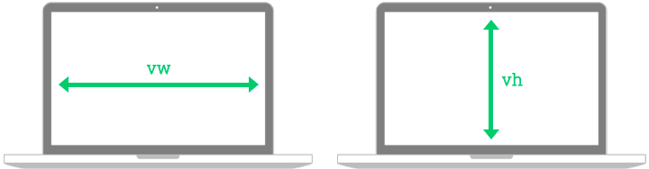
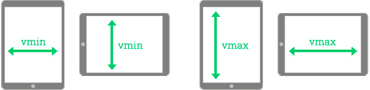

# Unités de mesure flexibles et fonctions css

> `vw`, `vh`, `vmin`, `vmax`, `min()`, `max()`, `calc()`, `clamp()` 

## vw & vh

Les unités `vw` et `vh` sont des unités relatives à la fenêtre *(viewport)*. Leur nom est en fait un acronyme :

- **vw** : viewport width *(largeur de fenêtre)*
- **vh** : viewport height *(hauteur de fenêtre)*

Elles fonctionnent sur le même principe que les pourcentages *(%),* mais plutôt que de se baser sur la dimension de leur parent, elles se basent sur la dimension de la fenêtre.

Par exemple, pour qu'un élément prenne la moitié de la largeur de la fenêtre :

```css
.element { width: 50vw; } /* Demi-largeur de fenêtre */
```

À priori, le résultat peut sembler identique à :

```css
.element { width: 50%; } /* Demi-largeur du parent */
```

Car si les deux éléments sont enfants de `body` *(body prenant par défaut toute la largeur de la fenêtre)*, les deux auront la même dimension.

Afin de bien illustrer la différence : imaginons une fenêtre d'une largeur de 1000px. À l'intérieur de celle-ci, un élément de 200px de large contenant deux enfants :

- Un premier avec une largeur de `50vw`
- Un deuxième avec une largeur de `50%`

Le premier se basant sur la dimension de la fenêtre mesurera donc **500px**. Tandis que le deuxième se basant sur son parent mesurera **100px**.




## vmin & vmax

Tout comme [vw et vh](#vw--vh), `vmin` et `vmax` sont des unités relatives à la fenêtre *(viewport)*. Leur nom correspond à :

- **vmin** : viewport minimum *(plus petit côté de la fenêtre)*
- **vmax** : viewport maximum *(plus grand côté de la fenêtre)*

Plutôt que de se baser directement sur un axe spécifique (largeur ou hauteur), ces unités alternent entre les deux selon le contexte.

`vmin` calcule l'équivalent en `vw` et `vh` et retourne le plus petit résultat. Tandis que `vmax` fait l'opposé et retourne le plus grand résultat.

Par exemple, pour créer un élément carré couvrant un maximum de la fenêtre sans en dépasser :

```css
.element {
  width: 100vmin;
  height: 100vmin;
}
```




## calc()

Plutôt que de spécifier une mesure directement, il est possible d'utiliser la fonction CSS `calc()` afin de combiner différentes mesures et d'en retourner le résultat. Cette approche est particulièrement utile pour combiner des mesures relatives *(`%`, `vw`, etc.)* avec des mesures absolues *(`px`)*.

Par exemple, si un élément doit couvrir toute la largeur de son parent, moins 50px, il est impossible d'y arriver avec une unité de base. En revanche, il est possible d'y arriver en combinant l'unité relative `100%` et l'unité absolue `50px` :

```css
.element { width: calc(100% - 50px); }
```

<br> 

<p class="codepen" data-theme-id="50173" data-height="300" data-pen-title="Calc()" data-default-tab="result" data-slug-hash="abjazxe" data-user="tim-momo" style="height: 300px; box-sizing: border-box; display: flex; align-items: center; justify-content: center; border: 2px solid; margin: 1em 0; padding: 1em;">
  <span>See the Pen <a href="https://codepen.io/tim-momo/pen/abjazxe">
  Calc()</a> by TIM Montmorency (<a href="https://codepen.io/tim-momo">@tim-momo</a>)
  on <a href="https://codepen.io">CodePen</a>.</span>
</p>
<script async src="https://public.codepenassets.com/embed/index.js"></script>

<br>

Les opérateurs mathématiques de base *(`+`, `-`, `*`, `/`)* sont permis entre les parenthèses de `calc()`.

!!! Warning "Attention à la syntaxe de `calc()`"
    Attention de laisser un espace avant et après les opérateurs mathématiques afin que le calcul fonctionne.

    ❌ `calc(100%-50px)`  
    ✅ `calc(100% - 50px)`


> 📖 [En savoir plus sur `calc()`sur MDN](https://developer.mozilla.org/fr/docs/Web/CSS/Reference/Values/calc)


## min() & max()

Les fonctions CSS `min()` et `max()` permettent de retourner le plus petit ou le plus grand résultat parmi différentes valeurs.

Par exemple, pour s'assurer qu'un texte ne soit jamais plus petit que `12px` afin qu'il reste toujours lisible :

```css
.element { font-size: max(12px, 0.5em); }
```

La fonction valide laquelle de ces 2 unités retourne le plus grand résultat et ne garde que cette valeur.

Si l'élément est dans un parent ayant un `font-size` de :

- **50px** : `12px` < `0.5em` *(25px)* ➡️ **25px**
- **20px** : `12px` > `0.5em` *(10px)* ➡️ **12px**

<br>


> 📖 [En savoir plus sur `min()`sur MDN](https://developer.mozilla.org/fr/docs/Web/CSS/Reference/Values/min)

> 📖 [En savoir plus sur `max()`sur MDN](https://developer.mozilla.org/fr/docs/Web/CSS/Reference/Values/max)


## clamp()

La fonction CSS `clamp()` ressemble aux fonctions [min() et max()](#min--max), mais contrairement à celles-ci, elle offre à la fois une valeur minimale et maximale.

Par exemple, pour qu'un texte ne soit jamais plus petit que `12px`, ni plus grand que `20px` :

```css
.element { font-size: clamp(12px, 0.5em, 20px); }
```

La fonction retourne la valeur centrale *(`0.5em`)* jusqu'à concurrence de sa valeur plancher *(`12px`)* ou sa valeur plafond *(`20px`)*.

Si l'élément est dans un parent ayant un `font-size` de :

- **50px** : `12px` < `0.5em` *(25px)* = 25px > `20px` ➡️ **20px**
- **20px** : `12px` > `0.5em` *(10px)* = 12px < `20px` ➡️ **12px**

<br>

> 📖 [En savoir plus sur `clamp()` sur MDN](https://developer.mozilla.org/fr/docs/Web/CSS/Reference/Values/clamp)


> 📖 `min()`, `max()` et `clamp()` en détail sur [web.dev](https://web.dev/articles/min-max-clamp)
