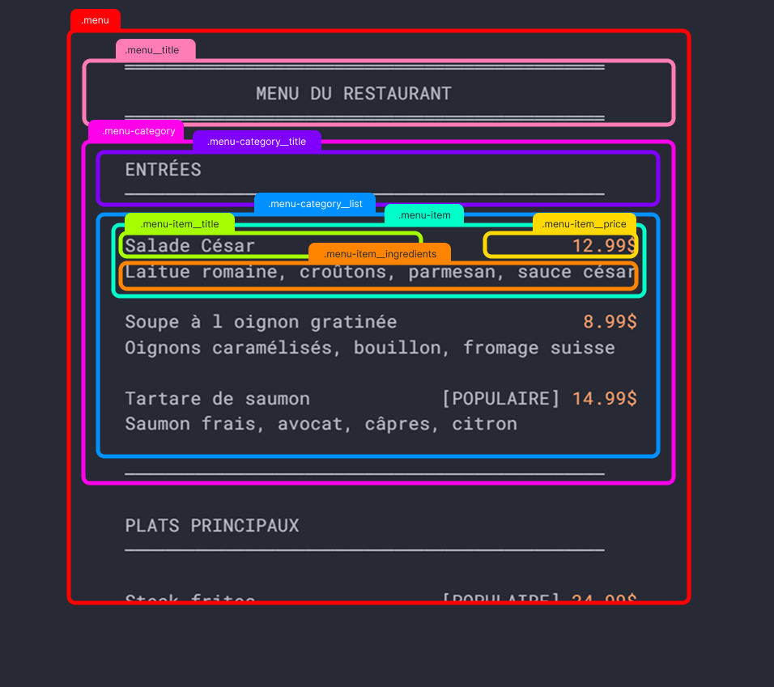

# 🍽️ EXERCICE: MENU DE RESTAURANT

## Fichier de bases à récupérer via GitHub Classroom

[👉 Rejoindre le GitHub Classroom](https://classroom.github.com/a/eu9a16L8){ .md-button }

<br>

---

<br>

<div class="class-content-link">
  
  <span class="sidetext">Utilisation de l'IA générative interdite à cette phase dans la session: vous devez solidifier les bases</span>
</div>

## Contexte

Vous êtes intégrateur Web pour une agence qui développe des sites pour des restaurants. Votre mission : créer la section "Menu" d'un site de restaurant en HTML et CSS.


## Objectifs d'apprentissage

- Réviser la structure HTML sémantique
- Pratiquer le modèle de boîte CSS (padding, margin, border)
- Comprendre la spécificité CSS (quelle règle gagne?)
- Appliquer une nomenclature cohérente (BEM recommandé)
- Créer une mise en page lisible et professionnelle


## Ce que vous devez créer

Un menu de restaurant qui contient :

### Structure minimale obligatoire

- [ ] **Un titre principal** pour le menu
- [ ] **3 catégories minimum** (ex: Entrées, Plats principaux, Desserts)
- [ ] **Au moins 3 items par catégorie** (9 items (plats) minimum au total)
- [ ] **Pour chaque item (plat) :**
  - Nom du plat
  - Description courte
  - Prix
- [ ] **Au moins 2 items avec un badge** "POPULAIRE" ou "VÉGÉ" ou "NOUVEAU"


## Exigences techniques

### HTML

- [ ] Structure HTML5 valide (doctype, head, body)  
- [ ] Balises **sémantiques** lorsque ça s'applique et que c'est pertinent (exemples: `<section>`, `<article>`, `<header>`, `<h1>`, `<h2>` etc.)  
- [ ] **Listes** utilisées pour lister les items (plats) dans chaque catégorie (ul/li ou ol/li)  
- [ ] Classes CSS cohérentes (nomenclature BEM recommandé)  
- [ ] Code bien **indenté** (clic droit / *Mettre le document en forme* (ou *Format Document* en anglais))
- [ ] Fichier externe `style.css` (pas de CSS inline dans le HTML)  


### CSS

- [ ] **CSS externe** uniquement (fichier `style.css`)
- [ ] **Modèle de boîte** maîtrisé (padding, margin, border)  
- [ ] **Typographie** lisible et hiérarchisée :
  - Titre principal plus grand
  - Titres de catégories moyens
  - Noms de plats en gras
  - Descriptions plus petites et en gris ou plus pâle
- [ ] **Prix alignés à droite**
- [ ] **Badges** stylisés avec couleur de fond et border-radius  
- [ ] **Séparateurs visuels** entre les catégories (border ou margin)
- [ ] **Spécificité CSS** : utiliser des sélecteurs variés (balise, classe, descendant)
- [ ] **Au moins un état de survol :hover** (sur les items par exemple)


## Contraintes de design

- Largeur *maximale* du menu : **800px**
- Menu *centré* sur la page : utilisez une technique que vous avez vue en Web1 pour centrer un élément de type block.
- Palette de couleurs cohérente (3-4 couleurs maximum) [Coolors](https://coolors.co/)
- Police intéressant et lisible ([Google Fonts](https://fonts.google.com/) recommandé)
- Pas d'images requises (optionnel si vous voulez en ajouter)


## Exemple de rendu attendu

Ne pas copier-coller, utilisez-le comme inspiration seulement!

```
════════════════════════════════════════════════
            MENU DU RESTAURANT
════════════════════════════════════════════════

ENTRÉES
────────────────────────────────────────────────

Salade César                             12.99$
Laitue romaine, croûtons, parmesan, sauce césar

Soupe à l oignon gratinée                 8.99$
Oignons caramélisés, bouillon, fromage suisse

Tartare de saumon            [POPULAIRE] 14.99$
Saumon frais, avocat, câpres, citron

────────────────────────────────────────────────

PLATS PRINCIPAUX
────────────────────────────────────────────────

Steak frites                 [POPULAIRE] 24.99$
8oz AAA, sauce au poivre, frites maison

Saumon grillé                            22.99$
Légumes de saison, riz basmati, beurre citronné

Risotto aux champignons          [VÉGÉ] 18.99$
Champignons sauvages, parmesan, truffe

────────────────────────────────────────────────

DESSERTS
────────────────────────────────────────────────

Crème brûlée                  [POPULAIRE] 7.99$
Vanille de Madagascar, sucre caramélisé

Tarte au citron                           6.99$
Meringuée, zeste de citron frais

Fondant au chocolat                       8.99$
Chocolat noir 70%, crème anglaise

════════════════════════════════════════════════
```


## Structure de fichiers attendue

```
menu-restaurant/
├── index.html
├── style.css
└── README.md
```

## Étapes suggérées

### 1. Structure HTML (20 min)

- Créer la structure de base
- Ajouter titre principal
- Créer les 3 sections de catégories
- Ajouter les items avec listes

!!! important

    Je vous recommande de commencer par travailler uniquement sur la *première catégorie* et le *premier item (plat)* afin de bien poser les balises HTML nécessaires.

    Une fois ce premier élément maîtrisé et validé, vous pourrez simplement dupliquer le code pour créer les autres plats et catégories.


<div class="grid grid-1-2" markdown>
  { data-zoom-image }

  Voici un exemple qui vous montre comment organiser et structurer vos éléments HTML. (Vous n’êtes pas tenu de le reproduire tel quel, mais il peut vous servir de repère.)
</div>


### 2. CSS de base (10 min)

- Styler le conteneur principal (largeur, centrage)
- Typographie de base

### 3. Style des catégories (entrées, desserts etc) (20 min)

- Titres de catégories
- Séparateurs visuels
- Espacements

### 4. Style des items (plats) (25 min)

- Layout nom/prix (`float` ou `inline-block`)
- Descriptions
- Badges

### 5. Finitions (10 min)

- États de survol (hover)
- Vérifications finales
- Validation HTML via le W3C

### 6. Complétez le README (5 min)

- Complétez le fichier README.md avec vos réflexions sur l'exercice


## Critères d'évaluation (formatif)

- Structure HTML valide et sémantique
- CSS externe (fichier style.css, pas de styles en ligne dans les balises html)
- Nomenclature COHÉRENTE dans tous les CSS (BEM ou autre)
- [Modèle de boîte](https://developer.mozilla.org/fr/docs/Learn_web_development/Core/Styling_basics/Box_model#les_bo%C3%AEtes_en_ligne_et_bo%C3%AEte_de_bloc) bien appliqué
- Typographie hiérarchisée et lisible
- Prix alignés correctement
- Badges stylisés (POPULAIRE, VÉGÉ, ou NOUVEAU)
- Séparateurs visuels
- [Spécificité CSS](../../css/specificite-css.md) démontrée
- Code propre et indenté
- Créativité et effort visuel


## Ressources utiles

### Emmet

Moteur d’autocomplétions permettant d’augmenter votre vitesse de création de balises HTML dans VS Code.

<div style="max-width: 1280px"><div style="position: relative; padding-bottom: 56.25%; height: 0; overflow: hidden;"><iframe src="https://cmontmorency365-my.sharepoint.com/personal/mariem_ouellet_cmontmorency_qc_ca/_layouts/15/embed.aspx?UniqueId=ab510bf3-acce-4ffe-82a7-87b6a11438c4&embed=%7B%22hvm%22%3Atrue%2C%22ust%22%3Atrue%7D&referrer=StreamWebApp&referrerScenario=EmbedDialog.Create" width="1280" height="720" frameborder="0" scrolling="no" allowfullscreen title="demo-emmet02.mp4" style="border:none; position: absolute; top: 0; left: 0; right: 0; bottom: 0; height: 100%; max-width: 100%;"></iframe></div></div>

[Emmet dans VS Code](https://tim-montmorency.com/timdoc/582-211/html/emmet/){ .md-button }

### Outils et références externes

- [Google Fonts](https://fonts.google.com/)
- [Coolors (palettes de couleurs)](https://coolors.co/)
- [Validateur HTML W3C](https://validator.w3.org/)
- [Méthodologie BEM](https://alticreation.com/blog/bem-pour-le-css/)
- [BEM exemples concrets](https://css-tricks.com/bem-101/#aa-more-examples-of-bem-in-action)

### CSS Web 1

- [CSS Cours 08](https://tim-montmorency.com/compendium/582-111-web1/cours08.html)
- [CSS Cours 09](https://tim-montmorency.com/compendium/582-111-web1/cours09.html)
- [CSS Cours 10](https://tim-montmorency.com/compendium/582-111-web1/cours10.html)
- [CSS Cours 11](https://tim-montmorency.com/compendium/582-111-web1/cours11.html)

### BEM

- [BEM Documentation](https://tim-montmorency.com/compendium/582-111-web1/cours11.html#bem)

### Documentation/résumé Web 1 pré 2025 :

- [Résumé HTML](https://tim-montmorency.com/timdoc/582-211/html/resume/)
- [Résumé CSS](https://tim-montmorency.com/timdoc/582-211/css/resume-css/)


## 📅 Remise

- **Date limite :** Avant le cours 3 de la semaine prochaine (2, 4 février)

- **Méthode :** *Commit* et *Push* sur GitHub Classroom (via Github Desktop ou l'outil de Git intégré à VS Code)


### Vérification avant remise :

- HTML validé avec le validateur [W3C](https://validator.w3.org/)
- CSS externe uniquement (aucune style en ligne sur les balises HTML)
- Fichiers bien nommés
- Code indenté
- Fichier README.md complété


## Conseils

- 💡 Commencez simple, puis améliorez progressivement
- 💡 Testez régulièrement dans le navigateur
- 💡 Utilisez l'inspecteur pour déboguer
- 💡 Documentez vos choix avec des commentaires CSS
- 💡 Si vous êtes bloqué, cherchez d'abord par vous même, puis demandez de l'aide à l'enseignante ou aux autres étudiants


## Exemples de restaurants (inspiration)

Vous pouvez vous inspirer de vrais restaurants ou inventer :

- Restaurant italien
- Bistro français
- Sushi bar
- Café brunch
- Restaurant végétarien
- Food truck mexicain
- etc.

**Choisissez un thème qui vous plaît!** 🍕🍣🥗🍔