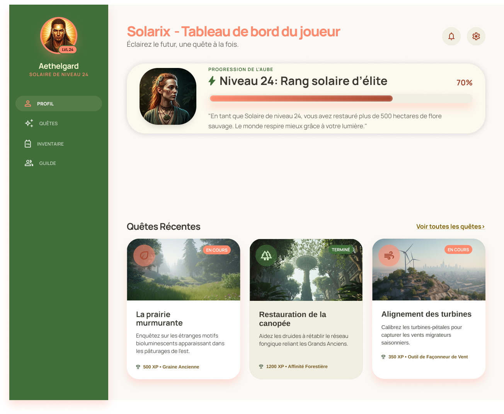

# Projet intégrateur: :material-flare: Solarix

**582-211-MO** : Web 2 | Session H2026 <br>
**Pondération** : 55 points<br>
**Remise de la planification** : cours 11 (20 ou 22 avril)<br>
**Remise finale** : cours final (11 ou 14 mai)<br>

## Mise en contexte

*Solarix* est un jeu de rôle fictif à l'esthétique *Solarpunk :material-flare:* :material-flare: : un univers où technologie et nature coexistent harmonieusement. Votre mandat : intégrer le **tableau de bord du joueur** de ce jeu à partir d'une maquette fournie.

Votre travail consiste à **structurer le HTML et écrire tout le CSS** pour que l'interface soit fidèle à la maquette, fluide, responsive et accessible.

## Fichiers de départ

### Maquette Figma

La maquette Figma (version desktop et mobile) :

- D'abord accéder à l'équipe *Web 2* de Figma [via ce lien](https://www.figma.com/team_invite/redeem/5DfH3v5mGAYvPU12BYLtQu?t=PC7OFho7hsSucnUJ-21) et accepter.
- Ensuite, accédez au *DevMode* de la [Maquette Figma Solarix](https://www.figma.com/design/MnfQC5u5xTquxOcTsOQa7E/Solarix-maquettes-finales?node-id=0-1&m=dev) - Notez bien que la maquette format mobile se trouve sur une autre page que celle du format desktop (voir la panneau à gauche pour naviguer entre les pages).

[:material-palette: Maquette Figma Solarix :material-login:](https://www.figma.com/design/MnfQC5u5xTquxOcTsOQa7E/Solarix-maquettes-finales?node-id=0-1&m=dev){ .md-button }

### Fichiers de départ et ressources

Voici le canevas de départ pour démarrer votre projet  :

[:material-file-replace-outline: Fichiers de départ .zip :material-download:](./depart-solarix.zip){ .md-button }

Les images exportées prêtes à être intégrées (icônes et images) :

[:material-image: Dossier d'images .zip :material-download:](./images.zip){ .md-button }

#### Dev Mode dans Figma (rappel)

Pour profiter des avantages du Dev Mode de Figma, connectez-vous à votre compte Figma, puis accédez à la maquette via le lien fourni. Une fois dans la maquette, activez le Dev Mode en cliquant sur l'icône `</>` en haut à droite de l'interface. Cela vous permettra d'inspecter les éléments de la maquette, de voir les propriétés CSS générées automatiquement et d'accéder aux ressources (images, icônes) nécessaires pour votre intégration.

- [Note de cours de Dev Mode du cours Web 2](../../css/figma-devmode.md)
- [Documentation complète du DevMode de Figma](https://help.figma.com/hc/fr/articles/15023124644247-Guide-sur-Dev-Mode)


#### Typographie

Dans le dossier de départ vous trouverez *les fichiers d'une des polices de caractères* utilisées dans la maquette. Installez la localement sur votre ordinateur pour les utiliser dans la maquette Figma. Vous devrez aussi importer la police dans votre projet via `@font-face`.

*L'autre police de caractère est accessible via Google Fonts*, vous devez donc l'importer dans votre projet via `@import` ou via un lien dans le `<head>` de votre HTML.

> Notez bien: Afin que Figma accède aux fontes installées sur votre ordinateur, vous devez installer un petit programme appelé "Installation de polices Figma". Téléchargez-le et installez-le à partir de ce lien : [Figma Font Helper](https://www.figma.com/fr-fr/downloads/). Une fois installé, redémarrez votre ordinateur pour que les changements prennent effet. Après cela, Figma devrait pouvoir accéder aux polices installées localement, y compris celles que vous venez d'ajouter.


## Objectifs d'apprentissage ciblés

- Assembler une interface Web fluide à partir d'une maquette
- Adapter l'affichage à différentes résolutions d'écran (approche **mobile first**)
- Produire un code CSS lisible, maintenable et bien documenté
- Utiliser l'intelligence artificielle comme outil professionnel de façon critique et réfléchie


## Description de l'interface à intégrer

L'interface comprend **une vue principale** : le tableau de bord du joueur.

### Composants à intégrer

| Composant | Description |
|---|---|
| Barre de navigation latérale | Avatar, nom du personnage, liens de navigation (desktop) / barre de navigation fixée en bas (mobile) |
| Carte de profil | Avatar, nom, niveau, rang, barre de progression XP |
| ⭐ Zone de stats globales  | 4 statistiques clés (quêtes terminées, temps de jeu, alliés, insignes) |
| Cartes de quêtes récentes | 3 cartes avec image, titre, description, statut et récompenses |

> ⭐ **Zone libre** : La zone de stats globales est la section que vous devez **concevoir vous-même**. Le contenu est fourni (les 4 statistiques et leurs valeurs), mais la mise en page et le traitement visuel sont libres. Votre conception doit demeurer cohérente avec le système visuel de la maquette fournie. 

Voici le contenu de la ⭐**zone libre** à intégrer :

- Quêtes terminées : 142
- Temps de jeu : 1204h
- Alliés : 38
- Insignes : 12


## Exigences techniques

### HTML

- Structure sémantique rigoureuse (`header`, `nav`, `main`, `section`, `article`, etc.)
- Respect de la hiérarchie des titres
- Attributs d'accessibilité (`alt`, `aria-label`, `aria-current`, etc.)
- Code propre et lisible : indentation, sections séparées clairement par des commentaires

### CSS

- Approche **mobile first** obligatoire
- **Flexbox** obligatoire pour la mise en page des composants
- Utilisation judicieuse de **media queries** et/ou de **container queries** selon le contexte :
  - Utiliser les **media queries** pour les changements de disposition globale (ex. : sidebar → bottom nav)
  - Utiliser les **container queries** pour les composants qui doivent s'adapter à leur conteneur plutôt qu'à la fenêtre
- **Variables CSS** pour les couleurs, espacements et typographie
- Faire une version *mode sombre (dark mode)* en modifiant uniquement les variables CSS et en utilisant les requêtes média de préférence de thème de l'utilisateur
- Nomenclature **BEM** appliquée par composant défini (pas nécessairement partout, mais de façon cohérente et justifiée)
- Noms de classes, identifiants et variables CSS rédigés en **anglais**
- Code annoté via des commentaires CSS


#### Animations et transitions <span class="important-label">NOUVEAU</span>

Toutes les animations et transitions doivent être réalisées en CSS uniquement. 

<br>

<span class="important-label">NOUVEAU: instructions ajoutées le 3 mai 2026</span> <br>

**Ce qui est attendu**


1. **Transition sur les cartes de quêtes**
  - Au survol d'une carte de quête, celle-ci doit se déplacer vers le haut de quelques pixels, son ombre portée doit s'intensifier légèrement. Cet effet de survol permet d'indiquer à l'utilisateur que cedtte carte est interactive et cliquable.
2. **Transition sur les liens de navigation**
  - Les liens de la navigation (sidebar desktop et barre mobile en bas) doivent réagir visuellement au survol et au focus clavier. La transition doit être subtile : un changement de couleur ou d'opacité suffit.
3. **Animation de la barre de progression XP**
  - Au charg:mment de la page, la barre de progression doit s'animer depuis 0% jusqu'à sa valeur finale (70%). L'animation ne doit jouer qu'une seule fois.
4. **Animation sur l'icône ⚡ du niveau**
  - L'icône ⚡associée au niveau du personnage doit être animée en boucle de façon subtile, pour lui donner vie sans attirer l'attention de manière excessive.

.

Les animations et transitions doivent respecter les critères suivants :

- **Pertinentes et subtiles :** elles doivent améliorer l'expérience utilisateur sans être distrayantes
- **Performantes :** éviter les propriétés qui causent des ralentissements (ex. : `box-shadow`, `filter`)
- **Accessibles :** fournir une alternative statique pour les utilisateurs qui préfèrent réduire les animations.


!!! warning "Accessibilité obligatoire"
    Les animations et transitions doivent être désactivées ou réduites pour les utilisateurs ayant activé la préférence de réduction de mouvement sur leur système. Utiliser la medias queries pertinente pour ça et ajoutez-y simplement ceci:

    ```css
    * {
      animation: none;
      transition: none;
    }
    ```

### Responsive

- Deux points de rupture (*breakpoints*) minimum pour 3 formats de layout: *mobile*, *tablette*, *desktop*. 
- La disposition doit être fidèle à la maquette fournie à chaque résolution

### Accessibilité

- Respect des critères WCAG de base (contraste, focus visible, tailles de cible)
- Navigation possible au clavier
- Audit obligatoire avec **Lighthouse** (inclus dans Google Chrome) ou **axe DevTools** (extension Google Chrome (installation d'extension bloqué par le collège)). Voir journal de bord, semaine 4.
- Créer une version *mode sombre (dark mode)* pour respecter les préférence de thème de l'utilisateur.


## Politique d'utilisation de l'intelligence artificielle

Vous pourrez utiliser des outils d'IA pour vous assister dans ce projet, *EXCEPTÉ dans la phase de planification (semaine 1) où l'utilisation de l'IA est strictement interdite*. Pour les autres phases, voici les règles à suivre :

**Non autorisé :**

- Utiliser l'IA pour générer du code sans le comprendre ou le modifier
- Se contenter de copier-coller du code généré sans jugement critique
- Utiliser l'IA pour faire le travail à votre place

**Autorisé :**

- Poser des questions, analyser des solutions, comparer des approches
- Utiliser l'IA pour déboguer, optimiser ou améliorer votre code
- S'en servir pour explorer des solutions alternatives

!!! warning
    Vous devez vous en tenir strictement aux techniques que nous avons vues en classe. L'utilisation de techniques avancées non vues en classe (ex. : CSS Grid, JavaScript, frameworks CSS) même si elles sont suggérées par une IA, n'est pas autorisée et peut entraîner une pénalité.

**Toujours obligatoire, peu importe l'outil utilisé :**

- *Comprendre* chaque ligne de code remise
- Être *capable de l'expliquer et de le justifier* à l'oral
- En assurer la *qualité*, la *cohérence* et l'*accessibilité* du code
- En assurer la *réutilisabilité* et la *flexibilité* des composants
- *Documenter au fur et à mesure l'utilisation de l'IA* dans le journal de bord : noimmer l'outil IA et ta requête exacte (ton prompt)

!!! danger Important sur la documentation de tes prompts
    Tout contenu généré par une IA doit être cité en mentionnant le nom de l'outil IA et ta requête (ton prompt) utilisée. Ne pas le mentionner constitue du *plagiat*.


## Structure du projet et livrables

Le projet se déroule sur **4 semaines** avec un "livrable" par semaine. (livrable est entre guillemets car tu n'as pas à remettre mais on s'attend à ce que tu aies complété la partie de la semaine pour bien suivre le groupe).

---

### *Semaine 1*: Planification | 13 au 19 avril

> 10 points (10% de la note finale)
>
> Remise : avant le début du prochain cours (cours 11 - 20/22 avril)

Avant d'écrire une seule ligne de code, vous planifiez votre intégration.

-

<div class="class-content-link">
  
  <span class="sidetext">Utilisation de l'IA INTERDITE à cette phase du projet. Tu dois démontrer tes capacités de planification et d'intégration.</span>
</div>

-

#### Maquette préliminaire pour la planification

Veuillez noter que pour la planification, vous devez travailler à partir de la *maquette préliminaire* fournie ici. Le contenu de la maquette finale à intégrer va possiblement un peu varier mais les grandes lignes de la mise en page restent les mêmes.

Veuillez noter aussi que cette maquette ne comprend pas la zone libre ⭐ que vous allez concevoir (zone de statistiques du joueur). L'objectif de cette étape-ci est de vous concentrer sur l'analyse de la *structure globale* et des *composants de base* avant d'ajouter votre propre conception pour la zone libre.

**Aperçu de la maquette préliminaire :**



**Téléchargez les maquettes préliminaires pour la planification ici :**

- [Maquette préliminaire: Format grand écran :material-download:](https://cmontmorency365-my.sharepoint.com/:i:/g/personal/mariem_ouellet_cmontmorency_qc_ca/IQBHTIsqKEzQQqQopOZecPOfAZiY6sRh4aY9QBYMR_At5zo?e=vEubmQ)
- [Maquette préliminaire: Format mobile :material-download:](https://cmontmorency365-my.sharepoint.com/:i:/g/personal/mariem_ouellet_cmontmorency_qc_ca/IQCqzZYkXDBpQJ15A51dopvjAcswgqmSbru1DI_nJvicttI?e=UfhcKH)

#### Étapes de la planification :

- Créer un dépôt GitHub *privé* nommé `nom-prenom-projet-solarix`.
  - Accorder l'accès à votre dépot à l'enseignante via le nom d'utilisateur `kid-synthetique` (Settings / Collaborators and teams / Add people).
- Créer un fichier `PLANIFICATION.md` dans votre dépôt GitHub.

#### Contenu attendu :

1. **Analyse de la maquette** : Identifiez et nommez tous les composants de l'interface. Faites un schéma ou une liste annotée.

2. **Nomenclature CSS prévue** : Pour chaque composant identifié, définissez les noms de classes BEM que vous prévoyez utiliser (en anglais).  
   Exemple :
   ```
   .quest-card
   .quest-card__image
   .quest-card__title
   .quest-card__status
   .quest-card__status--completed
   ```

3. **Découpage en tâches** : Listez les étapes de votre intégration dans l'ordre où vous prévoyez les réaliser.

4. **Stratégie responsive** : Décrivez brièvement comment vous prévoyez gérer le passage desktop → mobile pour chaque composant. Justifiez votre choix entre media queries et container queries pour au moins un composant.

5. **Conception de la zone libre** : Décrivez ou esquissez votre vision pour la zone de stats globales. Comment allez-vous la mettre en page tout en restant cohérent avec le reste de l'interface? Voici le contenu de la zone libre à intégrer :
   - Quêtes terminées : 142
   - Temps de jeu : 1204h
   - Alliés : 38
   - Insignes : 12

**Format de remise :** Fichier `PLANIFICATION.md` déposé dans votre dépôt GitHub.

Si vous avez des images à ajouter (votre esquisse par exemple), ajoutez un dossier `assets` à votre dépôt, puis [insérez-les images en markdown](https://www.markdownguide.org/basic-syntax/#images-1) dans votre fichier `PLANIFICATION.md` avec des liens relatifs.

Remettre le lien de votre dépot GitHub du projet et le fichier `PLANIFICATION.md` via le Devoir associé dans Teams avant votre cours du 20 ou 22 avril (avant le début du cours).

---

### *Semaine 2*: Structure HTML | 20 au 26 avril

> Évaluation incluse dans les 30 points du code de la remise finale (30% de la note finale)
>
> Remise : avant le début du cours 15 (11 ou 14 mai): en même temps que la remise finale

**Contenu attendu :**

- HTML complet de l'interface intégré dans le canevas fourni
- Structure sémantique respectée
- Attributs d'accessibilité de base en place
- Aucun style CSS requis à cette étape (ou très minimal)

**Journal de bord : questions de la semaine 2 :**
> Répondez dans votre fichier `JOURNAL.md`.

1. Quelle décision de structure HTML vous a demandé le plus de réflexion? Expliquez votre raisonnement.
2. Y a-t-il un composant dont la structure sémantique n'était pas évidente? Comment avez-vous tranché?
3. Avez-vous utilisé l'IA cette semaine? Si oui, pour quoi et qu'en avez-vous retenu ou modifié?

---

### *Semaine 3*: CSS et responsive | 27 avril au 3 mai

> Évaluation incluse dans les 30 points du code de la remise finale (30% de la note finale)
>
> Remise : avant le début du cours 15 (11 ou 14 mai): en même temps que la remise finale

**Contenu attendu :**

- CSS complet de l'interface (approche mobile first)
- Responsive fonctionnel aux trois résolutions
- Variables CSS définies et utilisées
- Nomenclature BEM appliquée
- Zone libre intégrée

**Journal de bord : questions de la semaine 3 :**

> Répondez dans votre fichier `JOURNAL.md`.

1. Quel composant vous a posé le plus de difficultés en responsive? Comment avez-vous résolu le problème?
2. Avez-vous utilisé des container queries? Si oui, pour quel composant et pourquoi ce choix plutôt que des media queries?
3. Qu'est-ce qui a changé par rapport à votre planification initiale? Pourquoi?
4. Décrivez vos décisions de conception pour la zone libre : qu'avez-vous choisi et pourquoi est-ce cohérent avec le système visuel?
5. Avez-vous utilisé l'IA cette semaine? Si oui, montrez un exemple concret : quelle était la requête, qu'est-ce que l'IA a généré, qu'avez-vous gardé, modifié ou rejeté?

---

### *Semaine 4*:  Finalisation et accessibilité | 4 au 10 mai

> Évaluation incluse dans les 30 points du code de la remise finale (30% de la note finale)
> 
> Remise finale : avant le début du cours 15 (11 ou 14 mai)

**Contenu attendu :**

- Ajout des [transitions des éléments interactifs et animations CSS](#animations-et-transitions-nouveau)
- Interface finalisée et peaufinée
- Audit d'accessibilité complété
- Journal de bord complet
- Dépôt GitHub à jour

**Journal de bord : questions de la semaine 4 :**

> Répondez dans votre fichier `JOURNAL.md`.

1. Effectuez un audit d'accessibilité avec Lighthouse ou axe DevTools. Nommez deux problèmes identifiés et expliquez comment vous les avez corrigés.
2. Y a-t-il un problème d'accessibilité que vous n'avez pas pu corriger? Expliquez pourquoi et ce que vous auriez fait avec plus de temps.
3. Quel est l'aspect de votre CSS dont vous êtes le plus satisfait? Pourquoi?
4. Si vous recommenciez ce projet, qu'est-ce que vous feriez différemment?

## REMISE

### Dates

- Remise planification: avant le début du cours 11 (20 ou 22 avril)
- Remise finale: avant le début du cours final (11 ou 14 mai)

### Format de remise

- **Dépôt GitHub** nommé `nom-prenom-projet-solarix`. Votre dépôt GitHub doit être *privé*.
  - Accorder l'accès à votre dépot à l'enseignante via le nom d'utilisateur `kid-synthetique` (Settings / Collaborators and teams / Add people).

- Remettre le lien de votre dépot GitHub du projet via le Devoir associé dans Teams avant les dates de remise indiquées.

- Pour la remise de la planification (20-22 avril) votre dépot github doit inclure fichier un `PLANIFICATION.md` avec les éléments décrits dans la section "Semaine 1: Planification". Votre dépôt GitHub doit être *privé* et l'accès à l'enseignante doit être accordé. Le lien veres le dépot GitHub doit être soumis via le Devoir associé dans Teams.

- Pour remise finale votre dépot github doit inclure :

  ```
  solarix/
  ├── index.html
  ├── styles/
  │   └── main.css (ou structure de votre choix)
  ├── assets/
  │   └── (images et icônes fournis)
  ├── PLANIFICATION.md
  └── JOURNAL.md
  ```

!!! danger
    Le dépôt doit être accessible à l'enseignante au moment de la remise. Un dépôt *privé* sans accès accordé équivaut à une remise manquante. Pour accorder l'accès à votre dépot à l'enseignante via le nom d'utilisateur `kid-synthetique` (Settings / Collaborators and teams / Add people).


## Présentation orale : cours 15

> 5 points (5% de la note finale) - Mais peut affecter la note globale si l'étudiant n'est pas capable d'expliquer son propre code lors de la présentation orale avec l'enseignante.
> 
> Remise finale : avant le début du cours 15 (11 ou 14 mai)

La présentation orale du projet sera individuelle entre l'étudiant et l'enseignante. Elle se déroulera lors du cours final (11 ou 14 mai) et durera environ 10 minutes par étudiant. Vous aurez un créneau horaire précis qui vous sera communiqué à l'avance.

Chaque étudiant présente son interface. La présentation doit couvrir :

1. **L'interface finale**: démonstration en direct aux trois résolutions
2. **Deux décisions techniques**  : expliquez pourquoi vous avez fait ce choix (ex. : expliquer le placement de certains éléments avec Flexbox, media query VS container query, structure BEM d'un composant)
3. **La zone libre**  : présentez votre conception et justifiez vos choix visuels
4. **L'utilisation de l'IA**  : si utilisée, montrez un exemple concret de votre démarche (requête → résultat → jugement critique)
5. **Un défi rencontré**  : qu'est-ce qui a été difficile et comment l'avez-vous surmonté?

!!! warning
    La présence à la remise et à la présentation est obligatoire. Une absence entraîne la note 0 pour la présentation, même si le travail a été remis en ligne.

!!! question
    L'enseignante va poser des questions de relance sur votre code. L'incapacité à expliquer votre propre code peut affecter votre note globale.


## Grille d'évaluation

### Planification  : 10 points

| Critère | Points |
|---|---|
| Identification complète et juste des composants | 3 pts |
| Nomenclature BEM cohérente et en anglais | 2 pts |
| Découpage en tâches réaliste et ordonné | 2 pts |
| Stratégie responsive décrite et justifiée | 2 pts |
| Vision claire pour la zone libre | 1 pt |

---

### Code et interface : 30 points

| Critère | Points |
|---|---|
| **Structure HTML** : sémantique, hiérarchie, attributs d'accessibilité | 4 pts |
| **Fidélité à la maquette** : desktop et mobile | 4 pts |
| **Flexbox** : utilisation appropriée et maîtrisée | 4 pts |
| **Responsive mobile first** : trois résolutions, media queries et/ou container queries justifiés | 5 pts |
| **Variables CSS et système cohérent** : couleurs, espacements, typographie | 3 pts |
| **Nomenclature BEM** : appliquée par composant, cohérente, en anglais | 3 pts |
| **Zone libre** : cohérence visuelle, qualité d'exécution, sens esthétique | 3 pts |
| **Animations et transitions** : pertinentes, performantes, accessibles | 2 pts |
| **Accessibilité** : contraste, focus, tailles de cible, préférence de thème (sombre), audit complété | 2 pts |

---

### Journal de bord : 10 points

| Critère | Points |
|---|---|
| Semaine 2 : questions complètes et réfléchies | 2 pts |
| Semaine 3 : questions complètes, choix techniques justifiés | 4 pts |
| Semaine 4 : audit d'accessibilité documenté, regard critique | 2 pts |
| Qualité générale : honnêteté, profondeur, évolution visible | 2 pts |

---

### Présentation devant l'enseignante : 5 points

| Critère | Points |
|---|---|
| Démonstration de l'interface aux trois résolutions | 1 pt |
| Justification claire d'au moins deux décisions techniques | 2 pts |
| Présentation de la zone libre et de ses choix | 1 pt |
| Capacité à répondre aux questions de relance | 1 pt |

!!! question
    L'enseignante va poser des questions de relance sur votre code. L'incapacité à expliquer votre propre code peut affecter votre note globale.


### Total : 55 points


## Ressources

- Contenu du cours Web 2 : [tim-montmorency.com/compendium/582-211-web2](https://tim-montmorency.com/compendium/582-211-web2/)
- Documentation MDN : [developer.mozilla.org/fr/docs/Web](https://developer.mozilla.org/fr/docs/Web)
- Guide Flexbox : CSS Tricks : [css-tricks.com/snippets/css/a-guide-to-flexbox](https://css-tricks.com/snippets/css/a-guide-to-flexbox/)
- Validateur HTML/CSS : [validator.w3.org](https://validator.w3.org/)
- Méthodologie BEM : [getbem.com](https://getbem.com/)


!!! info
    *Pour toute question, contactez l'enseignante par Teams de préférence. Comptez un délai de deux journées ouvrables pour obtenir une réponse.*
