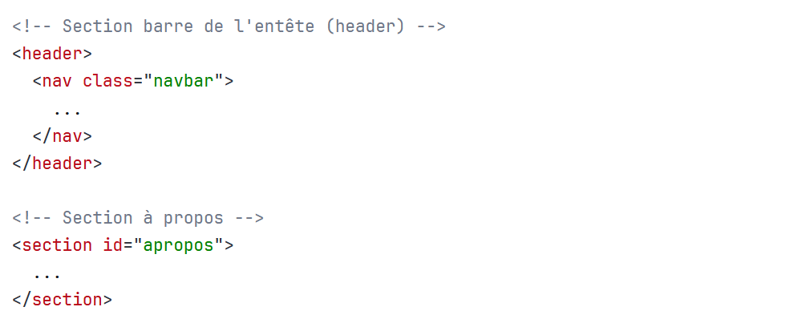
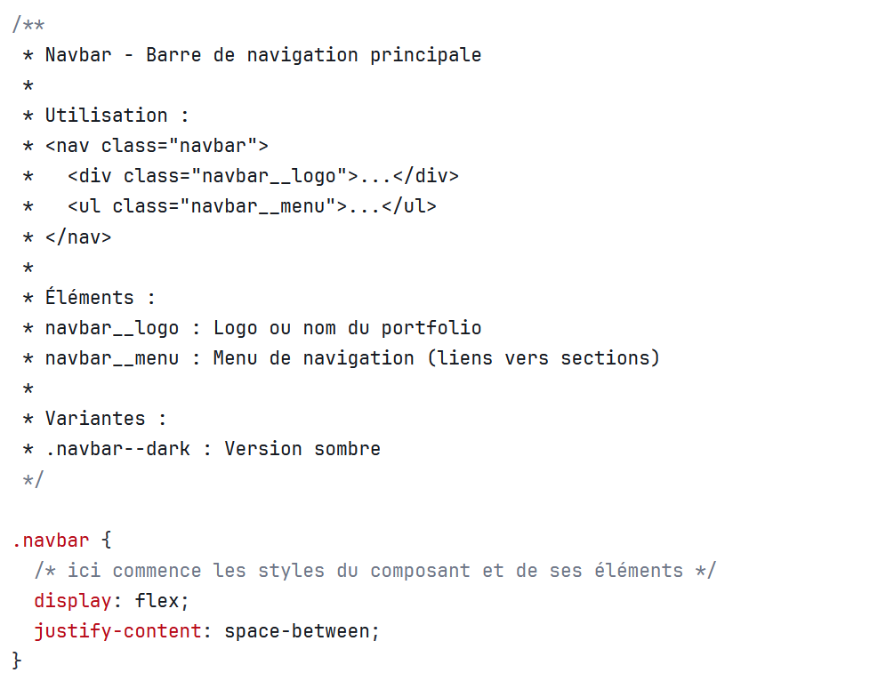

# Projet 1: Assemblage d’interface

<!-- 
Si je refais ce projet, puisque je constate que plusieurs n'ont même pas commencé et ce, 1 semaine avant la remise,  je devrais prévoir une remise #1 du projet au cours une semaine avant la remise ou peut-être même 2 semaine avant la remise dépendemment ou je place les cours. Cette remise #1 qui comprendrait les étapes :

- 0. Préparation
- 1. La maquette
- 2. Lecture des consignes ici et du brief du client
- 3. Analyse de la maquette
- 4. Planification de l’intégration

Et ainsi m'assurer que ce qu'il reste à faire c'est l'intégration et la documentation (en parallèle) et qu'il ne trainent pas de la patte. Car j'ai l'impresson que j'en ai échappé qq-uns qui n'avaient même pas encore créé leur répertoire github au cours 7 (remise au cours 8). Et la plupart ont commencé à rédiger du HTML sans même planifier leur composant. LE PLAN AVANT LE HANDS-ON!!
-->

---

  
  
PHASE 2: Utilisation de l'<em>IA</em> permise mais limitée.
    <ul>
        <li>👍VOUS POUVEZ vérifier et comparer, APRÈS avoir codé</li>
        <li>🚫VOUS NE POUVEZ PAS générer la structure de base de votre code</li>
        <li>Si vous utilisez l'<em>IA</em>, vous devez noter chaque utilisation de celle-ci dans le fichier <code>documentation.md</code></li>
    </ul>
    
Pourquoi ? Vous devez démontrer votre maîtrise autonome.

  

## Le brief complet

IMPORTANT LE BRIEF COMPLET EST DISPONIBLE ICI : 

[Projet 1: Brief complet (PDF)](https://cmontmorency365-my.sharepoint.com/:b:/g/personal/mariem_ouellet_cmontmorency_qc_ca/IQA83L9vcZpPTbvHwFbi1_Y6AQMVLAEXuOghB8megCIsZ6k?e=xc8sP6){ .md-button .md-primary }

## Évaluation

35% de la note finale du cours

Les critères d'évaluation sont détaillés dans la grille d'auto-évaluation suivante :

[Grille d'auto-évaluation du projet 1 (PDF)](https://cmontmorency365-my.sharepoint.com/:b:/g/personal/mariem_ouellet_cmontmorency_qc_ca/IQD3neVlTndPTb3awg4vQg3MAdxJSR2UqJQh_9z2LLUrZl4?e=wbLRbx){ .md-button .md-primary }

## Objectif

Intégrer une maquette Figma en HTML/CSS en suivant les bonnes pratiques. Vous devez:

- Recoder la maquette en HTML/CSS de façon fluide et flexible. Donc si on redimensionne la fenêtre du navigateur, les éléments de la page doivent se repositionner et s'adapter jusqu'à un minimum de 800px. Pour ce faire, vous devez :
  - mettre en place un [système de tokens (variables CSS)](../../css/variables-unites-fonctions.md),
  - segmenter l'interface en [composants réutilisables](../../css/composants.md), 
  - appliquer la [nomenclature BEM](../../css/nomenclature-bem.md) sur les classes des composants,
  - appliquer les concepts de Flexbox qu'on a vu en classe ([`display: flex`, `flex-direction`, `justify-content`, `align-items`, `flex-wrap`](../../css/flexbox01.md) | [`flex-grow`, `flex-shrink`, `flex-basis`, `flex`](../../css/flexbox02.md)  | [`order`](../../css/flexbox-order.md))
  
- Documenter votre travail de manière professionnelle :
  - rédiger des *commentaires par composant* dans le fichier `styles.css`,
  - et documenter le projet via `DOCUMENTATION.md` et `README.md.`

## Contexte

*Projet individuel*

Vous êtes un intégrateur web travaillant pour une agence de design. Votre tâche est de transformer une maquette Figma fournie par un designer en une page web fonctionnelle.

Vous devez analyser la maquette, comprendre les intentions du designer à travers le *Dev Mode* de Figma, et utiliser Flexbox pour recréer la structure de la maquette tout en produisant un code propre et maintenable.

## La maquette de design à intégrer

Vous avez reçu, le 27 février sur Teams (individuellement): une maquette de design Figma configurée avec **auto-layout**. Elle contient des défauts intentionnels à corriger.

À noter que la maquette est différente pour chaque étudiant. Certaines se ressemblent au niveau du thème mais les éléments et la structure sont différents.

---

*

---

<h1>Étapes</h1>

## *0. Préparation* (terminer avant le 9/11 mars)

    TERMINÉ... C'était à faire avant le 9/11 mars

- Assurez-vous d’avoir une bonne compréhension de Flexbox, de Figma Auto Layout et du Dev Mode avant de commencer le projet.
- Création de votre répertoire GitHub, nommez-le : `nom-prenom-projet1-web2` (non lié à GitHub Classrooom, c’est un repo personnel).
- Faites un clone en local (sur votre OneDrive ou votre disque dur externe) de votre repo GitHub.
- Préparez votre environnement de travail (VSCode, extension Figma for VS Code, etc.).
- Ajoutez à votre répertoire un `README.md` pour présenter votre projet et un `DOCUMENTATION.md` pour documenter votre démarche d’intégration.
- Faites un premier commit avec un message clair pour marquer le début de votre projet. Et poussez ce commit sur GitHub.

## *1. Réception de la maquette*

    TERMINÉ... C'était à faire avant le 9/11 mars

Marie-Michelle va vous attribuer personnellement une maquette Figma à intégrer (vous la recevrez dans une conversation du TEAMS au plus tard le 27 février en fin de journée). Chaque maquette a été conçue pour mettre en valeur des aspects spécifiques de l’intégration web et pour vous permettre de démontrer votre capacité à analyser et à traduire une conception visuelle en code HTML/CSS fonctionnel.

## *2. Lecture des consignes ici et celles du brief-client*

    TERMINÉ... C'était à faire avant le 9/11 mars

Comprendre les exigences et les objectifs du projet.

## *3. Analyse de la maquette reçue*

    TERMINÉ... C'était à faire avant le 9/11 mars

La maquette que vous avez reçue été conçue avec des règles d’**auto-layout** de Figma qui correspondent à des propriétés CSS spécifiques sous le concept de Flexbox.

Votre tâche est d’analyser la maquette en utilisant le *Dev Mode* de Figma pour identifier ces règles et comprendre comment elles se traduisent en HTML/CSS.

Utiliser le **Dev Mode** (via l'extension Figma for VS Code) pour analyser et comprendre la structure, les espacements, les styles et les valeurs CSS. Démarrer avec la base générée par le **Dev Mode** et ensuite *adapter et corriger pour créer un code propre et maintenable*. Puis, fixer les défauts intentionnels qui ont été laissés dans la maquette.

## 4. *Planification de l’intégration*

    TERMINÉ... C'était à faire avant le 9/11 mars

Décider :

- de l’*architecture HTML*,
- des *composants réutilisables*,
- de la *nomenclature des classes (BEM)*.
- et du *système de tokens (variables)* à utiliser.

Dans un fichier `DOCUMENTATION.md`, documenter votre démarche de planification et les décisions prises: liste des composants réutilisables identifiés, l’architecture HTML proposée, la nomenclature BEM choisie et le système de tokens (variables) mis en place.

## 5. *Intégration*

    EN COURS... du 9/11 mars au 23/25 mars

Écrire le code HTML et CSS en s’inspirant du code généré par Figma via le Dev Mode, mais en l’adaptant pour créer un code propre et maintenable.

- *Flexbox* : Utiliser Flexbox pour recréer la structure de la maquette, en traduisant les règles d’auto-layout de Figma en propriétés CSS appropriées.
- Structurez *composants réutilisables*
- Attention, il y a *plusieurs éléments à corriger* à partir de la maquette qui vous a été fournie, c'est normal et c'est prévu ainsi. C'est à vous de les repérer et de décider comment les corriger.

## 6. *Documentation*

    EN COURS... du 9/11 mars au 23/25 mars

- Documenter les décisions techniques prises lors de l’intégration. *Documenter par composant*.
- Pour documenter:
  - Rédiger la description de chaque composant principal en commentaires CSS `/* */`.
  - Segmenter vos sections de page dans le HTML en commentaires `<!-- -->`.
  - Créer un fichier `DOCUMENTATION.md` pour expliquer:
    - votre démarche,
    - vos choix techniques,
    - les défis rencontrés.
    - Si applicable, ajouter une *section sur l’utilisation de l’IA* dans fichier `DOCUMENTATION.md` : 
      - quel outil IA,
      - quelle version,
      - la date,
      - le prompt utilisé,
      - et quelle partie du code a été validée ou améliorée avec l’IA.
  - Créer un fichier `README.md` pour présenter le projet (voir le brief pour les détails).

<!-- [Documenter par composant](https://tim-montmorency.com/compendium/582-211-web2/css/composants.html#4-documentez-vos-composants). -->

### Documentation: Ce qu'on attend dans le HTML

Ajouter des commentaires pour séparer visuellement les grandes sections de la page. C'est tout ce qui est attendu dans le HTML — pas besoin d'expliquer le CSS ici.

### Documentation: Ce qu'on attend dans le CSS

Ajouter un **bloc de commentaire descriptif juste avant les styles de chaque composant**. Ce bloc doit expliquer :

- le nom du composant (B),
- le rôle du composant,
- la structure HTML attendue (les classes et balises utilisées),
- les éléments (E) qui le composent (éléments BEM `__`),
- les variantes (M) disponibles (modificateurs BEM `--`), s'il y en a.

> 💡 En résumé : le commentaire HTML dit où on est dans la page. Le commentaire CSS dit ce qu'est le composant, comment l'utiliser et quelles variantes existent.

!!! warning
    L'évaluation du projet dépend de la *qualité de votre documentation*.  C'est avec cette démarche que vous pouvez vraiment expliquer votre travail d'analyse, vos choix techniques et démontrer votre compréhension des concepts.

## Calendrier du projet

| Date | Activité |
|------|----------|
| Semaine 6 (vendredi 27 février) | Lancement du projet 27 février: attribution des entreprises et maquettes |
| 2–8 mars** | SEMAINE DE RATTRAPAGE — Travail autonome intensif (vous devez avoir avancé pour montrer l'avancement de votre travail en classe au cours 7) |
| Cours 7 groupes du lundi (9 mars ~~11 mars~~) | Travail en classe + rencontres individuelles |
| Cours 8 seulement le groupe du mercredi (18 mars)| PAS DE TRAVAIL EN CLASSE SUR LE PROJET mais possiblité de rencontre à la demande |
| Avant le cours 9 (23 ou 25 mars) | REMISE |

!!!danger "Gr. du merc: Considérant la levée de cours du mercr. 11 mars"
    Le cours du 11 mars était prévu comme période complète de travail en classe sur le Projet 1. Donc vous devez avancer par vous même ce jour là ou à un autre moment de la semaine. Le cours du mercredi 18 mars sera consacré à autre chose : *vous n'aurez pas de temps en classe pour avancer le Projet 1*. Prévoyez donc de travailler à la maison ou lors des autres périodes de la semaine.

    Le 18 mars, une courte période sera disponible pour des questions individuelles ponctuelles à la demande, mais uniquement si vous êtes déjà bien avancés. Rappel important : il est impossible de réaliser un projet de qualité et d'atteindre tous les critères d'évaluation en une seule semaine — planifiez en conséquence. N'attendez surtout pas au 18 mars pour débuter: ce serait compromettre vos chances de succès, ce se condamner à remettre un travail incomplet.

## Critères d’évaluation

| Catégorie | Pondération |
|-----------|-------------|
| Structure et organisation du code | 20% |
| Système de design (variables/tokens) | 15% |
| Maîtrise de Flexbox | 30% |
| Fidélité à la maquette | 15% |
| Documentation et justifications | 20% |

Les critères d'évaluation sont détaillés dans la grille d'auto-évaluation suivante :

[Grille d'auto-évaluation du projet 1 (PDF)](https://cmontmorency365-my.sharepoint.com/:b:/g/personal/mariem_ouellet_cmontmorency_qc_ca/IQD3neVlTndPTb3awg4vQg3MAdxJSR2UqJQh_9z2LLUrZl4?e=wbLRbx){ .md-button .md-primary }

## Le brief du projet

IMPORTANT LE BRIEF COMPLET EST DISPONIBLE ICI : 

[Projet 1: Brief complet (PDF)](https://cmontmorency365-my.sharepoint.com/:b:/g/personal/mariem_ouellet_cmontmorency_qc_ca/IQA83L9vcZpPTbvHwFbi1_Y6AQMVLAEXuOghB8megCIsZ6k?e=xc8sP6){ .md-button .md-primary }

## Politique d'utilisation de l'IA — Phase 2

Si vous utilisez l'IA pour le projet 1, vous devez l'inscrire dans le fichier  *documentation.md* : quel outil IA, quelle version, la date, le prompt et quelle partie du code pour avez validé ou amélioré avec l'IA.

Durant le Projet 1, vous êtes en Phase 2 de la politique IA du cours :

- PERMIS : Vérifier et comparer votre code après l'avoir écrit vous-même
- PERMIS : Poser des questions conceptuelles pour comprendre
- PERMIS : Déboguer un problème spécifique dans votre code
- INTERDIT : Générer la structure de base ou des sections complètes
- INTERDIT : Copier-coller du code IA sans le comprendre
- INTERDIT : Utiliser l'IA comme substitut à votre apprentissage

IMPORTANT: Vous êtes responsable de tout le code remis. Vous devez comprendre et pouvoir justifier chaque ligne à la demande de l’enseignante qui vous évaluera.

---

  
  
PHASE 2: Utilisation de l'<em>IA</em> permise mais limitée.
    <ul>
        <li>👍VOUS POUVEZ vérifier et comparer, APRÈS avoir codé</li>
        <li>🚫VOUS NE POUVEZ PAS générer la structure de base de votre code</li>
        <li>Si vous utilisez l'<em>IA</em>, vous devez noter chaque utilisation de celle-ci dans le fichier <code>documentation.md</code></li>
    </ul>
    
Pourquoi ? Vous devez démontrer votre maîtrise autonome.

  

