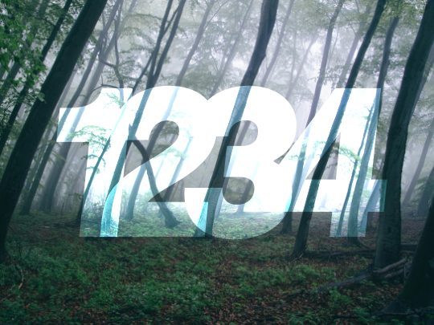

# Adobe After Effects

## Qu'est-ce c'est ?

* Logiciel d'animation et d'effets visuels.
* Utilisé dans la production vidéo, la création d'animations graphiques et les effets spéciaux.
* S'intègre avec d'autres logiciels Adobe (Photoshop, **Illustrator**, Premiere Pro).

## Interface

Voici la liste des différents panneaux et leur utilité.

[:material-play-circle: Les panneaux principaux](https://cmontmorency365-my.sharepoint.com/:v:/g/personal/mariem_ouellet_cmontmorency_qc_ca/EdkcyKY98idPvVvdcbMG33EBtAJZKzdOOFl0EOdVtAkJSQ)

### Panneau des projets

Le panneau des projets dans After Effects est l'espace où sont organisés et gérés tous les éléments importés, comme les **vidéos**, **images**, **compositions** et effets, servant de bibliothèque centrale pour construire une animation.

{ data-zoom-image }

### Panneau des compositions

* Fenêtre d'aperçu de l'animation en cours.
* Contrôles de lecture et d'affichage.
* Différents modes d’affichage (Aperçu rapide, Pleine qualité, Filtrage anti-aliasing).

{ data-zoom-image }

### Panneau de montage (ligne du temps, _timeline_)

* Organisation des calques et gestion du temps.
* Affichage des propriétés des calques (Position, Opacité, Rotation, Échelle).
* Marqueurs de temps et gestion des images clés (Keyframes).

{ data-zoom-image }

[:material-play-circle: Le panneau montage](https://cmontmorency365-my.sharepoint.com/:v:/g/personal/mariem_ouellet_cmontmorency_qc_ca/Ebt5l3luOeJHk-_ObGGHM8kBPlQatfpj2DYQ_aHe-b7J0Q)

[:material-play-circle: La lecture et le rendu de l'animation](https://cmontmorency365-my.sharepoint.com/:v:/g/personal/mariem_ouellet_cmontmorency_qc_ca/Eb3L11GVrj5EvtTqhBUS6GUBPZU0Aq5qfvjt1Eai5ia5og)

[:material-play-circle: La fonctionnalité _zoom_ du montage](https://cmontmorency365-my.sharepoint.com/:v:/g/personal/mariem_ouellet_cmontmorency_qc_ca/EfUgunKfJT5ArP5YmucXUGwB_6WriuGrXRDLOMW4PiKxyw)

[:material-play-circle: La prévisualisation](https://cmontmorency365-my.sharepoint.com/:v:/g/personal/mariem_ouellet_cmontmorency_qc_ca/EdLWCI2PmzBCnSrk4C6vw9oBDHhgrUrIyvEpelObisZntw)

### Les panneaux auxilières

[:material-play-circle: Les panneaux auxilières](https://cmontmorency365-my.sharepoint.com/:v:/g/personal/mariem_ouellet_cmontmorency_qc_ca/EQ3kun7rslBPu6b4e6ovOEsBEkH56isjd_y20KK2GgzRxw)

* **Panneau Outils** : Regroupe les outils essentiels tels que **Sélection**, **Plume**, **Texte**, **Forme**, **Zoom** et **Caméra**, permettant d'effectuer rapidement des actions courantes grâce à des raccourcis pratiques.
* **Panneau Effets et paramètres prédéfinis** : Offre une vaste bibliothèque d'effets prêts à l'emploi, tels que transitions, flous et distorsions, avec une fonction de recherche rapide pour trouver facilement des effets spécifiques.
* **Panneau Fil d'attente de rendu** : Permet de gérer l'exportation des compositions en ajoutant des projets prêts à être rendus, tout en offrant des options avancées pour configurer les formats de sortie, les codecs, la résolution et l'emplacement des fichiers finaux.
* **Panneau Caractères et Paragraphes** : Permet de personnaliser le texte en ajustant des paramètres tels que la **police**, la **taille**, l'**interligne** ou la **couleur**, tout en offrant des options avancées pour l'alignement et la mise en forme des paragraphes.

## Propriétés des calques

Les propriétés des calques sont des paramètres animables. Il existe de nombreuses [propriétés animables](https://helpx.adobe.com/ca_fr/after-effects/using/layer-properties.html), mais la majorité du temps, on anime la **position**, la **rotation**, l'**échelle** et la **transparence**. 

### Position 

Racourci clavier : ++p++ (comme dans _Position_)

<iframe class="aspect-4-1" height="300" style="width: 100%;" scrolling="no" title="Translation X" src="https://codepen.io/tim-momo/embed/jENvLpx?default-tab=result&theme-id=50173" frameborder="no" loading="lazy" allowtransparency="true" allowfullscreen="true"></iframe>

[:material-play-circle: Le positionnement](https://cmontmorency365-my.sharepoint.com/:v:/g/personal/mariem_ouellet_cmontmorency_qc_ca/EaeGspgw0H1Fll--0CTsXdQBEp05rZljpx4x2Xf-fmMVqw)

### Rotation

Raccourci clavier : ++r++ (comme dans _Roration_)

<iframe class="aspect-4-1" height="300" style="width: 100%;" scrolling="no" title="Rotation - Angle" src="https://codepen.io/tim-momo/embed/xbKaLJv?default-tab=result&theme-id=50173" frameborder="no" loading="lazy" allowtransparency="true" allowfullscreen="true"></iframe>

[:material-play-circle: La rotation](https://cmontmorency365-my.sharepoint.com/:v:/g/personal/mariem_ouellet_cmontmorency_qc_ca/EWLYftRT-rdEpopnWr38_2cBWbWNdh-zcVryMekPMaO53g)

### Échelle

Racourci clavier : ++s++ (comme dans _Scale_)

<iframe class="aspect-4-1" height="300" style="width: 100%;" scrolling="no" title="Scale" src="https://codepen.io/tim-momo/embed/ogvPePX?default-tab=result&theme-id=50173" frameborder="no" loading="lazy" allowtransparency="true" allowfullscreen="true"></iframe>

[:material-play-circle: La mise à l'échelle](https://cmontmorency365-my.sharepoint.com/:v:/g/personal/mariem_ouellet_cmontmorency_qc_ca/EdszNQFXOqJCiVVHqIcw03oBHR5RbtoFGITmTJWnIZvaTA)

### Opacité

Racourci clavier : ++t++ (comme dans _Transparency_)

<iframe class="aspect-4-1" height="300" style="width: 100%;" scrolling="no" title="Scale" src="https://codepen.io/tim-momo/embed/vEBzJzK?default-tab=result&theme-id=50173" frameborder="no" loading="lazy" allowtransparency="true" allowfullscreen="true"></iframe>

[:material-play-circle: La transparence](https://cmontmorency365-my.sharepoint.com/:v:/g/personal/mariem_ouellet_cmontmorency_qc_ca/EaeGspgw0H1Fll--0CTsXdQBEp05rZljpx4x2Xf-fmMVqw)

## Image-clé (keyframe)

[:material-play-circle: Les keyframe et l'interpolation](https://cmontmorency365-my.sharepoint.com/:v:/g/personal/mariem_ouellet_cmontmorency_qc_ca/EdLYhQVh1H5BqMkMFhwrggoBLu_O6EweDl91UaHLAXfEcw)

[:material-play-circle: Les raccourcis clavier pour les keyframes](https://cmontmorency365-my.sharepoint.com/:v:/g/personal/mariem_ouellet_cmontmorency_qc_ca/EZBL1r-zSalHt4V57J1Bx2IByFrGJ3d6_M2qZYH4qxeb1Q)

## Racourci clavier

[:material-play-circle: Les raccourcis clavier](https://cmontmorency365-my.sharepoint.com/:v:/g/personal/mariem_ouellet_cmontmorency_qc_ca/ERy5u9ZKkNBIsxlpm7oX5vsBFi_5pL1Qp3QamkC-azTNmw)

| Fonction                     | Raccourci Windows       |
|------------------------------|-------------------------|
| Outil Sélection              | ++v++                   |
| Outil Main                   | ++h++                   |
| Outil Zoom                   | ++z++                   |
| Outil Point d'ancrage        | ++y++                   |
| Nouvelle composition         | ++ctrl+n++              |
| Importer un fichier          | ++ctrl+i++              |
| Lecture en temps réel        | ++space++               |
| Placer la tête de lecture    | ++home++ (Début)  ++end++ (Fin) |
| Ajouter une image clé        | ++alt+shift+p++ (Position)  ++alt+shift+s++ (Échelle)  ++alt+shift+r++ (Rotation)  ++alt+shift+t++ (Opacité) |
| Dupliquer un calque          | ++ctrl+d++              |
| Annuler (undo)               | ++ctrl+z++              |
| Rétablir (redo)              | ++ctrl+shift+z++        |
| Afficher les propriétés      | ++p++ (Position)  ++s++ (Échelle)  ++r++ (Rotation)  ++t++ (Opacité) |
| Afficher toutes les clés     | ++u++                   |
| Rendu de la composition      | ++ctrl+m++              |
| Activer la plume             | ++g++                   |

[Liste officielle des raccourcis clavier](https://helpx.adobe.com/ca_fr/after-effects/using/keyboard-shortcuts-reference.html)

## Exercices

  

  <small>Exercice - After Effects</small> 
  **[Un, deux, trois et quatre !](../exercices_ae/undeuxtroisquatre/un-deux-trois-quatre.md){.stretched-link .back}**

  

  <small>Exercice - After Effects</small> 
  **[Cosmos](../exercices_ae/cosmos/cosmos.md){.stretched-link .back}**

  

  <small>Exercice - After Effects</small> 
  **[Wazowski](../exercices_ae/wazowski/wazowski.md){.stretched-link .back}**

[STOP]

  

  <small>Exercice - After Effects</small> 
  **[Monstre](../exercices_ae/00_monstre.md){.stretched-link .back}**

