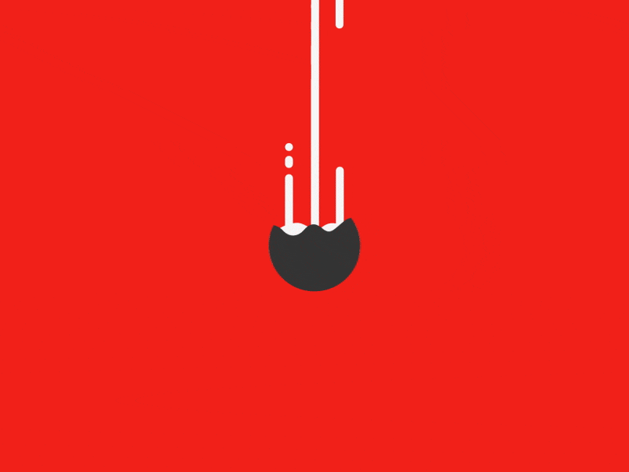

# Les animations

*[FPS]: Frames Per Second

## Introduction à l’animation 2D

Création d'une illusion de mouvement.

Technique qui consiste à agencer des images pour créer une impression de mouvement et de vie.

Le mouvement est représenté dans une succession d'images fixes dont la vision donne l'illusion d'un mouvement continu.

{ .w-100 }

{ .w-100 }

---

L'animation ce n'est pas juste à l'ordinateur !

{ .w-100 }

## Types d'animations 2D

### Animation traditionnelle

Aussi appelée animation dessinée à la main, elle consiste à dessiner chaque image individuellement pour créer une séquence animée fluide. (ex. Disney, Ghibli)

Exemple célèbre : le film [Steamboat Willie](https://youtu.be/BBgghnQF6E4?feature=shared&t=30).

{ .w-100 }

### Animation en rotoscopie

Technique où des séquences vidéo réelles sont utilisées comme référence pour tracer les mouvements image par image.

Exemple célèbre : le film [A Scanner Darkly](https://www.imdb.com/fr/title/tt0405296/).

Coup de coeur de Marie-Michelle : le film [Waking Life](https://www.youtube.com/watch?v=uk2DeTet98o).

{ .w-100 }

### Stop Motion 2D

Consiste à capturer des images d'éléments physiques (papier découpé, dessins) et à les assembler pour créer une animation.

Exemple célèbre : le film [The Nightmare Before Christmas](https://www.imdb.com/fr/title/tt0107688/).

{ .w-100 }

### Animation par interpolation (tweening)

Utilisée dans des logiciels comme Adobe After Effects, où des images-clés sont définies et l'ordinateur génère les images intermédiaires.

Le nombre d'image de l'animation n'est pas limité, car cette dernière est virtuelle.

<iframe class="aspect-4-1" height="300" style="width: 100%;" scrolling="no" title="Interpolation" src="https://codepen.io/tim-momo/embed/qBGxwQP?default-tab=result&theme-id=50173" frameborder="no" loading="lazy" allowtransparency="true" allowfullscreen="true">
  See the Pen <a href="https://codepen.io/tim-momo/pen/qBGxwQP">
  Interpolation</a> by TIM Montmorency (<a href="https://codepen.io/tim-momo">@tim-momo</a>)
  on <a href="https://codepen.io">CodePen</a>.
</iframe>

Les types d'interpolation : 

* Position (déplacement)
* Rotation
* Mise à l’échelle (scaling)
* Opacité

### Animation de marionnettes (cut-out)

Basée sur des éléments prédécoupés (bras, jambes, tête) qui sont animés en utilisant des squelettes ou des pivots.

Exemple célèbre : l'émission [South Park](https://www.imdb.com/fr/title/tt0121955/).

{ .w-100 }

### Animation par morphing

Technique permettant de transformer progressivement une forme en une autre (ex. transformation de visage).

{ .w-100 }

### Animation en boucle (looping)

Cette technique consiste à créer une séquence qui se répète de manière continue, comme une marche cyclique ou une vague en mouvement. Elle est fréquemment utilisée pour les GIFs, les bannières publicitaires et les jeux vidéo.

Exemple célèbre : [Danseuse en rotation](https://en.wikipedia.org/wiki/Spinning_dancer)

{ .w-100 }

### Animation basée sur la physique (dynamique)

Ce type d’animation repose sur l’application de principes physiques tels que la gravité, l’inertie ou les collisions pour rendre les mouvements plus réalistes.

{ .w-100 }

### Animation _motion design_

L'animation motion design consiste à animer des éléments graphiques tels que du texte, des formes et des icônes dans le cadre de présentations, de vidéos explicatives ou de contenus marketing.

{ .w-100 }

Crédit : [David Stanfield](https://dribbble.com/shots/1701919-Ideas)

[Autre exemple d'animation motion design](https://www.behance.net/gallery/164356671/Google-Icons-Animated?tracking_source=search_projects|google+motion&l=1)

## Un peu de lexique 

**Image par seconde (FPS)** : Le nombre d'image qui s'affiche à l'intérieur d'une seconde.

**Persistance rétinienne** : Notre œil garde en mémoire ce qu'il voit pendant une fraction de secondes.

> La persistance rétinienne est une particularité du fonctionnement de l'œil qui nous donne l'illusion du mouvement lorsque l'on regarde un dessin animé par exemple. En effet, les cellules de la rétine gardent en mémoire une image pendant 16 à 20 millisecondes (1/60e de seconde) après sont apparition. Ainsi, si l'on fait défiler très rapidement une séquence d'images, au rythme de 24 par seconde, l'œil a en permanence en mémoire les images et ne peut distinguer 2 images successives[^persis].

[^persis]: [Qu'est-ce que la persistance rétinienne ?](https://www.espace-sciences.org/archives/qu-est-ce-que-la-persistance-retinienne#:~:text=La%20persistance%20r%C3%A9tinienne%20est%20une,de%20seconde%20apr%C3%A8s%20sont%20apparition%20.)

!!! example "Combien d'image seconde pour le cours ?"

    Nous veillerons à toujours utiliser un taux supérieur à 24 FPS dans nos animations afin d'assurer une fluidité optimale.

## Images vectorielles et matricielles

Les images vectorielles, basées sur des formules mathématiques, sont redimensionnables sans perte de qualité, idéales pour les logos et les illustrations. 

Les images matricielles, composées de pixels, conviennent mieux aux photos, mais perdent en qualité lorsqu'elles sont agrandies. Le choix entre les deux dépend de l'usage et des besoins en résolution.

{ .w-100 }

[Source de l'image](https://ipcm.fr/comprendre-les-images-numeriques-matricielles-et-vectorielles-pour-mieux-les-utiliser/) 

### Logiciel d'édition d'images matricielles

  

  Adobe Photoshop est conçu pour manipuler des images matricielles, composées de pixels, ce qui le rend parfait pour la retouche photo et les visuels riches en détails, mais provoque une perte de qualité lors de l'agrandissement.

Formats de fichiers : `.psd` | `.jpg` `.png` `.gif`

### Logiciel d'édition d'images vectorielles 

  

  Adobe Illustrator est un logiciel spécialisé dans la création d'images vectorielles, permettant de concevoir des illustrations redimensionnables sans perte de qualité, idéales pour les logos et les graphiques complexes.

Formats de fichiers : `.ai` | `.svg` `.eps`