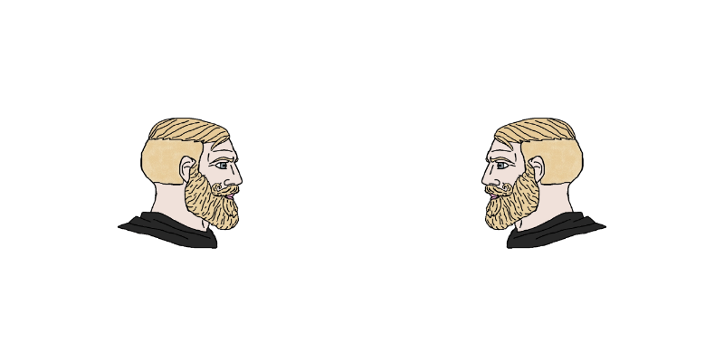
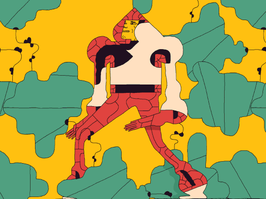
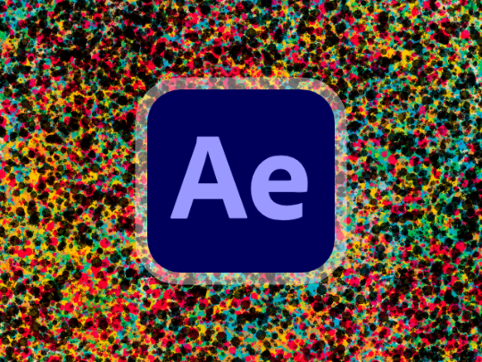

# Cours 1

## Présentations

## Rappel des règlements

* :material-food-off: Pas de nourriture et boissons
* On travaille calmement, on peut chuchoter pour s'aider
* Replacer les chaises et écouteurs à la fin du cours

## Matière

  

  **[Les animations](./animations.md){.stretched-link}**

  

  **[Adobe After Effects](./after-effects.md){.stretched-link}**

