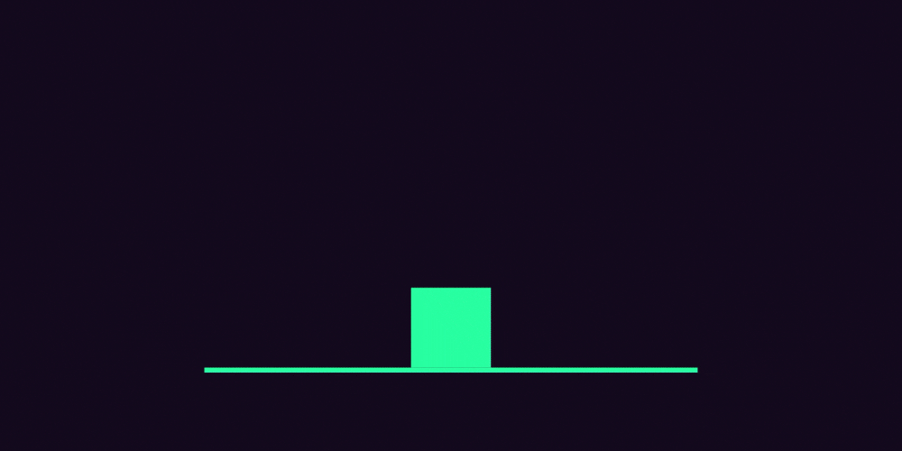
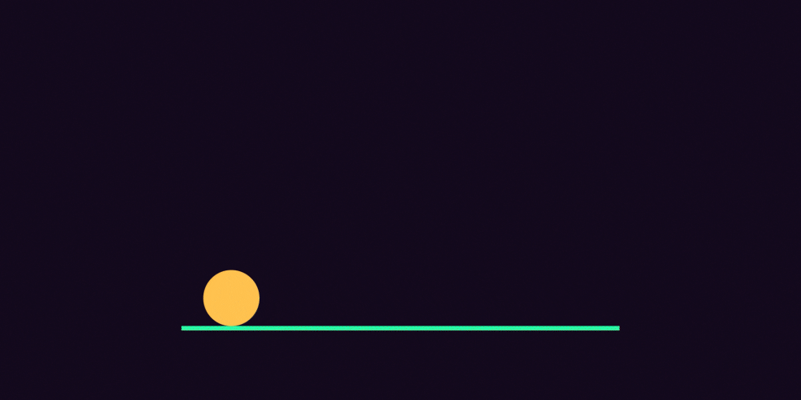

# Cours 2      

## Bases de l’animation

### Prévisualisation et flux de travail

  { data-zoom-image }

  [:material-play-circle: Le rendu](https://cmontmorency365-my.sharepoint.com/:v:/g/personal/mariem_ouellet_cmontmorency_qc_ca/Eb3L11GVrj5EvtTqhBUS6GUBPZU0Aq5qfvjt1Eai5ia5og)

  { data-zoom-image }

  [:material-play-circle: La prévisualisation](https://cmontmorency365-my.sharepoint.com/:v:/g/personal/mariem_ouellet_cmontmorency_qc_ca/EdLWCI2PmzBCnSrk4C6vw9oBDHhgrUrIyvEpelObisZntw)

  { data-zoom-image }

  [:material-play-circle: Le cache](https://cmontmorency365-my.sharepoint.com/:v:/g/personal/mariem_ouellet_cmontmorency_qc_ca/ETbHfBwIK2NMkV0MvapZll4BV1MqjmRvmzq7WwNN9my2ZA)

  { data-zoom-image }

  [:material-play-circle: Les paramètres de composition](https://cmontmorency365-my.sharepoint.com/:v:/g/personal/mariem_ouellet_cmontmorency_qc_ca/EbRIe5w3zY9Ngn9htiZ3sWsBSzQn_IFllHHL-5Fn7ZPQzA)

### Formes

  { data-zoom-image }

  [:material-play-circle: Les types de calque](https://cmontmorency365-my.sharepoint.com/:v:/r/personal/mariem_ouellet_cmontmorency_qc_ca/Documents/01_cours/Cours%20Animation%202D/animation%202D%202025/02_capsules_video/02_capsules_after_effects/16_types_de_calques/01_types_calques.mp4?csf=1&web=1&e=cgh4pw&nav=eyJyZWZlcnJhbEluZm8iOnsicmVmZXJyYWxBcHAiOiJTdHJlYW1XZWJBcHAiLCJyZWZlcnJhbFZpZXciOiJTaGFyZURpYWxvZy1MaW5rIiwicmVmZXJyYWxBcHBQbGF0Zm9ybSI6IldlYiIsInJlZmVycmFsTW9kZSI6InZpZXcifSwicGxheWJhY2tPcHRpb25zIjp7InN0YXJ0VGltZUluU2Vjb25kcyI6MzUuNDl9fQ%3D%3D)

### Animation courbée

  { data-zoom-image }

  [:material-play-circle: Courber une trajectoire](https://cmontmorency365-my.sharepoint.com/:v:/g/personal/mariem_ouellet_cmontmorency_qc_ca/EXbVPmLILVJFrZ2aQw7P0ckBR6_qlTP_tIPyLVveMI4YlA)

### Hiérarchies

{ data-zoom-image }

[:material-play-circle: Les calque parents et enfants](https://cmontmorency365-my.sharepoint.com/:v:/g/personal/mariem_ouellet_cmontmorency_qc_ca/EevYZli_buxNscVZ_P9WGzcBg2U7J6mYkKW5KvQfZRJjwQ)

[:material-play-circle: L'objet nul](https://cmontmorency365-my.sharepoint.com/:v:/g/personal/mariem_ouellet_cmontmorency_qc_ca/ETV8FnKoJgxHmJEWQvZwFU0B6h6HTaUbxv3KMsHVJUE5kg)

### Lissage

Le lissage de vitesse (_ease_) est une fonction qui permet de lisser la vitesse d'une animation en créant une transition fluide entre les mouvements, en ralentissant le début (_ease in_) ou la fin (_ease out_) d'une interpolation pour un rendu plus naturel et agréable.

<iframe class="aspect-4-1" height="300" style="width: 100%;" scrolling="no" title="Phaser - ease" src="https://codepen.io/tim-momo/embed/LYoKGZK?default-tab=result&theme-id=50173" frameborder="no" loading="lazy" allowtransparency="true" allowfullscreen="true"></iframe>

[:material-play-circle: Le lissage de vitesse](https://cmontmorency365-my.sharepoint.com/:v:/g/personal/mariem_ouellet_cmontmorency_qc_ca/EXQMoOiHLCNJsolStgZMgT0B_fnURMX4YZ_IQvkJVAsDcQ)

  { data-zoom-image }

  Pour retirer le lissage de vitesse d'une image-clé : clique-droit sur l'image-clé sélectionné / **Interpolation d'image-clé**. Dans la boite de dialogue, dans la liste **Interpolation temporelle"**, sélectionnez **linéaire**.

## Les 12 principes de l’animation

### L'origine

  

  Disney Animation: The Illusion of Life[^disneyanim] (1981)  
  [:material-book-open-page-variant: Feuilleter l'œuvre complète](https://archive.org/details/disney-animation-the-illusion-of-life/mode/2up)

Dans ce livre, les auteurs ont étudié les principes d'animation des années 1930 et ont classé les différentes approches en 12 principes fondamentaux.

[^disneyanim]: Disney Animation: The Illusion of Life (Wikipedia, en anglais) : <https://en.wikipedia.org/wiki/Disney_Animation:_The_Illusion_of_Life>

### 1. Écrasement et étirement

{.w-100}

Sans doute le plus fondamental des 12 principes de l'animation.

Donne une impression de **poids** ou de **flexibilité** aux objets ou aux personnes. 

Par exemple, une balle rebondissante. Lorsqu'elle touche le sol, vous pouvez écraser la balle pour l'aplatir et l'élargir.

[:simple-youtube: _Squash & Stretch_ | AlanBeckerTutorials](https://www.youtube.com/watch?v=haa7n3UGyDc&list=PL-bOh8btec4CXd2ya1NmSKpi92U_l6ZJd&index=1&t=7s) (en anglais mais possibilité de sous-titrer en français)

### 2. Anticipation

{.w-100}

Utilisation d'une petite action pour indiquer qu'une action majeure est sur le point de se produire.

La technique d'anticipation **prépare** subtilement le spectateur à la suite d'un mouvement.

[:simple-youtube: _Anticipation_ | AlanBeckerTutorials](https://www.youtube.com/watch?v=F8OtE60T8yU&list=PL-bOh8btec4CXd2ya1NmSKpi92U_l6ZJd&index=2&t=7s) (en anglais mais possibilité de sous-titrer en français)

### 3. Mise en scène

{.w-100}

La mise en scène est la présentation d'une idée de manière à la rendre parfaitement **claire** pour le spectateur.

C'est l'art de **diriger l'attention** du spectateur vers l'élément essentiel de la scène et d'amplifier une émotion.

[:simple-youtube: _Staging_ | AlanBeckerTutorials](https://www.youtube.com/watch?v=u-SXLaQGg50&list=PL-bOh8btec4CXd2ya1NmSKpi92U_l6ZJd&index=3&t=7s) (en anglais mais possibilité de sous-titrer en français)

### 4. Animation directe et pose clé

{.w-100}

Deux techniques d'animation : enchaînement fluide image par image ou travail à partir de positions clés.

**Animation directe** (_Straight Ahead Action_) : Cette technique consiste à dessiner image par image de manière séquentielle, permettant de créer des mouvements fluides et dynamiques, souvent utilisés pour les animations d'action ou les effets naturels.

**Pose clé** (_Pose to Pose_) : Cette méthode implique de dessiner d'abord les poses clés principales de l'animation, puis d'ajouter les images intermédiaires, offrant un meilleur contrôle du rythme et de la cohérence du mouvement.

[:simple-youtube: _Straight Ahead & Pose to Pose_ | AlanBeckerTutorials](https://www.youtube.com/watch?v=v8quCbt4C-c&list=PL-bOh8btec4CXd2ya1NmSKpi92U_l6ZJd&index=4&t=7s) (en anglais mais possibilité de sous-titrer en français)

### 5. Conséquence et chevauchement

{.w-100}

Ajout de mouvements secondaires qui continuent **après** l'arrêt du mouvement principal (conséquence).

Le **décalage** dans le rythme des différentes parties d'un sujet (chevauchement) crée ainsi un sentiment de réalisme et simule l'inertie/masse.

[:simple-youtube: _Follow Through & Overlapping Action_ | AlanBeckerTutorials](https://www.youtube.com/watch?v=4OxphYV8W3E&list=PL-bOh8btec4CXd2ya1NmSKpi92U_l6ZJd&index=5&t=7s) (en anglais mais possibilité de sous-titrer en français)

### 6. Lissage

{.w-100}

**Ralentissement progressif** en début et fin d'action pour créer un sentiment réaliste d'accélération et de décélération.

[:simple-youtube: _Slow In & Slow Out_ | AlanBeckerTutorials](https://www.youtube.com/watch?v=fQBFsTqbKhY&list=PL-bOh8btec4CXd2ya1NmSKpi92U_l6ZJd&index=6&t=7s) (en anglais mais possibilité de sous-titrer en français)

### 7. Arcs de mouvement

{.w-100}

**Trajectoires courbes** suivies par les objets ou les personnages en mouvement, reflétant les lois **naturelles** du mouvement et permettant d'obtenir des animations plus **fluides** et réalistes.

[:simple-youtube: _Arcs_ | AlanBeckerTutorials](https://www.youtube.com/watch?v=I1_tZ9LhJD4&list=PL-bOh8btec4CXd2ya1NmSKpi92U_l6ZJd&index=7&t=7s) (en anglais mais possibilité de sous-titrer en français)

### 8. Action secondaire

{.w-100}

Actions secondaires qui enrichissent l'action principale.

[:simple-youtube: _Secondary Action_ | AlanBeckerTutorials](https://www.youtube.com/watch?v=MjBHWw1TbP4&list=PL-bOh8btec4CXd2ya1NmSKpi92U_l6ZJd&index=8&t=7s) (en anglais mais possibilité de sous-titrer en français)

### 9. Rythme et synchronisation

{.w-100}

L'ajustement du nombre d'images pour modifier la perception de la vitesse d'une animation.

> La personnalité et la nature d'une animation sont grandement influencées par le nombre d'images insérées entre chaque action principale.

[:simple-youtube: _Timing_ | AlanBeckerTutorials](https://www.youtube.com/watch?v=BarOk2p38LQ&list=PL-bOh8btec4CXd2ya1NmSKpi92U_l6ZJd&index=9&t=7s) (en anglais mais possibilité de sous-titrer en français)

### 10. Exagération

{.w-100}

Dramatise ou intensifie une action afin de la rendre plus expressive et compréhensible pour le spectateur.

[:simple-youtube: _Exaggeration_ | AlanBeckerTutorials](https://www.youtube.com/watch?v=HfFj-VQKiAM&list=PL-bOh8btec4CXd2ya1NmSKpi92U_l6ZJd&index=10&t=7s) (en anglais mais possibilité de sous-titrer en français)

### 11. Dessin de volume

{.w-100}

Représenter des formes avec du volume et du poids pour donner l'illusion de 3D

[:simple-youtube: _Solid Drawing_ | AlanBeckerTutorials](https://www.youtube.com/watch?v=7An0jukOkCI&list=PL-bOh8btec4CXd2ya1NmSKpi92U_l6ZJd&index=11&t=7s) (en anglais mais possibilité de sous-titrer en français)

### 12. Attrait visuel

{.w-100}

Captiver le public en créant une animation simple, claire et attrayante

[:simple-youtube: _Appeal_ | AlanBeckerTutorials](https://www.youtube.com/watch?v=_SplEuWp0Yw&list=PL-bOh8btec4CXd2ya1NmSKpi92U_l6ZJd&index=12&t=7s) (en anglais mais possibilité de sous-titrer en français)

## Exercices

  

  <small>Exercices - After Effects | Adobe.com</small> 
  1. **[Trajectoire courbe](https://www.adobe.com/ca_fr/learn/after-effects/web/keyframe-animation)** 
  2. **[Outil de forme](https://www.adobe.com/ca_fr/learn/after-effects/web/add-animate-shapes)** 
  3. **[Liaison parent-enfant](https://www.adobe.com/ca_fr/learn/after-effects/web/animating-with-parenting)**

  

  <small>Exercice - After Effects</small> 
  **[3 principes de l'animations](./exercices_ae/12principles/part1.md){.stretched-link .back}**

  

  <small>Exercice - After Effects</small> 
  **[La balle de tennis](./exercices_ae/devoir_balle.md){.stretched-link .back}**

  

  <small>Exercice - After Effects</small> 
  **[Le totem en LEGO](./exercices_ae/legototem/legototem.md){.stretched-link .back}**

[STOP]

Sources : 
https://dribbble.com/shots/22702822-12-Principles-of-Animation
https://idearocketanimation.com/13721-12-principles-of-animation-gifs/
https://www.adobe.com/creativecloud/animation/discover/principles-of-animation.html
https://lottiefiles.com/blog/tips-and-tutorials/mastering-disney-12-principles-animation
