# Cours 3     

## Les calques (la suite)

[:material-play-circle: Les types de calque](https://cmontmorency365-my.sharepoint.com/:v:/g/personal/mariem_ouellet_cmontmorency_qc_ca/ET97Qp5f26pOgspYh56l23UBtVWGLQBvrfEfSJQ_D0rMwg)

### Solides

Les solides sont de simples fonds de couleur. 

Ils peuvent être utiles pour créer un fond de couleur à une scène ou pour faire un _fade out_ ou un _fade in_, mais principalement, les solides servent de support pour appliquer des effets et des modes de fusion. Bref, on y reviendra!

[:simple-youtube: Usage d'un solide (2:24 à 3:24) | MotionCafe](https://www.youtube.com/watch?v=TLKC3xwGz8Y&t=124s)

!!! info "Le saviez-vous ?"

    Vous pouvez facilement redimentionner une image pour qu'elle s'ajuste à la taille de votre composition avec l'option `Calque > Géométrie > Ajuster à la composition`.

### Formes 

Les formes plus complexes demande de connaitre certains **raccourcis**. Par exemple, l'étoile peut être modifiée avant de relacher le bouton de la souris lorsqu'on la créé. Essayez les flèches pour constater les propriétées modifiées.

Il est possible également de fabriquer toutes sortes de forme avec l'outil **Plume** :fontawesome-solid-pen-nib:. Assurez vous simplement de bien refermer vos formes vectorielles pour les utiliser proprement.

### Texte

Le panneau **Caractère** permet de modifier l'apparence du texte (police, taille, interlignage, etc.), tandis que le panneau **Paragraph** gère l'alignement et la disposition des blocs de texte. Ensemble, ils offrent un contrôle précis sur la typographie[^txtlayer].

[^txtlayer]: [Création et modification des calques de texte](https://helpx.adobe.com/ca_fr/after-effects/using/creating-editing-text-layers.html)

  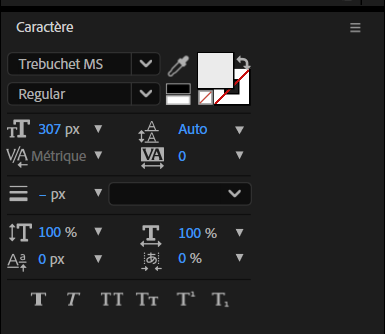{ data-zoom-image }

  Panneau de caratère

  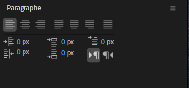{ data-zoom-image }

  Panneau de paragraphe

Quelques tutoriels intéressants : 

* [Tutoriel - Lʼécriture cursive](https://helpx.adobe.com/ca_fr/after-effects/using/animating-text.html)
* [Tutoriel - Effet machine à écrire](https://youtu.be/vtDtALyN3rY?feature=shared) par { data-zoom-image }

<!-- 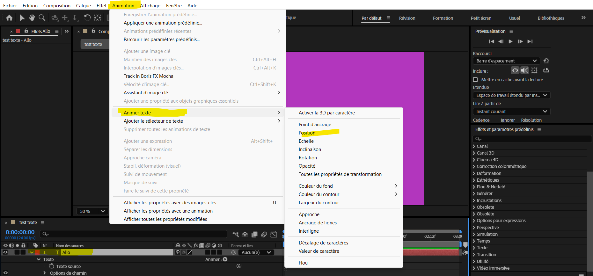 

Animations prédéfinies de texte

Ressources utile: traduction des effets AE de l'anglais à français [Repaire.net](https://www.repaire.net/forums/articles/after-effects-traduction-des-noms-des-effets-anglais-vers-francais.234/)

Animation mot par mot

-->

<!-- Fichier animation_predefinies_texte_2d-fichier_demo2025.aep composition The Blur Presets
https://cmontmorency365-my.sharepoint.com/:u:/r/personal/mariem_ouellet_cmontmorency_qc_ca/Documents/01_cours/Cours%20Animation%202D/animation%202D%202025/03_contenu_de_cours/demo-anim-texte/animation_predefinies_texte_2d-fichier_demo2025.aep?csf=1&web=1&e=OHY2ii -->

## Morphage vectoriel

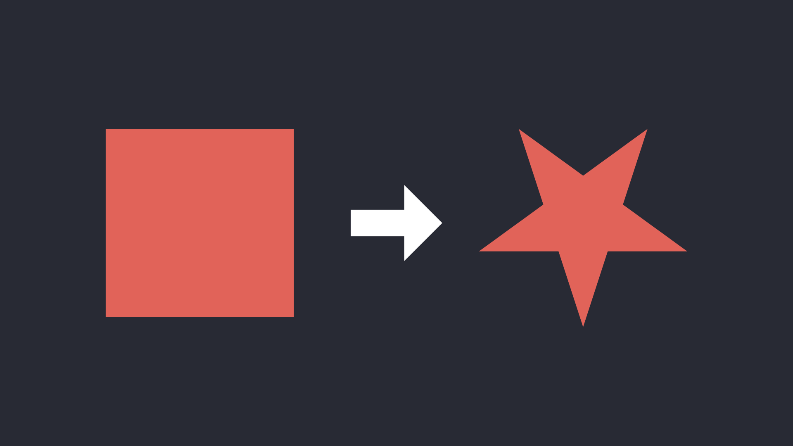

La technique d'animation de morphage vectoriel est très simple. 

1. D'abord on crée 2 formes sur 2 calques différents.
1. Ensuite, on sélectionne le tracé (path) de chaque forme et on ajoute pour chacun, un _keyframe_.
1. On sélectionne le _keyframe_ de la forme de destination et on fait un **copier**.
1. Enfin, on sélectionne la forme de départ, on avance le **repère d'instant courant** de quelques _frames_ et on fait un **coller**.

Datsit Datsow

!!! info "Le saviez-vous 2 ?"

    Vous pouvez facilement replacer l'ancre d'un objet à son centre en tenant enfoncé ctrl puis double clic sur l'icone de Point d'ancrage.

[:material-play-circle: Le morphage](https://cmontmorency365-my.sharepoint.com/:v:/g/personal/mariem_ouellet_cmontmorency_qc_ca/EYpViBMu9W1MpTwChd72VfcBGPF2eF8lZY-XhDba_mUcPw)

<!-- 
## Morphing à partir du tracé
[:material-play-circle: 1 - Morphing d'une forme à une autre](https://cmontmorency365-my.sharepoint.com/:v:/g/personal/mariem_ouellet_cmontmorency_qc_ca/EYpViBMu9W1MpTwChd72VfcBGPF2eF8lZY-XhDba_mUcPw?nav=eyJyZWZlcnJhbEluZm8iOnsicmVmZXJyYWxBcHAiOiJPbmVEcml2ZUZvckJ1c2luZXNzIiwicmVmZXJyYWxBcHBQbGF0Zm9ybSI6IldlYiIsInJlZmVycmFsTW9kZSI6InZpZXciLCJyZWZlcnJhbFZpZXciOiJNeUZpbGVzTGlua0NvcHkifX0&e=Q0zAvZ)

[:material-play-circle: 2- Morphing typographique (une lettre à une autre) ](https://cmontmorency365-my.sharepoint.com/:v:/g/personal/mariem_ouellet_cmontmorency_qc_ca/ERDWRjfNthdPhDsArEswgB0BSEmX2erD4TrnSZLcY_UNYw?nav=eyJyZWZlcnJhbEluZm8iOnsicmVmZXJyYWxBcHAiOiJPbmVEcml2ZUZvckJ1c2luZXNzIiwicmVmZXJyYWxBcHBQbGF0Zm9ybSI6IldlYiIsInJlZmVycmFsTW9kZSI6InZpZXciLCJyZWZlcnJhbFZpZXciOiJNeUZpbGVzTGlua0NvcHkifX0&e=jJPtar)

## Morphing forme et coupure (shape - cut)
[:material-play-circle: Étape 1 - Effet morphing ](https://cmontmorency365-my.sharepoint.com/:v:/g/personal/mariem_ouellet_cmontmorency_qc_ca/ERY6c65kLK1Mo2LnsZfyRs4Bi8I0xySw4kj9CrIatlkhwQ?nav=eyJyZWZlcnJhbEluZm8iOnsicmVmZXJyYWxBcHAiOiJPbmVEcml2ZUZvckJ1c2luZXNzIiwicmVmZXJyYWxBcHBQbGF0Zm9ybSI6IldlYiIsInJlZmVycmFsTW9kZSI6InZpZXciLCJyZWZlcnJhbFZpZXciOiJNeUZpbGVzTGlua0NvcHkifX0&e=FtmDn2)

[:material-play-circle: Étape 2 - Déplacement forme ](https://cmontmorency365-my.sharepoint.com/:v:/g/personal/mariem_ouellet_cmontmorency_qc_ca/EewB85yKZtJBsrr41_1mcc8Byitc849uNdzUKBZGqudA2w?nav=eyJyZWZlcnJhbEluZm8iOnsicmVmZXJyYWxBcHAiOiJPbmVEcml2ZUZvckJ1c2luZXNzIiwicmVmZXJyYWxBcHBQbGF0Zm9ybSI6IldlYiIsInJlZmVycmFsTW9kZSI6InZpZXciLCJyZWZlcnJhbFZpZXciOiJNeUZpbGVzTGlua0NvcHkifX0&e=QaYTg9)

[:material-play-circle: Étape 3 - Morphing carré-triangle ](https://cmontmorency365-my.sharepoint.com/:v:/g/personal/mariem_ouellet_cmontmorency_qc_ca/EWA83Z7PtUVKsELB85N4EycBBbSpdqyJ2xxz1X1CK_I4rw?nav=eyJyZWZlcnJhbEluZm8iOnsicmVmZXJyYWxBcHAiOiJPbmVEcml2ZUZvckJ1c2luZXNzIiwicmVmZXJyYWxBcHBQbGF0Zm9ybSI6IldlYiIsInJlZmVycmFsTW9kZSI6InZpZXciLCJyZWZlcnJhbFZpZXciOiJNeUZpbGVzTGlua0NvcHkifX0&e=poOqJ2)

[:material-play-circle: Étape 4 - Amélioration transition morphing ](https://cmontmorency365-my.sharepoint.com/:v:/g/personal/mariem_ouellet_cmontmorency_qc_ca/EVsUJAo9AWhMhfNeoMD2l7QB41ICoi291uF_0xKfKFOStA?nav=eyJyZWZlcnJhbEluZm8iOnsicmVmZXJyYWxBcHAiOiJPbmVEcml2ZUZvckJ1c2luZXNzIiwicmVmZXJyYWxBcHBQbGF0Zm9ybSI6IldlYiIsInJlZmVycmFsTW9kZSI6InZpZXciLCJyZWZlcnJhbFZpZXciOiJNeUZpbGVzTGlua0NvcHkifX0&e=BjnDYp)

[:material-play-circle: Étape 5 - Ajouter une texture sur le morphing ](https://cmontmorency365-my.sharepoint.com/:v:/g/personal/mariem_ouellet_cmontmorency_qc_ca/EaV094ruE5pAkF2lxZyH9AEBBEO0mAydtFsf21NtKy5gIA?nav=eyJyZWZlcnJhbEluZm8iOnsicmVmZXJyYWxBcHAiOiJPbmVEcml2ZUZvckJ1c2luZXNzIiwicmVmZXJyYWxBcHBQbGF0Zm9ybSI6IldlYiIsInJlZmVycmFsTW9kZSI6InZpZXciLCJyZWZlcnJhbFZpZXciOiJNeUZpbGVzTGlua0NvcHkifX0&e=azpMkV)
-->

## Animation sur une trajectoire

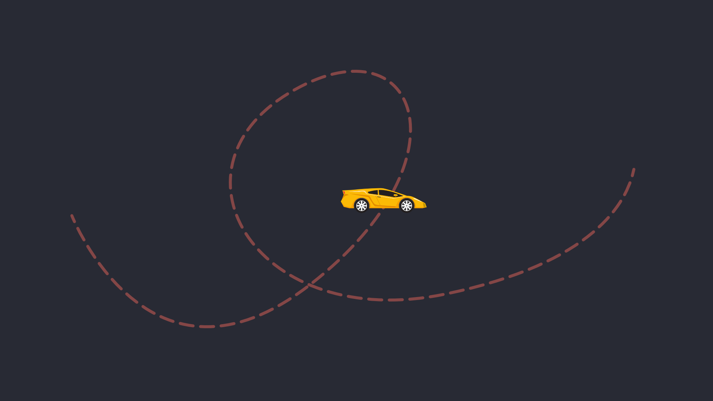

L'orientation sur une trajectoire se fait en créant une trajectoire à l'aide de la plume :fontawesome-solid-pen-nib:.

Tout comme le morphage vectoriel, une fois la trajectoire dessinée, on peut copier son tracé (path) et le coller sur l'attribut **Position** de la former ou de l'image.

### Orientation automatique

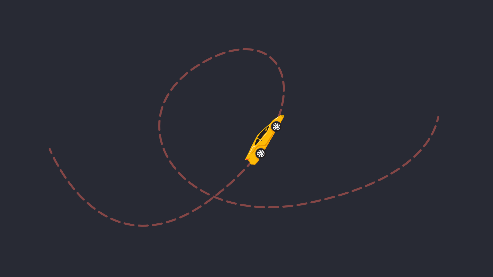

Lorsqu'un calque suit déjà une trajectoire, on peut ajuster sa rotation en fonction du tracé.

`Calque > Géométrie > Orientation automatique`

Si la rotation n'est pas tout à fait correcte, on peut corriger la rotation initiale de l'objet animé tout simplement.

[:material-play-circle: Orientation automatique](https://cmontmorency365-my.sharepoint.com/:v:/g/personal/mariem_ouellet_cmontmorency_qc_ca/EbiSTgq5TPJKoYCPD7Kk5LsBQ7QuS5jVJOXUEesXmqdVPw)

## Gestion du rythme

[:material-play-circle: Le séquençage](https://cmontmorency365-my.sharepoint.com/:v:/g/personal/mariem_ouellet_cmontmorency_qc_ca/EXLI0Z36AAhNvjQZcU3nvBcB0pYrLPEYPH1LIL56CGvcBQ)

[:material-play-circle: _Time stretch_](https://cmontmorency365-my.sharepoint.com/:v:/g/personal/mariem_ouellet_cmontmorency_qc_ca/EUqKO4P5OotDuxeQKwbDftsB1zWa6whp9V4T6itVkG99og)

## L'outil Marionnette

L'outil Marionnette permet d'ajouter des points de contrôle (appelés "épingles" :octicons-pin-16:) sur une image pour créer des déformations et des animations fluides. C'est particulièrement utile pour donner vie à des illustrations vectorielles en simulant des mouvements organiques.

[:material-play-circle: L'outil Marionnette  - Les notions de base](https://cmontmorency365-my.sharepoint.com/:v:/g/personal/mariem_ouellet_cmontmorency_qc_ca/EWhxb1HKHIJCs0qwlgzWmkUBpul9N1b1ChknjZ4r81Z_6g)

[:material-play-circle: L'outil Marionnette  - Les options](https://cmontmorency365-my.sharepoint.com/:v:/g/personal/mariem_ouellet_cmontmorency_qc_ca/EcNnPZC9UNhAjUbYGNQvhrsBhd7adgupio04CS6sO3L6Aw)

[:material-play-circle: L'outil Marionnette  - Bonne pratique](https://cmontmorency365-my.sharepoint.com/:v:/g/personal/mariem_ouellet_cmontmorency_qc_ca/EUAv17Pgv4BNkihPBgcox10BPdKy43CBge9f29luTku0eg)

[:material-play-circle: L'outil Marionnette - Enregistrement interactif](https://cmontmorency365-my.sharepoint.com/:v:/g/personal/mariem_ouellet_cmontmorency_qc_ca/Efn8VA_uCv9Fj2ltLMI6ZK0BbrAmRgpt7a2ql4g1b84oKg)

### Positionnement des coins de marionnette

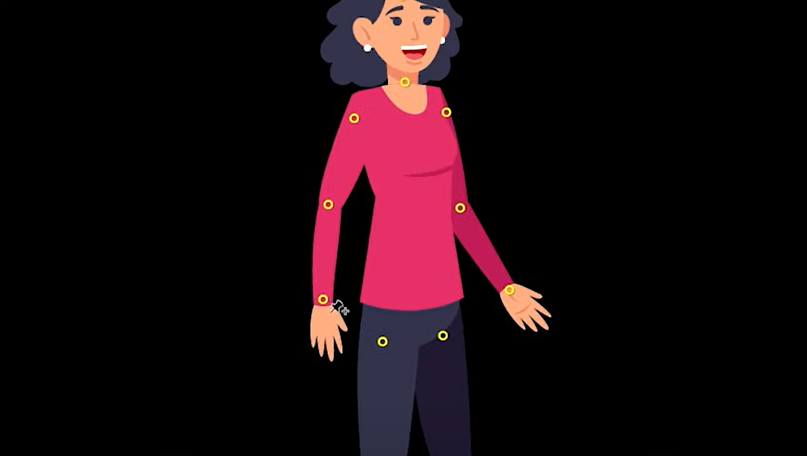{ data-zoom-image }

Ajoute des points de contrôle fixes permettant des déformations autour d’eux, comme pour placer des articulations sur un personnage (ex. genoux, coudes).

### Emploi des coins de marionnette

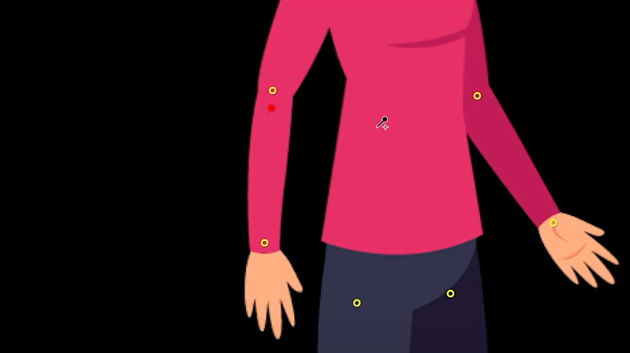{ data-zoom-image }

Permet des sélectionner des zones plus rigides entre les points de controles.

### Courbure des coins de marionnette

Ajoute une flexion avancée pour des mouvements plus fluides, pour animer un drapeau qui ondule par exemple.

### Coin de marionnette avancé

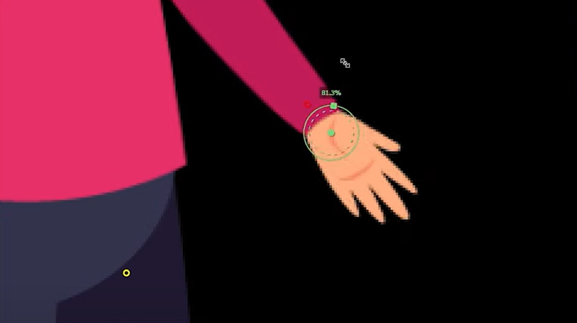{ data-zoom-image }

Gère la **position**, la **rotation** et la **mise à l’échelle**. Par exemple, c'est utile si on a besoin de plus de contrôle que simplement le positionement.

### Coin de recouvrement de marionnette

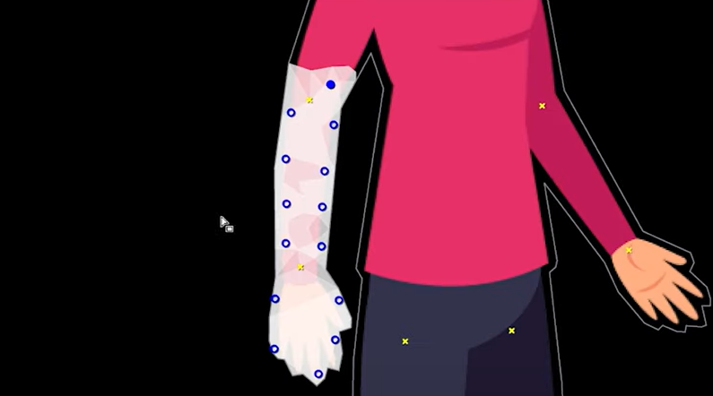{ data-zoom-image }

Définit l’ordre des couches dans l’animation, par exemple pour s’assurer qu’un bras passe devant ou derrière un corps.

## Exercices

[🛠️ Avion](exercices_ae/01_avion.md){ .md-button }       
    
[🛠️ Voiture](exercices_ae/01_voiture.md){ .md-button }  

  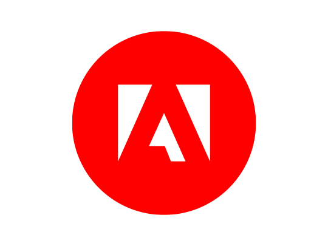

  <small>Exercices - After Effects | Adobe.com</small> 
  **[Forme complexe](https://www.adobe.com/ca_fr/learn/after-effects/web/draw-complex-shapes?learnIn=1)**

  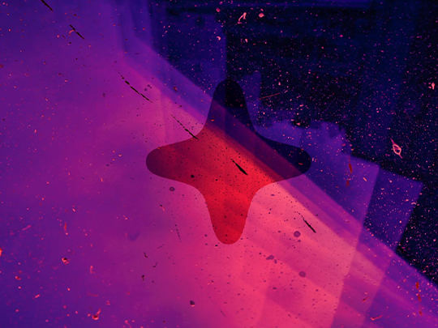

  <small>Exercice - After Effects</small> 
  **[Transmutation](./exercices_ae/transmutation/transmutation.md){.stretched-link .back}**

  

  <small>Exercice - After Effects</small> 
  **[Gaïa](./exercices_ae/gaia/gaia.md){.stretched-link .back}**

