# Cours 4

[STOP]

## Adobe Illustrator

[Adobe Illustrator](https://www.adobe.com/ca_fr/products/illustrator.html) est un logiciel de dessin **vectoriel** utilisé dans les domaines du design graphique, de l’illustration et de la conception d’interfaces. Contrairement aux images matricielles, les images vectorielles peuvent être **agrandies ou réduites à l’infini sans perte de qualité** !

L'outil permet de créer des **logos**, des **illustrations**, des **icônes**, des **infographies** et bien plus encore.

## Interface

  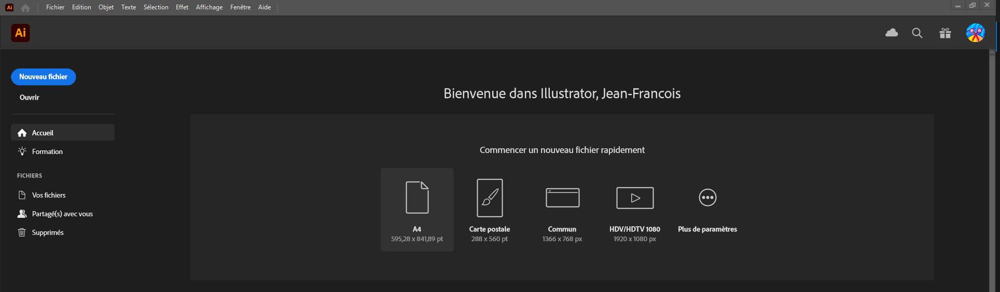{ data-zoom-image }

  [:material-play-circle: Création d'un projet](https://cmontmorency365.sharepoint.com/:v:/s/TIM-582214-Animation2d77/ES5ddJzsh91LrbRnu6N642EBaWL34-pCoxRj9pk49v7VGg?e=kCswfy)
   Raccourci : ++ctrl+n++

  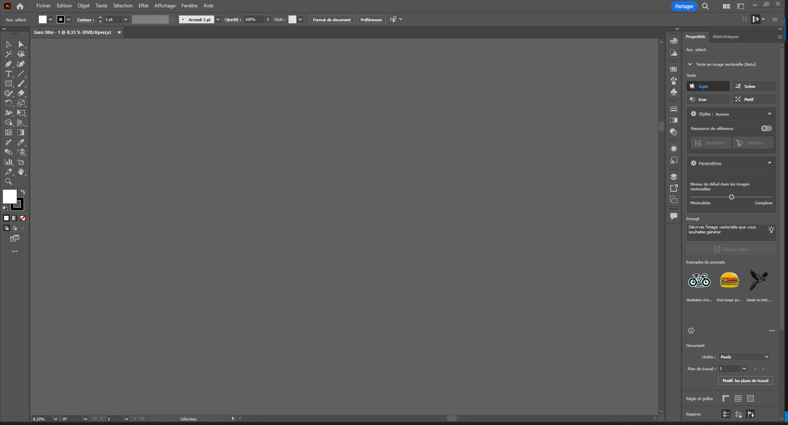{ data-zoom-image }

  [:material-play-circle: Présentation de l'interface](https://cmontmorency365.sharepoint.com/:v:/s/TIM-582214-Animation2d77/EcWxaKyOey9FiYqmafpdPz8B9hVhRJb88p_nxjLAEDctPA?e=FyjWXf)

  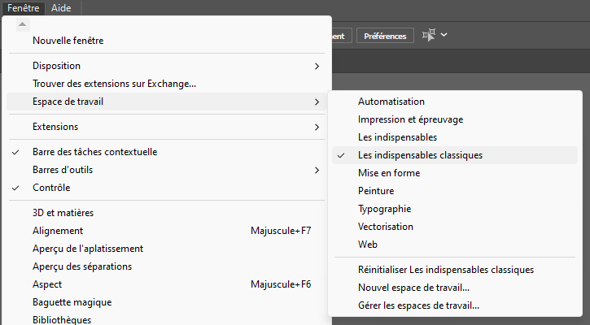{ data-zoom-image }

  [:material-play-circle: Personnaliser l'espace de travail](https://cmontmorency365.sharepoint.com/:v:/s/TIM-582214-Animation2d77/EU9vhuwP9-FChhvKBO4eAkYBkOffUVN3oSVgvquohjvP-Q?e=pbtden)

  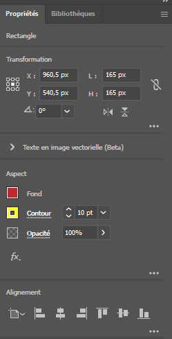{ data-zoom-image }

  [:material-play-circle: Panneau de propriété](https://cmontmorency365.sharepoint.com/:v:/s/TIM-582214-Animation2d77/EW_j7oaAnARLhmrcNtRhtg8BdoRPKLmP0eUcaETmwtS-2w?e=NjbWbt)

  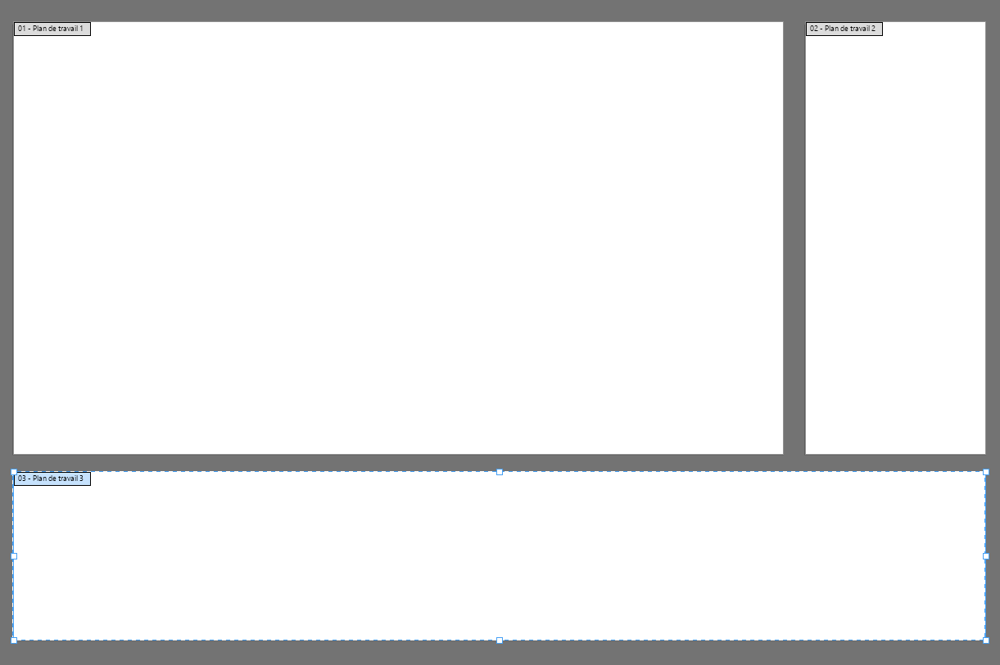{ data-zoom-image }

  [:material-play-circle: Plan de travail](https://cmontmorency365.sharepoint.com/:v:/s/TIM-582214-Animation2d77/ETw2wfv38RlKsRFtHQip1aEB9x3zN4ainpbDqGPK9q-ImQ?e=ta4Dgu)

  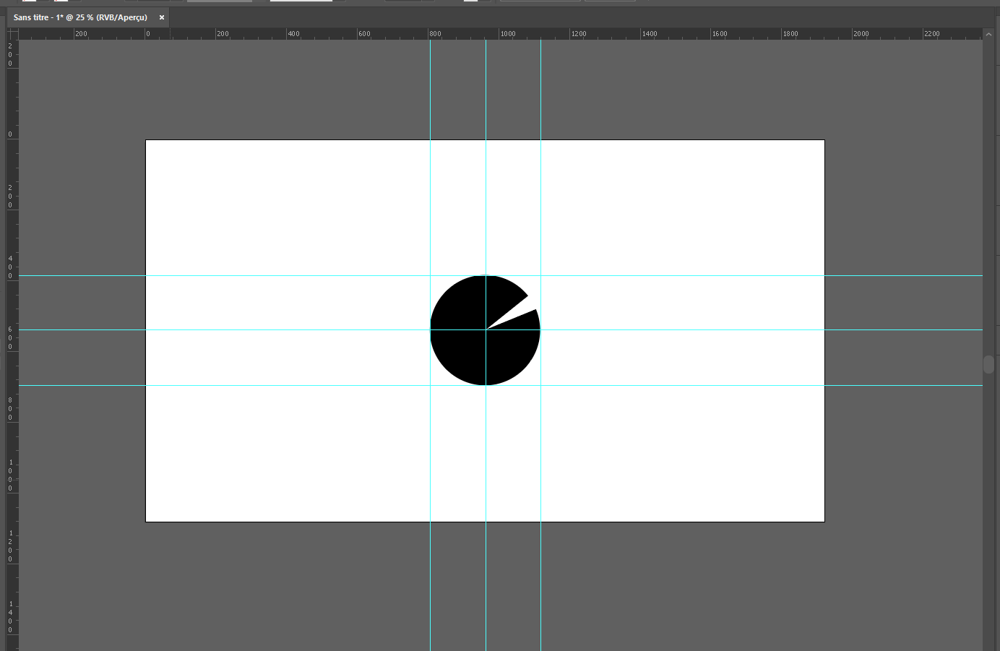{ data-zoom-image }

  [:material-play-circle: Règles et repères](https://cmontmorency365.sharepoint.com/:v:/s/TIM-582214-Animation2d77/EVWn5aelFqpOv_9d1i0JF78BymFyM5Ss_7aDn8zNncEsLA?e=RKKLMO)
   `Affichage > Règles > Afficher les règles`

  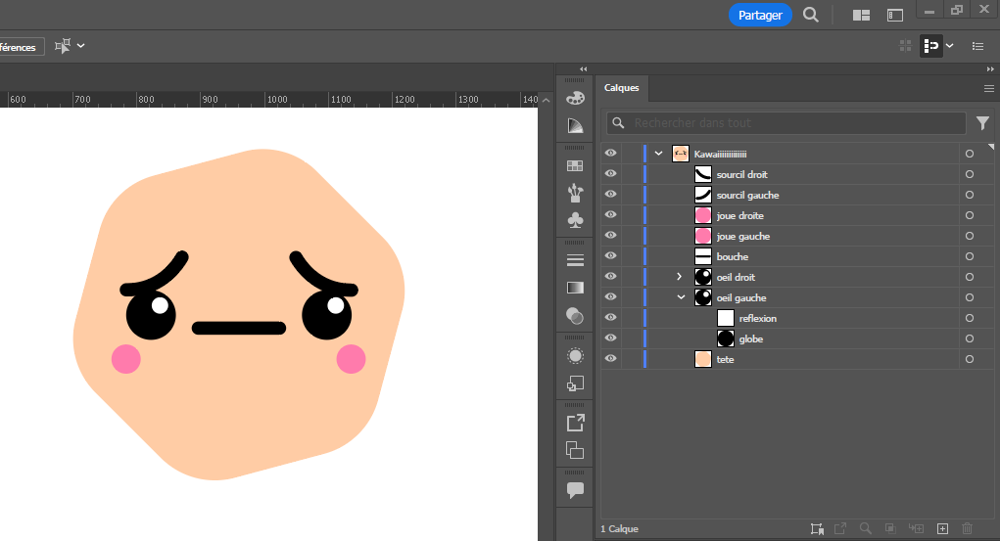{ data-zoom-image }

  [:material-play-circle: Les calques](https://cmontmorency365.sharepoint.com/:v:/s/TIM-582214-Animation2d77/EXbsq2fkhm9Ls9JeLlNmDhoBkZR8xBtMFOQl2qPzn7TNkQ?e=WF6FvR) 
  [:material-play-circle: Grouper les calques](https://cmontmorency365.sharepoint.com/:v:/s/TIM-582214-Animation2d77/ERskOIzx8thBu_Z6Tom8z9EBd4UsYweOJA5eEjBLhsZ-8g?e=qdnQ6D)
   Grouper : `Objet > Associer`
   Raccourci : ++ctrl+g++

  [:material-play-circle: Préparer les calques pour After Effects](https://cmontmorency365-my.sharepoint.com/:f:/g/personal/mariem_ouellet_cmontmorency_qc_ca/ElTl7pNn_atGuWTh-HcDxo4B97E_Oxew0e4rEDeGrE1-5A?e=uEFfJD)

  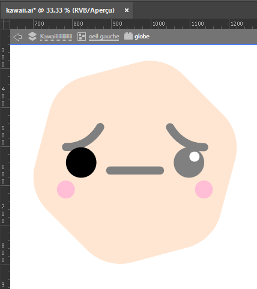{ data-zoom-image }

  [:material-play-circle: Mode isolement](https://cmontmorency365.sharepoint.com/:v:/s/TIM-582214-Animation2d77/EVevKy3jqq5KjV1rBFfBoGkBrFqKDurwihI2ObQDx-kIxw?e=6fCpJ5)
   Portez attention au fil d'Ariane

## Outils de manipulation

  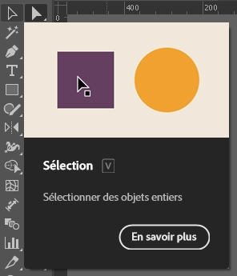{ data-zoom-image }

  [:material-play-circle: La sélection](https://cmontmorency365.sharepoint.com/:v:/s/TIM-582214-Animation2d77/EaM75QxzM9pBg9iYuG01uo8BGFVDSQtsSrFA6fXz2j2Jsw?e=xVHOsn)
   Raccourci : ++v++

  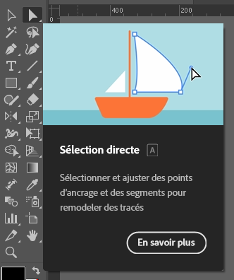{ data-zoom-image }

  [:material-play-circle: La sélection directe](https://cmontmorency365.sharepoint.com/:v:/s/TIM-582214-Animation2d77/EQbG5xgPIDlFh8gKp_bCcVcBDbhXN4hySTLMdBt-QKJP4g?e=iSHEmI) 
  [:material-play-circle: La sélection directe progressive](https://cmontmorency365.sharepoint.com/:v:/s/TIM-582214-Animation2d77/ESVH-vYG0LhOvJF1E-1TfNEBBnzLVTHqTm8ULnFC1B_X3w?e=Myy2SJ)
   Raccourci : ++a++

 

  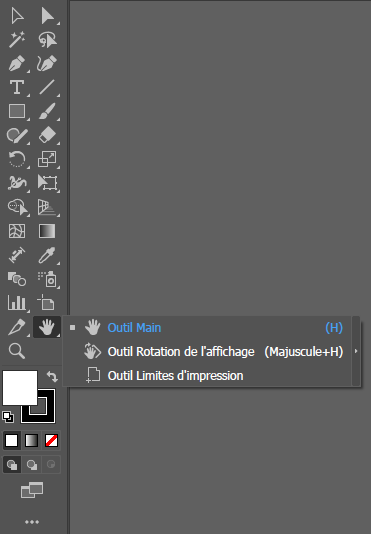{ data-zoom-image }

  [:material-play-circle: Le déplacement](https://cmontmorency365.sharepoint.com/:v:/s/TIM-582214-Animation2d77/EdzZLfIhGG9GmDUD2nGWcgMBHbPFCwI8MMfUV5dnha9fEA?e=HNhpXb)
   Clic molette de défilement (Déplacement)
   Espace enfoncé + clic (Déplacement)
   alt + molette de défilement (Zoom)

  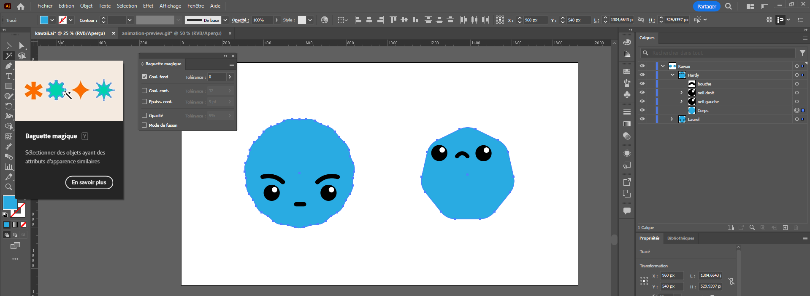{ data-zoom-image }

  [:material-play-circle: Baguette magique](https://cmontmorency365.sharepoint.com/:v:/s/TIM-582214-Animation2d77/EaDI5ZSDJzhEnBU3VXJ1zt8B47tGZ8ZoJeTMfisebov2BQ?e=328kHA)
   Raccourci : ++y++

  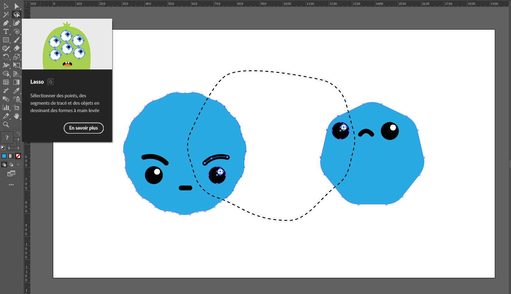{ data-zoom-image }

  [:material-play-circle: Lasso](https://cmontmorency365.sharepoint.com/:v:/s/TIM-582214-Animation2d77/EeMB16q9Y2ZFiWqmSSqHNegBE6-OskRpaw1nPyw1g-vFtw?e=lTym2X)
   Raccourci : ++q++

  { data-zoom-image }

  [:material-play-circle: Déformation](https://cmontmorency365.sharepoint.com/:v:/s/TIM-582214-Animation2d77/EZmlrOHAd7FBtB25jLFiV_0BmUID-i4BWHGGLEprKZshfA?e=pRgl4O)

<!-- [:material-play-circle: Importation d'images](https://cmontmorency365.sharepoint.com/:v:/s/TIM-582214-Animation2d77/EadRHPzIucxFlI28D5gO0RgBIs3IZJ5KfBvqZThd9ODvNQ?e=8N6CPd) -->
    
## Formes

  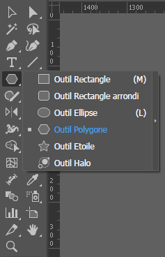{ data-zoom-image }

  [:material-play-circle: Rectangle](https://cmontmorency365.sharepoint.com/:v:/s/TIM-582214-Animation2d77/EQxYAeW4G51FsiXGcDGOIP8B93DnMnndzRLxt_a8R8zBRA?e=h0kTU7) 
  [:material-play-circle: Cercle](https://cmontmorency365.sharepoint.com/:v:/s/TIM-582214-Animation2d77/EQxYAeW4G51FsiXGcDGOIP8B93DnMnndzRLxt_a8R8zBRA?e=h0kTU7) 
  [:material-play-circle: Étoile](https://cmontmorency365.sharepoint.com/:v:/s/TIM-582214-Animation2d77/EZX2hwnkga5Gs40mBRIsmoQBsl7C88Qf5870TUvM2Gjyeg?e=MF0Bze) 
  [:material-play-circle: Polygone](https://cmontmorency365.sharepoint.com/:v:/s/TIM-582214-Animation2d77/ERjFIyvRbdxIqUXUJpZVPcUBtV3y_unzAOcQfgW_wkPMuA?e=aTTyb3) 

  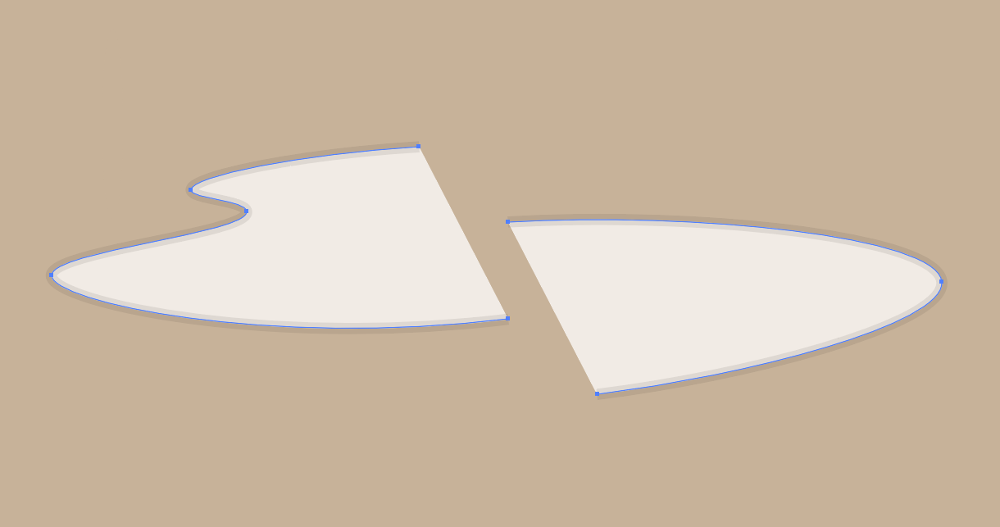{ data-zoom-image }

  [:material-play-circle: Plume (P)](https://cmontmorency365.sharepoint.com/:f:/s/TIM-582214-Animation2d77/Eq8ZhUw3cV1IqNyni40oEZgBdq_dNHTLU51tnAMLyqFmAw?e=lwBTZr) 
  [:material-play-circle: Courbure](https://cmontmorency365.sharepoint.com/:v:/s/TIM-582214-Animation2d77/EdEBCUstOuBDm53ceqGbNVsBIwBWuH7GxkZr7qhPyYix9w?e=Wdug0F) 
  [:material-play-circle: Trait](https://cmontmorency365.sharepoint.com/:v:/s/TIM-582214-Animation2d77/EXEsMNgXyytBmvfM-W-rAU0BlKyCj0UZ6NrlleE5KkscPA?e=J5oJJS) +
  [:material-play-circle: Épaisseur de trait](https://cmontmorency365.sharepoint.com/:v:/s/TIM-582214-Animation2d77/EXSERtnu2vROpH40Q_RYJawBqrU7VpFVz6UKNfY2cHf-jg?e=btRNie)  
  [:material-play-circle: Arc](https://cmontmorency365.sharepoint.com/:v:/s/TIM-582214-Animation2d77/EfarjMb3n4lAmQ9Txg6PEzIBBe1vFkONITW7pvHF-ozADg?e=nDRVjK) 
  [:material-play-circle: Ciseaux](https://cmontmorency365.sharepoint.com/:v:/s/TIM-582214-Animation2d77/EbCiUHz89vNHlZJ-rFlhNgwBJBLCcG1O-b1DYVpIU9SLoQ?e=ZVYIng)

### La décomposition

[La décomposition](https://helpx.adobe.com/ca_fr/illustrator/using/grouping-expanding-objects.html) permet de convertir une forme en une structure vectorielle indépendante des outils dynamiques d’Illustrator.

⚠️ Attention : Cette méthode est destructive, ce qui signifie qu’il est impossible de revenir en arrière une fois l’action effectuée. Il est donc fortement recommandé de dupliquer votre calque avant d’appliquer cette transformation.

Par exemple, le jeune d'oeuf a initialement été créé avec une forme ovale puis décomposée et ajustée par la suite.

## Raccourcis

| Action                        | Raccourci (Windows) |
|-------------------------------|---------------------|
| **Zoom avant**                | ctrl + +            |
| **Zoom arrière**              | ctrl + -            |
| **Afficher les repères**      | ctrl + ;            |
| **Déplacer vers l'arrière**   | ctrl + [            |
| **Déplacer vers l'avant**     | ctrl + ]            |
| **Dupliquer**                 | alt + glisser       |
| **Grouper**                   | ctrl + g            |
| **Dégrouper**                 | ctrl + maj + g      |
| **Outil de sélection**        | v                   |
| **Outil de sélection directe**| a                   |
| **Outil Plume**               | p                   |
| **Outil déplacement**         | h                   |
| **Outil Zoom**                | z                   |

[Liste complète des raccourcis](https://helpx.adobe.com/ca_fr/illustrator/using/default-keyboard-shortcuts.html)

<!-- 
[:material-play-circle: Spirale](https://cmontmorency365.sharepoint.com/:v:/s/TIM-582214-Animation2d77/Edkspx-v4p1PmUDZyI3cL1gBR6oyBkE1JzqiYCe5DbCy1w?e=lascoq)

[:material-play-circle: Grille](https://cmontmorency365.sharepoint.com/:v:/s/TIM-582214-Animation2d77/EZxC7yf3LLJOoTvcyrN8-goBY7ikG1LdrwOMO_LEQFI55Q?e=3gB2at)

[:material-play-circle: Sauvegarde](https://cmontmorency365.sharepoint.com/:v:/s/TIM-582214-Animation2d77/Ebuc6WA8nGRMsnv43au4gMoBDTC54PbZ3yWDyaoZYMl4Rw?e=M3af7U)
-->

## Exercices

<!-- 

[Création d'un nouveau document](./exercice_ai/00_nouveau_doc.md){ .md-button }  
[Maison](./exercice_ai/04_maison.md){.back} 
[Formes simples](./exercice_ai/04_formes_simples.md){.back}     
[Vagues](./exercice_ai/01_vagues.md){.back} 

  

  <small>Exercices en vrac - Illustrator</small> 
  [Largeur](./exercice_ai/02_largeur.md){.back} 
  [Déformation](./exercice_ai/02_deformation.md){.back} 
  [Formes](./exercice_ai/03_formes.md){.back}  

  -->

  

  <small>Exercice - Illustrator</small> 
  [Istanbul](./exercice_ai/00_transformations.md){.stretched-link .back}

  

  <small>Exercice - Illustrator</small> 
  [Plume](./exercice_ai/01_plume.md){.stretched-link .back}

  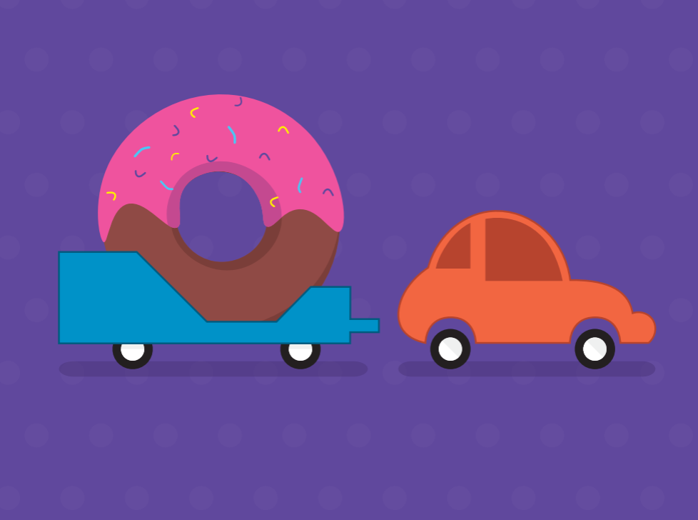

  <small>Exercice - Illustrator</small> 
  [Voiture](./exercice_ai/01_voiture.md){.stretched-link .back}

  

  <small>Exercice - Illustrator</small> 
  **[(づ｡◕‿‿◕｡)づ](./exercice_ai/kawaii/kawaii.md){.stretched-link .back}**

<!-- [🛠️ Devoir 1](./exercice_ai/04_devoir_1.md){ .md-button }    -->

 

