# Cours 5

## Exportation

[:material-play-circle: Exportation](https://cmontmorency365.sharepoint.com/:v:/s/TIM-582214-Animation2d77/ERSReehDFyBBhkRuuu-IZuAB3g1PvdYW3C3dVaeMAA4rwQ?e=DAE16t) 
Exportation jpeg ou psd 
Exportation Web (jpg, png, gif)

## Fromes (carré, cercle, polygone)

[:material-play-circle: Modification dynamique du nombre de cotés, coins arrondis, etc](https://cmontmorency365.sharepoint.com/:v:/s/TIM-582214-Animation2d77/ER4QVjpZdNtLrT9iA-AdLdIB8JX4o0Pl1s5Yg_fTk8WUrQ?e=L1djZU)

## Dessin

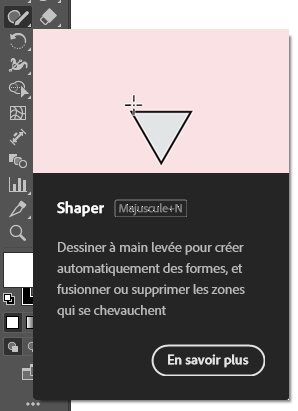

[:material-play-circle: Shaper](https://cmontmorency365.sharepoint.com/:v:/s/TIM-582214-Animation2d77/Ef1TjjvjbjhAtZ8e69VC-UcByeZDRGWB510iZODaHbimuA?e=AYxsmx)

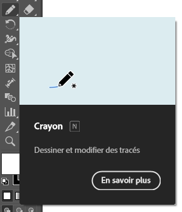

[:material-play-circle: Crayon](https://cmontmorency365.sharepoint.com/:v:/s/TIM-582214-Animation2d77/EdlQKYC_ZdNFlN6W7cq54kQBx3evpB7o0TitXQJEt3PhJA?e=yDenP2)

[:material-play-circle: Simplifier les contours](https://cmontmorency365.sharepoint.com/:v:/s/TIM-582214-Animation2d77/EVQXT9fceRlGie7B72m9r7kB2HO8KaT1kRVhvWu2yvV0QA?e=wEvZsD) 
Clic droit et sélectionner "Simplifier..."

## Pinceau, découpe et vectorisation

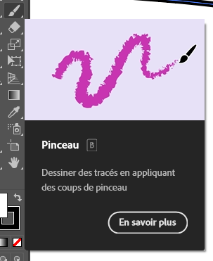

[:material-play-circle: Pinceau (B)](https://cmontmorency365.sharepoint.com/:v:/s/TIM-582214-Animation2d77/EeAcTCH7CUZKk6CTkwhG8-8B371RWYGBXqiUseW9LAPJlw?e=jmHAt8) 
Fenêtre > Formes (F5)

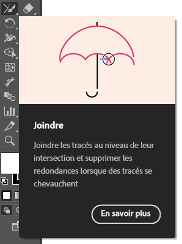

[:material-play-circle: Jonction](https://cmontmorency365.sharepoint.com/:v:/s/TIM-582214-Animation2d77/Eaj8dcdB3IlEvz_zXQ6QmxQBUiJDGSGWzRMFp95_vIWiCg?e=Fr2HLA)

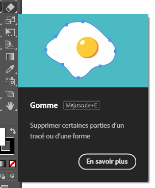

[:material-play-circle: Gomme (Maj +E)](https://cmontmorency365.sharepoint.com/:v:/s/TIM-582214-Animation2d77/ESwTH2I8Do9MkjRnKNnodHABW-DFUVG36G02AtTJyBw7GA?e=Vn0DiO)

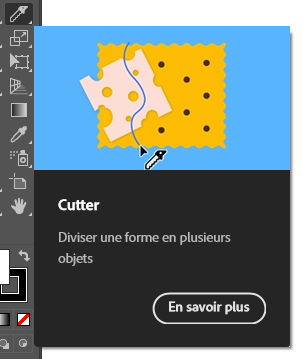

[:material-play-circle: Cutter](https://cmontmorency365.sharepoint.com/:v:/s/TIM-582214-Animation2d77/EYJAvExXxTZMtSkvOcHpmY4BFB9vIRqNkXUIPnRLT8MG1w?e=d9i3S6)

[:material-play-circle: Vectoriser les contours](https://cmontmorency365.sharepoint.com/:v:/s/TIM-582214-Animation2d77/EVYeu9N1iG9MrndylAX0FCEBYlPJXMPRPQ5BPm0N4Jf6rw?e=uX8L5i) 
Objet > Tracé > Vectoriser le contour

## Couleurs

[:material-play-circle: Palettes de couleur](https://cmontmorency365.sharepoint.com/:v:/s/TIM-582214-Animation2d77/Ea783BGLQzRBgjwFvcAyOJwBYcbMshlxCp12LoJcARYxSw?e=oQGVWK) 
Fenêtre > Couleur 
Fenêtre > Nuancier (Nouvelle nuance)

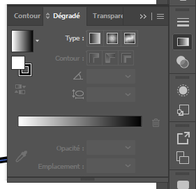

[:material-play-circle: Dégradé linéaire](https://cmontmorency365.sharepoint.com/:v:/s/TIM-582214-Animation2d77/EZNNl0cu2UFNjXKl-TvCnLYBXAmQNyVYQieAOLXZ1tL3oA?e=ZNElRZ) 
Fenêtre > Dégradé de couleurs

[:material-play-circle: Dégradé de forme libre](https://cmontmorency365.sharepoint.com/:v:/s/TIM-582214-Animation2d77/ETebMpCBOyNMucE0tQ2Fk9wBZ3QxjLDA_IE6lofPqVHnEw?e=SxmJfe)

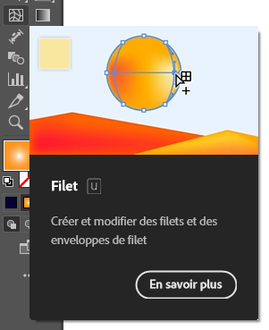

[:material-play-circle: Filet](https://cmontmorency365.sharepoint.com/:v:/s/TIM-582214-Animation2d77/EQ3-rGmHAAZBgEp60EqLqEYBsnU2yMeGLbnd6PqUscIx3g?e=SCfPT1)

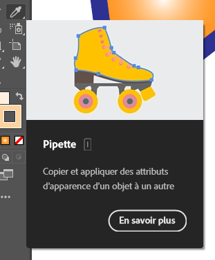

[:material-play-circle: Pipette (I)](https://cmontmorency365.sharepoint.com/:v:/s/TIM-582214-Animation2d77/EdohoqrJg_BKkGef_AdV5cYBGI4ULInbsE701imTzFYpXQ?e=dbjH0E) 
Shift + clic pour sélectionner la couleur uniquement

## Transformations et marionnette

<!--  Lien brisé -->

[:material-play-circle: Rotation (R)](https://cmontmorency365.sharepoint.com/:v:/s/TIM-582214-Animation2d77/EdBWqucj7k9Dh5_jn3fYoCMB0_qZHEyl9ACh9kt5m8bF2w?e=NMhSBa)

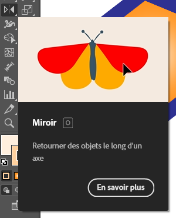

[:material-play-circle: Miroir (O)](https://cmontmorency365.sharepoint.com/:v:/s/TIM-582214-Animation2d77/EVA2GDg_Ry5OqiqITnUHteIBIqhtsjnvK2Tn-dDnhCVm7w?e=ESdBKh)

<!-- [:material-play-circle: Mise à l'échelle](https://cmontmorency365.sharepoint.com/:v:/s/TIM-582214-Animation2d77/EZrlGGsydSFGvRTQiMmKk2sBOBh-CVRvqsgl064-3y1xwA?e=EygQh5) -->

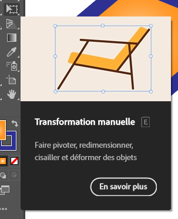

[:material-play-circle: Transformation manuelle (E)](https://cmontmorency365.sharepoint.com/:v:/s/TIM-582214-Animation2d77/EezPmr0wvPZOngNTrsMfL-cB_W0o5dfSxYFgOG4ukwH1yw?e=KNXifs) 
Skew (transformation) 
Perspective 
Distorsion manuelle

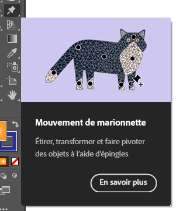

[:material-play-circle: Marionnette](https://cmontmorency365.sharepoint.com/:v:/s/TIM-582214-Animation2d77/EeGkbYSu5qhKpEkrqKIeTFEBbDaJ8iIOuG_Bwd1RErqSrg?e=4AyZ7D)

<!-- [:material-play-circle: Marionnette filet](https://cmontmorency365.sharepoint.com/:v:/s/TIM-582214-Animation2d77/EbffAjE-YKVJgwiDrsyj6oUB5TwGqv1eoJH6DNpA_4F7TA?e=vAlCCc)

## Alignement

[:material-play-circle: Pathfinder](https://cmontmorency365.sharepoint.com/:v:/s/TIM-582214-Animation2d77/EZj0BIRpahBOhBFsRbp5bhsB3Tqi7PdKLrqhN1uFF16M0Q?e=OTxr5u)

[:material-play-circle: Alignement](https://cmontmorency365.sharepoint.com/:v:/s/TIM-582214-Animation2d77/EXc4p7G-tdtLib26nMAzxdABOWhH7mXFBMbFxPMWZTZ4KQ?e=xQgc5c)

 [:material-play-circle: Répartition](https://cmontmorency365.sharepoint.com/:v:/s/TIM-582214-Animation2d77/EXW12cP0Y7FAhWo7D1LXOKkBa6cCvPUSEfJ-bkwRD5iTyg?e=qElAnj) -->

## Masques

[:material-play-circle: Écrêtage](https://cmontmorency365.sharepoint.com/:v:/s/TIM-582214-Animation2d77/EeeL6EuK-iBFpZI-Jt3RcBgBxRHPRwgJkhDs-hjFkU0hKA?e=AQ2U2G) 
Sélection des calques, clic droit + Créer un masque d'écrêtage

[:material-play-circle: Masque et transparence](https://cmontmorency365.sharepoint.com/:v:/s/TIM-582214-Animation2d77/EXK9TJqqjEFFn0Wc9ZgFZhIBGhOdfNSoxoXmJRJtQPJJkA?e=q9rtSz) 
Fenêtre Transparence, créer un masque, clic le masque et colle la texture

## Typographie

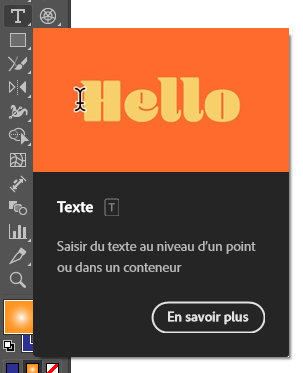

[:material-play-circle: Texte (T)](https://cmontmorency365.sharepoint.com/:v:/s/TIM-582214-Animation2d77/EY32kr9fiIBKk6377mmLce4B0_gSdA9FPrqZuup9MkJIAw?e=1TF1SI)

[:material-play-circle: Paragraphe](https://cmontmorency365.sharepoint.com/:v:/s/TIM-582214-Animation2d77/EaKBbLH7h-FDiwKI-FGe5AkBqraWHZlF1Ec0192Ctjw3eg?e=shhqmb) 
Fenêtre Paragraphe

[:material-play-circle: Activation des polices](https://cmontmorency365.sharepoint.com/:v:/s/TIM-582214-Animation2d77/EShlgqaZhONJkmNl81kxbx8Bl9jVH0iWfnlji4nEW6oUOA?e=5CV4Qf) 
Explication des formats :

* TTF : Format courant
* OTF : Une version améliorée de TTF avec plus de fonctionnalités typographiques (ex: différents affichages selon le contexte).
* WOFF / WOFF2 : Optimisés pour le web.
* EOT : Format ancien spécifique à Internet Explorer.

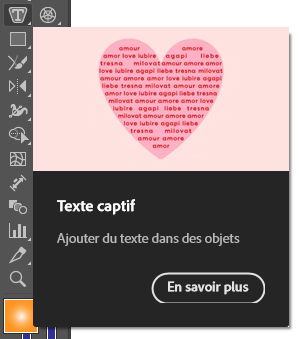

[:material-play-circle: Texte captif horizontal](https://cmontmorency365.sharepoint.com/:v:/s/TIM-582214-Animation2d77/ESzwupB5CgBMqzWMgS6_CXcBh5iB6h0wXK3QYmZCTALSvg?e=ZRHnrk)

[:material-play-circle: Texte captif vertical](https://cmontmorency365.sharepoint.com/:v:/s/TIM-582214-Animation2d77/EbU9cAE0CrRLiPjL2sq9X_wBrzs3ey_2mCmVN8gjAmmGXQ?e=UtW8iM)

[:material-play-circle: Effet isométrique](https://cmontmorency365.sharepoint.com/:v:/s/TIM-582214-Animation2d77/EWhHJDR4d8dLqQk6Ydf5JwIByxBq09dSlQE-TyI3ey6nsQ?e=aE9ct2) 
Effet > 3D > Rotation (position isométrique haut) 
Effet > Distorsion et transformation > Transformation (ex: 15 copies)

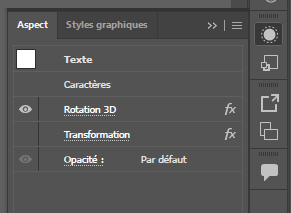

[:material-play-circle: Modification d'effet](https://cmontmorency365.sharepoint.com/:v:/s/TIM-582214-Animation2d77/EZakrA8bd5pDl5icN3ZK-fUBBsJ8RFupt5gy5ARiQodK-A?e=Xdl0zu) 
Fenêtre > Aspect

## Vectorisation (de matriciel à vectoriel)

[:material-play-circle: Vectorisation](https://cmontmorency365.sharepoint.com/:v:/s/TIM-582214-Animation2d77/Eer-AKJaa51Il5nqJTM7UbABHoNzo-lIuMaDOoveaLOarQ?e=5RYdSY) 
Fenêtre > Vectorisation de l'image

<!--
## Précisions sur le travail 1

[:material-play-circle: Nomenclature des calques](https://cmontmorency365.sharepoint.com/:f:/s/TIM-582214-Animation2d77/EhR-OzQO_t1KkGjAf0Wu6nMB38jUZ55LbFHtxw4f33XqFg?e=eZSTew)

[:material-play-circle: Effet isométrique](https://cmontmorency365.sharepoint.com/:v:/s/TIM-582214-Animation2d77/EWhHJDR4d8dLqQk6Ydf5JwIByxBq09dSlQE-TyI3ey6nsQ?e=aE9ct2)

Précisions:
  - Police: Filson bold
  - Rotation 3D - Isométrique haut
  - Distorsion et transformation: Transformation de l'image avec 15 copies et un décalage vertical de 16 pixels.

[:material-play-circle: Fenêtre aspect pour modifier les effets](https://cmontmorency365.sharepoint.com/:v:/s/TIM-582214-Animation2d77/EZakrA8bd5pDl5icN3ZK-fUBBsJ8RFupt5gy5ARiQodK-A?e=Xdl0zu)

[:material-play-circle: Vectorisation (cactus)](https://cmontmorency365.sharepoint.com/:v:/s/TIM-582214-Animation2d77/Eer-AKJaa51Il5nqJTM7UbABHoNzo-lIuMaDOoveaLOarQ?e=5RYdSY)

[💼 Travail 1](exercice_ai/travail1.md){ .md-button }
-->

## Exercices

  

  <small> </small> 
   **[Papillon](exercice_ai/06_papillon.md){.back}** 
  **[Pinceau](exercice_ai/06_pinceau.md){.back}** 
  **[Nuancier](exercice_ai/07_nuancier.md){.back}** 
  **[Marionnette](exercice_ai/08_marionnette.md){.back}** 
  **[Pathfinder](exercice_ai/09_pathfinder.md){.back}** 
  **[Masques](exercice_ai/10_masques.md){.back}** 
  **[Transparence](exercice_ai/10_transparence.md){.back}** 
  **[Mise en page](exercice_ai/11_mise_page.md){.back}** 
  **[Typographie](exercice_ai/11_typographie.md){.back}**

